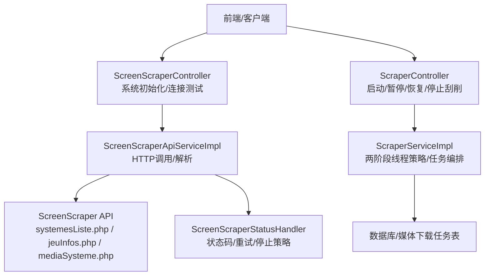
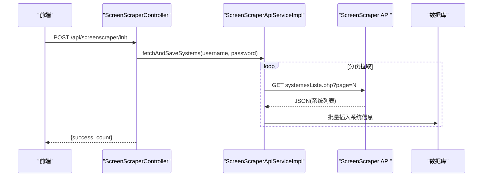
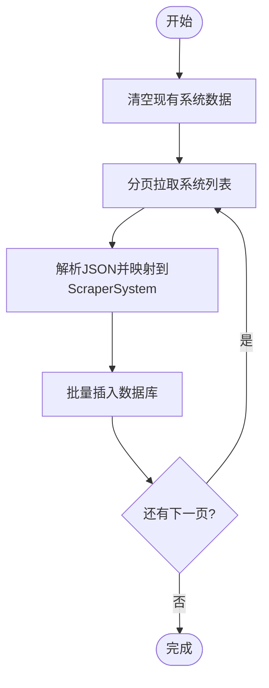
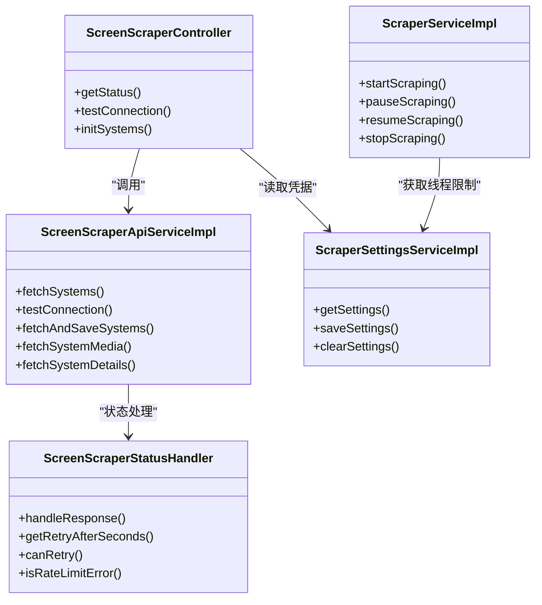

# Scraper系统集成

<cite>
**本文引用的文件**
- [ScreenScraperConfig.java](file://src/main/java/com/gamelist/config/ScreenScraperConfig.java)
- [application.properties](file://src/main/resources/application.properties)
- [ScreenScraperApiService.java](file://src/main/java/com/gamelist/service/ScreenScraperApiService.java)
- [ScreenScraperApiServiceImpl.java](file://src/main/java/com/gamelist/service/impl/ScreenScraperApiServiceImpl.java)
- [ScreenScraperController.java](file://src/main/java/com/gamelist/controller/ScreenScraperController.java)
- [ScraperSettingsService.java](file://src/main/java/com/gamelist/service/ScraperSettingsService.java)
- [ScraperSettingsServiceImpl.java](file://src/main/java/com/gamelist/service/impl/ScraperSettingsServiceImpl.java)
- [ScraperController.java](file://src/main/java/com/gamelist/controller/ScraperController.java)
- [ScraperServiceImpl.java](file://src/main/java/com/gamelist/service/impl/ScraperServiceImpl.java)
- [ScraperSystem.java](file://src/main/java/com/gamelist/model/ScraperSystem.java)
- [ScreenScraperStatusHandler.java](file://src/main/java/com/gamelist/util/ScreenScraperStatusHandler.java)
</cite>

## 目录
1. [简介](#简介)
2. [项目结构](#项目结构)
3. [核心组件](#核心组件)
4. [架构总览](#架构总览)
5. [详细组件分析](#详细组件分析)
6. [依赖关系分析](#依赖关系分析)
7. [性能与并发](#性能与并发)
8. [错误处理与重试策略](#错误处理与重试策略)
9. [批量抓取指南](#批量抓取指南)
10. [常见问题与调试技巧](#常见问题与调试技巧)
11. [结论](#结论)

## 简介
本文件面向Scraper系统的ScreenScraper集成，覆盖账户注册与API密钥配置、请求频率限制、元数据自动获取（游戏信息、封面、截图、描述等）、系统初始化流程、错误处理与重试策略、批量抓取操作指南与性能优化建议，以及常见问题排查与调试技巧。文档基于代码实现进行说明，确保与实际行为一致。

## 项目结构
与ScreenScraper集成相关的核心位置：
- 配置层：ScreenScraperConfig 提供基础URL与开发者凭证；application.properties 提供运行时参数
- 服务层：ScreenScraperApiService 及其实现负责HTTP调用与解析；ScraperSettingsService 管理用户凭据持久化
- 控制器层：ScreenScraperController 暴露系统初始化与连接测试接口；ScraperController 暴露刮削任务控制接口
- 工具层：ScreenScraperStatusHandler 统一处理状态码、重试与停止策略
- 模型层：ScraperSystem 表示平台系统信息

图表来源
- [ScreenScraperController.java:18-119](file://src/main/java/com/gamelist/controller/ScreenScraperController.java#L18-L119)
- [ScraperController.java:21-131](file://src/main/java/com/gamelist/controller/ScraperController.java#L21-L131)
- [ScreenScraperApiServiceImpl.java:30-104](file://src/main/java/com/gamelist/service/impl/ScreenScraperApiServiceImpl.java#L30-L104)
- [ScraperServiceImpl.java:131-538](file://src/main/java/com/gamelist/service/impl/ScraperServiceImpl.java#L131-L538)
- [ScreenScraperStatusHandler.java:15-213](file://src/main/java/com/gamelist/util/ScreenScraperStatusHandler.java#L15-L213)

章节来源
- [ScreenScraperConfig.java:1-46](file://src/main/java/com/gamelist/config/ScreenScraperConfig.java#L1-L46)
- [application.properties:1-86](file://src/main/resources/application.properties#L1-L86)

## 核心组件
- ScreenScraperConfig：集中管理ScreenScraper基础URL与开发者凭证（devPseudo/devPassword），便于通过配置切换环境
- ScreenScraperApiService/Impl：封装对ScreenScraper的HTTP请求、分页拉取系统列表、构建媒体URL、解析响应并持久化系统信息
- ScraperSettingsService/Impl：持久化用户凭据（username/password），支持加密存储与读取，用于区分游客模式与用户模式
- ScreenScraperController：提供“连接测试”和“系统初始化”接口，清理旧数据并拉取系统列表入库
- ScraperController/ScraperServiceImpl：提供“启动/暂停/恢复/停止”刮削任务，采用两阶段线程策略优先保障游戏信息搜索，再并行下载媒体
- ScreenScraperStatusHandler：统一处理HTTP状态码，给出是否立即停止、是否通知用户、重试间隔等决策

章节来源
- [ScreenScraperApiService.java:1-19](file://src/main/java/com/gamelist/service/ScreenScraperApiService.java#L1-L19)
- [ScreenScraperApiServiceImpl.java:106-460](file://src/main/java/com/gamelist/service/impl/ScreenScraperApiServiceImpl.java#L106-L460)
- [ScraperSettingsService.java:1-12](file://src/main/java/com/gamelist/service/ScraperSettingsService.java#L1-L12)
- [ScraperSettingsServiceImpl.java:18-117](file://src/main/java/com/gamelist/service/impl/ScraperSettingsServiceImpl.java#L18-L117)
- [ScreenScraperController.java:18-119](file://src/main/java/com/gamelist/controller/ScreenScraperController.java#L18-L119)
- [ScraperController.java:21-131](file://src/main/java/com/gamelist/controller/ScraperController.java#L21-L131)
- [ScraperServiceImpl.java:131-538](file://src/main/java/com/gamelist/service/impl/ScraperServiceImpl.java#L131-L538)
- [ScreenScraperStatusHandler.java:15-213](file://src/main/java/com/gamelist/util/ScreenScraperStatusHandler.java#L15-L213)

## 架构总览
ScreenScraper集成采用分层设计：
- 配置层：通过ScreenScraperConfig注入基础URL与开发者凭证
- 服务层：ScreenScraperApiServiceImpl负责网络请求与JSON解析；ScraperServiceImpl负责任务编排与并发控制
- 控制器层：对外暴露REST接口，接收前端请求并调度服务层
- 工具层：ScreenScraperStatusHandler集中处理状态码、重试与停止策略

图表来源
- [ScreenScraperController.java:90-119](file://src/main/java/com/gamelist/controller/ScreenScraperController.java#L90-L119)
- [ScreenScraperApiServiceImpl.java:279-426](file://src/main/java/com/gamelist/service/impl/ScreenScraperApiServiceImpl.java#L279-L426)

## 详细组件分析

### 配置与环境
- 基础URL与开发者凭证：通过ScreenScraperConfig的baseUrl、devPseudo、devPassword注入，默认值可在配置中覆盖
- 应用属性：application.properties定义端口、编码、数据库、日志等；未包含ScreenScraper用户凭据，凭据由ScraperSettingsService持久化到/data/config/scraper-settings.json

章节来源
- [ScreenScraperConfig.java:6-46](file://src/main/java/com/gamelist/config/ScreenScraperConfig.java#L6-L46)
- [application.properties:1-86](file://src/main/resources/application.properties#L1-L86)
- [ScraperSettingsServiceImpl.java:21-42](file://src/main/java/com/gamelist/service/impl/ScraperSettingsServiceImpl.java#L21-L42)

### 账户注册与API密钥获取
- 账户注册：在ScreenScraper官网注册账号，获得用户名与密码（用于提高配额与访问权限）
- 开发者凭证：系统内置devPseudo/devPassword用于基础访问；若配置了用户凭据则进入“用户模式”，否则为“游客模式”
- 凭据保存：通过ScraperSettingsController保存username/password，内部使用EncryptionUtil加密存储

章节来源
- [ScraperSettingsServiceImpl.java:81-103](file://src/main/java/com/gamelist/service/impl/ScraperSettingsServiceImpl.java#L81-L103)
- [ScraperSettingsController.java:20-66](file://src/main/java/com/gamelist/controller/ScraperSettingsController.java#L20-L66)

### 请求频率限制与模式
- 游客模式：每日请求限制较低（约20000次），适用于小规模或测试
- 用户模式：登录后可获得更高配额；系统根据是否配置用户凭据自动判断模式
- 速率限制处理：遇到429/430/431时，依据ScreenScraperStatusHandler的建议降低请求速度或等待次日

章节来源
- [ScreenScraperController.java:51-88](file://src/main/java/com/gamelist/controller/ScreenScraperController.java#L51-L88)
- [ScreenScraperStatusHandler.java:172-199](file://src/main/java/com/gamelist/util/ScreenScraperStatusHandler.java#L172-L199)

### 元数据自动获取
- 系统列表拉取：分页调用systemesListe.php，解析noms对象或多语言字段，填充ScraperSystem并批量入库
- 系统媒体URL构建：mediaSysteme.php按类型与地区生成媒体URL，供后续下载
- 游戏信息搜索与媒体下载：ScraperServiceImpl在任务中先搜索游戏信息，再创建媒体下载任务并异步下载

章节来源
- [ScreenScraperApiServiceImpl.java:106-251](file://src/main/java/com/gamelist/service/impl/ScreenScraperApiServiceImpl.java#L106-L251)
- [ScreenScraperApiServiceImpl.java:648-696](file://src/main/java/com/gamelist/service/impl/ScreenScraperApiServiceImpl.java#L648-L696)
- [ScraperServiceImpl.java:203-538](file://src/main/java/com/gamelist/service/impl/ScraperServiceImpl.java#L203-L538)
- [ScraperSystem.java:1-228](file://src/main/java/com/gamelist/model/ScraperSystem.java#L1-L228)

### 系统初始化流程
- 清除旧数据：调用前清空已有系统记录
- 拉取并保存：分页拉取系统列表，解析并批量插入数据库
- 返回结果：返回成功标志与数量

图表来源
- [ScreenScraperController.java:90-119](file://src/main/java/com/gamelist/controller/ScreenScraperController.java#L90-L119)
- [ScreenScraperApiServiceImpl.java:279-426](file://src/main/java/com/gamelist/service/impl/ScreenScraperApiServiceImpl.java#L279-L426)

### 错误处理机制与重试策略
- 状态码分类：成功、客户端错误、认证错误、未找到、服务器错误、速率限制、未知
- 立即停止：遇到400/401/403/423/426/429/430/431等，应立刻停止并提示用户
- 重试策略：401/423/429可重试，分别建议等待60秒、300秒、60秒；430/431需等待一天
- 404保护：短时间内频繁404将触发停止，避免无效请求风暴

章节来源
- [ScreenScraperStatusHandler.java:19-23](file://src/main/java/com/gamelist/util/ScreenScraperStatusHandler.java#L19-L23)
- [ScreenScraperStatusHandler.java:79-98](file://src/main/java/com/gamelist/util/ScreenScraperStatusHandler.java#L79-L98)
- [ScreenScraperStatusHandler.java:138-187](file://src/main/java/com/gamelist/util/ScreenScraperStatusHandler.java#L138-L187)
- [ScraperServiceImpl.java:655-700](file://src/main/java/com/gamelist/service/impl/ScraperServiceImpl.java#L655-L700)

## 依赖关系分析
- ScreenScraperController依赖ScreenScraperApiService与ScraperSettingsService
- ScreenScraperApiServiceImpl依赖ScreenScraperConfig与OkHttpClient，并通过ScreenScraperStatusHandler处理状态码
- ScraperServiceImpl依赖ScraperSettingsService获取最大线程数，依赖TaskService与MediaDownloadTaskMapper管理任务与媒体下载
- 所有组件通过Spring装配，遵循单一职责与分层解耦

图表来源
- [ScreenScraperController.java:18-119](file://src/main/java/com/gamelist/controller/ScreenScraperController.java#L18-L119)
- [ScreenScraperApiServiceImpl.java:30-104](file://src/main/java/com/gamelist/service/impl/ScreenScraperApiServiceImpl.java#L30-L104)
- [ScraperSettingsServiceImpl.java:18-117](file://src/main/java/com/gamelist/service/impl/ScraperSettingsServiceImpl.java#L18-L117)
- [ScraperServiceImpl.java:131-538](file://src/main/java/com/gamelist/service/impl/ScraperServiceImpl.java#L131-L538)
- [ScreenScraperStatusHandler.java:15-213](file://src/main/java/com/gamelist/util/ScreenScraperStatusHandler.java#L15-L213)

## 性能与并发
- 动态线程资源管理：ScraperServiceImpl采用两阶段策略，优先保证游戏信息搜索，再并行下载媒体，使用ThreadResourceManager控制并发
- 超时与连接池：OkHttpClient设置合理的连接/读写超时，启用连接失败重试与连接池
- 404快速熔断：短时间大量404会触发停止，避免浪费资源
- 建议：
  - 合理设置最大线程数（受用户等级影响）
  - 选择合适的时间段执行批量任务，避开高峰
  - 监控日志中的状态码与重试次数，及时调整策略

章节来源
- [ScraperServiceImpl.java:194-538](file://src/main/java/com/gamelist/service/impl/ScraperServiceImpl.java#L194-L538)
- [ScreenScraperApiServiceImpl.java:45-104](file://src/main/java/com/gamelist/service/impl/ScreenScraperApiServiceImpl.java#L45-L104)
- [ScreenScraperStatusHandler.java:108-136](file://src/main/java/com/gamelist/util/ScreenScraperStatusHandler.java#L108-L136)

## 错误处理与重试策略
- 认证错误（401/403）：检查用户凭据或开发者凭证，建议等待后重试
- 速率限制（429/430/431）：降低请求频率或等待次日；必要时提升用户等级
- 服务器错误（423/5xx）：等待官方修复或稍后重试
- 未找到（404）：检查ROM文件或CRC；若短时间内频繁404，系统将自动停止

章节来源
- [ScreenScraperStatusHandler.java:79-98](file://src/main/java/com/gamelist/util/ScreenScraperStatusHandler.java#L79-L98)
- [ScreenScraperStatusHandler.java:172-199](file://src/main/java/com/gamelist/util/ScreenScraperStatusHandler.java#L172-L199)
- [ScraperServiceImpl.java:655-700](file://src/main/java/com/gamelist/service/impl/ScraperServiceImpl.java#L655-L700)

## 批量抓取指南
- 准备：
  - 配置用户凭据（可选，推荐以提升配额）
  - 确认平台已绑定系统ID
  - 选择媒体类型与范围（仅信息或包含媒体）
- 启动任务：
  - 调用POST /api/scraper/scrape，传入平台ID、游戏ID列表、范围与地区
  - 系统创建后台任务并异步执行
- 监控与控制：
  - 查询任务状态：GET /api/scraper/tasks/{taskId}
  - 暂停/恢复/停止：POST /api/scraper/pause | /resume | /stop
- 结果：
  - 游戏信息更新到数据库
  - 媒体文件下载到本地路径并关联到游戏记录

章节来源
- [ScraperController.java:30-131](file://src/main/java/com/gamelist/controller/ScraperController.java#L30-L131)
- [ScraperServiceImpl.java:131-538](file://src/main/java/com/gamelist/service/impl/ScraperServiceImpl.java#L131-L538)

## 常见问题与调试技巧
- 连接测试失败：
  - 检查用户凭据是否正确；或使用游客模式测试
  - 查看日志中的HTTP状态码与响应体
- 初始化无数据：
  - 确认系统列表接口返回JSON而非HTML
  - 检查分页逻辑与最大页数限制
- 频繁404导致停止：
  - 检查ROM文件名或CRC是否正确
  - 调整搜索关键词或地区
- 速率限制：
  - 降低并发线程数或延后执行时间
  - 考虑升级用户等级以获得更高配额

调试建议：
- 开启DEBUG日志，关注SSL握手、HTTP状态码、响应体长度
- 使用H2控制台查看数据库状态
- 通过/api/screenscraper/status与/test接口验证当前模式与连通性

章节来源
- [ScreenScraperController.java:37-88](file://src/main/java/com/gamelist/controller/ScreenScraperController.java#L37-L88)
- [ScreenScraperApiServiceImpl.java:106-251](file://src/main/java/com/gamelist/service/impl/ScreenScraperApiServiceImpl.java#L106-L251)
- [ScreenScraperStatusHandler.java:138-213](file://src/main/java/com/gamelist/util/ScreenScraperStatusHandler.java#L138-L213)

## 结论
本集成通过清晰的分层设计与完善的错误处理机制，实现了ScreenScraper的系统初始化、元数据自动获取与批量抓取能力。结合动态线程管理与速率限制策略，能够在不同用户模式下稳定运行。建议在生产环境中配置用户凭据、合理设置并发与执行窗口，并持续监控日志与状态码以优化性能与稳定性。