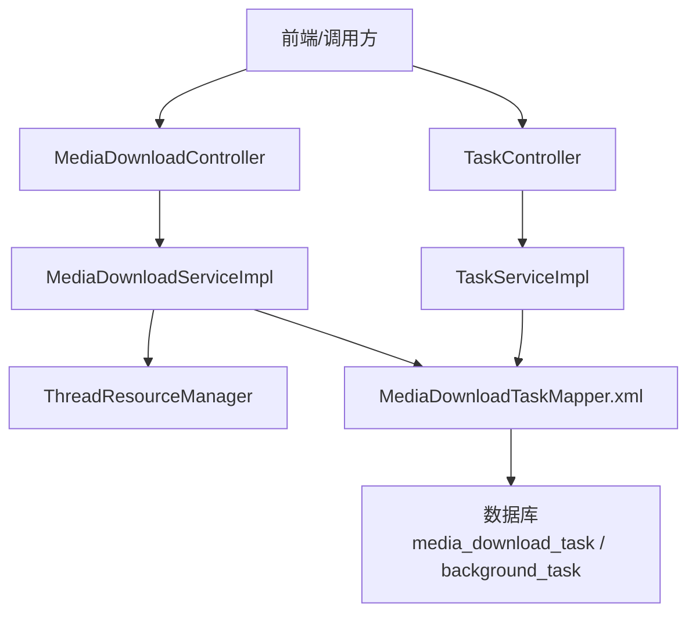
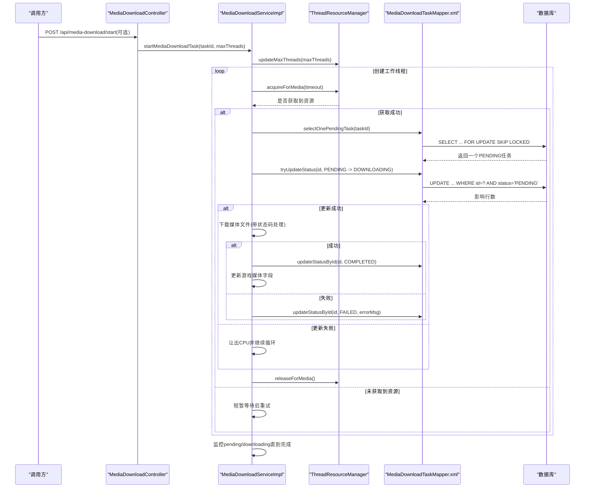
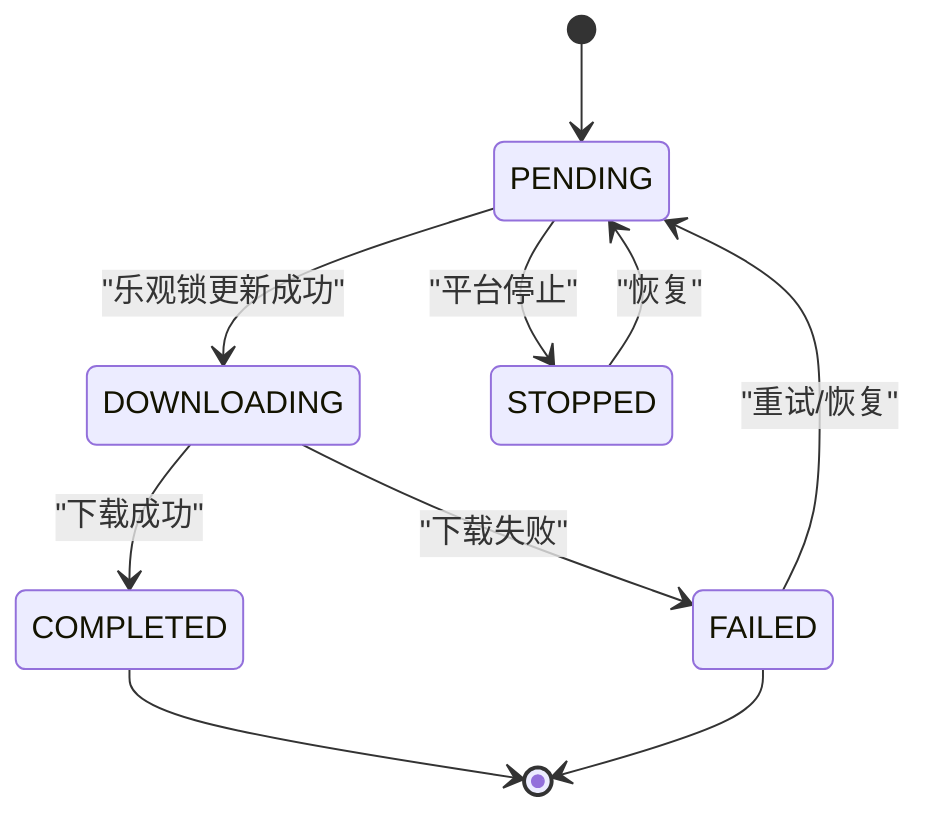
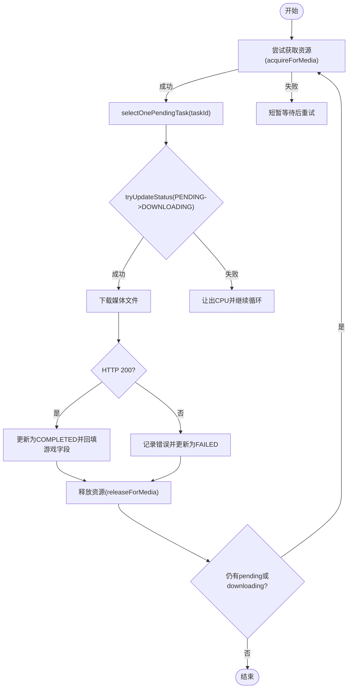
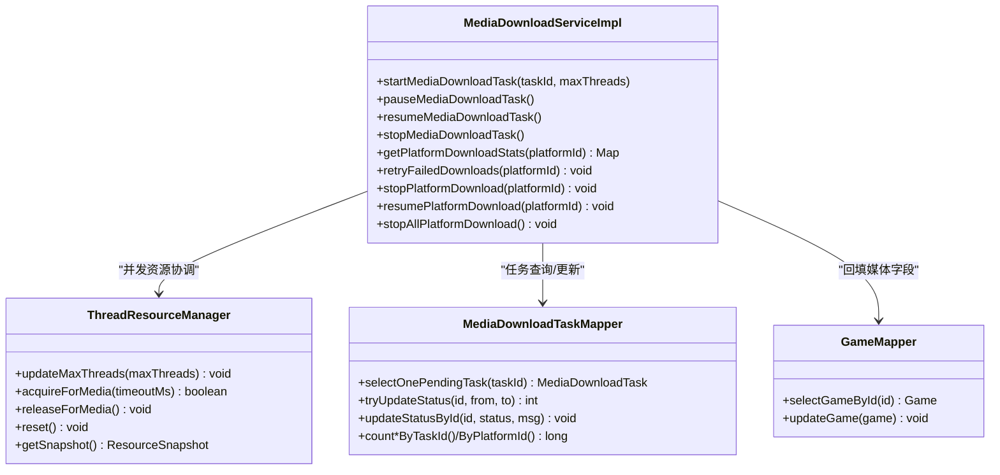

# 任务调度与管理

<cite>
**本文引用的文件**
- [MediaDownloadTask.java](file://src/main/java/com/gamelist/model/MediaDownloadTask.java)
- [BackgroundTask.java](file://src/main/java/com/gamelist/model/BackgroundTask.java)
- [MediaDownloadServiceImpl.java](file://src/main/java/com/gamelist/service/impl/MediaDownloadServiceImpl.java)
- [ThreadResourceManager.java](file://src/main/java/com/gamelist/service/ThreadResourceManager.java)
- [TaskService.java](file://src/main/java/com/gamelist/service/TaskService.java)
- [TaskServiceImpl.java](file://src/main/java/com/gamelist/service/impl/TaskServiceImpl.java)
- [TaskController.java](file://src/main/java/com/gamelist/controller/TaskController.java)
- [MediaDownloadController.java](file://src/main/java/com/gamelist/controller/MediaDownloadController.java)
- [MediaDownloadTaskMapper.xml](file://src/main/resources/mappers/MediaDownloadTaskMapper.xml)
- [V1.0.3__baseline_migration.sql](file://src/main/resources/db/migration/V1.0.3__baseline_migration.sql)
</cite>

## 目录
1. [简介](#简介)
2. [项目结构](#项目结构)
3. [核心组件](#核心组件)
4. [架构总览](#架构总览)
5. [详细组件分析](#详细组件分析)
6. [依赖关系分析](#依赖关系分析)
7. [性能与并发特性](#性能与并发特性)
8. [故障处理与重试机制](#故障处理与重试机制)
9. [API 接口说明](#api-接口说明)
10. [结论](#结论)
11. [附录：数据模型与持久化](#附录数据模型与持久化)

## 简介
本文件面向媒体下载任务调度与管理，覆盖任务生命周期（创建、状态转换、执行监控、完成处理）、队列管理（优先级、并发控制、资源分配）、持久化存储（表结构、查询优化、统计信息）、API 使用说明（CRUD、批量操作、筛选查询），以及失败处理、重试机制与日志记录。

## 项目结构
围绕媒体下载任务的关键代码分布在以下层次：
- 模型层：MediaDownloadTask、BackgroundTask
- 服务层：MediaDownloadServiceImpl、TaskService/TaskServiceImpl、ThreadResourceManager
- 控制器层：MediaDownloadController、TaskController
- 数据访问层：MediaDownloadTaskMapper.xml（SQL）
- 数据库迁移：V1.0.3__baseline_migration.sql（包含 media_download_task、background_task 等表）

图表来源
- [MediaDownloadController.java:16-483](file://src/main/java/com/gamelist/controller/MediaDownloadController.java#L16-L483)
- [TaskController.java:22-82](file://src/main/java/com/gamelist/controller/TaskController.java#L22-L82)
- [MediaDownloadServiceImpl.java:28-635](file://src/main/java/com/gamelist/service/impl/MediaDownloadServiceImpl.java#L28-L635)
- [TaskServiceImpl.java:17-175](file://src/main/java/com/gamelist/service/impl/TaskServiceImpl.java#L17-L175)
- [MediaDownloadTaskMapper.xml:1-180](file://src/main/resources/mappers/MediaDownloadTaskMapper.xml#L1-L180)

章节来源
- [MediaDownloadController.java:16-483](file://src/main/java/com/gamelist/controller/MediaDownloadController.java#L16-L483)
- [TaskController.java:22-82](file://src/main/java/com/gamelist/controller/TaskController.java#L22-L82)
- [MediaDownloadServiceImpl.java:28-635](file://src/main/java/com/gamelist/service/impl/MediaDownloadServiceImpl.java#L28-L635)
- [TaskServiceImpl.java:17-175](file://src/main/java/com/gamelist/service/impl/TaskServiceImpl.java#L17-L175)
- [MediaDownloadTaskMapper.xml:1-180](file://src/main/resources/mappers/MediaDownloadTaskMapper.xml#L1-L180)

## 核心组件
- MediaDownloadTask：单个媒体下载任务的数据模型，包含任务归属、游戏关联、平台、媒体类型、下载地址、本地路径、文件大小、状态、优先级、重试次数、错误信息、排序索引、时间戳等。
- BackgroundTask：后台任务抽象，用于承载任务元信息（类型、状态、进度、消息、总数/已处理数、开始/结束时间、错误信息、描述、结果、日志）。
- MediaDownloadServiceImpl：媒体下载的核心实现，负责启动/暂停/恢复/停止下载、多线程并发执行、限流、404 快速失败、状态更新、游戏媒体字段回填、平台级任务控制与统计。
- ThreadResourceManager：线程资源管理器，动态分配并发资源，保证游戏信息刮削线程优先于媒体下载线程，支持超时获取与归还。
- TaskService/TaskServiceImpl：通用后台任务的生命周期管理与缓存。
- MediaDownloadTaskMapper.xml：媒体下载任务的 SQL 映射，提供插入、批量插入、按任务/平台查询、状态更新、乐观锁更新、统计计数、失败重试重置等能力。

章节来源
- [MediaDownloadTask.java:1-175](file://src/main/java/com/gamelist/model/MediaDownloadTask.java#L1-L175)
- [BackgroundTask.java:1-114](file://src/main/java/com/gamelist/model/BackgroundTask.java#L1-L114)
- [MediaDownloadServiceImpl.java:28-635](file://src/main/java/com/gamelist/service/impl/MediaDownloadServiceImpl.java#L28-L635)
- [ThreadResourceManager.java:1-376](file://src/main/java/com/gamelist/service/ThreadResourceManager.java#L1-L376)
- [TaskService.java:1-72](file://src/main/java/com/gamelist/service/TaskService.java#L1-L72)
- [TaskServiceImpl.java:1-175](file://src/main/java/com/gamelist/service/impl/TaskServiceImpl.java#L1-L175)
- [MediaDownloadTaskMapper.xml:1-180](file://src/main/resources/mappers/MediaDownloadTaskMapper.xml#L1-L180)

## 架构总览
媒体下载任务的整体流程如下：
- 控制器接收请求，调用服务层进行任务控制（启动、暂停、恢复、停止、统计）。
- 服务层通过 Mapper 读取待下载任务，使用线程资源管理器协调并发，确保不超过最大线程限制且游戏信息线程优先。
- 工作线程从数据库以“PENDING”状态拉取任务，尝试将状态更新为“DOWNLOADING”，成功后执行下载；根据 HTTP 状态码与错误信息进行成功或失败处理。
- 成功时更新任务状态为“COMPLETED”，并回填游戏对应媒体字段；失败时更新为“FAILED”，记录错误信息，支持后续重试。
- 主循环监控 pending/downloading 数量，全部完成后结束任务，清理资源。

图表来源
- [MediaDownloadController.java:16-483](file://src/main/java/com/gamelist/controller/MediaDownloadController.java#L16-L483)
- [MediaDownloadServiceImpl.java:64-229](file://src/main/java/com/gamelist/service/impl/MediaDownloadServiceImpl.java#L64-L229)
- [MediaDownloadTaskMapper.xml:95-101](file://src/main/resources/mappers/MediaDownloadTaskMapper.xml#L95-L101)
- [ThreadResourceManager.java:104-196](file://src/main/java/com/gamelist/service/ThreadResourceManager.java#L104-L196)

## 详细组件分析

### 任务生命周期管理
- 创建：通过后台任务（BackgroundTask）承载任务元信息，媒体下载任务（MediaDownloadTask）作为子任务被批量创建并持久化。
- 状态转换：
  - PENDING → DOWNLOADING：工作线程通过乐观锁更新状态，避免重复消费。
  - DOWNLOADING → COMPLETED：下载成功，更新状态并回填游戏媒体字段。
  - DOWNLOADING → FAILED：下载失败，记录错误信息，支持重试。
  - STOPPED/PENDING/FAILED 的恢复：平台级恢复可将 STOPPED/FAILED 重置为 PENDING，以便重新调度。
- 执行监控：控制器暴露统计接口，返回 total/pending/downloading/completed/failed 及进度百分比。
- 完成处理：主循环检测 pending=0 且 downloading=0 时结束任务，清理资源并关闭线程池。

图表来源
- [MediaDownloadTask.java:25-30](file://src/main/java/com/gamelist/model/MediaDownloadTask.java#L25-L30)
- [MediaDownloadTaskMapper.xml:95-101](file://src/main/resources/mappers/MediaDownloadTaskMapper.xml#L95-L101)
- [MediaDownloadServiceImpl.java:118-183](file://src/main/java/com/gamelist/service/impl/MediaDownloadServiceImpl.java#L118-L183)

章节来源
- [MediaDownloadTask.java:25-30](file://src/main/java/com/gamelist/model/MediaDownloadTask.java#L25-L30)
- [MediaDownloadTaskMapper.xml:95-101](file://src/main/resources/mappers/MediaDownloadTaskMapper.xml#L95-L101)
- [MediaDownloadServiceImpl.java:118-183](file://src/main/java/com/gamelist/service/impl/MediaDownloadServiceImpl.java#L118-L183)

### 任务队列管理机制
- 优先级调度：任务具备 priority 与 order_index 字段，查询时使用 ORDER BY order_index ASC 保证顺序；同时支持按平台维度选择待处理任务。
- 并发控制：
  - 线程池大小由 maxThreads 决定，实际并发受 ThreadResourceManager 约束。
  - 工作线程在每次消费前尝试获取资源，失败则短暂等待并重试。
  - 全局暂停/恢复通过 AtomicBoolean 标志位控制。
- 资源分配：
  - 游戏信息线程具有更高优先级，当两种线程并存时优先满足游戏信息线程。
  - 资源管理器支持动态调整最大线程数，并在任务结束时重置。

图表来源
- [MediaDownloadServiceImpl.java:88-189](file://src/main/java/com/gamelist/service/impl/MediaDownloadServiceImpl.java#L88-L189)
- [MediaDownloadTaskMapper.xml:95-101](file://src/main/resources/mappers/MediaDownloadTaskMapper.xml#L95-L101)
- [ThreadResourceManager.java:104-196](file://src/main/java/com/gamelist/service/ThreadResourceManager.java#L104-L196)

章节来源
- [MediaDownloadServiceImpl.java:88-189](file://src/main/java/com/gamelist/service/impl/MediaDownloadServiceImpl.java#L88-L189)
- [MediaDownloadTaskMapper.xml:95-101](file://src/main/resources/mappers/MediaDownloadTaskMapper.xml#L95-L101)
- [ThreadResourceManager.java:104-196](file://src/main/java/com/gamelist/service/ThreadResourceManager.java#L104-L196)

### 持久化存储设计
- 表结构：
  - background_task：后台任务元信息（类型、状态、进度、消息、总数/已处理数、开始/结束时间、错误信息、描述、结果、日志）。
  - media_download_task：媒体下载任务明细（task_id、game_id、platform_id、media_type、download_url、local_path、status、priority、retry_count、error_message、order_index 等）。
- 查询优化：
  - 使用 LIMIT + ORDER BY order_index 进行分批拉取。
  - 使用 FOR UPDATE SKIP LOCKED 避免多工作线程争抢同一行。
  - 乐观锁更新 tryUpdateStatus 防止重复消费。
- 统计信息收集：
  - 提供 countTotalByTaskId、countPendingByTaskId、countDownloadingByTaskId、countCompletedByTaskId、countFailedByTaskId 等方法。
  - 平台维度统计：countByPlatformId、countPendingByPlatformId、countDownloadingByPlatformId、countCompletedByPlatformId、countFailedByPlatformId、countStoppedByPlatformId。

章节来源
- [V1.0.3__baseline_migration.sql:199-237](file://src/main/resources/db/migration/V1.0.3__baseline_migration.sql#L199-L237)
- [MediaDownloadTaskMapper.xml:26-180](file://src/main/resources/mappers/MediaDownloadTaskMapper.xml#L26-L180)

### API 接口使用说明
- 任务管理（后台任务）：
  - GET /api/tasks：获取所有后台任务列表。
  - GET /api/tasks/{id}：获取指定后台任务。
  - DELETE /api/tasks/{id}：删除指定后台任务（同时清理其媒体下载任务）。
  - DELETE /api/tasks/clear：清空所有后台任务。
  - GET /api/tasks/{id}/media-tasks：获取某后台任务的媒体下载统计（total/pending/downloading/completed/failed/progress）。
- 媒体下载任务：
  - GET /api/media-download/tasks：获取所有待下载任务（默认限制条数）。
  - GET /api/media-download/tasks/by-platform?platformId=...：按平台筛选任务。
  - GET /api/media-download/tasks/by-task?taskId=...：按任务ID筛选任务。
  - GET /api/media-download/tasks/{id}：获取单个媒体下载任务。
  - DELETE /api/media-download/tasks/{id}：删除单个任务。
  - DELETE /api/media-download/tasks/batch：批量删除任务。
  - DELETE /api/media-download/tasks/by-platform?platformId=...：删除指定平台的所有任务。
  - DELETE /api/media-download/tasks/by-task?taskId=...：删除指定任务的所有媒体下载任务。
- 下载控制与状态：
  - GET /api/media-download/status：获取当前下载运行状态（isRunning/isPaused）。
  - GET /api/media-download/stats?taskId=...：获取某任务的下载统计。
  - POST /api/media-download/pause：暂停下载。
  - POST /api/media-download/resume：恢复下载。
  - POST /api/media-download/stop：停止下载。
- 平台级控制：
  - GET /api/media-download/platforms：获取有媒体下载任务的平台ID列表。
  - GET /api/media-download/platforms/{platformId}/stats：获取平台下载统计。
  - POST /api/media-download/platforms/{platformId}/stop：停止指定平台的下载。
  - POST /api/media-download/platforms/{platformId}/resume：恢复指定平台的下载（含失败任务）。
  - POST /api/media-download/platforms/{platformId}/retry-failed：重试指定平台的失败下载任务。
  - POST /api/media-download/platforms/stop-all：停止所有平台的下载。
  - POST /api/media-download/platforms/{platformId}/delete：停止并删除指定平台的所有媒体下载任务。

章节来源
- [TaskController.java:41-82](file://src/main/java/com/gamelist/controller/TaskController.java#L41-L82)
- [MediaDownloadController.java:28-483](file://src/main/java/com/gamelist/controller/MediaDownloadController.java#L28-L483)

## 依赖关系分析
- MediaDownloadServiceImpl 依赖：
  - MediaDownloadTaskMapper：任务查询与状态更新。
  - GameMapper：成功下载后回填游戏媒体字段。
  - ScraperService/ScraperSettingsService：获取用户配置（如认证参数）与线程数。
  - ThreadResourceManager：并发资源协调。
  - RateLimitCounter：限流控制。
  - ScreenScraperStatusHandler：特殊状态码处理建议。
- TaskServiceImpl 依赖：
  - BackgroundTaskMapper：后台任务持久化。
  - 内存缓存：ConcurrentHashMap 提升读取性能。

图表来源
- [MediaDownloadServiceImpl.java:28-635](file://src/main/java/com/gamelist/service/impl/MediaDownloadServiceImpl.java#L28-L635)
- [ThreadResourceManager.java:1-376](file://src/main/java/com/gamelist/service/ThreadResourceManager.java#L1-L376)
- [MediaDownloadTaskMapper.xml:1-180](file://src/main/resources/mappers/MediaDownloadTaskMapper.xml#L1-L180)

章节来源
- [MediaDownloadServiceImpl.java:28-635](file://src/main/java/com/gamelist/service/impl/MediaDownloadServiceImpl.java#L28-L635)
- [ThreadResourceManager.java:1-376](file://src/main/java/com/gamelist/service/ThreadResourceManager.java#L1-L376)
- [MediaDownloadTaskMapper.xml:1-180](file://src/main/resources/mappers/MediaDownloadTaskMapper.xml#L1-L180)

## 性能与并发特性
- 并发控制：
  - 固定线程池大小由 maxThreads 决定，但实际并发受 ThreadResourceManager 限制，确保系统整体并发不超配。
  - 工作线程通过 acquireForMedia 获取资源，失败则短暂等待，避免忙等。
- 优先级调度：
  - 游戏信息线程优先于媒体下载线程，保障关键业务不受阻塞。
- 批处理与分页：
  - 批量拉取待处理任务（BATCH_SIZE），减少数据库压力。
  - 使用 ORDER BY order_index 保证顺序执行。
- 限流与容错：
  - 基于 RateLimitCounter 的滑动窗口限流，避免触发目标站点限速。
  - 404 快速失败策略：短时间内多次 404 自动停止下载，避免无效重试。
  - 特殊状态码处理：依据 ScreenScraperStatusHandler 的建议立即停止并提示。
- 资源回收：
  - finally 中释放资源并关闭线程池，确保无泄漏。

章节来源
- [MediaDownloadServiceImpl.java:52-63](file://src/main/java/com/gamelist/service/impl/MediaDownloadServiceImpl.java#L52-L63)
- [MediaDownloadServiceImpl.java:88-189](file://src/main/java/com/gamelist/service/impl/MediaDownloadServiceImpl.java#L88-L189)
- [MediaDownloadServiceImpl.java:268-303](file://src/main/java/com/gamelist/service/impl/MediaDownloadServiceImpl.java#L268-L303)
- [MediaDownloadServiceImpl.java:382-405](file://src/main/java/com/gamelist/service/impl/MediaDownloadServiceImpl.java#L382-L405)
- [MediaDownloadServiceImpl.java:206-229](file://src/main/java/com/gamelist/service/impl/MediaDownloadServiceImpl.java#L206-L229)
- [ThreadResourceManager.java:104-196](file://src/main/java/com/gamelist/service/ThreadResourceManager.java#L104-L196)

## 故障处理与重试机制
- 失败处理：
  - 下载失败时更新任务状态为 FAILED，并记录错误信息。
  - 遇到特殊状态码或连续 404，立即停止下载并通知。
- 重试机制：
  - 平台级恢复会将 STOPPED 与 FAILED 的任务重置为 PENDING，并递增 retry_count。
  - 支持单独的重试接口：/api/media-download/platforms/{platformId}/retry-failed。
- 日志记录：
  - 关键步骤均有日志输出，包括任务开始、批次获取、下载过程、状态变更、异常与停止原因。
  - URL 敏感参数脱敏，避免泄露认证信息。

章节来源
- [MediaDownloadServiceImpl.java:148-179](file://src/main/java/com/gamelist/service/impl/MediaDownloadServiceImpl.java#L148-L179)
- [MediaDownloadServiceImpl.java:382-405](file://src/main/java/com/gamelist/service/impl/MediaDownloadServiceImpl.java#L382-L405)
- [MediaDownloadTaskMapper.xml:168-170](file://src/main/resources/mappers/MediaDownloadTaskMapper.xml#L168-L170)
- [MediaDownloadController.java:418-435](file://src/main/java/com/gamelist/controller/MediaDownloadController.java#L418-L435)

## API 接口说明
以下为常用接口的简要说明（方法与路径）：
- 后台任务
  - GET /api/tasks
  - GET /api/tasks/{id}
  - DELETE /api/tasks/{id}
  - DELETE /api/tasks/clear
  - GET /api/tasks/{id}/media-tasks
- 媒体下载任务
  - GET /api/media-download/tasks
  - GET /api/media-download/tasks/by-platform?platformId=...
  - GET /api/media-download/tasks/by-task?taskId=...
  - GET /api/media-download/tasks/{id}
  - DELETE /api/media-download/tasks/{id}
  - DELETE /api/media-download/tasks/batch
  - DELETE /api/media-download/tasks/by-platform?platformId=...
  - DELETE /api/media-download/tasks/by-task?taskId=...
- 下载控制与状态
  - GET /api/media-download/status
  - GET /api/media-download/stats?taskId=...
  - POST /api/media-download/pause
  - POST /api/media-download/resume
  - POST /api/media-download/stop
- 平台级控制
  - GET /api/media-download/platforms
  - GET /api/media-download/platforms/{platformId}/stats
  - POST /api/media-download/platforms/{platformId}/stop
  - POST /api/media-download/platforms/{platformId}/resume
  - POST /api/media-download/platforms/{platformId}/retry-failed
  - POST /api/media-download/platforms/stop-all
  - POST /api/media-download/platforms/{platformId}/delete

章节来源
- [TaskController.java:41-82](file://src/main/java/com/gamelist/controller/TaskController.java#L41-L82)
- [MediaDownloadController.java:28-483](file://src/main/java/com/gamelist/controller/MediaDownloadController.java#L28-L483)

## 结论
该任务调度与管理方案通过分层设计与严格的并发控制，实现了高可靠、可观测、可扩展的媒体下载任务执行。借助乐观锁、FOR UPDATE SKIP LOCKED、限流与快速失败策略，系统在大规模任务场景下保持稳定与高效。平台级控制与重试机制提供了灵活的任务管理能力，配合完善的统计与日志，便于运维与问题定位。

## 附录：数据模型与持久化
- 背景任务表（background_task）
  - 字段：id、type、status、progress、message、total_items、processed_items、start_time、end_time、error_message、description、result、log、created_at、updated_at
- 媒体下载任务表（media_download_task）
  - 字段：id、task_id、game_id、game_name、media_type、download_url、local_path、file_size、status、priority、retry_count、error_message、order_index、created_at、updated_at
- 查询优化要点
  - 使用 LIMIT + ORDER BY order_index 分批拉取。
  - 使用 FOR UPDATE SKIP LOCKED 避免行级锁竞争。
  - 使用乐观锁 tryUpdateStatus 防止重复消费。
- 统计信息
  - 任务维度：total、pending、downloading、completed、failed
  - 平台维度：同上，并支持 stopped 统计

章节来源
- [V1.0.3__baseline_migration.sql:199-237](file://src/main/resources/db/migration/V1.0.3__baseline_migration.sql#L199-L237)
- [MediaDownloadTaskMapper.xml:26-180](file://src/main/resources/mappers/MediaDownloadTaskMapper.xml#L26-L180)