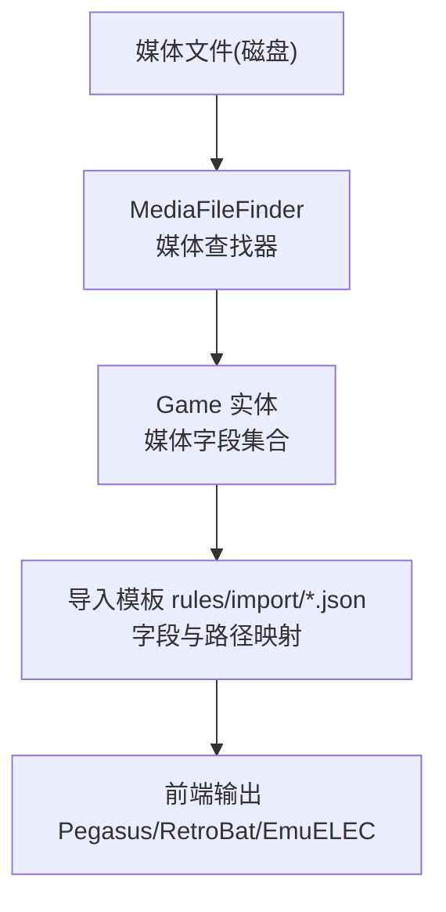
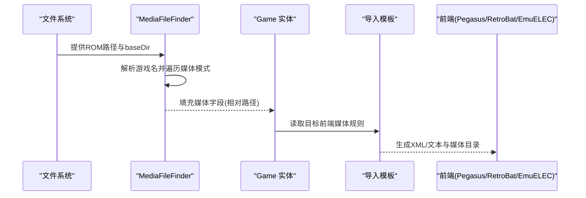
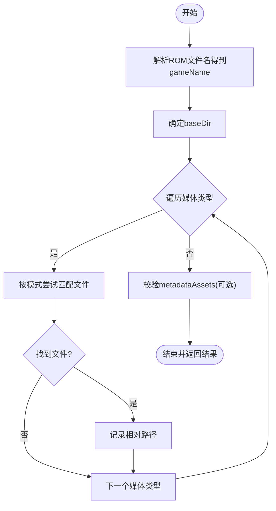
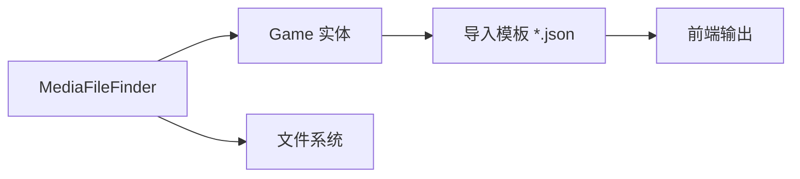

# 媒体文件类型与命名规范

<cite>
**本文引用的文件**
- [MediaFileFinder.java](file://src/main/java/com/gamelist/util/MediaFileFinder.java)
- [Game.java](file://src/main/java/com/gamelist/model/Game.java)
- [media-mapping-cn.md](file://docs/media-mapping-cn.md)
- [screenscraper-media-mapping.md](file://docs/screenscraper-media-mapping.md)
- [pegasus.json](file://rules/import/pegasus.json)
- [retrobat.json](file://rules/import/retrobat.json)
- [emuelec.json](file://rules/import/emuelec.json)
- [webgamelistoper.json](file://rules/import/webgamelistoper.json)
</cite>

## 目录
1. [简介](#简介)
2. [项目结构](#项目结构)
3. [核心组件](#核心组件)
4. [架构总览](#架构总览)
5. [详细组件分析](#详细组件分析)
6. [依赖关系分析](#依赖关系分析)
7. [性能考量](#性能考量)
8. [故障排查指南](#故障排查指南)
9. [结论](#结论)
10. [附录](#附录)

## 简介
本文件系统化说明本系统支持的媒体文件类型、用途、推荐尺寸与格式要求，以及媒体文件的命名规范与目录组织方式。同时覆盖不同模拟器前端（Pegasus、RetroBat、EmuELEC等）的兼容性说明，并解释媒体文件查找算法的工作原理与匹配规则，帮助你在多平台环境下正确组织与管理媒体资源。

## 项目结构
本项目围绕“媒体发现与映射”的核心能力构建：
- 媒体发现：通过 MediaFileFinder 按游戏名在 media 目录下按多种约定路径扫描匹配媒体文件。
- 数据模型：Game 实体承载所有媒体字段，用于持久化与导出。
- 导入模板：rules/import/*.json 定义各前端的字段与媒体路径规则，确保跨平台兼容。
- 文档：docs/* 提供媒体映射、数据库字段清单与扩展名支持等参考。

图表来源
- [MediaFileFinder.java:89-159](file://src/main/java/com/gamelist/util/MediaFileFinder.java#L89-L159)
- [Game.java:14-53](file://src/main/java/com/gamelist/model/Game.java#L14-L53)
- [pegasus.json:249-548](file://rules/import/pegasus.json#L249-L548)
- [retrobat.json:203-426](file://rules/import/retrobat.json#L203-L426)
- [emuelec.json:86-198](file://rules/import/emuelec.json#L86-L198)

章节来源
- [MediaFileFinder.java:89-159](file://src/main/java/com/gamelist/util/MediaFileFinder.java#L89-L159)
- [Game.java:14-53](file://src/main/java/com/gamelist/model/Game.java#L14-L53)
- [media-mapping-cn.md:234-269](file://docs/media-mapping-cn.md#L234-L269)

## 核心组件
- 媒体查找器 MediaFileFinder：根据 ROM 文件名提取游戏名，在 baseDir/media 下按预设模式匹配各类媒体文件，返回相对路径集合。
- 数据模型 Game：包含封面、截图、视频、海报、标题画面、背景、音乐、边框、面板、卡带图、Steam 网格、粉丝艺术、纹理等数十个媒体字段。
- 导入模板 rules/import/*.json：为不同前端定义字段映射与媒体路径规则，统一归一到 Game 字段。

章节来源
- [MediaFileFinder.java:89-159](file://src/main/java/com/gamelist/util/MediaFileFinder.java#L89-L159)
- [Game.java:14-53](file://src/main/java/com/gamelist/model/Game.java#L14-L53)
- [pegasus.json:249-548](file://rules/import/pegasus.json#L249-L548)
- [retrobat.json:203-426](file://rules/import/retrobat.json#L203-L426)
- [emuelec.json:86-198](file://rules/import/emuelec.json#L86-L198)

## 架构总览
媒体从文件系统被识别后，进入统一的字段映射层，最终写入 Game 实体；导出时依据目标前端模板生成对应的 XML/文本与媒体目录结构。

图表来源
- [MediaFileFinder.java:89-159](file://src/main/java/com/gamelist/util/MediaFileFinder.java#L89-L159)
- [pegasus.json:249-548](file://rules/import/pegasus.json#L249-L548)
- [retrobat.json:203-426](file://rules/import/retrobat.json#L203-L426)
- [emuelec.json:86-198](file://rules/import/emuelec.json#L86-L198)

## 详细组件分析

### 媒体类型与用途
以下列出系统支持的主要媒体类型、用途与常见建议尺寸/格式。具体以实际前端展示为准，以下为通用实践建议。

- 封面图（boxFront）
  - 用途：游戏列表主视觉封面
  - 建议尺寸：1000×1400 或 1200×1700（竖版）
  - 格式：PNG/JPG/WebP
  - 典型路径：media/{game}/boxFront.png 或 media/boxFront/{game}.png

- 封底（boxBack）
  - 用途：盒装背面信息
  - 建议尺寸：同封面
  - 格式：PNG/JPG/WebP
  - 典型路径：media/{game}/boxBack.png

- 书脊（boxSpine）
  - 用途：书架视图侧边条
  - 建议尺寸：约 200×1400（窄高）
  - 格式：PNG/JPG
  - 典型路径：media/{game}/boxSpine.png

- 完整盒子（boxFull）
  - 用途：3D立体封面渲染或完整盒面
  - 建议尺寸：1200×1200 或更大
  - 格式：PNG/JPG
  - 典型路径：media/{game}/boxFull.png

- 截图（screenshot）
  - 用途：游戏实机画面
  - 建议尺寸：1920×1080 或 1280×720
  - 格式：PNG/JPG
  - 典型路径：media/{game}/screenshot.png

- 视频（video）
  - 用途：预告片/玩法演示
  - 建议格式：MP4(H264)/MKV
  - 建议分辨率：1920×1080
  - 典型路径：media/{game}/video.mp4

- 海报（poster）
  - 用途：宣传海报/传单
  - 建议尺寸：1000×1400 或 1200×1700
  - 格式：PNG/JPG
  - 典型路径：media/{game}/poster.png

- 标题画面（titlescreen）
  - 用途：游戏启动标题界面截图
  - 建议尺寸：1920×1080
  - 格式：PNG/JPG
  - 典型路径：media/{game}/titlescreen.png

- 背景（background）
  - 用途：列表/详情页背景
  - 建议尺寸：1920×1080 或更宽
  - 格式：PNG/JPG/WebP
  - 典型路径：media/{game}/background.png

- 音乐（music）
  - 用途：BGM/原声片段
  - 建议格式：MP3/OGG/FLAC
  - 典型路径：media/{game}/music.mp3

- Logo/跑马灯（logo/marquee）
  - 用途：品牌标识/顶部横幅
  - 建议尺寸：宽度优先，高度适中（如 800×200）
  - 格式：PNG/SVG
  - 典型路径：media/{game}/logo.png 或 media/logos/{game}.png

- 边框（bezel）
  - 用途：街机模拟器的屏幕边框
  - 建议比例：4:3 或 16:9（视模拟器）
  - 格式：PNG
  - 典型路径：media/{game}/bezel.png

- 控制面板（panel）
  - 用途：街机面板贴图
  - 建议尺寸：适配面板分辨率
  - 格式：PNG
  - 典型路径：media/{game}/panel.png

- 卡带/光盘（cartridge）
  - 用途：介质正面图
  - 建议尺寸：按介质比例
  - 格式：PNG/JPG
  - 典型路径：media/{game}/cartridge.png

- Steam 网格（steamgrid）
  - 用途：Steam 风格网格封面
  - 建议尺寸：924×432 或 460×215
  - 格式：PNG/JPG
  - 典型路径：media/{game}/steamgrid.png

- 粉丝艺术（fanart）
  - 用途：高清背景/插画
  - 建议尺寸：1920×1080 或更高
  - 格式：PNG/JPG/WebP
  - 典型路径：media/{game}/fanart.png

- 纹理（boxtexture/supporttexture）
  - 用途：盒子/支架材质贴图
  - 建议尺寸：按材质需求
  - 格式：PNG/JPG
  - 典型路径：media/{game}/boxtexture.png

- 其他：tile、banner、wheel、screenmarqueesmall、picto系列、wallpaper、figurine 等，均遵循 media/{game}/{type}.* 或 media/{type}/{game}.* 的组织方式。

章节来源
- [media-mapping-cn.md:234-269](file://docs/media-mapping-cn.md#L234-L269)
- [screenscraper-media-mapping.md:67-90](file://docs/screenscraper-media-mapping.md#L67-L90)

### 命名规范与目录结构
- 基础原则
  - 以 ROM 文件名（不含扩展名）作为 gameName 进行匹配。
  - 媒体根目录通常为 baseDir/media。
  - 两种常用组织方式：
    - 按游戏分目录：media/{game}/...
    - 按类型分目录：media/{type}/{game}.*
  - 同一类型支持多个别名与位置，系统会按优先级顺序尝试匹配。

- 示例（以某游戏名为“GameTitle”为例）
  - 封面：media/GameTitle/boxFront.png 或 media/boxFront/GameTitle.png
  - 截图：media/GameTitle/screenshot.png 或 media/screenshots/GameTitle.png
  - 视频：media/GameTitle/video.mp4 或 media/videos/GameTitle.mp4
  - 海报：media/GameTitle/poster.png 或 media/poster/GameTitle.png
  - 标题画面：media/GameTitle/titlescreen.png 或 media/titlescreen/GameTitle.png
  - 背景：media/GameTitle/background.png 或 media/background/GameTitle.png
  - 音乐：media/GameTitle/music.mp3 或 media/music/GameTitle.mp3
  - Logo：media/GameTitle/logo.png 或 media/logos/GameTitle.png
  - 边框：media/GameTitle/bezel.png 或 media/bezel/GameTitle.png
  - 控制面板：media/GameTitle/panel.png 或 media/panel/GameTitle.png
  - 卡带：media/GameTitle/cartridge.png 或 media/cartridge/GameTitle.png
  - Steam 网格：media/GameTitle/steamgrid.png 或 media/steamgrid/GameTitle.png
  - 粉丝艺术：media/GameTitle/fanart.png 或 media/fanart/GameTitle.png
  - 纹理：media/GameTitle/boxtexture.png 或 media/boxtexture/GameTitle.png

- 扩展名支持
  - 图片：png/jpg/jpeg/gif/webp/svg
  - 视频：mp4/mkv/avi/wmv/webm
  - 音频：mp3/ogg/flac
  - 文档：pdf

章节来源
- [MediaFileFinder.java:167-731](file://src/main/java/com/gamelist/util/MediaFileFinder.java#L167-L731)
- [media-mapping-cn.md:234-269](file://docs/media-mapping-cn.md#L234-L269)

### 不同前端的兼容性说明
- Pegasus
  - 支持大量媒体类型与路径变体，包括 boxFront/boxBack/boxFull/boxSpine、screenshot、video、wheel、marquee、fanart、titlescreen、banner、cartridge、bezel、panel、cabinetLeft/Right、tile、steam、poster、background、music、boxtexture、supporttexture、manual、steamgrid 等。
  - 路径规则强调 media/{filename}/... 与 media/{type}/{filename}.* 的灵活组合。

- RetroBat
  - 与 Pegasus 类似，支持主流媒体类型与路径变体，尤其对 wheel、marquee、bezel、panel、poster、background、manual、steamgrid 等有明确规则。

- EmuELEC
  - 使用 downloaded_images/{platform}/... 与 media/{platform}/... 两类路径，涵盖 box2dfront/back/side、box3d、fanart、screenshot、video、wheel、banner、manual、images、titlescreen、marquee、miximage、cartridge、bezel 等。

- WebGamelistOper 内部模板
  - 将 scraper 产出的媒体集中存放于 data/scraper/games/{platform}/{gameId}/{region}/...，并映射到标准字段。

章节来源
- [pegasus.json:249-548](file://rules/import/pegasus.json#L249-L548)
- [retrobat.json:203-426](file://rules/import/retrobat.json#L203-L426)
- [emuelec.json:86-198](file://rules/import/emuelec.json#L86-L198)
- [webgamelistoper.json:86-200](file://rules/import/webgamelistoper.json#L86-L200)

### 媒体查找算法与匹配规则
- 入口流程
  - 输入：romFilePath、metadataDir（可选）、metadataAssets（可选）。
  - 步骤：
    1) 从 ROM 文件名提取 gameName（去除扩展名）。
    2) 确定 baseDir（默认 ROM 所在目录）。
    3) 依次调用各媒体类型的查找函数，按固定顺序尝试多种路径模式。
    4) 若提供 metadataAssets，则校验并补充缺失的媒体路径（保留相对路径）。
    5) 将找到的媒体路径填入结果对象对应字段。

- 匹配策略
  - 每种媒体类型维护一组候选路径模式，按顺序检查是否存在。
  - 支持“按游戏分目录”和“按类型分目录”两种组织方式。
  - 支持多种文件名别名（如 boxFront/box_front/front/box 等）。
  - 支持多种扩展名（png/jpg/jpeg/gif/webp/svg/mp4/mkv/avi/wmv/webm/mp3/ogg/flac/pdf）。

- 关键行为
  - 一旦找到首个匹配即停止该类型的后续搜索，避免歧义。
  - 返回相对路径，便于在不同部署环境中复用。
  - 对于元数据资产（metadataAssets），会规范化路径并以相对形式保存。

图表来源
- [MediaFileFinder.java:89-159](file://src/main/java/com/gamelist/util/MediaFileFinder.java#L89-L159)
- [MediaFileFinder.java:167-731](file://src/main/java/com/gamelist/util/MediaFileFinder.java#L167-L731)
- [MediaFileFinder.java:733-800](file://src/main/java/com/gamelist/util/MediaFileFinder.java#L733-L800)

章节来源
- [MediaFileFinder.java:89-159](file://src/main/java/com/gamelist/util/MediaFileFinder.java#L89-L159)
- [MediaFileFinder.java:167-731](file://src/main/java/com/gamelist/util/MediaFileFinder.java#L167-L731)
- [MediaFileFinder.java:733-800](file://src/main/java/com/gamelist/util/MediaFileFinder.java#L733-L800)

## 依赖关系分析
- 模块耦合
  - MediaFileFinder 与 Game 实体解耦：仅负责发现与赋值，不关心存储。
  - 导入模板与前端强相关：不同前端的媒体路径规则差异由 JSON 模板管理，便于扩展与维护。
- 外部依赖
  - 文件系统 I/O：用于检查文件存在性。
  - 字符串处理：提取文件名、拼接路径、相对路径转换。
- 潜在风险
  - 路径模式过多可能导致扫描开销增加；可通过限定 baseDir 与减少冗余模式优化。
  - 不同前端路径差异较大，需确保模板与实际目录一致。

图表来源
- [MediaFileFinder.java:89-159](file://src/main/java/com/gamelist/util/MediaFileFinder.java#L89-L159)
- [pegasus.json:249-548](file://rules/import/pegasus.json#L249-L548)
- [retrobat.json:203-426](file://rules/import/retrobat.json#L203-L426)
- [emuelec.json:86-198](file://rules/import/emuelec.json#L86-L198)

章节来源
- [MediaFileFinder.java:89-159](file://src/main/java/com/gamelist/util/MediaFileFinder.java#L89-L159)
- [pegasus.json:249-548](file://rules/import/pegasus.json#L249-L548)
- [retrobat.json:203-426](file://rules/import/retrobat.json#L203-L426)
- [emuelec.json:86-198](file://rules/import/emuelec.json#L86-L198)

## 性能考量
- 扫描次数控制：每种媒体类型按固定顺序尝试，命中即停，减少不必要的 IO。
- 路径模式精简：建议只启用必要的路径变体，避免过多分支。
- 缓存策略：可在上层对已发现的媒体路径做缓存，避免重复扫描。
- 并发处理：批量处理时可并行扫描不同游戏的媒体，但需注意文件系统并发限制。

[本节为通用指导，无需特定文件引用]

## 故障排查指南
- 常见问题
  - 找不到媒体：确认 baseDir 与 ROM 目录一致；检查媒体是否位于 media/{game} 或 media/{type} 下；核对文件名与扩展名。
  - 路径不一致：对照目标前端的导入模板规则，确保路径符合其期望。
  - 元数据资产未生效：检查 metadataAssets 中的路径是否为相对路径，并确保文件真实存在。
- 定位方法
  - 查看日志中媒体查找过程（例如 findBoxFrontMedia 等函数的输出）。
  - 逐步缩小 baseDir 范围，验证是否能命中预期路径。
  - 对比导入模板的规则数组，确认是否有遗漏的模式。

章节来源
- [MediaFileFinder.java:167-731](file://src/main/java/com/gamelist/util/MediaFileFinder.java#L167-L731)
- [MediaFileFinder.java:733-800](file://src/main/java/com/gamelist/util/MediaFileFinder.java#L733-L800)

## 结论
本系统通过统一的媒体查找与字段映射机制，实现了对多前端媒体格式的广泛兼容。遵循推荐的命名与目录组织方式，可显著提升媒体资源的可用性与一致性。结合导入模板，可轻松适配 Pegasus、RetroBat、EmuELEC 等不同环境。

[本节为总结，无需特定文件引用]

## 附录

### 数据库字段与媒体类型映射要点
- 多对一映射：多个来源类型（如 box-2d、box2d、box-front）统一映射到同一数据库字段（如 boxFront）。
- 废弃字段：部分历史字段不再接收新数据，但仍保留旧值。
- 扩展名：图片、视频、音频、文档的扩展名支持见文档。

章节来源
- [media-mapping-cn.md:91-151](file://docs/media-mapping-cn.md#L91-L151)
- [media-mapping-cn.md:234-269](file://docs/media-mapping-cn.md#L234-L269)
- [screenscraper-media-mapping.md:94-155](file://docs/screenscraper-media-mapping.md#L94-L155)