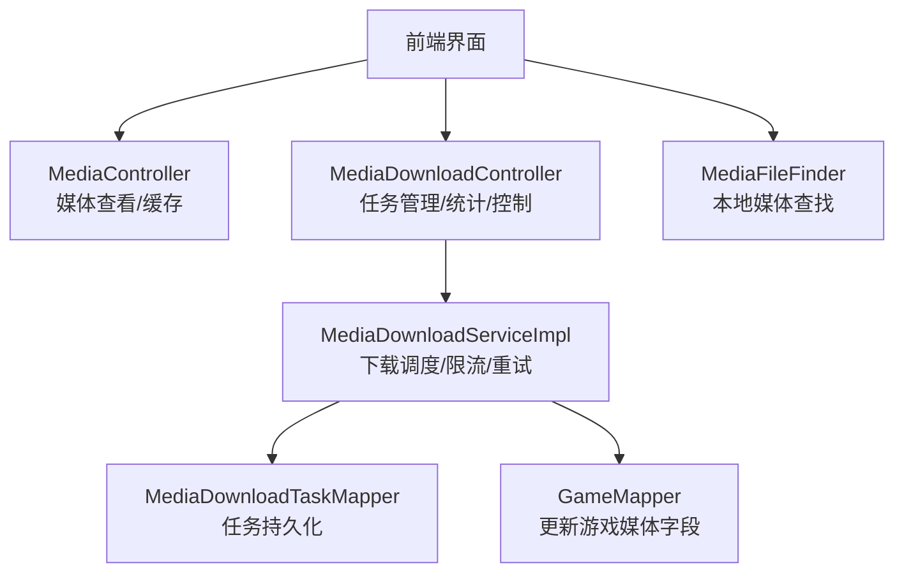
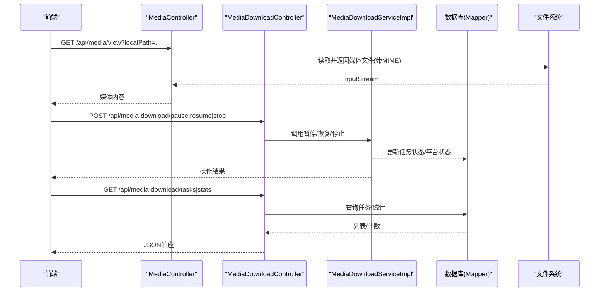
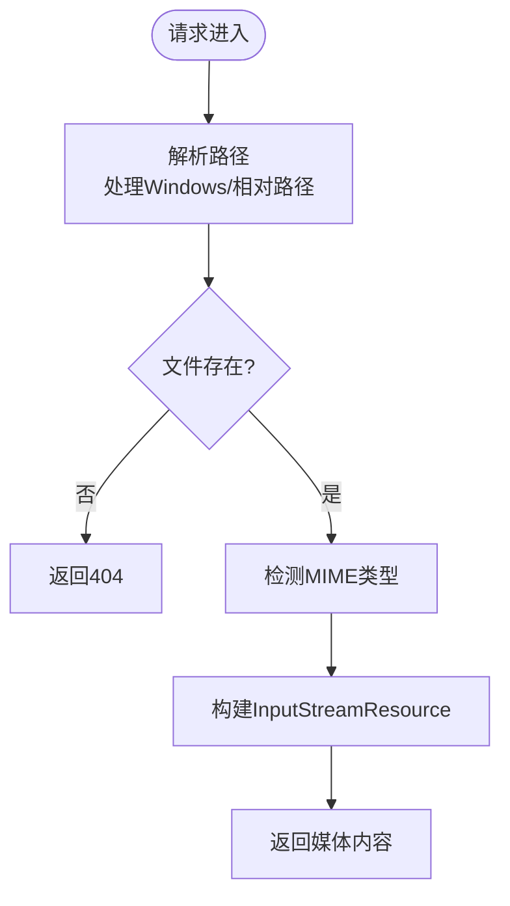
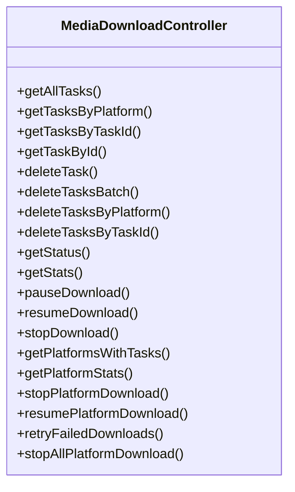
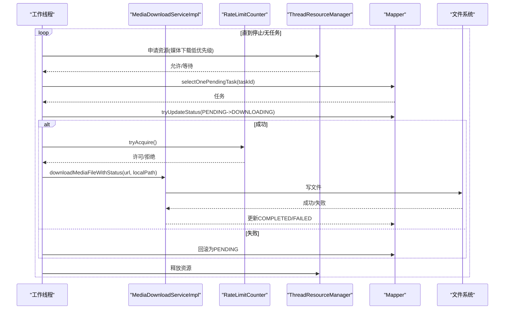
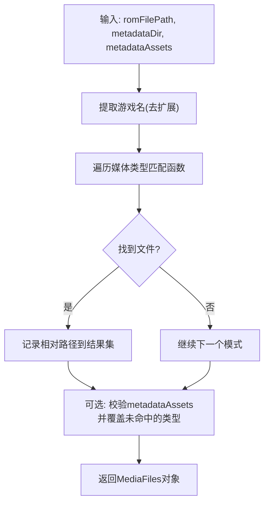
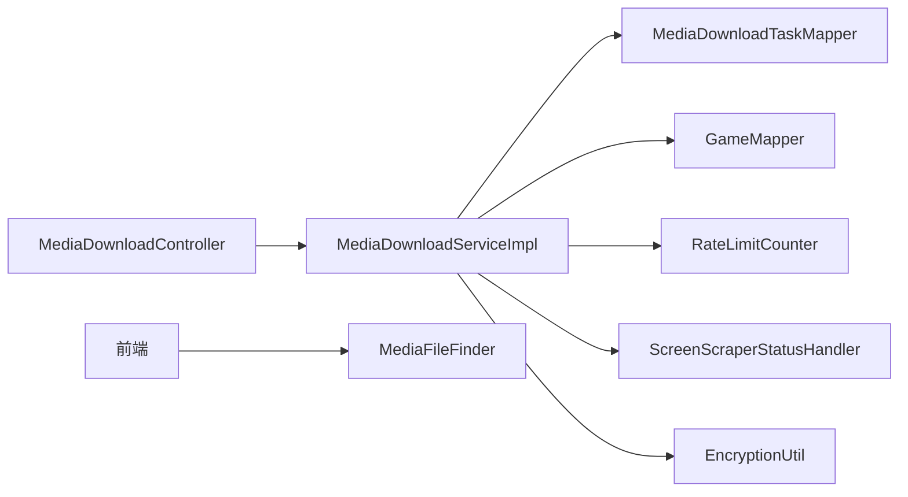

# 媒体资源管理

<cite>
**本文引用的文件**
- [MediaController.java](file://src/main/java/com/gamelist/controller/MediaController.java)
- [MediaDownloadController.java](file://src/main/java/com/gamelist/controller/MediaDownloadController.java)
- [MediaDownloadServiceImpl.java](file://src/main/java/com/gamelist/service/impl/MediaDownloadServiceImpl.java)
- [MediaFileFinder.java](file://src/main/java/com/gamelist/util/MediaFileFinder.java)
- [MediaDownloadTask.java](file://src/main/java/com/gamelist/model/MediaDownloadTask.java)
- [Game.java](file://src/main/java/com/gamelist/model/Game.java)
- [media-mapping-cn.md](file://docs/media-mapping-cn.md)
</cite>

## 目录
1. [简介](#简介)
2. [项目结构](#项目结构)
3. [核心组件](#核心组件)
4. [架构总览](#架构总览)
5. [详细组件分析](#详细组件分析)
6. [依赖关系分析](#依赖关系分析)
7. [性能考虑](#性能考虑)
8. [故障排查指南](#故障排查指南)
9. [结论](#结论)
10. [附录](#附录)

## 简介
本章节面向“媒体资源管理”功能，覆盖以下目标：
- 支持的媒体类型与命名规范（封面、截图、视频、海报等）
- 自动下载机制（媒体源配置、下载策略、缓存机制）
- 本地媒体查找与管理（匹配规则、重命名、批量操作）
- 媒体下载任务的创建、监控与管理
- 批量管理与性能优化建议
- 常见问题与网络异常处理方案

## 项目结构
媒体资源管理涉及控制器、服务实现、工具类与数据模型，关键路径如下：
- 控制器层：提供媒体查看、缓存、任务管理等REST接口
- 服务层：负责下载调度、限流、状态机控制、失败重试与平台级控制
- 工具层：本地媒体文件查找与匹配
- 模型层：下载任务实体与游戏实体字段映射

图表来源
- [MediaController.java:28-271](file://src/main/java/com/gamelist/controller/MediaController.java#L28-L271)
- [MediaDownloadController.java:16-483](file://src/main/java/com/gamelist/controller/MediaDownloadController.java#L16-L483)
- [MediaDownloadServiceImpl.java:28-635](file://src/main/java/com/gamelist/service/impl/MediaDownloadServiceImpl.java#L28-L635)
- [MediaFileFinder.java:8-800](file://src/main/java/com/gamelist/util/MediaFileFinder.java#L8-L800)

章节来源
- [MediaController.java:28-271](file://src/main/java/com/gamelist/controller/MediaController.java#L28-L271)
- [MediaDownloadController.java:16-483](file://src/main/java/com/gamelist/controller/MediaDownloadController.java#L16-L483)
- [MediaDownloadServiceImpl.java:28-635](file://src/main/java/com/gamelist/service/impl/MediaDownloadServiceImpl.java#L28-L635)
- [MediaFileFinder.java:8-800](file://src/main/java/com/gamelist/util/MediaFileFinder.java#L8-L800)

## 核心组件
- 媒体查看与缓存
  - 提供本地媒体文件的查看与临时缓存能力，支持常见图片/视频/PDF格式，自动处理Windows路径映射与相对路径拼接。
- 媒体下载任务管理
  - 提供任务的查询、删除、按平台筛选、暂停/恢复/停止、批量删除、重试失败任务、平台统计等能力。
- 下载调度与执行
  - 多线程并发下载，结合线程资源管理器进行优先级协调；内置速率限制、404阈值保护、特殊状态码中断；下载成功后自动更新游戏记录中的媒体字段。
- 本地媒体查找
  - 基于游戏名与约定目录结构，按多种命名模式匹配封面、截图、视频、海报、边框、面板、手册等媒体。

章节来源
- [MediaController.java:34-243](file://src/main/java/com/gamelist/controller/MediaController.java#L34-L243)
- [MediaDownloadController.java:31-483](file://src/main/java/com/gamelist/controller/MediaDownloadController.java#L31-L483)
- [MediaDownloadServiceImpl.java:64-635](file://src/main/java/com/gamelist/service/impl/MediaDownloadServiceImpl.java#L64-L635)
- [MediaFileFinder.java:89-800](file://src/main/java/com/gamelist/util/MediaFileFinder.java#L89-L800)

## 架构总览
媒体资源管理采用分层架构：
- 控制器层暴露REST API，负责参数校验与响应封装
- 服务层实现业务逻辑：下载调度、限流、状态机、失败重试、平台级控制
- 数据访问层通过Mapper完成任务与游戏记录的读写
- 工具层提供本地媒体查找与路径解析

图表来源
- [MediaController.java:96-243](file://src/main/java/com/gamelist/controller/MediaController.java#L96-L243)
- [MediaDownloadController.java:31-483](file://src/main/java/com/gamelist/controller/MediaDownloadController.java#L31-L483)
- [MediaDownloadServiceImpl.java:64-635](file://src/main/java/com/gamelist/service/impl/MediaDownloadServiceImpl.java#L64-L635)

## 详细组件分析

### 媒体查看与缓存（MediaController）
- 媒体查看
  - 支持从前端传入的platformPath或从游戏/平台信息中推导完整路径，兼容Windows路径分隔符与相对路径前缀
  - 根据扩展名设置正确的Content-Type，返回二进制流
- 媒体缓存
  - 将远程或外部路径的文件复制到本地media目录，生成唯一文件名，返回可访问URL
- 清理缓存
  - 清空本地media目录下的所有文件

图表来源
- [MediaController.java:96-243](file://src/main/java/com/gamelist/controller/MediaController.java#L96-L243)

章节来源
- [MediaController.java:34-271](file://src/main/java/com/gamelist/controller/MediaController.java#L34-L271)

### 媒体下载任务管理（MediaDownloadController）
- 任务查询
  - 获取全部待下载任务、按平台/任务ID筛选、获取单个任务详情
- 任务删除
  - 单条删除、批量删除、按平台删除、按任务ID删除
- 运行控制
  - 暂停、恢复、停止；支持全局与平台级控制
- 统计信息
  - 总体统计（总数、待下载、下载中、已完成、失败）
  - 平台统计（各状态数量）

图表来源
- [MediaDownloadController.java:16-483](file://src/main/java/com/gamelist/controller/MediaDownloadController.java#L16-L483)

章节来源
- [MediaDownloadController.java:31-483](file://src/main/java/com/gamelist/controller/MediaDownloadController.java#L31-L483)

### 下载调度与执行（MediaDownloadServiceImpl）
- 并发与资源协调
  - 使用固定大小线程池，结合ThreadResourceManager进行资源抢占与释放，确保游戏信息线程优先
- 任务拉取与状态机
  - 循环拉取PENDING任务，乐观锁更新为DOWNLOADING，完成后标记COMPLETED，失败标记FAILED
- 限流与容错
  - RateLimitCounter控制访问频率；404阈值保护（10秒内多次404则停止）；特殊状态码立即停止并提示
- URL认证参数处理
  - 根据当前登录状态添加/移除认证参数，避免泄露或无效凭证
- 成功后更新游戏记录
  - 将下载的本地路径写入Game对应字段（如boxFront、screenshot、video等），支持多对一映射

图表来源
- [MediaDownloadServiceImpl.java:64-229](file://src/main/java/com/gamelist/service/impl/MediaDownloadServiceImpl.java#L64-L229)
- [MediaDownloadServiceImpl.java:268-365](file://src/main/java/com/gamelist/service/impl/MediaDownloadServiceImpl.java#L268-L365)
- [MediaDownloadServiceImpl.java:418-558](file://src/main/java/com/gamelist/service/impl/MediaDownloadServiceImpl.java#L418-L558)

章节来源
- [MediaDownloadServiceImpl.java:64-635](file://src/main/java/com/gamelist/service/impl/MediaDownloadServiceImpl.java#L64-L635)

### 本地媒体查找（MediaFileFinder）
- 匹配规则
  - 以游戏名为基准，在media目录下按多种命名约定搜索各类媒体（封面、封底、书脊、3D盒、轮子图标、跑马灯、截图、背景、海报、边框、面板、手册、音乐、壁纸等）
- 输出结构
  - 返回包含各类型媒体相对路径的对象，供后续导入或展示使用
- 元数据资产验证
  - 支持外部提供的媒体资产路径校验与合并，统一相对路径格式

图表来源
- [MediaFileFinder.java:89-159](file://src/main/java/com/gamelist/util/MediaFileFinder.java#L89-L159)
- [MediaFileFinder.java:167-800](file://src/main/java/com/gamelist/util/MediaFileFinder.java#L167-L800)

章节来源
- [MediaFileFinder.java:89-800](file://src/main/java/com/gamelist/util/MediaFileFinder.java#L89-L800)

### 媒体类型与命名规范
- 支持的媒体类型（部分示例）
  - 封面类：box-2d、box-front、support-2d、boxvierge → boxFront
  - 封底/侧边：box-2d-back、boxback → boxBack；box-2d-side、boxspine → boxSpine
  - 3D盒：box-3d、support-3d → boxFull；box-full → boxFull
  - 轮子类：wheel、wheel-carbon、wheel-steel → wheel/wheelcarbon/wheelsteel
  - Logo/跑马灯：logo、marquee、arcademarquee、screenmarquee → logo/marquee/screenmarqueesmall
  - 截图：ss、screenshot、ssmap → screenshot；sstitle/titlescreen/minicon → thumbnail
  - 视频：video、intro → video；videonormalized → videonormalized
  - 其他：fanart/photo/illustration/controller → fanart；background/backgrounds → background；poster/flyer/flyer-2d → poster；bezel/bezel43/bezel169 → bezel；panel → panel；cartridge → cartridge；manual/manuel → manual；music → music；steam → steam；steamgrid → steamgrid；boxtexture/supporttexture → 纹理；figurine → figurine；pictoliste/pictomonochrome/pictomonochromesvg/pictocouleur → 图标；wallpaper → wallpaper；cabinet-left/right → cabinetLeft/cabinetRight；spine → spine
- 文件扩展名支持
  - 图片：png/jpg/jpeg/gif/webp/svg
  - 视频：mp4/mkv/avi/wmv/webm
  - 音频：mp3/ogg/wav
  - 文档：pdf

章节来源
- [media-mapping-cn.md:91-151](file://docs/media-mapping-cn.md#L91-L151)
- [media-mapping-cn.md:234-269](file://docs/media-mapping-cn.md#L234-L269)
- [MediaDownloadServiceImpl.java:500-558](file://src/main/java/com/gamelist/service/impl/MediaDownloadServiceImpl.java#L500-L558)

## 依赖关系分析
- 控制器与服务
  - MediaDownloadController依赖MediaDownloadService接口及其实现，用于任务生命周期管理
- 服务与数据访问
  - MediaDownloadServiceImpl依赖MediaDownloadTaskMapper与GameMapper，分别用于任务状态与游戏媒体字段更新
- 服务与工具
  - 依赖RateLimitCounter进行限流，依赖ScreenScraperStatusHandler处理特殊状态码，依赖EncryptionUtil解密URL
- 本地查找
  - MediaFileFinder独立于下载流程，用于扫描本地媒体并按命名规则匹配

图表来源
- [MediaDownloadController.java:16-483](file://src/main/java/com/gamelist/controller/MediaDownloadController.java#L16-L483)
- [MediaDownloadServiceImpl.java:28-635](file://src/main/java/com/gamelist/service/impl/MediaDownloadServiceImpl.java#L28-L635)
- [MediaFileFinder.java:8-800](file://src/main/java/com/gamelist/util/MediaFileFinder.java#L8-L800)

章节来源
- [MediaDownloadController.java:16-483](file://src/main/java/com/gamelist/controller/MediaDownloadController.java#L16-L483)
- [MediaDownloadServiceImpl.java:28-635](file://src/main/java/com/gamelist/service/impl/MediaDownloadServiceImpl.java#L28-L635)
- [MediaFileFinder.java:8-800](file://src/main/java/com/gamelist/util/MediaFileFinder.java#L8-L800)

## 性能考虑
- 并发与优先级
  - 使用固定线程池并行下载，并通过ThreadResourceManager保证游戏信息线程优先，避免资源争用导致整体卡顿
- 限流与保护
  - 速率限制防止触发服务端限流；404阈值保护避免无效请求风暴
- I/O优化
  - 分块写入（缓冲区）减少内存占用；合理设置连接与读取超时提升稳定性
- 批量操作
  - 批量删除与按平台操作减少往返次数；统计接口支持快速掌握进度

[本节为通用指导，不直接分析具体文件]

## 故障排查指南
- 媒体查看失败
  - 检查路径拼接是否正确（Windows分隔符、相对路径前缀）
  - 确认文件是否存在，必要时尝试原始路径
- 下载失败
  - 查看任务状态与错误消息；关注404阈值与特殊状态码导致的停止
  - 检查URL认证参数是否有效（已登录时添加，未登录时移除）
- 任务卡住
  - 检查是否被限流器阻塞；确认资源管理器是否释放成功
  - 使用暂停/恢复/停止接口进行干预
- 平台级问题
  - 使用平台统计接口定位失败集中点；必要时重试失败任务或删除平台任务后重建

章节来源
- [MediaController.java:96-243](file://src/main/java/com/gamelist/controller/MediaController.java#L96-L243)
- [MediaDownloadController.java:231-483](file://src/main/java/com/gamelist/controller/MediaDownloadController.java#L231-L483)
- [MediaDownloadServiceImpl.java:140-229](file://src/main/java/com/gamelist/service/impl/MediaDownloadServiceImpl.java#L140-L229)
- [MediaDownloadServiceImpl.java:268-365](file://src/main/java/com/gamelist/service/impl/MediaDownloadServiceImpl.java#L268-L365)

## 结论
媒体资源管理模块提供了完整的媒体查看、缓存、本地查找与在线下载能力，具备高并发、限流保护、失败重试与平台级控制等特性。通过统一的媒体类型映射与灵活的命名规范，能够兼容多种来源与格式，满足大规模媒体管理的实际需求。

[本节为总结性内容，不直接分析具体文件]

## 附录

### 支持的媒体类型与数据库字段映射（摘要）
- 封面类：box-2d/box-front/support-2d/boxvierge → boxFront
- 封底：box-2d-back/boxback → boxBack
- 书脊：box-2d-side/boxspine → boxSpine
- 3D盒：box-3d/support-3d → boxFull；box-full → boxFull
- 轮子：wheel → wheel；wheel-carbon → wheelcarbon；wheel-steel → wheelsteel
- Logo/跑马灯：logo → logo；marquee/arcademarquee/screenmarquee → marquee；screenmarqueesmall → screenmarqueesmall
- 截图：ss/screenshot/ssmap → screenshot；sstitle/titlescreen/minicon → thumbnail
- 视频：video/intro → video；videonormalized → videonormalized
- 其他：fanart/photo/illustration/controller → fanart；background/backgrounds → background；poster/flyer/flyer-2d → poster；bezel/bezel43/bezel169 → bezel；panel → panel；cartridge → cartridge；manual/manuel → manual；music → music；steam → steam；steamgrid → steamgrid；boxtexture/supporttexture → 纹理；figurine → figurine；pictoliste/pictomonochrome/pictomonochromesvg/pictocouleur → 图标；wallpaper → wallpaper；cabinet-left/right → cabinetLeft/cabinetRight；spine → spine

章节来源
- [media-mapping-cn.md:91-151](file://docs/media-mapping-cn.md#L91-L151)
- [MediaDownloadServiceImpl.java:500-558](file://src/main/java/com/gamelist/service/impl/MediaDownloadServiceImpl.java#L500-L558)

### 下载任务状态与生命周期
- 状态常量：PENDING、DOWNLOADING、COMPLETED、FAILED、SKIPPED、STOPPED
- 生命周期：PENDING → DOWNLOADING → COMPLETED/FAILED；STOPPED可由平台级操作置位，恢复时可重置为PENDING

章节来源
- [MediaDownloadTask.java:25-30](file://src/main/java/com/gamelist/model/MediaDownloadTask.java#L25-L30)
- [MediaDownloadServiceImpl.java:127-179](file://src/main/java/com/gamelist/service/impl/MediaDownloadServiceImpl.java#L127-L179)
- [MediaDownloadServiceImpl.java:575-604](file://src/main/java/com/gamelist/service/impl/MediaDownloadServiceImpl.java#L575-L604)

### 本地媒体查找与命名约定（示例）
- 封面：{gameName}/boxFront.png|jpg、{gameName}.png|jpg、images/{gameName}.png|jpg、box_front/{gameName}.png|jpg等
- 视频：{gameName}/video.mp4|mkv|avi、videos/{gameName}.mp4、video/{gameName}.mp4等
- 截图：{gameName}/screenshot.png|jpg、screenshots/{gameName}.png、thumbnails/{gameName}.png等
- 海报：{gameName}/poster.png|jpg、poster/{gameName}.png|jpg
- 边框/面板/手册/音乐/壁纸等均有多种约定路径

章节来源
- [MediaFileFinder.java:167-800](file://src/main/java/com/gamelist/util/MediaFileFinder.java#L167-L800)