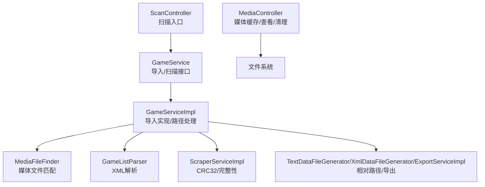
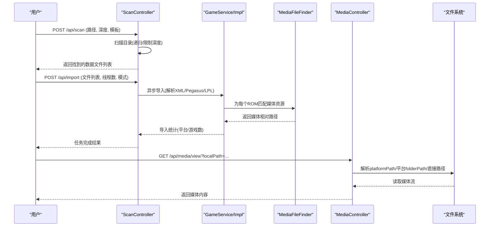
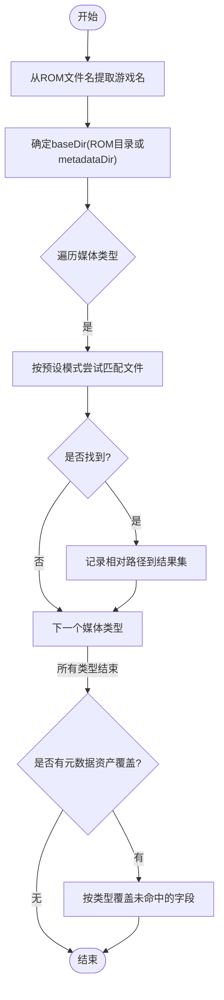
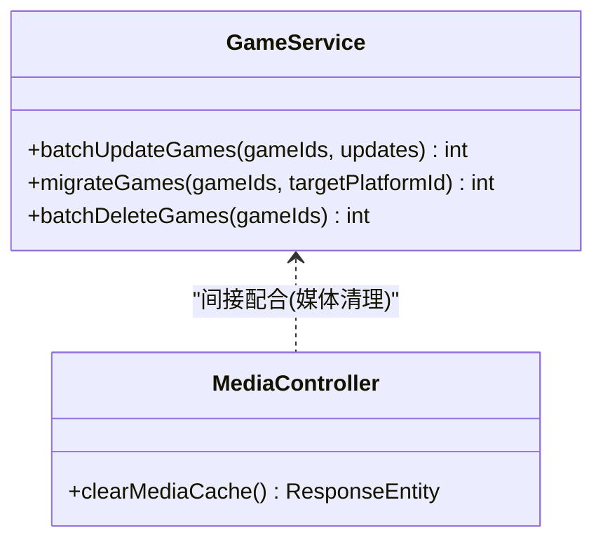
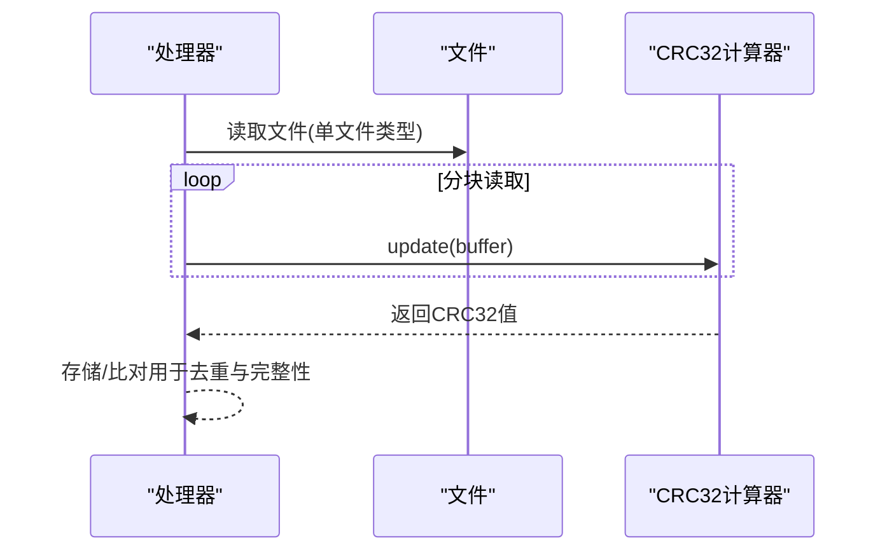
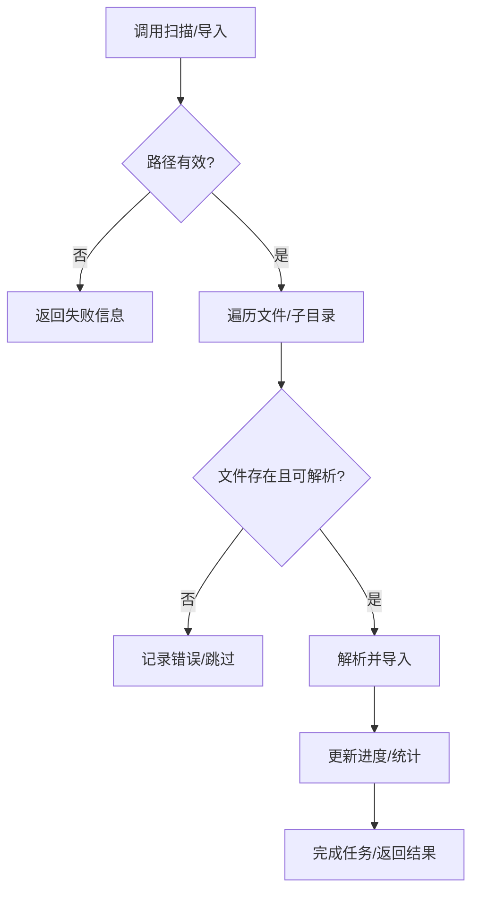
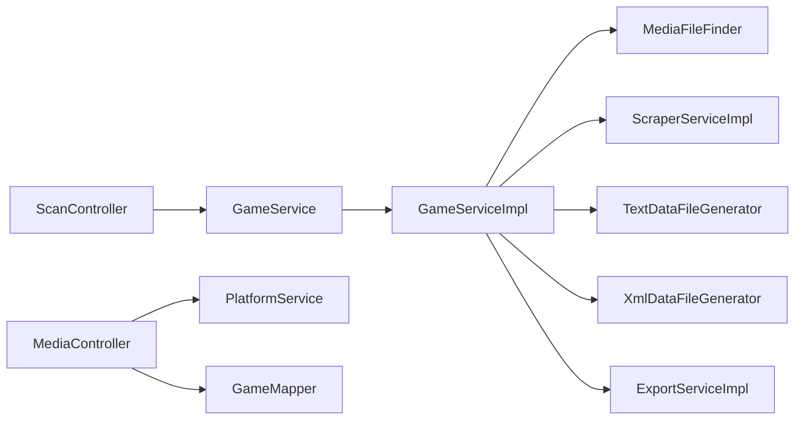

# 本地媒体管理

<cite>
**本文引用的文件**
- [MediaFileFinder.java](file://src/main/java/com/gamelist/util/MediaFileFinder.java)
- [ScanController.java](file://src/main/java/com/gamelist/controller/ScanController.java)
- [GameService.java](file://src/main/java/com/gamelist/service/GameService.java)
- [GameServiceImpl.java](file://src/main/java/com/gamelist/service/impl/GameServiceImpl.java)
- [Game.java](file://src/main/java/com/gamelist/model/Game.java)
- [GameFileInfo.java](file://src/main/java/com/gamelist/model/GameFileInfo.java)
- [FileType.java](file://src/main/java/com/gamelist/model/FileType.java)
- [MediaController.java](file://src/main/java/com/gamelist/controller/MediaController.java)
- [ScraperServiceImpl.java](file://src/main/java/com/gamelist/service/impl/ScraperServiceImpl.java)
- [GameListParser.java](file://src/main/java/com/gamelist/xml/GameListParser.java)
- [TextDataFileGenerator.java](file://src/main/java/com/gamelist/service/impl/TextDataFileGenerator.java)
- [ExportServiceImpl.java](file://src/main/java/com/gamelist/service/impl/ExportServiceImpl.java)
- [XmlDataFileGenerator.java](file://src/main/java/com/gamelist/service/impl/XmlDataFileGenerator.java)
</cite>

## 目录
1. [简介](#简介)
2. [项目结构](#项目结构)
3. [核心组件](#核心组件)
4. [架构总览](#架构总览)
5. [详细组件分析](#详细组件分析)
6. [依赖关系分析](#依赖关系分析)
7. [性能考虑](#性能考虑)
8. [故障排查指南](#故障排查指南)
9. [结论](#结论)
10. [附录](#附录)

## 简介
本章节面向“本地媒体管理”能力，系统性说明：
- 本地媒体文件的查找算法（扫描、匹配规则、重命名逻辑）
- 批量操作能力（批量重命名、批量移动、批量删除等）
- 媒体文件验证机制（格式检查、完整性校验、损坏检测）
- 媒体库整理与优化建议（去重、归档、备份策略）
- 文件系统操作的异常处理与恢复机制

该功能围绕游戏 ROM 及其配套媒体资源（封面、视频、截图、手册等）的自动发现、导入、缓存与访问展开，支撑前端展示与导出。

## 项目结构
围绕本地媒体管理的代码主要分布在以下位置：
- 工具层：媒体文件查找器 MediaFileFinder
- 控制器层：扫描入口 ScanController、媒体访问 MediaController
- 服务层：GameService 接口与 GameServiceImpl 实现（含路径计算、相对路径转换等）
- 模型层：Game、GameFileInfo、FileType
- XML/数据解析：GameListParser
- 数据生成与导出：TextDataFileGenerator、XmlDataFileGenerator、ExportServiceImpl
- 校验与哈希：ScraperServiceImpl（CRC32 计算）

图表来源
- [ScanController.java:170-239](file://src/main/java/com/gamelist/controller/ScanController.java#L170-L239)
- [GameService.java:13-61](file://src/main/java/com/gamelist/service/GameService.java#L13-L61)
- [GameServiceImpl.java:116-200](file://src/main/java/com/gamelist/service/impl/GameServiceImpl.java#L116-L200)
- [MediaFileFinder.java:89-159](file://src/main/java/com/gamelist/util/MediaFileFinder.java#L89-L159)
- [MediaController.java:34-88](file://src/main/java/com/gamelist/controller/MediaController.java#L34-L88)

章节来源
- [ScanController.java:170-239](file://src/main/java/com/gamelist/controller/ScanController.java#L170-L239)
- [GameService.java:13-61](file://src/main/java/com/gamelist/service/GameService.java#L13-L61)

## 核心组件
- 媒体文件查找器：根据 ROM 文件名与约定目录结构，按多模式匹配各类媒体资源（封面、视频、截图、手册等），并支持元数据资产覆盖。
- 扫描与导入：支持扫描指定目录深度、模板方式、无数据文件模式；异步执行导入任务，统计平台与游戏数量。
- 媒体缓存与访问：将远程或外部路径的文件复制到本地缓存目录，提供统一访问 URL；支持按平台/游戏路径解析相对路径。
- 路径与相对路径计算：在多处实现相对路径计算，保证跨平台兼容与导出一致性。
- 完整性校验：对单文件类型计算 CRC32，用于去重与完整性判断。

章节来源
- [MediaFileFinder.java:89-159](file://src/main/java/com/gamelist/util/MediaFileFinder.java#L89-L159)
- [ScanController.java:244-410](file://src/main/java/com/gamelist/controller/ScanController.java#L244-L410)
- [MediaController.java:34-88](file://src/main/java/com/gamelist/controller/MediaController.java#L34-L88)
- [GameServiceImpl.java:2983-3023](file://src/main/java/com/gamelist/service/impl/GameServiceImpl.java#L2983-L3023)
- [ScraperServiceImpl.java:1484-1516](file://src/main/java/com/gamelist/service/impl/ScraperServiceImpl.java#L1484-L1516)

## 架构总览
本地媒体管理的关键流程包括：
- 扫描阶段：根据路径与深度扫描目标数据文件（gamelist.xml、metadata.pegasus.txt、.lpl 或自定义扩展名）。
- 导入阶段：解析数据文件，构建 Game 对象，关联平台信息，必要时进行媒体文件匹配与缓存。
- 访问阶段：通过 MediaController 提供媒体文件查看与缓存能力，支持相对路径到绝对路径的转换。
- 导出/生成阶段：使用 TextDataFileGenerator/XmlDataFileGenerator/ExportServiceImpl 输出媒体引用，保持相对路径一致。

图表来源
- [ScanController.java:170-239](file://src/main/java/com/gamelist/controller/ScanController.java#L170-L239)
- [ScanController.java:244-410](file://src/main/java/com/gamelist/controller/ScanController.java#L244-L410)
- [MediaFileFinder.java:89-159](file://src/main/java/com/gamelist/util/MediaFileFinder.java#L89-L159)
- [MediaController.java:96-243](file://src/main/java/com/gamelist/controller/MediaController.java#L96-L243)

## 详细组件分析

### 媒体文件查找算法（扫描、匹配规则、重命名逻辑）
- 扫描基础：以 ROM 文件名为基准，提取不含扩展名的游戏名，结合 baseDir（默认 ROM 所在目录或指定 metadataDir）构造候选路径。
- 匹配规则：针对每种媒体类型（boxFront、video、logo、screenshot、boxBack、boxSpine、boxFull、cartridge、bezel、panel、cabinetLeft、cabinetRight、tile、banner、steam、poster、background、music、titlescreen、manual、box3d、steamgrid、fanart、boxtexture、supporttexture）定义多套路径模式，优先顺序由代码中数组顺序决定。
- 元数据资产覆盖：若传入 metadataAssets，则对已发现的媒体进行覆盖式补充，仅当对应类型尚未找到时写入。
- 重命名逻辑：媒体缓存阶段会生成唯一文件名（时间戳+原文件名，去除特殊字符），避免冲突；媒体访问阶段不修改源文件，仅做路径解析与流式返回。

图表来源
- [MediaFileFinder.java:89-159](file://src/main/java/com/gamelist/util/MediaFileFinder.java#L89-L159)
- [MediaFileFinder.java:167-731](file://src/main/java/com/gamelist/util/MediaFileFinder.java#L167-L731)
- [MediaFileFinder.java:733-800](file://src/main/java/com/gamelist/util/MediaFileFinder.java#L733-L800)

章节来源
- [MediaFileFinder.java:89-159](file://src/main/java/com/gamelist/util/MediaFileFinder.java#L89-L159)
- [MediaFileFinder.java:167-731](file://src/main/java/com/gamelist/util/MediaFileFinder.java#L167-L731)
- [MediaFileFinder.java:733-800](file://src/main/java/com/gamelist/util/MediaFileFinder.java#L733-L800)

### 批量操作功能（批量重命名、批量移动、批量删除）
- 批量重命名/移动：当前仓库未提供直接的“批量重命名/移动 ROM 文件”的 API；但提供了批量更新数据库记录的接口（如 batchUpdateGames、migrateGames），可用于批量迁移平台归属或更新字段。
- 批量删除：提供 batchDeleteGames 接口，可批量删除游戏记录（注意：此操作影响数据库记录，不直接删除物理文件）。
- 媒体缓存清理：提供 /api/media/clear 接口，清空本地媒体缓存目录下的所有缓存文件。

图表来源
- [GameService.java:57-61](file://src/main/java/com/gamelist/service/GameService.java#L57-L61)
- [MediaController.java:245-270](file://src/main/java/com/gamelist/controller/MediaController.java#L245-L270)

章节来源
- [GameService.java:57-61](file://src/main/java/com/gamelist/service/GameService.java#L57-L61)
- [MediaController.java:245-270](file://src/main/java/com/gamelist/controller/MediaController.java#L245-L270)

### 媒体文件验证机制（格式检查、完整性验证、损坏检测）
- 格式检查：MediaController 在返回媒体流时根据扩展名设置正确的 Content-Type（png/jpg/gif/mp4/avi/mkv/pdf/octet-stream），用于前端正确渲染。
- 完整性验证：对单文件类型计算 CRC32，用于去重与完整性校验（适用于 SINGLE_FILE 类型）。
- 损坏检测：当前未实现基于文件头或解码的损坏检测；建议在导入或预览阶段增加可选的“轻量校验”（如图片宽高、视频时长）以提升健壮性。

图表来源
- [ScraperServiceImpl.java:1484-1516](file://src/main/java/com/gamelist/service/impl/ScraperServiceImpl.java#L1484-L1516)
- [FileType.java:3-8](file://src/main/java/com/gamelist/model/FileType.java#L3-L8)

章节来源
- [MediaController.java:203-223](file://src/main/java/com/gamelist/controller/MediaController.java#L203-L223)
- [ScraperServiceImpl.java:1484-1516](file://src/main/java/com/gamelist/service/impl/ScraperServiceImpl.java#L1484-L1516)

### 媒体库整理与优化建议（去重、归档、备份策略）
- 去重：利用 CRC32 对单文件类型进行去重；对于多文件或压缩包，可扩展为基于内容哈希（如 SHA-256）的去重方案。
- 归档：将历史或低频使用的媒体资源移动到归档目录，并在数据库中保留相对路径引用，确保访问链路不变。
- 备份策略：定期备份 media 目录与数据库；对关键平台目录建立快照或增量备份；导出 XML/文本数据文件作为离线备份。

[本节为通用建议，不直接分析具体文件]

### 文件系统操作的异常处理与恢复机制
- 扫描与导入：
  - 路径不存在或非法：返回失败信息与计数为零。
  - 文件不存在：跳过并记录错误日志。
  - 解析失败：捕获异常并记录堆栈，继续处理其他文件。
- 媒体缓存与访问：
  - 源文件不存在：返回 404 与错误消息。
  - IO 异常：返回 500 与错误消息。
  - 清理缓存：遍历删除失败时记录异常。
- 相对路径计算：
  - 跨盘符或分隔符不一致时，采用字符串前缀匹配兜底，确保导出一致性。

图表来源
- [ScanController.java:170-239](file://src/main/java/com/gamelist/controller/ScanController.java#L170-L239)
- [ScanController.java:244-410](file://src/main/java/com/gamelist/controller/ScanController.java#L244-L410)
- [MediaController.java:34-88](file://src/main/java/com/gamelist/controller/MediaController.java#L34-L88)
- [MediaController.java:96-243](file://src/main/java/com/gamelist/controller/MediaController.java#L96-L243)
- [GameListParser.java:373-407](file://src/main/java/com/gamelist/xml/GameListParser.java#L373-L407)

章节来源
- [ScanController.java:170-239](file://src/main/java/com/gamelist/controller/ScanController.java#L170-L239)
- [ScanController.java:244-410](file://src/main/java/com/gamelist/controller/ScanController.java#L244-L410)
- [MediaController.java:34-88](file://src/main/java/com/gamelist/controller/MediaController.java#L34-L88)
- [MediaController.java:96-243](file://src/main/java/com/gamelist/controller/MediaController.java#L96-L243)
- [GameListParser.java:373-407](file://src/main/java/com/gamelist/xml/GameListParser.java#L373-L407)

## 依赖关系分析
- ScanController 依赖 GameService 进行导入与扫描；GameServiceImpl 实现具体逻辑，并依赖 MediaFileFinder 进行媒体匹配。
- MediaController 依赖 PlatformService 与 GameMapper 获取平台与游戏信息，用于路径解析。
- ScraperServiceImpl 提供 CRC32 计算，用于完整性校验。
- 导出相关组件（TextDataFileGenerator、XmlDataFileGenerator、ExportServiceImpl）提供相对路径计算，确保导出一致性。

图表来源
- [ScanController.java:170-239](file://src/main/java/com/gamelist/controller/ScanController.java#L170-L239)
- [GameService.java:13-61](file://src/main/java/com/gamelist/service/GameService.java#L13-L61)
- [GameServiceImpl.java:116-200](file://src/main/java/com/gamelist/service/impl/GameServiceImpl.java#L116-L200)
- [MediaController.java:96-243](file://src/main/java/com/gamelist/controller/MediaController.java#L96-L243)
- [ScraperServiceImpl.java:1484-1516](file://src/main/java/com/gamelist/service/impl/ScraperServiceImpl.java#L1484-L1516)
- [TextDataFileGenerator.java:268-296](file://src/main/java/com/gamelist/service/impl/TextDataFileGenerator.java#L268-L296)
- [XmlDataFileGenerator.java:277-305](file://src/main/java/com/gamelist/service/impl/XmlDataFileGenerator.java#L277-L305)
- [ExportServiceImpl.java:841-869](file://src/main/java/com/gamelist/service/impl/ExportServiceImpl.java#L841-L869)

章节来源
- [ScanController.java:170-239](file://src/main/java/com/gamelist/controller/ScanController.java#L170-L239)
- [GameService.java:13-61](file://src/main/java/com/gamelist/service/GameService.java#L13-L61)
- [GameServiceImpl.java:116-200](file://src/main/java/com/gamelist/service/impl/GameServiceImpl.java#L116-L200)
- [MediaController.java:96-243](file://src/main/java/com/gamelist/controller/MediaController.java#L96-L243)
- [ScraperServiceImpl.java:1484-1516](file://src/main/java/com/gamelist/service/impl/ScraperServiceImpl.java#L1484-L1516)
- [TextDataFileGenerator.java:268-296](file://src/main/java/com/gamelist/service/impl/TextDataFileGenerator.java#L268-L296)
- [XmlDataFileGenerator.java:277-305](file://src/main/java/com/gamelist/service/impl/XmlDataFileGenerator.java#L277-L305)
- [ExportServiceImpl.java:841-869](file://src/main/java/com/gamelist/service/impl/ExportServiceImpl.java#L841-L869)

## 性能考虑
- 扫描深度控制：通过 depth 参数限制递归深度，避免深层目录扫描带来的性能开销。
- 并发导入：支持 threadCount 参数，合理设置线程数提升导入吞吐。
- 媒体匹配优化：媒体匹配按优先级顺序尝试，命中即返回，减少不必要的文件系统访问。
- 缓存策略：媒体文件缓存至本地目录，减少重复复制与网络访问。
- 相对路径计算：多处实现相对路径计算，避免绝对路径导致的跨平台问题与导出不一致。

[本节为通用指导，不直接分析具体文件]

## 故障排查指南
- 扫描失败：
  - 检查路径是否存在且为目录。
  - 确认模板配置是否正确（数据文件类型）。
  - 查看任务日志中的错误信息。
- 导入失败：
  - 检查文件格式（gamelist.xml、metadata.pegasus.txt、.lpl）。
  - 查看异常堆栈与详细错误日志。
- 媒体无法访问：
  - 检查 platformPath 与平台 folderPath 是否正确。
  - 确认媒体文件是否存在于预期路径。
  - 尝试使用原始路径访问。
- 清理缓存失败：
  - 检查 media 目录权限。
  - 查看异常信息并修复权限或磁盘问题。

章节来源
- [ScanController.java:170-239](file://src/main/java/com/gamelist/controller/ScanController.java#L170-L239)
- [ScanController.java:244-410](file://src/main/java/com/gamelist/controller/ScanController.java#L244-L410)
- [MediaController.java:96-243](file://src/main/java/com/gamelist/controller/MediaController.java#L96-L243)
- [MediaController.java:245-270](file://src/main/java/com/gamelist/controller/MediaController.java#L245-L270)
- [GameListParser.java:373-407](file://src/main/java/com/gamelist/xml/GameListParser.java#L373-L407)

## 结论
本项目实现了较为完善的本地媒体管理能力：
- 通过 MediaFileFinder 提供强大的媒体文件匹配能力，支持多种命名与目录约定。
- 通过 ScanController 与 GameService 实现灵活的扫描与导入流程，支持模板与无数据文件模式。
- 通过 MediaController 提供媒体缓存与访问，支持相对路径解析与跨平台兼容。
- 通过 ScraperServiceImpl 提供 CRC32 完整性校验，辅助去重与质量保障。
- 通过导出组件保证相对路径一致性，便于跨系统迁移与共享。

建议后续增强：
- 增加更丰富的媒体完整性校验（图片/视频头检查）。
- 完善批量重命名/移动 ROM 文件的 API。
- 引入更健壮的损坏检测与修复机制。

[本节为总结，不直接分析具体文件]

## 附录
- 数据模型参考：
  - Game：包含大量媒体字段（boxFront、video、logo、screenshot 等），用于持久化媒体引用。
  - GameFileInfo：描述游戏文件信息（名称、CRC32、类型、路径、大小）。
  - FileType：枚举单文件/多文件及压缩包类型。

章节来源
- [Game.java:1-650](file://src/main/java/com/gamelist/model/Game.java#L1-L650)
- [GameFileInfo.java:1-61](file://src/main/java/com/gamelist/model/GameFileInfo.java#L1-L61)
- [FileType.java:1-8](file://src/main/java/com/gamelist/model/FileType.java#L1-L8)