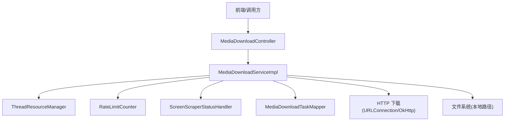
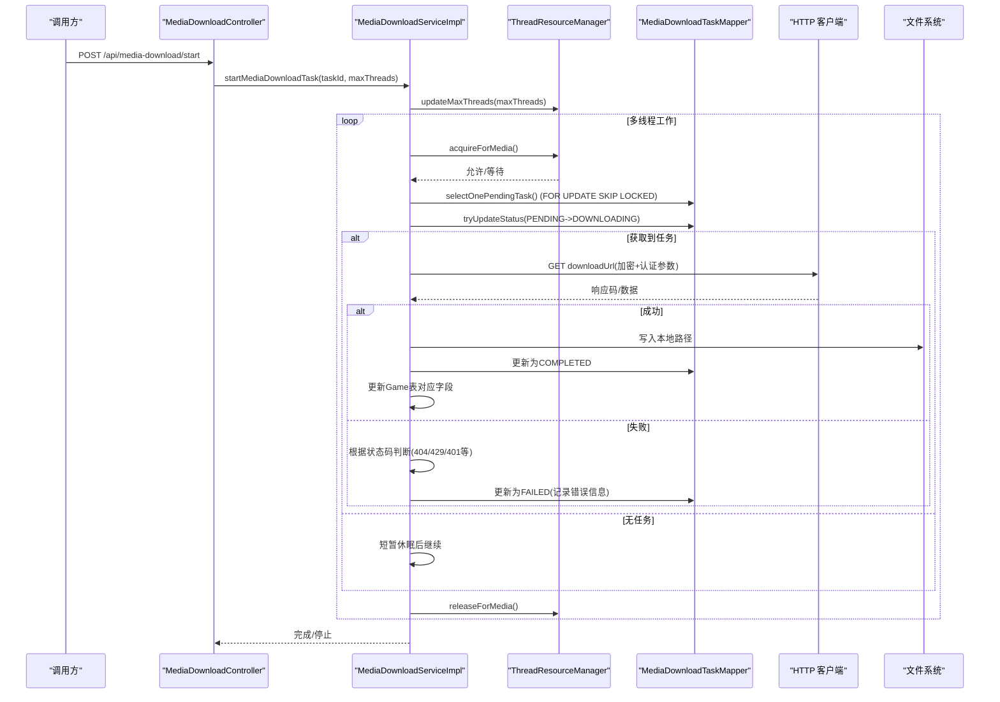
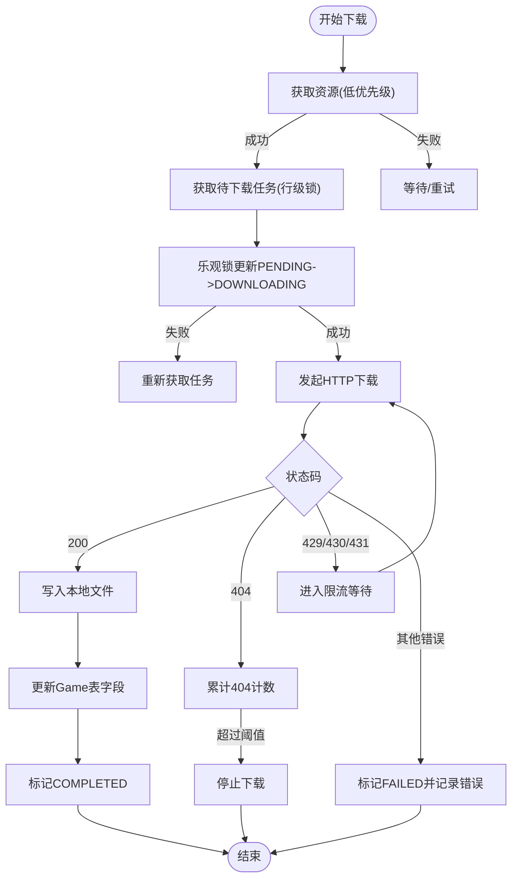
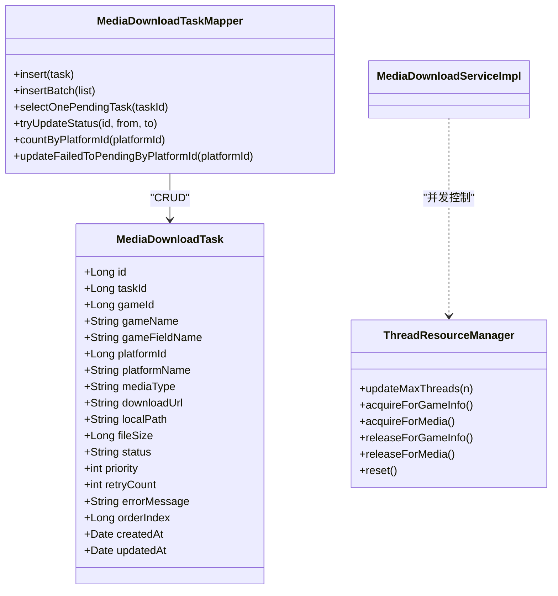
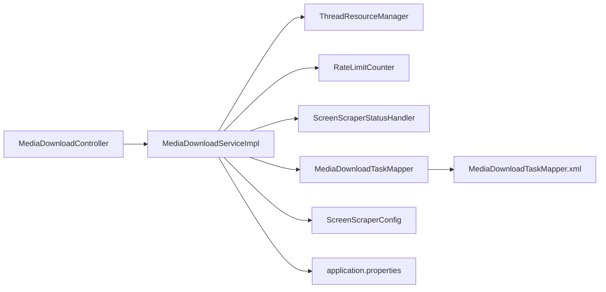

# 自动下载机制

<cite>
**本文引用的文件**
- [MediaDownloadService.java](file://src/main/java/com/gamelist/service/MediaDownloadService.java)
- [MediaDownloadServiceImpl.java](file://src/main/java/com/gamelist/service/impl/MediaDownloadServiceImpl.java)
- [MediaDownloadTask.java](file://src/main/java/com/gamelist/model/MediaDownloadTask.java)
- [ScreenScraperConfig.java](file://src/main/java/com/gamelist/config/ScreenScraperConfig.java)
- [MediaDownloadController.java](file://src/main/java/com/gamelist/controller/MediaDownloadController.java)
- [RateLimitCounter.java](file://src/main/java/com/gamelist/util/RateLimitCounter.java)
- [ScreenScraperStatusHandler.java](file://src/main/java/com/gamelist/util/ScreenScraperStatusHandler.java)
- [ThreadResourceManager.java](file://src/main/java/com/gamelist/service/ThreadResourceManager.java)
- [MediaDownloadTaskMapper.java](file://src/main/java/com/gamelist/mapper/MediaDownloadTaskMapper.java)
- [MediaDownloadTaskMapper.xml](file://src/main/resources/mappers/MediaDownloadTaskMapper.xml)
- [application.properties](file://src/main/resources/application.properties)
</cite>

## 目录
1. [简介](#简介)
2. [项目结构](#项目结构)
3. [核心组件](#核心组件)
4. [架构总览](#架构总览)
5. [详细组件分析](#详细组件分析)
6. [依赖关系分析](#依赖关系分析)
7. [性能考虑](#性能考虑)
8. [故障排查指南](#故障排查指南)
9. [结论](#结论)
10. [附录](#附录)

## 简介
本文件面向“媒体自动下载”子系统，系统性说明其工作原理与实现细节，覆盖以下方面：
- 下载源配置（ScreenScraper API）
- 下载策略（并发控制、重试机制、错误处理）
- 任务创建流程、优先级排序、资源管理
- 缓存机制（本地缓存策略、网络请求优化）
- 断点续传能力现状与建议
- 性能调优建议与最佳实践
- 常见问题的排查方法与解决方案

## 项目结构
自动下载相关代码主要分布在 service、controller、util、mapper、config 等包中，采用分层设计：
- Controller 层暴露 REST 接口，负责接收请求、参数校验与结果封装
- Service 层实现下载调度、并发控制、限流、状态机流转与业务逻辑
- Util 层提供限流器、状态码处理器等通用工具
- Mapper 层通过 MyBatis 访问数据库，维护下载任务的状态与统计
- Config 层集中管理 ScreenScraper 基础配置

图表来源
- [MediaDownloadController.java:1-483](file://src/main/java/com/gamelist/controller/MediaDownloadController.java#L1-L483)
- [MediaDownloadServiceImpl.java:1-635](file://src/main/java/com/gamelist/service/impl/MediaDownloadServiceImpl.java#L1-L635)
- [ThreadResourceManager.java:1-377](file://src/main/java/com/gamelist/service/ThreadResourceManager.java#L1-L377)
- [RateLimitCounter.java:1-138](file://src/main/java/com/gamelist/util/RateLimitCounter.java#L1-L138)
- [ScreenScraperStatusHandler.java:1-213](file://src/main/java/com/gamelist/util/ScreenScraperStatusHandler.java#L1-L213)
- [MediaDownloadTaskMapper.java:1-56](file://src/main/java/com/gamelist/mapper/MediaDownloadTaskMapper.java#L1-L56)

章节来源
- [MediaDownloadController.java:1-483](file://src/main/java/com/gamelist/controller/MediaDownloadController.java#L1-L483)
- [MediaDownloadServiceImpl.java:1-635](file://src/main/java/com/gamelist/service/impl/MediaDownloadServiceImpl.java#L1-L635)
- [application.properties:1-86](file://src/main/resources/application.properties#L1-L86)

## 核心组件
- MediaDownloadService/Impl：下载任务调度、线程池管理、限流、状态机、失败重试、平台级启停与统计
- ThreadResourceManager：统一并发资源分配，优先保障游戏信息线程，媒体下载为低优先级
- RateLimitCounter：基于滑动窗口的访问频率限制，避免触发目标 API 限流
- ScreenScraperStatusHandler：对 HTTP 状态码进行分类、建议与是否立即停止的判断
- MediaDownloadTask/Mapper/XML：任务模型与持久化，支持按平台/任务维度查询、批量更新与乐观锁
- MediaDownloadController：对外暴露任务管理、启停、统计、平台维度的操作接口
- ScreenScraperConfig：ScreenScraper 基础地址与开发凭据配置

章节来源
- [MediaDownloadService.java:1-20](file://src/main/java/com/gamelist/service/MediaDownloadService.java#L1-L20)
- [MediaDownloadServiceImpl.java:1-635](file://src/main/java/com/gamelist/service/impl/MediaDownloadServiceImpl.java#L1-L635)
- [ThreadResourceManager.java:1-377](file://src/main/java/com/gamelist/service/ThreadResourceManager.java#L1-L377)
- [RateLimitCounter.java:1-138](file://src/main/java/com/gamelist/util/RateLimitCounter.java#L1-L138)
- [ScreenScraperStatusHandler.java:1-213](file://src/main/java/com/gamelist/util/ScreenScraperStatusHandler.java#L1-L213)
- [MediaDownloadTask.java:1-175](file://src/main/java/com/gamelist/model/MediaDownloadTask.java#L1-L175)
- [MediaDownloadTaskMapper.java:1-56](file://src/main/java/com/gamelist/mapper/MediaDownloadTaskMapper.java#L1-L56)
- [MediaDownloadTaskMapper.xml:1-180](file://src/main/resources/mappers/MediaDownloadTaskMapper.xml#L1-L180)
- [ScreenScraperConfig.java:1-46](file://src/main/java/com/gamelist/config/ScreenScraperConfig.java#L1-L46)
- [MediaDownloadController.java:1-483](file://src/main/java/com/gamelist/controller/MediaDownloadController.java#L1-L483)

## 架构总览
自动下载的整体流程如下：
- 控制器接收启动/暂停/恢复/停止/重试等请求，委托服务层执行
- 服务层使用固定大小线程池并行拉取任务，结合资源管理器进行并发控制
- 每个工作线程从数据库获取一个待下载任务（带行级锁），尝试将状态由 PENDING 改为 DOWNLOADING（乐观锁）
- 下载前通过限流器检查是否允许访问；下载时解密 URL、追加认证参数并发起 HTTP 请求
- 成功则写盘并更新游戏记录字段；失败根据状态码分类处理（立即停止/通知用户/重试）
- 任务完成后释放资源，主循环监控剩余任务直至结束或收到停止信号

图表来源
- [MediaDownloadController.java:1-483](file://src/main/java/com/gamelist/controller/MediaDownloadController.java#L1-L483)
- [MediaDownloadServiceImpl.java:64-229](file://src/main/java/com/gamelist/service/impl/MediaDownloadServiceImpl.java#L64-L229)
- [MediaDownloadTaskMapper.xml:95-101](file://src/main/resources/mappers/MediaDownloadTaskMapper.xml#L95-L101)
- [ThreadResourceManager.java:166-245](file://src/main/java/com/gamelist/service/ThreadResourceManager.java#L166-L245)

## 详细组件分析

### 下载源配置（ScreenScraper API）
- 基础地址与凭据：通过配置类集中管理，便于切换环境与调试
- 认证参数注入：下载前会解析 URL，移除旧的 ssid/sspassword，并根据当前登录状态追加最新凭据，确保每次请求使用正确身份
- 日志脱敏：URL 中的敏感参数在日志中会被掩码，避免泄露

章节来源
- [ScreenScraperConfig.java:1-46](file://src/main/java/com/gamelist/config/ScreenScraperConfig.java#L1-L46)
- [MediaDownloadServiceImpl.java:312-365](file://src/main/java/com/gamelist/service/impl/MediaDownloadServiceImpl.java#L312-L365)
- [MediaDownloadServiceImpl.java:370-377](file://src/main/java/com/gamelist/service/impl/MediaDownloadServiceImpl.java#L370-L377)

### 下载策略（并发控制、重试机制、错误处理）
- 并发控制
  - 固定线程池 + 资源管理器：实际并发受限于可用线程数，且当有游戏信息线程等待时，媒体下载线程让出资源，保证高优先级任务不阻塞
  - 每线程独立获取任务并尝试状态变更，避免重复下载
- 重试机制
  - 失败任务可重置为待下载状态并增加重试计数，支持平台级重试
  - 针对特定状态码（如 429/430/431）可通过限流器与退避策略降低请求频率
- 错误处理
  - 使用状态码分类器统一处理不同错误类型，支持“立即停止”、“通知用户”、“可重试”等分支
  - 404 高频出现时触发保护性停止，防止无效请求风暴

图表来源
- [MediaDownloadServiceImpl.java:88-189](file://src/main/java/com/gamelist/service/impl/MediaDownloadServiceImpl.java#L88-L189)
- [MediaDownloadTaskMapper.xml:95-101](file://src/main/resources/mappers/MediaDownloadTaskMapper.xml#L95-L101)
- [ScreenScraperStatusHandler.java:19-43](file://src/main/java/com/gamelist/util/ScreenScraperStatusHandler.java#L19-L43)
- [RateLimitCounter.java:31-79](file://src/main/java/com/gamelist/util/RateLimitCounter.java#L31-L79)

章节来源
- [MediaDownloadServiceImpl.java:64-229](file://src/main/java/com/gamelist/service/impl/MediaDownloadServiceImpl.java#L64-L229)
- [ThreadResourceManager.java:166-245](file://src/main/java/com/gamelist/service/ThreadResourceManager.java#L166-L245)
- [ScreenScraperStatusHandler.java:79-187](file://src/main/java/com/gamelist/util/ScreenScraperStatusHandler.java#L79-L187)
- [RateLimitCounter.java:1-138](file://src/main/java/com/gamelist/util/RateLimitCounter.java#L1-L138)

### 任务创建流程、优先级排序、资源管理
- 任务创建
  - 通过 Mapper 插入单条或多条任务，包含任务ID、游戏ID、平台ID、媒体类型、下载URL、本地路径、优先级、顺序索引等
  - 支持按平台/任务维度查询与删除
- 优先级排序
  - 任务按 order_index 升序获取，保证同一任务内的媒体下载顺序可控
  - 资源管理器内，游戏信息线程优先级高于媒体下载线程，避免关键路径被阻塞
- 资源管理
  - 动态调整最大线程数，并在任务结束时重置资源状态，避免泄漏
  - 所有资源获取均在 try-finally 中归还，确保异常情况下也能释放

图表来源
- [MediaDownloadTask.java:1-175](file://src/main/java/com/gamelist/model/MediaDownloadTask.java#L1-L175)
- [MediaDownloadTaskMapper.java:1-56](file://src/main/java/com/gamelist/mapper/MediaDownloadTaskMapper.java#L1-L56)
- [MediaDownloadTaskMapper.xml:26-101](file://src/main/resources/mappers/MediaDownloadTaskMapper.xml#L26-L101)
- [ThreadResourceManager.java:61-95](file://src/main/java/com/gamelist/service/ThreadResourceManager.java#L61-L95)

章节来源
- [MediaDownloadTaskMapper.xml:26-101](file://src/main/resources/mappers/MediaDownloadTaskMapper.xml#L26-L101)
- [MediaDownloadServiceImpl.java:88-189](file://src/main/java/com/gamelist/service/impl/MediaDownloadServiceImpl.java#L88-L189)
- [ThreadResourceManager.java:104-245](file://src/main/java/com/gamelist/service/ThreadResourceManager.java#L104-L245)

### 缓存机制（本地缓存策略、网络请求优化）
- 本地缓存策略
  - 下载成功后直接写入本地路径，后续读取可通过静态资源映射访问
  - 应用配置中启用静态资源映射，关闭浏览器缓存以利于调试
- 网络请求优化
  - 连接超时与读取超时合理设置，避免长时间阻塞
  - 使用 HttpURLConnection 流式写入，减少内存占用
  - 对 URL 进行解密与认证参数注入，提高鉴权成功率
- 断点续传
  - 当前实现未包含断点续传逻辑（Range 头与分片下载）
  - 如需支持，可在下载器中增加 Range 请求与本地文件偏移写入，并结合任务状态记录已下载字节数

章节来源
- [application.properties:10-13](file://src/main/resources/application.properties#L10-L13)
- [MediaDownloadServiceImpl.java:268-303](file://src/main/java/com/gamelist/service/impl/MediaDownloadServiceImpl.java#L268-L303)

### 平台级管理与统计
- 平台维度的启停、恢复、重试与统计接口
- 支持批量停止所有平台下载，以及按平台删除任务
- 统计信息包括总数、待下载、下载中、已完成、失败、已停止数量

章节来源
- [MediaDownloadController.java:228-483](file://src/main/java/com/gamelist/controller/MediaDownloadController.java#L228-L483)
- [MediaDownloadServiceImpl.java:560-635](file://src/main/java/com/gamelist/service/impl/MediaDownloadServiceImpl.java#L560-L635)

## 依赖关系分析
- 控制器依赖服务接口，服务实现依赖资源管理器、限流器、状态码处理器与数据库映射
- 数据库映射通过 XML 定义 SQL，使用 FOR UPDATE SKIP LOCKED 实现行级锁，避免并发竞争
- 配置类与属性文件提供运行时参数，影响行为与路径

图表来源
- [MediaDownloadController.java:1-483](file://src/main/java/com/gamelist/controller/MediaDownloadController.java#L1-L483)
- [MediaDownloadServiceImpl.java:1-635](file://src/main/java/com/gamelist/service/impl/MediaDownloadServiceImpl.java#L1-L635)
- [MediaDownloadTaskMapper.xml:1-180](file://src/main/resources/mappers/MediaDownloadTaskMapper.xml#L1-L180)
- [ScreenScraperConfig.java:1-46](file://src/main/java/com/gamelist/config/ScreenScraperConfig.java#L1-L46)
- [application.properties:1-86](file://src/main/resources/application.properties#L1-L86)

章节来源
- [MediaDownloadTaskMapper.xml:95-101](file://src/main/resources/mappers/MediaDownloadTaskMapper.xml#L95-L101)
- [application.properties:15-27](file://src/main/resources/application.properties#L15-L27)

## 性能考虑
- 并发与资源
  - 合理设置最大线程数，避免过高导致系统抖动或触发远端限流
  - 利用资源管理器让出机制，确保游戏信息线程优先，提升整体吞吐
- 限流与退避
  - 使用滑动窗口限流器，避免短时间突发请求触发 429/430/431
  - 遇到限流时适当退避，降低无效重试
- I/O 与网络
  - 流式写入减少内存峰值
  - 合理设置连接与读取超时，避免长尾请求拖慢线程池
- 数据库
  - 使用行级锁与乐观锁减少竞争
  - 批量插入与更新减少往返次数
- 缓存
  - 开启静态资源映射，减少后端压力
  - 未来可引入本地缓存与断点续传，提升大文件下载稳定性

[本节为通用指导，无需具体文件引用]

## 故障排查指南
- 常见问题定位
  - 404 频繁：检查 ROM/CRC 是否正确，关注 404 计数窗口，必要时停止下载
  - 429/430/431：降低并发或等待配额恢复，检查限流器配置
  - 401/403：确认用户名密码与凭证有效，检查认证参数注入逻辑
  - 下载卡住：检查资源管理器是否有未归还资源，查看活跃线程快照
- 日志与监控
  - 关注下载过程中的状态码与错误消息
  - 使用平台统计接口观察各阶段任务数量变化
- 恢复与重试
  - 使用平台级恢复接口将 STOPPED/FAILED 任务重置为 PENDING
  - 使用重试接口仅重置 FAILED 任务，并递增重试计数

章节来源
- [ScreenScraperStatusHandler.java:79-187](file://src/main/java/com/gamelist/util/ScreenScraperStatusHandler.java#L79-L187)
- [MediaDownloadServiceImpl.java:382-405](file://src/main/java/com/gamelist/service/impl/MediaDownloadServiceImpl.java#L382-L405)
- [MediaDownloadController.java:380-483](file://src/main/java/com/gamelist/controller/MediaDownloadController.java#L380-L483)

## 结论
该自动下载机制通过分层设计与多种保障手段实现了稳定高效的媒体下载：
- 并发控制与优先级保障确保系统在高负载下仍保持良好响应
- 限流与状态码处理有效应对远端 API 的限制与异常
- 任务状态机与乐观锁避免重复下载与数据不一致
- 平台级管理提供了灵活的启停与重试能力
- 当前未实现断点续传，可按需扩展以提升大文件下载的鲁棒性

[本节为总结性内容，无需具体文件引用]

## 附录
- 关键接口一览（部分）
  - 获取任务列表、按平台/任务筛选、删除任务
  - 获取状态与统计、暂停/恢复/停止
  - 平台维度的停止/恢复/重试/删除
- 配置项参考
  - 服务器端口、编码、静态资源映射
  - 数据库连接与连接池参数
  - 文件上传临时目录与工作目录

章节来源
- [MediaDownloadController.java:28-483](file://src/main/java/com/gamelist/controller/MediaDownloadController.java#L28-L483)
- [application.properties:1-86](file://src/main/resources/application.properties#L1-L86)