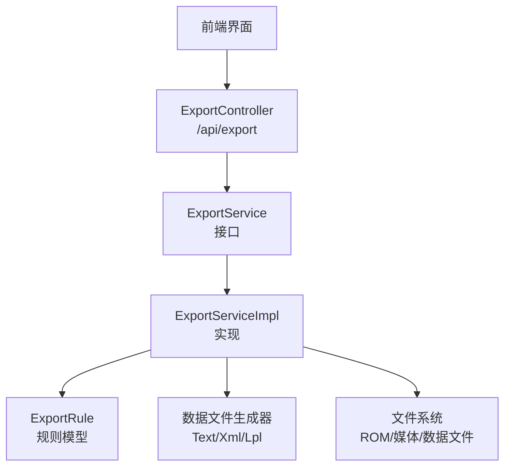
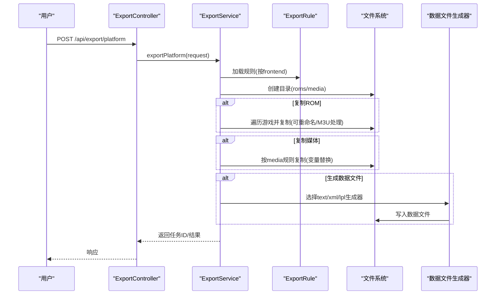
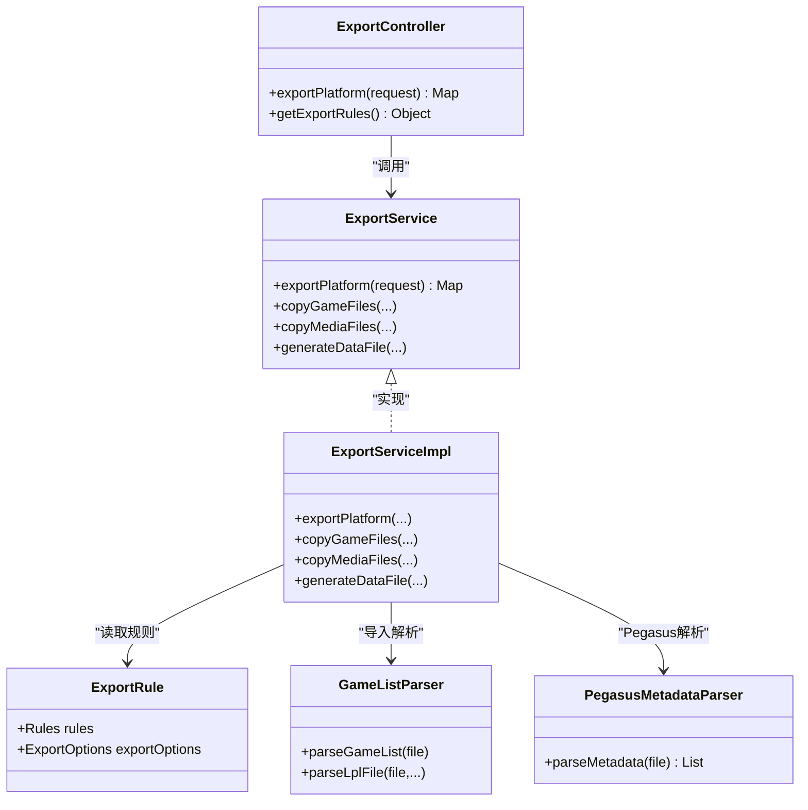

# 导入导出功能

<cite>
**本文引用的文件**
- [rules/import/pegasus.json](file://rules/import/pegasus.json)
- [rules/export/pegasus.json](file://rules/export/pegasus.json)
- [rules/import/retrobat.json](file://rules/import/retrobat.json)
- [rules/export/retrobat.json](file://rules/export/retrobat.json)
- [rules/import/emuelec.json](file://rules/import/emuelec.json)
- [rules/export/emuelec.json](file://rules/export/emuelec.json)
- [rules/import/lakka.json](file://rules/import/lakka.json)
- [rules/export/lakka.json](file://rules/export/lakka.json)
- [ExportController.java](file://src/main/java/com/gamelist/controller/ExportController.java)
- [ExportService.java](file://src/main/java/com/gamelist/service/ExportService.java)
- [ExportServiceImpl.java](file://src/main/java/com/gamelist/service/impl/ExportServiceImpl.java)
- [ExportRule.java](file://src/main/java/com/gamelist/model/ExportRule.java)
- [GameListParser.java](file://src/main/java/com/gamelist/xml/GameListParser.java)
- [PegasusMetadataParser.java](file://src/main/java/com/gamelist/util/PegasusMetadataParser.java)
- [export-functionality-cn.md](file://docs/export-functionality-cn.md)
- [import-templates-cn.md](file://docs/import-templates-cn.md)
</cite>

## 目录
1. [简介](#简介)
2. [项目结构](#项目结构)
3. [核心组件](#核心组件)
4. [架构总览](#架构总览)
5. [详细组件分析](#详细组件分析)
6. [依赖关系分析](#依赖关系分析)
7. [性能考量](#性能考量)
8. [故障排查指南](#故障排查指南)
9. [结论](#结论)
10. [附录](#附录)

## 简介
本文件面向“导入/导出”能力，覆盖以下目标：
- 支持的前端模板格式：Pegasus、RetroBat、EmuELEC、Lakka 等
- 每种格式的导入与导出配置方法
- 导入模板与导出规则的 JSON 结构说明（字段映射、路径变量、条件过滤等）
- 自定义模板创建指南（模板语法、变量替换机制、错误处理）
- 批量导入/导出的操作流程与最佳实践
- 常见问题解决方案与性能优化建议

## 项目结构
- 规则定义位于 rules/import 与 rules/export 下，分别描述各前端的导入与导出规则
- 后端服务通过控制器与服务层加载规则并执行导入/导出
- 文档位于 docs 下，提供中文说明与示例

图表来源
- [ExportController.java:14-59](file://src/main/java/com/gamelist/controller/ExportController.java#L14-L59)
- [ExportService.java:7-37](file://src/main/java/com/gamelist/service/ExportService.java#L7-L37)
- [ExportServiceImpl.java:52-180](file://src/main/java/com/gamelist/service/impl/ExportServiceImpl.java#L52-L180)
- [ExportRule.java:17-99](file://src/main/java/com/gamelist/model/ExportRule.java#L17-L99)

章节来源
- [ExportController.java:14-59](file://src/main/java/com/gamelist/controller/ExportController.java#L14-L59)
- [ExportService.java:7-37](file://src/main/java/com/gamelist/service/ExportService.java#L7-L37)
- [ExportServiceImpl.java:52-180](file://src/main/java/com/gamelist/service/impl/ExportServiceImpl.java#L52-L180)
- [ExportRule.java:17-99](file://src/main/java/com/gamelist/model/ExportRule.java#L17-L99)

## 核心组件
- 导出控制器：接收导出请求，返回任务信息
- 导出服务：编排导出流程（复制 ROM、复制媒体、生成数据文件）
- 规则模型：描述媒体映射、数据文件格式、目录结构、M3U 处理、LPL 导出等
- XML/文本解析器：负责导入时解析不同前端的数据文件（XML、Pegasus 文本、Lakka .lpl）

章节来源
- [ExportController.java:14-59](file://src/main/java/com/gamelist/controller/ExportController.java#L14-L59)
- [ExportServiceImpl.java:52-180](file://src/main/java/com/gamelist/service/impl/ExportServiceImpl.java#L52-L180)
- [ExportRule.java:17-99](file://src/main/java/com/gamelist/model/ExportRule.java#L17-L99)
- [GameListParser.java:319-384](file://src/main/java/com/gamelist/xml/GameListParser.java#L319-L384)
- [PegasusMetadataParser.java:284-614](file://src/main/java/com/gamelist/util/PegasusMetadataParser.java#L284-L614)

## 架构总览
导出流程以“规则驱动”为核心：根据所选前端规则，动态决定输出目录、媒体拷贝策略、数据文件结构与字段映射。导入流程则依据导入模板解析外部数据文件，并将游戏与媒体关联到系统内部模型。

图表来源
- [ExportController.java:25-41](file://src/main/java/com/gamelist/controller/ExportController.java#L25-L41)
- [ExportServiceImpl.java:52-180](file://src/main/java/com/gamelist/service/impl/ExportServiceImpl.java#L52-L180)
- [ExportRule.java:17-99](file://src/main/java/com/gamelist/model/ExportRule.java#L17-L99)

## 详细组件分析

### Pegasus 导入/导出
- 导入模板要点
  - 数据类型：text，分隔符为冒号
  - 表头：支持 key-value 形式，提取平台名称、排序、启动命令等
  - 字段映射：name/description/releaseDate/developer/publisher/genre/players/files/rating 及多种媒体字段
  - 媒体匹配：支持 media/{filename}/... 等多路径模式，path 转换默认 no
- 导出规则要点
  - 数据文件：metadata.pegasus.txt，text 格式，支持 header/footer/fields 映射
  - 媒体映射：video/box2dfront/box2dback/box3d/screenshot/wheel/marquee/fanart 等
  - 目录：roms/media 使用变量模板
  - M3U：可选启用，目标路径模板

章节来源
- [rules/import/pegasus.json:1-556](file://rules/import/pegasus.json#L1-L556)
- [rules/export/pegasus.json:1-93](file://rules/export/pegasus.json#L1-L93)
- [PegasusMetadataParser.java:284-614](file://src/main/java/com/gamelist/util/PegasusMetadataParser.java#L284-L614)

### RetroBat 导入/导出
- 导入模板要点
  - 数据类型：xml，gamelist.xml
  - 表头：provider 节点，支持 System/software/database/web/launch/sort-by/description
  - 字段映射：name/description/releaseDate/developer/publisher/genre/players/files 及多种媒体字段
  - 媒体匹配：media/{filename}/... 多路径模式，path 转换默认 no
- 导出规则要点
  - 数据文件：gamelist.xml，xml 格式，header/footer/fields 映射
  - 媒体映射：box2dfront/box2dback/box3d/screenshot/video/wheel/marquee/fanart
  - 目录：roms/media 使用变量模板

章节来源
- [rules/import/retrobat.json:1-435](file://rules/import/retrobat.json#L1-L435)
- [rules/export/retrobat.json:1-92](file://rules/export/retrobat.json#L1-L92)

### EmuELEC 导入/导出
- 导入模板要点
  - 数据类型：xml，gamelist.xml
  - 表头：默认禁用
  - 字段映射：name/description/releaseDate/developer/publisher/genre/players/hash/files 及多种媒体字段
  - 媒体匹配：downloaded_images/{platform}/... 与 media/... 多路径模式
- 导出规则要点
  - 数据文件：gamelist.xml，xml 格式，pathFormat 绝对路径带点前缀
  - 媒体映射：box2dback/box2dfront/box2dside/box3d/fanart/screenshot/video/wheel/banner/manual/images
  - 目录：roms/media/gamelist 使用变量模板

章节来源
- [rules/import/emuelec.json:1-206](file://rules/import/emuelec.json#L1-L206)
- [rules/export/emuelec.json:1-102](file://rules/export/emuelec.json#L1-L102)

### Lakka 导入/导出
- 导入模板要点
  - 数据类型：text，*.lpl
  - 行格式：支持 5/6 行条目自动检测，行号到字段映射（files/name/corePath/coreName/databaseLink/playlistName）
  - 空值标记：DETECT
- 导出规则要点
  - LPL 导出：enabled/outputPath/lineFormat
  - 核心映射：coreMappings（按平台或 default）
  - 平台映射：platformMappings
  - 数据文件：{platformName}.lpl，format=lpl，pathFormat=absolute
  - 媒体映射：screenshot/thumbnail/video

章节来源
- [rules/import/lakka.json:1-58](file://rules/import/lakka.json#L1-L58)
- [rules/export/lakka.json:1-73](file://rules/export/lakka.json#L1-L73)
- [GameListParser.java:571-697](file://src/main/java/com/gamelist/xml/GameListParser.java#L571-L697)

### 导入模板与导出规则的 JSON 结构
- 导入模板（rules/import/*.json）
  - 基本信息：frontend/name/version/description/type/dataFile/delimiter
  - rules.header：enabled/format/startMarker/endMarker/structure/fields
  - rules.fieldMappings：字段映射（isMultiValue/valuePrefix/transform.path/trim/case/replace）
  - rules.media：媒体类型 source/rules（路径模板列表），支持 {gameName}/{filename}/{filepath}/{ext}
  - rules.extensions：image/video 扩展名
  - rules.gameExtensions：游戏文件扩展名
- 导出规则（rules/export/*.json）
  - rules.media：source/target/dataFileTag
  - rules.dataFile：filename/format/fieldSeparator/entrySeparator/header/footer/fields/pathFormat/fieldTransforms
  - rules.directory：roms/media
  - rules.m3u：enabled/target
  - rules.lplExport：enabled/outputPath/lineFormat
  - rules.coreMappings/platformMappings：Lakka 专用

章节来源
- [import-templates-cn.md:16-224](file://docs/import-templates-cn.md#L16-L224)
- [export-functionality-cn.md:18-116](file://docs/export-functionality-cn.md#L18-L116)
- [ExportRule.java:17-99](file://src/main/java/com/gamelist/model/ExportRule.java#L17-L99)

### 变量替换机制
- 路径变量：{outputPath}/{platform}/{gameName}/{mediaPath}/{romsPath}
- 平台变量：{platform.system}/{platform.name}/{platform.launch}/{platform.software}/{platform.database}/{platform.web}
- 环境变量：{env.appdir}/{env.home}/{env.user}
- 游戏变量：{game.name}/{game.path}/{game.description}/{game.rating}/{game.developer}/{game.publisher}/{game.genre}/{game.players}
- 替换顺序：路径变量 → 平台变量 → 环境变量 → 游戏变量

章节来源
- [export-functionality-cn.md:405-443](file://docs/export-functionality-cn.md#L405-L443)
- [ExportServiceImpl.java:210-223](file://src/main/java/com/gamelist/service/impl/ExportServiceImpl.java#L210-L223)
- [ExportServiceImpl.java:381-397](file://src/main/java/com/gamelist/service/impl/ExportServiceImpl.java#L381-L397)
- [ExportServiceImpl.java:524-533](file://src/main/java/com/gamelist/service/impl/ExportServiceImpl.java#L524-L533)

### 批量导入/导出操作流程
- 批量导出
  - 选择平台与前端规则
  - 勾选导出范围（ROM/媒体/数据文件）
  - 设置输出路径与线程数
  - 执行导出，查看实时进度与日志
- 批量导入
  - 选择导入模板（Pegasus/RetroBat/EmuELEC/Lakka）
  - 上传数据文件（XML/文本/.lpl）
  - 系统解析并映射字段与媒体，生成内部模型
  - 可结合抓取/翻译等后续流程完善元数据

章节来源
- [export-functionality-cn.md:776-792](file://docs/export-functionality-cn.md#L776-L792)
- [GameListParser.java:319-384](file://src/main/java/com/gamelist/xml/GameListParser.java#L319-L384)
- [PegasusMetadataParser.java:284-614](file://src/main/java/com/gamelist/util/PegasusMetadataParser.java#L284-L614)

### 自定义模板创建指南
- 模板语法
  - 导入模板：定义 header/fieldMappings/media/extensions/gameExtensions
  - 导出规则：定义 media/dataFile/directory/m3u/lplExport/coreMappings/platformMappings
- 变量替换
  - 在 target/header/footer/lineFormat 中使用变量占位符
  - 注意 pathFormat 与 fieldTransforms 的路径前缀控制
- 错误处理
  - XML 解析支持多编码尝试与 BOM 检测
  - 未知元素忽略，记录警告/错误事件
  - LPL 解析支持 5/6 行格式自动检测与空值标记

章节来源
- [GameListParser.java:104-139](file://src/main/java/com/gamelist/xml/GameListParser.java#L104-L139)
- [GameListParser.java:148-162](file://src/main/java/com/gamelist/xml/GameListParser.java#L148-L162)
- [GameListParser.java:186-210](file://src/main/java/com/gamelist/xml/GameListParser.java#L186-L210)
- [GameListParser.java:571-697](file://src/main/java/com/gamelist/xml/GameListParser.java#L571-L697)

## 依赖关系分析
- 控制器依赖服务接口，服务实现依赖规则模型与数据文件生成器
- 导入解析依赖 GameListParser 与 PegasusMetadataParser
- 导出流程依赖 ExportRule 的 media/dataFile/directory/m3u/lplExport 等子规则

图表来源
- [ExportController.java:14-59](file://src/main/java/com/gamelist/controller/ExportController.java#L14-L59)
- [ExportService.java:7-37](file://src/main/java/com/gamelist/service/ExportService.java#L7-L37)
- [ExportServiceImpl.java:52-180](file://src/main/java/com/gamelist/service/impl/ExportServiceImpl.java#L52-L180)
- [ExportRule.java:17-99](file://src/main/java/com/gamelist/model/ExportRule.java#L17-L99)
- [GameListParser.java:319-384](file://src/main/java/com/gamelist/xml/GameListParser.java#L319-L384)
- [PegasusMetadataParser.java:284-614](file://src/main/java/com/gamelist/util/PegasusMetadataParser.java#L284-L614)

章节来源
- [ExportController.java:14-59](file://src/main/java/com/gamelist/controller/ExportController.java#L14-L59)
- [ExportService.java:7-37](file://src/main/java/com/gamelist/service/ExportService.java#L7-L37)
- [ExportServiceImpl.java:52-180](file://src/main/java/com/gamelist/service/impl/ExportServiceImpl.java#L52-L180)
- [ExportRule.java:17-99](file://src/main/java/com/gamelist/model/ExportRule.java#L17-L99)
- [GameListParser.java:319-384](file://src/main/java/com/gamelist/xml/GameListParser.java#L319-L384)
- [PegasusMetadataParser.java:284-614](file://src/main/java/com/gamelist/util/PegasusMetadataParser.java#L284-L614)

## 性能考量
- 并发复制：导出服务使用固定大小线程池复制 ROM 与媒体文件，提升吞吐
- 预检查规则：提前判断是否启用游戏文件重命名与 M3U 处理，减少无效操作
- 变量预构建：媒体规则迭代前预构建列表，避免重复获取
- 线程安全：媒体复制时为每条任务创建局部变量映射，避免共享状态竞争
- I/O 优化：确保目标目录预先创建，减少重复 mkdir 开销

章节来源
- [ExportServiceImpl.java:233-359](file://src/main/java/com/gamelist/service/impl/ExportServiceImpl.java#L233-L359)
- [ExportServiceImpl.java:408-501](file://src/main/java/com/gamelist/service/impl/ExportServiceImpl.java#L408-L501)
- [ExportServiceImpl.java:690-739](file://src/main/java/com/gamelist/service/impl/ExportServiceImpl.java#L690-L739)

## 故障排查指南
- XML 解析失败
  - 检查 BOM 与编码声明，系统会尝试多种编码
  - 关注 JAXB 验证事件中的 WARNING/ERROR/FATAL_ERROR 消息
- LPL 解析异常
  - 确认每条目行数（5/6）与 nullValueMarker（如 DETECT）
  - 检查 ZIP 路径中的 # 符号处理
- 媒体文件未找到
  - 核对导入模板中 media.rules 的路径模板与源字段
  - 检查 path 转换（no/yes/keep）是否符合预期
- 导出路径错误
  - 检查 directory.roms/media 与 dataFile.filename 的变量替换
  - 确认 platform/system 等变量已正确注入

章节来源
- [GameListParser.java:104-139](file://src/main/java/com/gamelist/xml/GameListParser.java#L104-L139)
- [GameListParser.java:186-210](file://src/main/java/com/gamelist/xml/GameListParser.java#L186-L210)
- [GameListParser.java:571-697](file://src/main/java/com/gamelist/xml/GameListParser.java#L571-L697)
- [ExportServiceImpl.java:210-223](file://src/main/java/com/gamelist/service/impl/ExportServiceImpl.java#L210-L223)
- [ExportServiceImpl.java:381-397](file://src/main/java/com/gamelist/service/impl/ExportServiceImpl.java#L381-L397)

## 结论
本系统通过“规则驱动”的导入/导出机制，实现对 Pegasus、RetroBat、EmuELEC、Lakka 等多种前端的高效适配。导入模板与导出规则均基于 JSON 配置，支持灵活的字段映射、路径变量与条件处理；后端服务提供并发复制、变量替换与数据文件生成能力，满足批量场景下的性能与稳定性需求。

## 附录
- 常用变量参考：见导出功能文档的变量章节
- 字段映射与转换：见导入模板文档的字段映射与 transform 章节
- 媒体类型与路径模板：见各前端的 import/export 规则文件