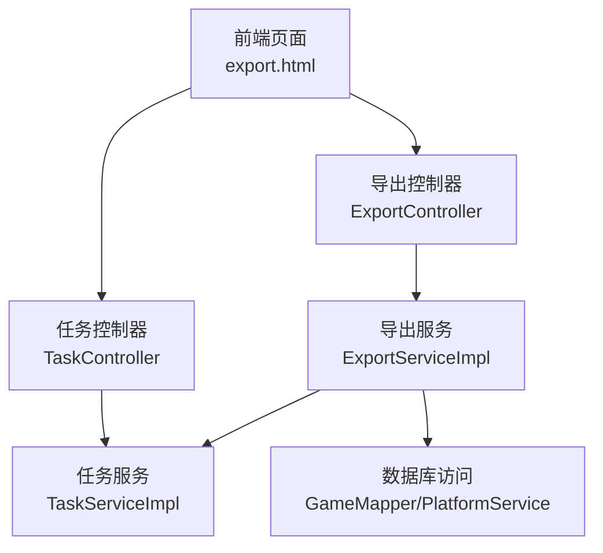
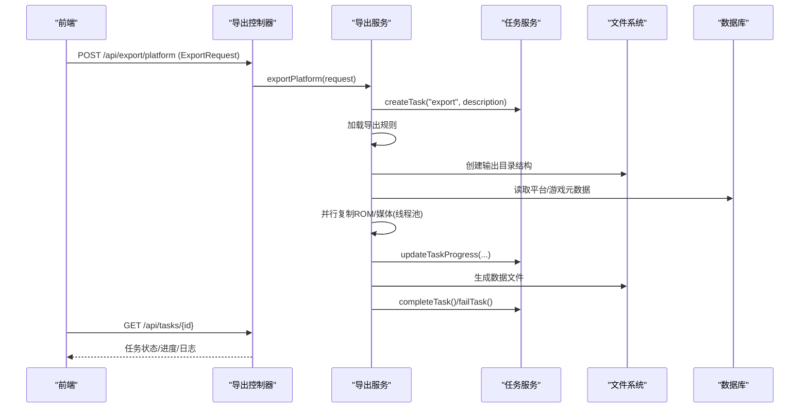
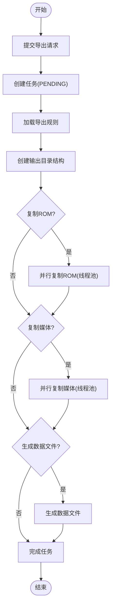
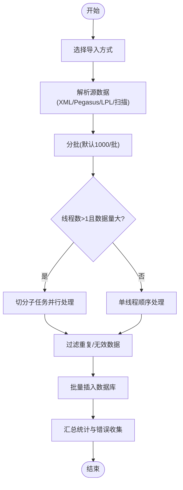
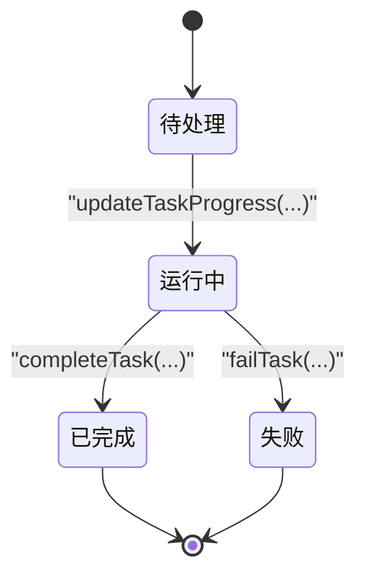
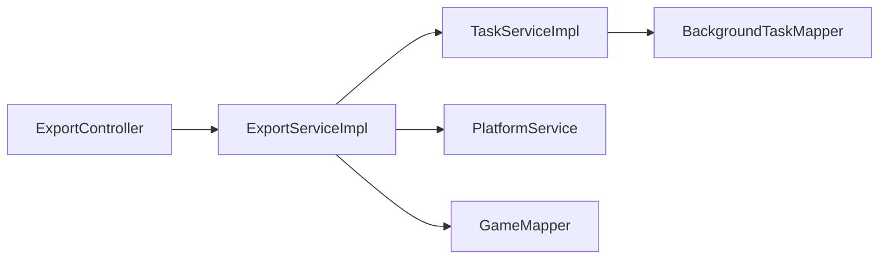

# 批量操作指南

<cite>
**本文引用的文件**
- [ExportController.java](file://src/main/java/com/gamelist/controller/ExportController.java)
- [ExportServiceImpl.java](file://src/main/java/com/gamelist/service/impl/ExportServiceImpl.java)
- [TaskController.java](file://src/main/java/com/gamelist/controller/TaskController.java)
- [TaskServiceImpl.java](file://src/main/java/com/gamelist/service/impl/TaskServiceImpl.java)
- [BackgroundTask.java](file://src/main/java/com/gamelist/model/BackgroundTask.java)
- [ExportRequest.java](file://src/main/java/com/gamelist/model/ExportRequest.java)
- [GameService.java](file://src/main/java/com/gamelist/service/GameService.java)
- [GameServiceImpl.java](file://src/main/java/com/gamelist/service/impl/GameServiceImpl.java)
- [export.html](file://src/main/resources/static/export.html)
- [export-functionality-cn.md](file://docs/export-functionality-cn.md)
</cite>

## 目录
1. [简介](#简介)
2. [项目结构](#项目结构)
3. [核心组件](#核心组件)
4. [架构总览](#架构总览)
5. [详细组件分析](#详细组件分析)
6. [依赖关系分析](#依赖关系分析)
7. [性能考虑](#性能考虑)
8. [故障排查指南](#故障排查指南)
9. [结论](#结论)
10. [附录：API与使用示例](#附录api与使用示例)

## 简介
本指南面向需要执行“批量导入/导出”的用户与开发者，聚焦以下目标：
- 明确批量操作的端到端流程：任务提交、进度监控、结果处理
- 给出最佳实践：数据准备、错误处理、性能优化、并发控制
- 提供可操作的 API 调用示例与代码片段路径
- 总结常见问题及解决方案：内存管理、超时处理、重试机制
- 给出性能调优建议与关键监控指标

## 项目结构
本项目采用分层架构：
- 控制器层：对外暴露 REST API（导出、任务管理等）
- 服务层：实现业务逻辑（导出、导入、任务调度等）
- 模型层：请求/响应对象与任务实体
- 资源层：前端页面与规则配置文档

图表来源
- [ExportController.java:25-41](file://src/main/java/com/gamelist/controller/ExportController.java#L25-L41)
- [ExportServiceImpl.java:52-181](file://src/main/java/com/gamelist/service/impl/ExportServiceImpl.java#L52-L181)
- [TaskController.java:22-60](file://src/main/java/com/gamelist/controller/TaskController.java#L22-L60)
- [TaskServiceImpl.java:59-141](file://src/main/java/com/gamelist/service/impl/TaskServiceImpl.java#L59-L141)

章节来源
- [ExportController.java:1-60](file://src/main/java/com/gamelist/controller/ExportController.java#L1-L60)
- [ExportServiceImpl.java:1-181](file://src/main/java/com/gamelist/service/impl/ExportServiceImpl.java#L1-L181)
- [TaskController.java:1-60](file://src/main/java/com/gamelist/controller/TaskController.java#L1-L60)
- [TaskServiceImpl.java:1-141](file://src/main/java/com/gamelist/service/impl/TaskServiceImpl.java#L1-L141)

## 核心组件
- 导出控制器：接收导出请求并返回任务信息
- 导出服务：加载规则、创建任务、分阶段执行（目录创建、ROM复制、媒体复制、数据文件生成），更新任务进度与日志
- 任务服务：统一的任务生命周期管理（创建、进度更新、完成/失败、查询、清理）
- 任务模型：描述任务类型、状态、进度、消息、统计、结果、日志等
- 导入服务接口与实现：支持 XML/Pegasus/LPL/文件扫描等多种导入方式，内置分批与多线程策略

章节来源
- [ExportController.java:25-41](file://src/main/java/com/gamelist/controller/ExportController.java#L25-L41)
- [ExportServiceImpl.java:52-181](file://src/main/java/com/gamelist/service/impl/ExportServiceImpl.java#L52-L181)
- [TaskServiceImpl.java:59-141](file://src/main/java/com/gamelist/service/impl/TaskServiceImpl.java#L59-L141)
- [BackgroundTask.java:5-20](file://src/main/java/com/gamelist/model/BackgroundTask.java#L5-L20)
- [GameService.java:13-39](file://src/main/java/com/gamelist/service/GameService.java#L13-L39)

## 架构总览
下图展示从前端发起导出到后台异步执行、进度回传的完整链路。

图表来源
- [ExportController.java:25-41](file://src/main/java/com/gamelist/controller/ExportController.java#L25-L41)
- [ExportServiceImpl.java:52-181](file://src/main/java/com/gamelist/service/impl/ExportServiceImpl.java#L52-L181)
- [TaskController.java:41-49](file://src/main/java/com/gamelist/controller/TaskController.java#L41-L49)
- [TaskServiceImpl.java:59-141](file://src/main/java/com/gamelist/service/impl/TaskServiceImpl.java#L59-L141)

## 详细组件分析

### 导出流程（任务提交、执行、监控）
- 任务提交
  - 前端通过 /api/export/platform 提交 ExportRequest（平台ID、前端模板、输出路径、是否复制ROM/媒体/数据文件、线程数）
  - 控制器调用导出服务，服务加载规则、创建任务并立即返回任务ID
- 任务执行
  - 在单线程执行器中按阶段推进：创建目录、复制ROM、复制媒体、生成数据文件
  - 每个阶段通过任务服务更新进度、消息与日志
  - 复制阶段内部使用固定大小线程池并行处理，避免阻塞
- 结果处理
  - 成功：标记 COMPLETED，写入结果摘要
  - 失败：标记 FAILED，记录错误信息与日志
- 进度监控
  - 前端轮询 /api/tasks/{id} 获取任务状态、进度、消息与日志

图表来源
- [ExportServiceImpl.java:52-181](file://src/main/java/com/gamelist/service/impl/ExportServiceImpl.java#L52-L181)
- [TaskServiceImpl.java:59-141](file://src/main/java/com/gamelist/service/impl/TaskServiceImpl.java#L59-L141)

章节来源
- [ExportController.java:25-41](file://src/main/java/com/gamelist/controller/ExportController.java#L25-L41)
- [ExportServiceImpl.java:52-181](file://src/main/java/com/gamelist/service/impl/ExportServiceImpl.java#L52-L181)
- [TaskController.java:41-49](file://src/main/java/com/gamelist/controller/TaskController.java#L41-L49)
- [TaskServiceImpl.java:59-141](file://src/main/java/com/gamelist/service/impl/TaskServiceImpl.java#L59-L141)

### 导入流程（批量导入）
- 支持的导入方式
  - XML 列表、Pegasus 元数据、LPL 播放列表、文件夹扫描
- 分批与并发
  - 默认每批 1000 条；当线程数大于1且数据量超过批次大小时，切分为多个子任务并行处理
  - 过滤重复/无效数据后批量插入，减少内存峰值与锁竞争
- 统计与错误收集
  - 记录跳过路径、空路径游戏等信息，便于后续定位问题

图表来源
- [GameService.java:13-39](file://src/main/java/com/gamelist/service/GameService.java#L13-L39)
- [GameServiceImpl.java:246-300](file://src/main/java/com/gamelist/service/impl/GameServiceImpl.java#L246-L300)

章节来源
- [GameService.java:13-39](file://src/main/java/com/gamelist/service/GameService.java#L13-L39)
- [GameServiceImpl.java:246-300](file://src/main/java/com/gamelist/service/impl/GameServiceImpl.java#L246-L300)

### 任务模型与生命周期
- 任务字段
  - 类型、状态、进度、消息、总数/已处理数、起止时间、错误信息、描述、结果、日志、创建/更新时间
- 生命周期
  - PENDING → RUNNING → COMPLETED/FAILED
  - 运行中持续追加日志；完成后清理缓存

图表来源
- [BackgroundTask.java:5-20](file://src/main/java/com/gamelist/model/BackgroundTask.java#L5-L20)
- [TaskServiceImpl.java:59-141](file://src/main/java/com/gamelist/service/impl/TaskServiceImpl.java#L59-L141)

章节来源
- [BackgroundTask.java:5-20](file://src/main/java/com/gamelist/model/BackgroundTask.java#L5-L20)
- [TaskServiceImpl.java:59-141](file://src/main/java/com/gamelist/service/impl/TaskServiceImpl.java#L59-L141)

## 依赖关系分析
- 控制器与服务解耦：控制器仅负责参数校验与响应封装
- 服务间协作：导出服务依赖平台/游戏数据与规则服务；任务服务贯穿全流程
- 外部资源：文件系统、数据库、规则配置文件

图表来源
- [ExportController.java:19-41](file://src/main/java/com/gamelist/controller/ExportController.java#L19-L41)
- [ExportServiceImpl.java:35-45](file://src/main/java/com/gamelist/service/impl/ExportServiceImpl.java#L35-L45)
- [TaskServiceImpl.java:20-24](file://src/main/java/com/gamelist/service/impl/TaskServiceImpl.java#L20-L24)

章节来源
- [ExportController.java:19-41](file://src/main/java/com/gamelist/controller/ExportController.java#L19-L41)
- [ExportServiceImpl.java:35-45](file://src/main/java/com/gamelist/service/impl/ExportServiceImpl.java#L35-L45)
- [TaskServiceImpl.java:20-24](file://src/main/java/com/gamelist/service/impl/TaskServiceImpl.java#L20-L24)

## 性能考虑
- 并发控制
  - 导出：ROM/媒体复制阶段使用固定大小线程池，线程数由请求或默认值决定，并有上限保护
  - 导入：默认每批 1000 条，超大数据集时启用多线程并行处理，限制最大线程数以控资源
- 内存管理
  - 导入采用分批处理，避免一次性加载全部数据到内存
  - 导出阶段按需创建目录与文件，避免构建超大中间对象
- 超时与中断
  - 复制阶段对线程池设置等待超时，必要时强制关闭，防止长时间阻塞
- 规则与变量
  - 通过规则配置驱动数据文件生成与路径替换，减少硬编码与重复逻辑
- 监控指标建议
  - 任务维度：状态、进度、已处理/总数、耗时、错误次数
  - 系统维度：CPU/内存占用、磁盘IO、线程池队列长度、任务积压数量

章节来源
- [ExportServiceImpl.java:47-74](file://src/main/java/com/gamelist/service/impl/ExportServiceImpl.java#L47-L74)
- [ExportServiceImpl.java:231-363](file://src/main/java/com/gamelist/service/impl/ExportServiceImpl.java#L231-L363)
- [ExportServiceImpl.java:408-505](file://src/main/java/com/gamelist/service/impl/ExportServiceImpl.java#L408-L505)
- [GameServiceImpl.java:246-300](file://src/main/java/com/gamelist/service/impl/GameServiceImpl.java#L246-L300)

## 故障排查指南
- 常见错误
  - 平台不存在/规则未找到：检查平台ID与前端模板名称是否正确
  - 源文件缺失：确认 ROM/媒体源路径有效，日志中会记录缺失路径
  - 任务失败：查看任务日志与错误信息，定位具体阶段
- 调试步骤
  - 查看任务日志：通过任务详情接口获取详细日志
  - 检查规则配置：确认目录模板、媒体映射、数据文件格式正确
  - 降低并发：临时减小线程数，观察是否因资源争用导致失败
- 恢复策略
  - 断点续传：当前为阶段式进度更新，可按需重新触发对应阶段
  - 重试机制：对网络/IO异常可在上层增加重试与退避策略

章节来源
- [ExportServiceImpl.java:98-115](file://src/main/java/com/gamelist/service/impl/ExportServiceImpl.java#L98-L115)
- [ExportServiceImpl.java:338-345](file://src/main/java/com/gamelist/service/impl/ExportServiceImpl.java#L338-L345)
- [TaskServiceImpl.java:95-141](file://src/main/java/com/gamelist/service/impl/TaskServiceImpl.java#L95-L141)

## 结论
本项目的批量导入/导出以“任务化 + 规则驱动 + 分批并发”为核心设计，既保证了大规模数据处理的可扩展性，又提供了完善的进度与日志能力。结合合理的并发控制与内存管理策略，可在保证稳定性的同时获得良好吞吐。建议在生产环境结合监控指标进行容量规划与调优。

## 附录：API与使用示例
- 导出
  - 提交导出任务
    - 方法：POST
    - 路径：/api/export/platform
    - 请求体：ExportRequest（platformId、frontend、outputPath、copyRoms、copyMedia、generateDataFile、threadCount）
    - 参考：[ExportController.java:25-41](file://src/main/java/com/gamelist/controller/ExportController.java#L25-L41)、[ExportRequest.java:5-69](file://src/main/java/com/gamelist/model/ExportRequest.java#L5-L69)
  - 获取导出规则列表
    - 方法：GET
    - 路径：/api/export/rules
    - 参考：[ExportController.java:43-59](file://src/main/java/com/gamelist/controller/ExportController.java#L43-L59)
- 任务管理
  - 获取所有任务：GET /api/tasks
  - 获取单个任务：GET /api/tasks/{id}
  - 删除任务：DELETE /api/tasks/{id}
  - 清空任务：DELETE /api/tasks/clear
  - 参考：[TaskController.java:41-60](file://src/main/java/com/gamelist/controller/TaskController.java#L41-L60)
- 前端交互
  - 导出页面通过 fetch 调用 /api/export/platform，并在成功后提示前往任务管理页查看进度
  - 参考：[export.html:679-710](file://src/main/resources/static/export.html#L679-L710)
- 导入相关
  - 导入接口定义见 GameService 接口，支持多种导入方式与线程控制
  - 参考：[GameService.java:13-39](file://src/main/java/com/gamelist/service/GameService.java#L13-L39)
- 规则与功能说明
  - 导出功能详细说明与规则配置示例
  - 参考：[export-functionality-cn.md:1-800](file://docs/export-functionality-cn.md#L1-L800)