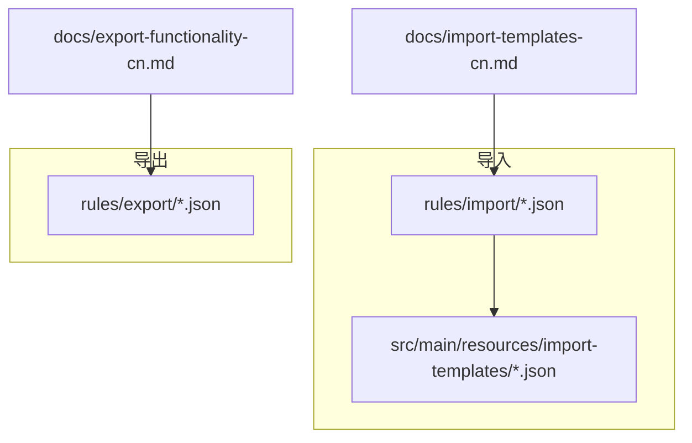
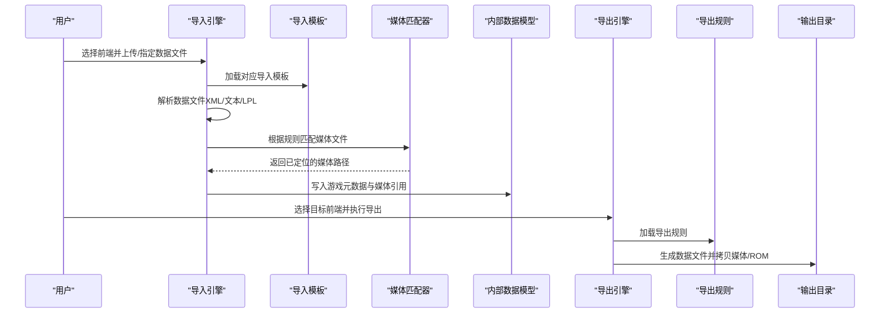
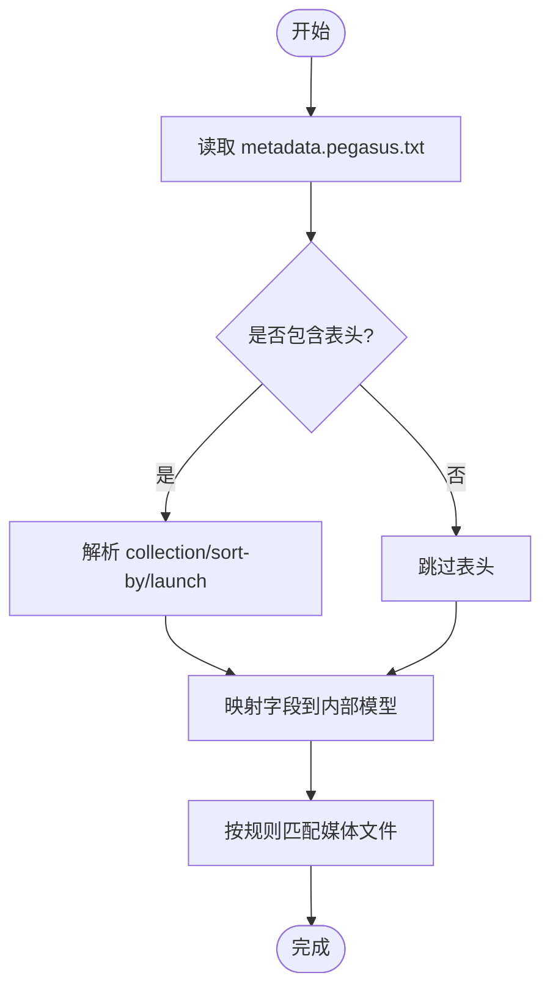
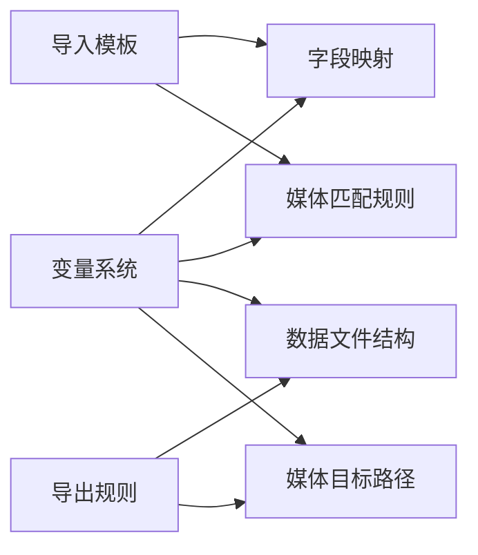

# 支持的格式说明

<cite>
**本文引用的文件**
- [rules/import/pegasus.json](file://rules/import/pegasus.json)
- [rules/import/retrobat.json](file://rules/import/retrobat.json)
- [rules/import/emuelec.json](file://rules/import/emuelec.json)
- [rules/import/lakka.json](file://rules/import/lakka.json)
- [rules/import/esde.json](file://rules/import/esde.json)
- [src/main/resources/import-templates/pegasus.json](file://src/main/resources/import-templates/pegasus.json)
- [src/main/resources/import-templates/retrobat.json](file://src/main/resources/import-templates/retrobat.json)
- [src/main/resources/import-templates/emuelec.json](file://src/main/resources/import-templates/emuelec.json)
- [src/main/resources/import-templates/lakka.json](file://src/main/resources/import-templates/lakka.json)
- [src/main/resources/import-templates/esde.json](file://src/main/resources/import-templates/esde.json)
- [rules/export/pegasus.json](file://rules/export/pegasus.json)
- [rules/export/retrobat.json](file://rules/export/retrobat.json)
- [rules/export/emuelec.json](file://rules/export/emuelec.json)
- [rules/export/lakka.json](file://rules/export/lakka.json)
- [rules/export/esde.json](file://rules/export/esde.json)
- [docs/import-templates-cn.md](file://docs/import-templates-cn.md)
- [docs/export-functionality-cn.md](file://docs/export-functionality-cn.md)
</cite>

## 目录
1. [简介](#简介)
2. [项目结构](#项目结构)
3. [核心组件](#核心组件)
4. [架构总览](#架构总览)
5. [详细组件分析](#详细组件分析)
6. [依赖关系分析](#依赖关系分析)
7. [性能考虑](#性能考虑)
8. [故障排查指南](#故障排查指南)
9. [结论](#结论)
10. [附录](#附录)

## 简介
本文件系统性说明本项目对主流模拟器前端（Pegasus、RetroBat、EmuELEC、Lakka、ESDE）的导入与导出格式支持。内容涵盖：
- 各前端的 XML/文本数据文件格式特点与字段映射
- 媒体资源路径约定与匹配规则
- 特殊配置项（如表头、M3U、LPL、路径前缀等）
- 兼容性说明、版本差异与迁移建议
- 如何识别与验证不同格式的文件结构

## 项目结构
- 导入模板位于 rules/import 与 src/main/resources/import-templates，分别提供“规则定义”和“内置模板”。
- 导出规则位于 rules/export，定义输出目标结构与数据文件生成方式。
- 文档 docs 中包含导入模板与导出功能的详细说明，便于理解字段、变量与行为。

图表来源
- [docs/import-templates-cn.md:16-73](file://docs/import-templates-cn.md#L16-L73)
- [docs/export-functionality-cn.md:18-116](file://docs/export-functionality-cn.md#L18-L116)

章节来源
- [docs/import-templates-cn.md:16-73](file://docs/import-templates-cn.md#L16-L73)
- [docs/export-functionality-cn.md:18-116](file://docs/export-functionality-cn.md#L18-L116)

## 核心组件
- 导入模板（Import Templates）：描述外部前端的数据文件类型（XML/文本）、字段映射、媒体匹配规则、扩展名与游戏文件扩展名。
- 导出规则（Export Rules）：描述导出数据文件（XML/文本/LPL）的结构、媒体拷贝目标、路径格式与变量替换。
- 通用能力：
  - 表头解析（XML/键值对）
  - 多值字段处理
  - 路径转换（no/yes/keep）
  - 媒体文件按规则自动匹配与复制
  - M3U 播放列表展开（导出）
  - LPL 播放列表生成（导出）

章节来源
- [docs/import-templates-cn.md:16-73](file://docs/import-templates-cn.md#L16-L73)
- [docs/export-functionality-cn.md:42-116](file://docs/export-functionality-cn.md#L42-L116)

## 架构总览
导入与导出的整体流程如下：

图表来源
- [docs/import-templates-cn.md:16-73](file://docs/import-templates-cn.md#L16-L73)
- [docs/export-functionality-cn.md:480-523](file://docs/export-functionality-cn.md#L480-L523)

## 详细组件分析

### Pegasus（文本格式）
- 数据文件：metadata.pegasus.txt，键值对形式，支持 collection/sort-by/launch 等表头信息。
- 字段映射：名称、描述、发行日期、开发者、发行商、类型、玩家数、评分、文件路径、多种媒体字段（封面、截图、视频、轮播图、横幅、背景、音乐等）。
- 媒体路径：以 media/{filename}/... 或 media/xxx/{filename}.ext 为主，支持多种命名变体。
- 特殊点：
  - files 为多值字段，行内以缩进表示多个条目。
  - 路径默认不带 ./ 前缀（path: no）。
  - 支持大量媒体类型（boxFront/Back/Spine/Full/3d、screenshot、video、wheel、marquee、fanart、titlescreen、banner、cartridge、logo、bezel、panel、cabinetLeft/Right、tile、steam、poster、background、music、manual、steamgrid 等）。

图表来源
- [rules/import/pegasus.json:1-556](file://rules/import/pegasus.json#L1-L556)
- [src/main/resources/import-templates/pegasus.json:1-556](file://src/main/resources/import-templates/pegasus.json#L1-L556)

章节来源
- [rules/import/pegasus.json:1-556](file://rules/import/pegasus.json#L1-L556)
- [src/main/resources/import-templates/pegasus.json:1-556](file://src/main/resources/import-templates/pegasus.json#L1-L556)
- [docs/import-templates-cn.md:376-526](file://docs/import-templates-cn.md#L376-L526)

### RetroBat（XML 格式）
- 数据文件：gamelist.xml，包含 <provider> 表头（System/software/database/web/launch/sort-by/description）。
- 字段映射：名称、描述、发行日期、开发者、发行商、类型、玩家数、评分、文件路径、多种媒体字段。
- 媒体路径：media/{filename}/... 或 media/xxx/{filename}.ext，覆盖常见变体。
- 特殊点：
  - 路径默认不带 ./ 前缀（path: no）。
  - 支持完整媒体类型集合（与 Pegasus 类似）。

章节来源
- [rules/import/retrobat.json:1-435](file://rules/import/retrobat.json#L1-L435)
- [src/main/resources/import-templates/retrobat.json:1-573](file://src/main/resources/import-templates/retrobat.json#L1-L573)

### EmuELEC（XML 格式）
- 数据文件：gamelist.xml，无表头。
- 字段映射：名称、描述、发行日期、开发者、发行商、类型、玩家数、评分、哈希、文件路径、基础媒体字段。
- 媒体路径：优先从 downloaded_images/{platform}/... 或 {platform}/media/... 匹配，兼容 media/... 子目录。
- 特殊点：
  - 支持更丰富的平台与媒体类型（含 box2dfront/back/side、miximage、images 等）。
  - 适合 ES 系列生态的媒体组织方式。

章节来源
- [rules/import/emuelec.json:1-206](file://rules/import/emuelec.json#L1-L206)
- [src/main/resources/import-templates/emuelec.json:1-52](file://src/main/resources/import-templates/emuelec.json#L1-L52)

### Lakka（文本 .lpl 播放列表）
- 数据文件：*.lpl，每条目固定行数（5 或 6），支持自动检测。
- 字段映射：files、name、corePath、coreName、databaseLink、playlistName。
- 特殊点：
  - nullValueMarker 使用 DETECT。
  - 导出时生成 lpl 文件，并支持 coreMappings 与 platformMappings。

章节来源
- [rules/import/lakka.json:1-58](file://rules/import/lakka.json#L1-L58)
- [src/main/resources/import-templates/lakka.json:1-58](file://src/main/resources/import-templates/lakka.json#L1-L58)

### ESDE（XML 格式）
- 数据文件：gamelist.xml，无表头。
- 字段映射：名称、描述、发行日期、开发者、发行商、类型、玩家数、评分、哈希、文件路径。
- 媒体路径：优先从 downloaded_media/{platform}/... 匹配，兼容 covers/screenshots/videos 等子目录。
- 特殊点：
  - 导入时需将 downloaded_media 与 gamelists 放在同一目录。
  - 导出时使用相对路径与前缀 ./，且不在 gamelist 中存储媒体路径（通过文件名匹配）。

章节来源
- [rules/import/esde.json:1-204](file://rules/import/esde.json#L1-L204)
- [src/main/resources/import-templates/esde.json:1-204](file://src/main/resources/import-templates/esde.json#L1-L204)

## 依赖关系分析
- 导入模板与导出规则均基于 JSON 配置驱动，遵循统一的字段映射与媒体匹配机制。
- 导入阶段依赖“字段映射 + 媒体规则”，导出阶段依赖“数据文件结构 + 媒体目标路径 + 变量替换”。
- 关键依赖：
  - 路径变量：{gameName}/{filename}/{filepath}/{platform}/{ext}/{outputPath}/{mediaPath}/{romsPath}
  - 平台变量：{platform.system}/{platform.software}/{platform.database}/{platform.web}/{platform.launch}/{platform.name}/{platform.sortBy}
  - 环境变量：{env.appdir}/{env.home}/{env.user}
  - 游戏变量：{game.name}/{game.path}/{game.description}/{game.rating}/{game.developer}/{game.publisher}/{game.genre}/{game.players}

图表来源
- [docs/import-templates-cn.md:780-800](file://docs/import-templates-cn.md#L780-L800)
- [docs/export-functionality-cn.md:405-455](file://docs/export-functionality-cn.md#L405-L455)

章节来源
- [docs/import-templates-cn.md:780-800](file://docs/import-templates-cn.md#L780-L800)
- [docs/export-functionality-cn.md:405-455](file://docs/export-functionality-cn.md#L405-L455)

## 性能考虑
- 媒体匹配采用规则顺序尝试，合理组织媒体目录可显著减少查找次数。
- 大库导入时，避免过深的子目录层级；必要时使用 {filepath} 变量（Skraper 模板示例）提升匹配效率。
- 导出时批量拷贝媒体与 ROM，注意磁盘 I/O 与并发限制。

[本节为通用指导，不直接分析具体文件]

## 故障排查指南
- 无法识别数据文件：确认 type（xml/text/lpl）与 dataFile 匹配。
- 字段未映射：检查 fieldMappings.fields 列表是否与源文件一致。
- 媒体未关联：核对 media.rules 中的路径模板与实际目录结构是否一致。
- 路径错误：确认 path 转换（no/yes/keep）与 pathPrefix（如 ESDE 的 ./）设置。
- M3U 未展开：检查导出规则中 m3u.enabled 与 target 配置。
- LPL 生成异常：核对 linesPerEntry、lineMappings 与 coreMappings。

章节来源
- [docs/import-templates-cn.md:16-73](file://docs/import-templates-cn.md#L16-L73)
- [docs/export-functionality-cn.md:480-523](file://docs/export-functionality-cn.md#L480-L523)

## 结论
本项目通过统一的 JSON 配置体系，实现了对 Pegasus、RetroBat、EmuELEC、Lakka、ESDE 等多前端的导入与导出支持。借助灵活的字段映射、媒体匹配规则与变量替换机制，能够适配不同前端的文件组织与路径约定。建议在迁移过程中：
- 先校验导入模板与源文件结构的一致性
- 再根据目标前端调整导出规则的路径与字段映射
- 最后通过小样本验证确保媒体与数据文件正确关联

[本节为总结性内容，不直接分析具体文件]

## 附录

### 各前端导出规则要点
- Pegasus：导出 metadata.pegasus.txt，媒体按 {mediaPath}/{gameName}/... 组织，支持 assets.* 标签。
- RetroBat：导出 gamelist.xml，带 <provider> 表头，媒体按 {mediaPath}/... 分类存放。
- EmuELEC：导出 gamelist.xml，媒体放入 downloaded_images/{platform}/...，仅导出元数据与媒体。
- Lakka：导出 *.lpl 播放列表，支持 core/platform 映射，媒体按平台分目录。
- ESDE：导出 gamelist.xml 到 gamelists/{platform}/...，媒体到 downloaded_media/{platform}/...，路径使用相对前缀 ./。

章节来源
- [rules/export/pegasus.json:1-93](file://rules/export/pegasus.json#L1-L93)
- [rules/export/retrobat.json:1-92](file://rules/export/retrobat.json#L1-L92)
- [rules/export/emuelec.json:1-102](file://rules/export/emuelec.json#L1-L102)
- [rules/export/lakka.json:1-73](file://rules/export/lakka.json#L1-L73)
- [rules/export/esde.json:1-120](file://rules/export/esde.json#L1-L120)

### 字段与路径变量速查
- 常用变量：{gameName}/{filename}/{filepath}/{platform}/{ext}/{outputPath}/{mediaPath}/{romsPath}
- 平台变量：{platform.system}/{platform.software}/{platform.database}/{platform.web}/{platform.launch}/{platform.name}/{platform.sortBy}
- 环境变量：{env.appdir}/{env.home}/{env.user}
- 游戏变量：{game.name}/{game.path}/{game.description}/{game.rating}/{game.developer}/{game.publisher}/{game.genre}/{game.players}

章节来源
- [docs/import-templates-cn.md:780-800](file://docs/import-templates-cn.md#L780-L800)
- [docs/export-functionality-cn.md:405-455](file://docs/export-functionality-cn.md#L405-L455)