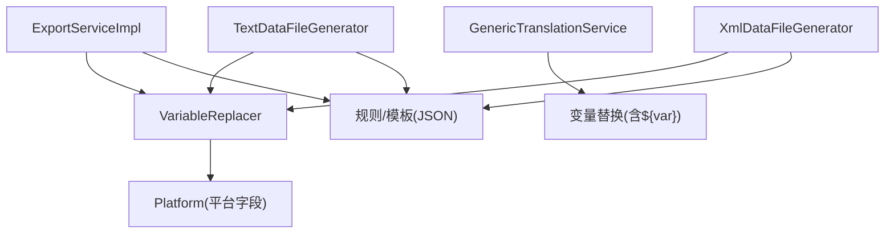
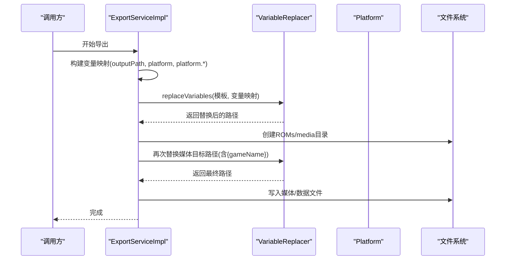
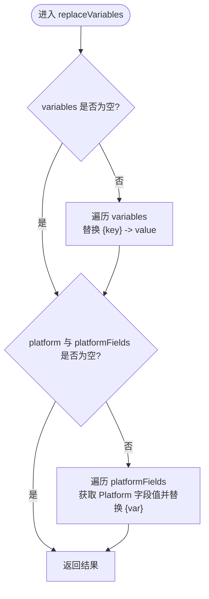
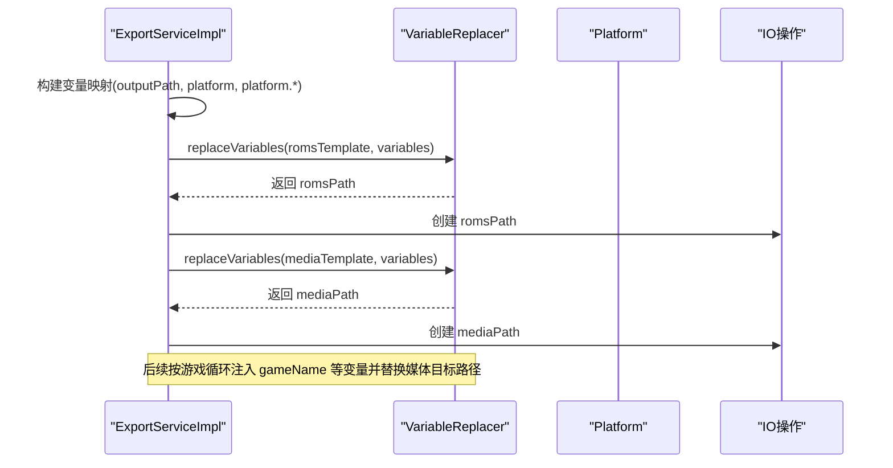
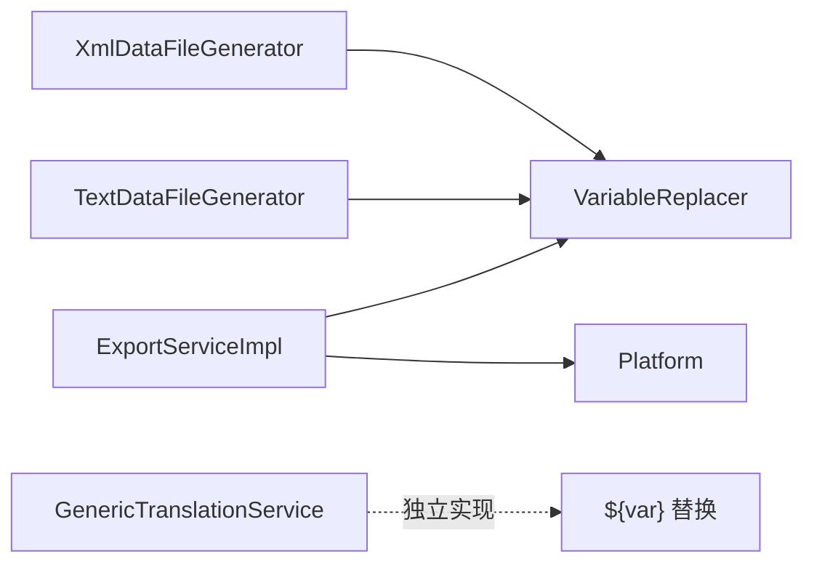

# 变量替换系统

<cite>
**本文引用的文件**
- [VariableReplacer.java](file://src/main/java/com/gamelist/util/VariableReplacer.java)
- [ExportServiceImpl.java](file://src/main/java/com/gamelist/service/impl/ExportServiceImpl.java)
- [Platform.java](file://src/main/java/com/gamelist/model/Platform.java)
- [TextDataFileGenerator.java](file://src/main/java/com/gamelist/service/impl/TextDataFileGenerator.java)
- [XmlDataFileGenerator.java](file://src/main/java/com/gamelist/service/impl/XmlDataFileGenerator.java)
- [GenericTranslationService.java](file://src/main/java/com/gamelist/service/impl/GenericTranslationService.java)
- [retrobat.json](file://rules/export/retrobat.json)
- [webgamelistoper.json](file://src/main/resources/import-templates/webgamelistoper.json)
- [export-functionality-cn.md](file://docs/export-functionality-cn.md)
</cite>

## 目录
1. [简介](#简介)
2. [项目结构](#项目结构)
3. [核心组件](#核心组件)
4. [架构总览](#架构总览)
5. [详细组件分析](#详细组件分析)
6. [依赖关系分析](#依赖关系分析)
7. [性能与缓存](#性能与缓存)
8. [故障排查指南](#故障排查指南)
9. [结论](#结论)
10. [附录：变量语法与示例](#附录：变量语法与示例)

## 简介
本文件为“变量替换系统”的完整技术文档，面向需要理解并扩展变量替换能力的开发者与配置使用者。内容涵盖：
- 变量语法与解析机制（如 {variableName}、{platform.name} 等）
- 内置变量、自定义变量与环境变量的使用方法
- 预定义变量的类型与作用域（平台信息、路径、游戏字段等）
- 变量替换的执行时机与顺序（导入/导出流程）
- 高级用法示例（动态路径生成、条件格式化、数据转换）
- 性能优化策略与缓存机制
- 调试工具与常见问题排查方法

## 项目结构
变量替换能力由通用工具类与多个业务服务共同实现：
- 通用替换器：VariableReplacer 提供基础模板替换能力
- 导出服务：ExportServiceImpl 在构建目录、生成媒体路径、导出数据时广泛使用变量替换
- 数据文件生成器：TextDataFileGenerator、XmlDataFileGenerator 在文本/XML 导出中调用 VariableReplacer
- 翻译服务：GenericTranslationService 支持基于 ${var} 语法的请求体/URL 变量替换
- 模型：Platform 提供平台相关字段的取值来源
- 规则与模板：rules/export/*.json、import-templates/*.json 展示变量在配置中的实际用法

图表来源
- [ExportServiceImpl.java:690-739](file://src/main/java/com/gamelist/service/impl/ExportServiceImpl.java#L690-L739)
- [VariableReplacer.java:17-43](file://src/main/java/com/gamelist/util/VariableReplacer.java#L17-L43)
- [TextDataFileGenerator.java:317-319](file://src/main/java/com/gamelist/service/impl/TextDataFileGenerator.java#L317-L319)
- [XmlDataFileGenerator.java:338-340](file://src/main/java/com/gamelist/service/impl/XmlDataFileGenerator.java#L338-L340)
- [GenericTranslationService.java:350-363](file://src/main/java/com/gamelist/service/impl/GenericTranslationService.java#L350-L363)

章节来源
- [ExportServiceImpl.java:690-739](file://src/main/java/com/gamelist/service/impl/ExportServiceImpl.java#L690-L739)
- [VariableReplacer.java:17-43](file://src/main/java/com/gamelist/util/VariableReplacer.java#L17-L43)

## 核心组件
- VariableReplacer：提供两类替换能力
  - 环境变量替换：将模板中的 {key} 替换为传入 Map 的值
  - 平台变量替换：根据 platformFields 映射，从 Platform 对象读取字段值并替换到模板
- ExportServiceImpl：在创建目录结构、生成媒体目标路径、导出数据行时组装变量映射并调用替换逻辑
- TextDataFileGenerator / XmlDataFileGenerator：封装对 VariableReplacer 的调用，用于文本/XML 导出场景
- GenericTranslationService：支持 ${var} 形式的变量替换，用于翻译服务的 URL/请求体参数化
- Platform：提供 system、name、launch、software、database、web、folderPath 等平台字段，作为平台变量的数据来源

章节来源
- [VariableReplacer.java:17-90](file://src/main/java/com/gamelist/util/VariableReplacer.java#L17-L90)
- [ExportServiceImpl.java:690-739](file://src/main/java/com/gamelist/service/impl/ExportServiceImpl.java#L690-L739)
- [TextDataFileGenerator.java:317-319](file://src/main/java/com/gamelist/service/impl/TextDataFileGenerator.java#L317-L319)
- [XmlDataFileGenerator.java:338-340](file://src/main/java/com/gamelist/service/impl/XmlDataFileGenerator.java#L338-L340)
- [GenericTranslationService.java:350-363](file://src/main/java/com/gamelist/service/impl/GenericTranslationService.java#L350-L363)
- [Platform.java:1-141](file://src/main/java/com/gamelist/model/Platform.java#L1-L141)

## 架构总览
变量替换贯穿导入/导出全流程：
- 导出阶段：
  - 构建输出目录：通过 {outputPath}/{platform} 等变量生成 ROMs 与 media 目录
  - 媒体目标路径：通过 {mediaPath}/{gameName}.png 等变量生成具体媒体文件路径
  - 数据文件头部/字段：通过 {platform.system} 等变量填充 XML/文本头部
- 导入阶段：
  - 模板路径匹配：在 import-templates 中使用 {platform}/{gameId}/{region} 等变量定位资源
- 翻译阶段：
  - 使用 ${var} 语法替换 URL 或请求体中的变量

图表来源
- [ExportServiceImpl.java:690-739](file://src/main/java/com/gamelist/service/impl/ExportServiceImpl.java#L690-L739)
- [VariableReplacer.java:17-43](file://src/main/java/com/gamelist/util/VariableReplacer.java#L17-L43)

## 详细组件分析

### VariableReplacer：变量替换引擎
- 功能要点
  - 支持 {key} 形式的环境变量替换
  - 支持 {platform.*} 形式的平台变量替换，通过 platformFields 映射到 Platform 字段
  - 提供两种重载：仅环境变量替换；同时包含平台变量替换
- 复杂度与行为
  - 时间复杂度 O(N*M)，N 为模板长度，M 为变量数量
  - 若变量值为 null，则跳过替换，避免空串覆盖
- 可扩展点
  - 新增平台字段：在 getPlatformFieldValue 中添加 case 分支
  - 新增变量前缀：可在调用方构造变量映射时增加新 key（如 env.*、game.*）

图表来源
- [VariableReplacer.java:17-43](file://src/main/java/com/gamelist/util/VariableReplacer.java#L17-L43)
- [VariableReplacer.java:70-89](file://src/main/java/com/gamelist/util/VariableReplacer.java#L70-L89)

章节来源
- [VariableReplacer.java:17-90](file://src/main/java/com/gamelist/util/VariableReplacer.java#L17-L90)

### ExportServiceImpl：导出流程中的变量应用
- 目录结构创建
  - 构建变量映射：outputPath、platform、platform.system/name/launch/software/database/web
  - 使用 replaceVariables 将模板路径转换为真实路径并创建目录
- 媒体目标路径
  - 为每种媒体类型设置 target 模板（如 {mediaPath}/box2dfront/{gameName}.png）
  - 在多线程处理中为每个游戏实例注入 gameName 等变量后替换
- 数据文件头部
  - 在 XML/文本头部使用 {platform.system} 等变量填充元数据

图表来源
- [ExportServiceImpl.java:690-739](file://src/main/java/com/gamelist/service/impl/ExportServiceImpl.java#L690-L739)

章节来源
- [ExportServiceImpl.java:690-739](file://src/main/java/com/gamelist/service/impl/ExportServiceImpl.java#L690-L739)

### TextDataFileGenerator / XmlDataFileGenerator：数据导出中的变量替换
- 两者均封装了对 VariableReplacer 的调用，用于在生成文本/XML 数据时进行变量替换
- 典型用途：
  - 替换数据行中的字段占位符
  - 替换文件头/尾中的平台/环境信息

章节来源
- [TextDataFileGenerator.java:317-319](file://src/main/java/com/gamelist/service/impl/TextDataFileGenerator.java#L317-L319)
- [XmlDataFileGenerator.java:338-340](file://src/main/java/com/gamelist/service/impl/XmlDataFileGenerator.java#L338-L340)

### GenericTranslationService：翻译服务的变量替换
- 支持 ${var} 形式的变量替换，常用于：
  - 替换 API URL 中的参数
  - 替换请求体中的文本、源语言、目标语言等
- 与 VariableReplacer 的区别：
  - 语法不同：${var} vs {var}
  - 作用域不同：主要用于翻译服务配置与请求参数

章节来源
- [GenericTranslationService.java:350-363](file://src/main/java/com/gamelist/service/impl/GenericTranslationService.java#L350-L363)

### 平台变量与字段映射
- Platform 提供以下字段，可作为平台变量的数据来源：
  - system、name、launch、software、database、web、folderPath
- 在导出规则中，可通过 platformFields 将变量名映射到这些字段，从而实现 {platform.system} 等嵌套变量替换

章节来源
- [Platform.java:1-141](file://src/main/java/com/gamelist/model/Platform.java#L1-L141)
- [VariableReplacer.java:70-89](file://src/main/java/com/gamelist/util/VariableReplacer.java#L70-L89)

## 依赖关系分析
- 组件耦合
  - ExportServiceImpl 强依赖 VariableReplacer 与 Platform
  - TextDataFileGenerator/XmlDataFileGenerator 弱依赖 VariableReplacer
  - GenericTranslationService 独立实现 ${var} 替换，不依赖 VariableReplacer
- 外部依赖
  - 文件系统：创建目录、写入媒体/数据文件
  - JSON 规则/模板：定义变量在路径与头部中的使用方式

图表来源
- [ExportServiceImpl.java:690-739](file://src/main/java/com/gamelist/service/impl/ExportServiceImpl.java#L690-L739)
- [VariableReplacer.java:17-43](file://src/main/java/com/gamelist/util/VariableReplacer.java#L17-L43)
- [GenericTranslationService.java:350-363](file://src/main/java/com/gamelist/service/impl/GenericTranslationService.java#L350-L363)

章节来源
- [ExportServiceImpl.java:690-739](file://src/main/java/com/gamelist/service/impl/ExportServiceImpl.java#L690-L739)
- [VariableReplacer.java:17-43](file://src/main/java/com/gamelist/util/VariableReplacer.java#L17-L43)
- [GenericTranslationService.java:350-363](file://src/main/java/com/gamelist/service/impl/GenericTranslationService.java#L350-L363)

## 性能与缓存
- 当前实现
  - VariableReplacer 采用字符串逐次 replace 的方式，无内部缓存
  - 每次调用都会遍历变量映射并进行多次字符串替换
- 优化建议
  - 引入正则表达式一次性替换（如 Pattern/Matcher），减少多次扫描
  - 对频繁使用的模板与变量映射进行缓存（例如按规则ID缓存编译后的替换计划）
  - 对平台字段访问进行懒加载与缓存，避免重复查询数据库或服务
  - 在导出大文件时，考虑流式处理与批量替换，降低内存占用
- 注意事项
  - 确保变量键唯一且无冲突，避免覆盖错误
  - 对空值进行防御性处理，防止产生意外空串

[本节为通用性能指导，不直接分析具体文件]

## 故障排查指南
- 常见问题
  - 变量未替换：检查变量键是否与模板中的 {key} 完全一致（大小写敏感）
  - 平台变量为空：确认 Platform 对象是否已正确加载，platformFields 映射是否正确
  - 路径异常：检查 outputPath、platform、mediaPath 等变量是否已注入
  - 翻译服务失败：确认 ${var} 变量是否已在请求体/URL 中正确替换
- 调试手段
  - 启用日志：ExportServiceImpl 在创建目录前后记录原始模板与替换结果
  - 打印变量映射：在替换前输出 variables 内容，便于核对键值对
  - 逐步验证：先替换简单变量（如 {outputPath}），再逐步加入复杂变量（如 {platform.system}）
- 参考位置
  - 导出目录创建与变量替换日志：ExportServiceImpl
  - 变量替换核心逻辑：VariableReplacer
  - 翻译服务变量替换：GenericTranslationService

章节来源
- [ExportServiceImpl.java:690-739](file://src/main/java/com/gamelist/service/impl/ExportServiceImpl.java#L690-L739)
- [VariableReplacer.java:17-43](file://src/main/java/com/gamelist/util/VariableReplacer.java#L17-L43)
- [GenericTranslationService.java:350-363](file://src/main/java/com/gamelist/service/impl/GenericTranslationService.java#L350-L363)

## 结论
变量替换系统以 VariableReplacer 为核心，结合 ExportServiceImpl 与数据文件生成器，实现了在导入/导出流程中的灵活路径与内容定制。通过平台变量、环境变量与游戏变量的组合，能够支撑多种前端/平台的导出需求。未来可引入正则一次性替换与模板缓存以提升性能，并扩展更多变量前缀与函数式处理能力。

[本节为总结性内容，不直接分析具体文件]

## 附录：变量语法与示例
- 变量语法
  - 环境变量：{key}，由调用方传入 Map 提供
  - 平台变量：{platform.system}、{platform.name} 等，来源于 Platform 对象
  - 游戏变量：{game.name}、{game.path} 等，由导出流程在游戏级别注入
  - 路径变量：{outputPath}、{mediaPath}、{romsPath} 等，用于构建目录与文件路径
  - 翻译变量：${var}，用于 GenericTranslationService 的请求参数化
- 执行顺序
  - 路径变量优先替换，随后平台变量、环境变量、游戏变量依次替换
- 实际示例
  - 动态路径生成：{outputPath}/{platform}/media/{gameName}.png
  - 条件格式化：在规则中通过多值匹配选择非空字段（如 name,filename）
  - 数据转换：在生成器中对字段进行 trim、大小写转换、字符替换等
- 配置文件示例
  - 导出规则：rules/export/retrobat.json 展示了 {mediaPath}、{gameName}、{platform.system} 的使用
  - 导入模板：src/main/resources/import-templates/webgamelistoper.json 展示了 {platform}/{gameId}/{region} 的路径匹配

章节来源
- [retrobat.json:1-92](file://rules/export/retrobat.json#L1-L92)
- [webgamelistoper.json:86-120](file://src/main/resources/import-templates/webgamelistoper.json#L86-L120)
- [export-functionality-cn.md:405-532](file://docs/export-functionality-cn.md#L405-L532)