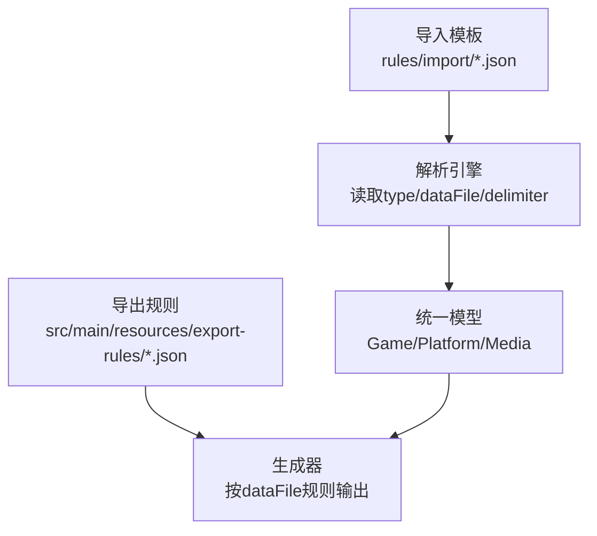
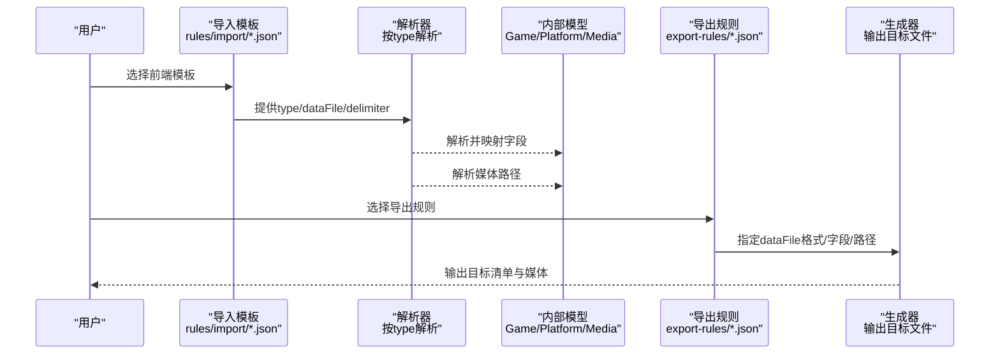
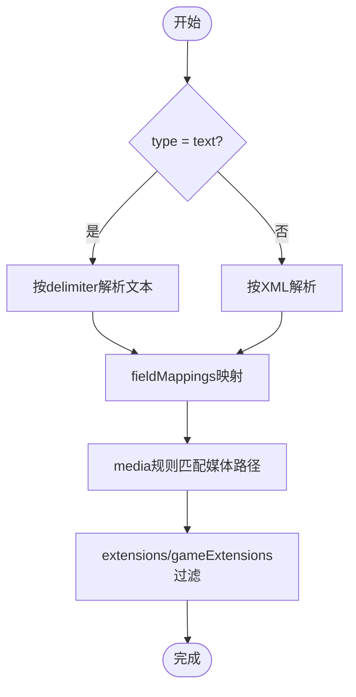

# 基础配置结构

<cite>
**本文引用的文件**
- [rules/import/pegasus.json](file://rules/import/pegasus.json)
- [rules/import/retrobat.json](file://rules/import/retrobat.json)
- [rules/import/emuelec.json](file://rules/import/emuelec.json)
- [rules/import/lakka.json](file://rules/import/lakka.json)
- [src/main/resources/export-rules/pegasus.json](file://src/main/resources/export-rules/pegasus.json)
- [src/main/resources/export-rules/retrobat.json](file://src/main/resources/export-rules/retrobat.json)
- [docs/media-mapping-cn.md](file://docs/media-mapping-cn.md)
- [wiki/Configuration.md](file://wiki/Configuration.md)
</cite>

## 目录
1. [简介](#简介)
2. [项目结构](#项目结构)
3. [核心组件](#核心组件)
4. [架构总览](#架构总览)
5. [详细组件分析](#详细组件分析)
6. [依赖关系分析](#依赖关系分析)
7. [性能注意事项](#性能注意事项)
8. [故障排查指南](#故障排查指南)
9. [结论](#结论)
10. [附录](#附录)

## 简介
本章节面向“基础模板配置”，系统说明导入与导出场景下的 JSON 配置文件结构与字段含义，重点覆盖：
- 根节点元数据：frontend、name、version、description 等
- type 字段对解析方式的影响（text/xml）
- dataFile、delimiter 等文件解析相关配置
- rules 对象的核心作用及其子节点：header、fieldMappings、media 等的语法与用法
- 不同前端格式（Pegasus、RetroBat、EmuELEC、Lakka）的基础配置差异
- 常见配置错误排查方法与最佳实践建议

## 项目结构
本项目将“导入模板”和“导出规则”分别存放于不同目录：
- 导入模板位于 rules/import 与 src/main/resources/import-templates，用于解析外部前端或刮削器产出的数据文件（如 Pegasus 的 metadata.pegasus.txt、RetroBat/EmuELEC 的 gamelist.xml）。
- 导出规则位于 src/main/resources/export-rules，用于将内部数据输出为各前端的期望格式（如 Pegasus 文本清单、RetroBat XML 清单）。

图表来源
- [rules/import/pegasus.json:1-10](file://rules/import/pegasus.json#L1-L10)
- [rules/import/retrobat.json:1-10](file://rules/import/retrobat.json#L1-L10)
- [src/main/resources/export-rules/pegasus.json:1-15](file://src/main/resources/export-rules/pegasus.json#L1-L15)
- [src/main/resources/export-rules/retrobat.json:1-15](file://src/main/resources/export-rules/retrobat.json#L1-L15)

章节来源
- [wiki/Configuration.md:49-61](file://wiki/Configuration.md#L49-L61)

## 核心组件
- 根节点元数据
  - frontend：标识目标前端（如 pegasus、retrobat、emuelec、lakka），用于选择对应模板。
  - name/version/description：模板名称、版本与描述，便于管理与识别。
- 解析控制
  - type：决定解析器类型，text 表示键值/行式文本，xml 表示 XML 文档；none 表示无数据文件。
  - dataFile：数据文件名或通配符（如 *.lpl），指定要解析的文件。
  - delimiter：文本类型时的分隔符（如 Pegasus 使用冒号）。
- 规则集 rules
  - header：表头/头部信息处理（XML 或 key-value），可启用并定义结构模板与字段映射。
  - fieldMappings：字段映射，将外部字段映射到系统内部字段（如 name、files、image 等）。
  - media：媒体文件路径匹配规则，支持多候选路径与变量替换（{filename}、{ext}、{platform} 等）。
  - extensions/gameExtensions：支持的媒体/游戏扩展名列表。

章节来源
- [rules/import/pegasus.json:1-10](file://rules/import/pegasus.json#L1-L10)
- [rules/import/retrobat.json:1-10](file://rules/import/retrobat.json#L1-L10)
- [rules/import/emuelec.json:1-12](file://rules/import/emuelec.json#L1-L12)
- [rules/import/lakka.json:1-14](file://rules/import/lakka.json#L1-L14)

## 架构总览
下图展示了从“导入模板”到“导出规则”的整体流程：导入侧根据 type 选择解析器，读取 dataFile 并按 delimiter（文本模式）或 XML 结构解析，通过 fieldMappings 映射到内部模型；媒体文件通过 media 规则定位；导出侧依据 export-rules 中的 dataFile 配置生成目标格式。

图表来源
- [rules/import/pegasus.json:1-10](file://rules/import/pegasus.json#L1-L10)
- [rules/import/retrobat.json:1-10](file://rules/import/retrobat.json#L1-L10)
- [src/main/resources/export-rules/pegasus.json:55-88](file://src/main/resources/export-rules/pegasus.json#L55-L88)
- [src/main/resources/export-rules/retrobat.json:54-91](file://src/main/resources/export-rules/retrobat.json#L54-L91)

## 详细组件分析

### 根节点元数据与解析控制
- frontend/name/version/description
  - 作用：标识模板用途与版本，便于管理、展示与选择。
- type
  - text：以行为单位的键值/分隔符文本（如 Pegasus 的 metadata.pegasus.txt）。
  - xml：XML 文档（如 RetroBat/EmuELEC 的 gamelist.xml）。
  - none：无数据文件（仅用于某些特殊场景）。
- dataFile
  - 指定要解析的数据文件名或通配符（如 *.lpl）。
- delimiter
  - 仅在 text 模式下生效，定义字段分隔符（如 Pegasus 使用冒号）。

章节来源
- [rules/import/pegasus.json:1-9](file://rules/import/pegasus.json#L1-L9)
- [rules/import/retrobat.json:1-8](file://rules/import/retrobat.json#L1-L8)
- [rules/import/emuelec.json:1-8](file://rules/import/emuelec.json#L1-L8)
- [rules/import/lakka.json:1-9](file://rules/import/lakka.json#L1-L9)

### rules.header（表头/头部）
- enabled：是否启用头部处理。
- format：头部格式，支持 xml 或 key-value。
- startMarker/endMarker：在 XML 中界定头部区域的起止标记。
- structure：头部结构模板，用于生成或校验头部内容。
- fields：平台信息的字段映射，将外部头部字段映射到 platform.* 内部字段。

示例要点
- Pegasus 使用 key-value 格式，startMarker 为 collection:，fields 映射 platform.name、platform.launch 等。
- RetroBat 使用 XML 格式，startMarker 为 <provider>，endMarker 为 </provider>，fields 映射 System/software/database/web 等。
- EmuELEC 默认关闭头部处理（enabled: false）。

章节来源
- [rules/import/pegasus.json:10-38](file://rules/import/pegasus.json#L10-L38)
- [rules/import/retrobat.json:10-49](file://rules/import/retrobat.json#L10-L49)
- [rules/import/emuelec.json:10-12](file://rules/import/emuelec.json#L10-L12)

### rules.fieldMappings（字段映射）
- 键名：系统内部字段名（如 name、description、releaseDate、developer、publisher、genre、players、rating、hash、files、image、video、thumbnail、marquee 等）。
- fields：外部数据文件中的字段名数组，按顺序尝试匹配。
- isMultiValue：是否为多值字段（如 Pegasus 的 files 支持多值）。
- valuePrefix：多值字段的值前缀（如 Pegasus 中 files 使用两个空格作为前缀）。
- transform：可选的值转换规则，包括 path（路径格式）、trim（去空白）、case（大小写）、replace（字符串替换，支持正则）。

章节来源
- [rules/import/pegasus.json:39-248](file://rules/import/pegasus.json#L39-L248)
- [rules/import/retrobat.json:50-202](file://rules/import/retrobat.json#L50-L202)
- [rules/import/emuelec.json:13-85](file://rules/import/emuelec.json#L13-L85)

### rules.media（媒体文件规则）
- source：源字段名（通常与 fieldMappings 中的媒体字段一致）。
- rules：媒体路径候选列表，支持变量替换：
  - {filename}：基于游戏名的文件名占位
  - {ext}：自动推断扩展名
  - {platform}：平台名
  - {filepath}：相对路径片段（部分模板使用）
- transform.path：是否保留 ./ 前缀（no/yes/keep）。

媒体路径策略
- 多候选规则提高鲁棒性，优先匹配更规范的路径。
- 不同前端对媒体命名与目录组织存在差异，模板通过 rules 列表兼容多种约定。

章节来源
- [rules/import/pegasus.json:249-549](file://rules/import/pegasus.json#L249-L549)
- [rules/import/retrobat.json:203-427](file://rules/import/retrobat.json#L203-L427)
- [rules/import/emuelec.json:86-199](file://rules/import/emuelec.json#L86-L199)

### 不同前端的基础配置差异
- Pegasus
  - type: text，dataFile: metadata.pegasus.txt，delimiter: :
  - header: key-value，启用并定义 collection/sort-by/launch 等
  - fieldMappings: 支持多值 files，valuePrefix 为两个空格
  - media: 大量媒体类型与路径变体
- RetroBat
  - type: xml，dataFile: gamelist.xml，delimiter: ""
  - header: xml，<provider>...</provider>，映射 System/software/database/web
  - fieldMappings: 标准字段映射
  - media: 与 Pegasus 类似但路径略有差异
- EmuELEC
  - type: xml，dataFile: gamelist.xml，delimiter: ""
  - header: 默认禁用
  - fieldMappings: 包含 hash 字段
  - media: 使用 downloaded_images/{platform}/... 与 media/... 等多路径
- Lakka
  - type: text，dataFile: *.lpl，delimiter: ""
  - textFormat: linesPerEntry/autoDetect/supportedLineCounts/lineMappings/nullValueMarker
  - fieldMappings: 包含 corePath/coreName/databaseLink/playlistName 等

章节来源
- [rules/import/pegasus.json:1-10](file://rules/import/pegasus.json#L1-L10)
- [rules/import/retrobat.json:1-10](file://rules/import/retrobat.json#L1-L10)
- [rules/import/emuelec.json:1-12](file://rules/import/emuelec.json#L1-L12)
- [rules/import/lakka.json:1-23](file://rules/import/lakka.json#L1-L23)

### 导出规则对比（Pegasus vs RetroBat）
- Pegasus 导出
  - dataFile.filename: metadata.pegasus.txt
  - format: text
  - pathFormat: relative
  - header.structure: 包含 collection/sort-by/launch
  - fields: 映射 name/path/description/rating/releaseYear/developer/publisher/genre/players/region
- RetroBat 导出
  - dataFile.filename: gamelist.xml
  - format: xml
  - pathFormat: absoluteWithDot
  - header.structure: XML 头部 <gameList><provider>...</provider>
  - fields: 映射 title/path/description/rating/releaseYear/developer/publisher/genre/players/region

章节来源
- [src/main/resources/export-rules/pegasus.json:55-88](file://src/main/resources/export-rules/pegasus.json#L55-L88)
- [src/main/resources/export-rules/retrobat.json:54-91](file://src/main/resources/export-rules/retrobat.json#L54-L91)

## 依赖关系分析
- 导入模板依赖解析器根据 type 选择解析逻辑：
  - text：按 delimiter 分割行，结合 fieldMappings 映射字段，media 规则定位媒体。
  - xml：按 startMarker/endMarker 提取头部，解析条目与字段。
- 媒体路径规则与扩展名列表共同决定媒体文件的发现与匹配。
- 导出规则依赖 dataFile 配置生成目标清单，并与媒体目录结构配合。

图表来源
- [rules/import/pegasus.json:1-10](file://rules/import/pegasus.json#L1-L10)
- [rules/import/retrobat.json:1-10](file://rules/import/retrobat.json#L1-L10)

章节来源
- [docs/media-mapping-cn.md:1-67](file://docs/media-mapping-cn.md#L1-L67)

## 性能注意事项
- 媒体规则数量较多时，路径匹配会进行多次尝试，建议：
  - 将最可能匹配的路径放在 rules 列表的前面，减少无效尝试。
  - 合理设置 extensions 与 gameExtensions，避免不必要的扫描。
- 对于大型数据集，启用异步任务与资源池（参见应用配置）以提升吞吐。
- 使用 transform.trim/case/replace 时注意正则复杂度，避免影响解析性能。

[本节为通用指导，不直接分析具体文件]

## 故障排查指南
- type 与 dataFile 不匹配
  - 现象：解析失败或找不到数据文件。
  - 检查：确保 type=text 时使用文本文件（如 metadata.pegasus.txt），type=xml 时使用 XML（如 gamelist.xml）。
  - 参考：[rules/import/pegasus.json:1-9](file://rules/import/pegasus.json#L1-L9)、[rules/import/retrobat.json:1-8](file://rules/import/retrobat.json#L1-L8)
- delimiter 配置错误
  - 现象：字段无法正确拆分。
  - 检查：text 模式下确认 delimiter 与实际文件分隔符一致（如 Pegasus 使用冒号）。
  - 参考：[rules/import/pegasus.json:7-8](file://rules/import/pegasus.json#L7-L8)
- header 配置不当
  - 现象：平台信息未正确映射或头部解析异常。
  - 检查：XML 模式下确认 startMarker/endMarker 与文件结构一致；key-value 模式下确认 format 与结构模板。
  - 参考：[rules/import/retrobat.json:10-49](file://rules/import/retrobat.json#L10-L49)、[rules/import/pegasus.json:10-38](file://rules/import/pegasus.json#L10-L38)
- fieldMappings 字段缺失或顺序错误
  - 现象：字段映射不到或为空。
  - 检查：确保 fields 数组包含实际字段名，且顺序优先匹配。
  - 参考：[rules/import/emuelec.json:13-85](file://rules/import/emuelec.json#L13-L85)
- media 路径不匹配
  - 现象：媒体文件未被识别。
  - 检查：确认 rules 列表包含实际路径，变量 {filename}/{ext}/{platform} 是否正确；必要时调整优先级。
  - 参考：[rules/import/emuelec.json:86-199](file://rules/import/emuelec.json#L86-L199)
- 导出规则与目标前端不一致
  - 现象：生成的清单不被前端识别。
  - 检查：核对 dataFile.filename/format/pathFormat 与目标前端要求。
  - 参考：[src/main/resources/export-rules/pegasus.json:55-88](file://src/main/resources/export-rules/pegasus.json#L55-L88)、[src/main/resources/export-rules/retrobat.json:54-91](file://src/main/resources/export-rules/retrobat.json#L54-L91)

章节来源
- [rules/import/pegasus.json:1-10](file://rules/import/pegasus.json#L1-L10)
- [rules/import/retrobat.json:1-10](file://rules/import/retrobat.json#L1-L10)
- [rules/import/emuelec.json:1-12](file://rules/import/emuelec.json#L1-L12)
- [src/main/resources/export-rules/pegasus.json:55-88](file://src/main/resources/export-rules/pegasus.json#L55-L88)
- [src/main/resources/export-rules/retrobat.json:54-91](file://src/main/resources/export-rules/retrobat.json#L54-L91)

## 结论
- 基础模板配置通过根节点元数据与 rules 对象实现了对多种前端格式的灵活适配。
- type 字段决定了整体解析策略，dataFile 与 delimiter 进一步细化文本解析。
- header/fieldMappings/media 三者协同完成头部信息、业务字段与媒体资源的映射与定位。
- 针对不同前端（Pegasus、RetroBat、EmuELEC、Lakka），应选择合适的模板并微调 rules 以匹配实际数据结构。
- 遵循最佳实践（合理排序媒体规则、谨慎使用复杂转换、保持字段映射一致性）可显著提升稳定性与性能。

[本节为总结，不直接分析具体文件]

## 附录
- 媒体映射参考
  - 导入模板与数据库字段对应关系、媒体路径映射、扩展名支持等详见媒体映射文档。
  - 参考：[docs/media-mapping-cn.md:1-274](file://docs/media-mapping-cn.md#L1-L274)
- 应用配置与环境变量
  - 服务器端口、数据路径、数据库连接、静态资源位置等。
  - 参考：[wiki/Configuration.md:7-47](file://wiki/Configuration.md#L7-L47)

章节来源
- [docs/media-mapping-cn.md:1-274](file://docs/media-mapping-cn.md#L1-L274)
- [wiki/Configuration.md:7-47](file://wiki/Configuration.md#L7-L47)