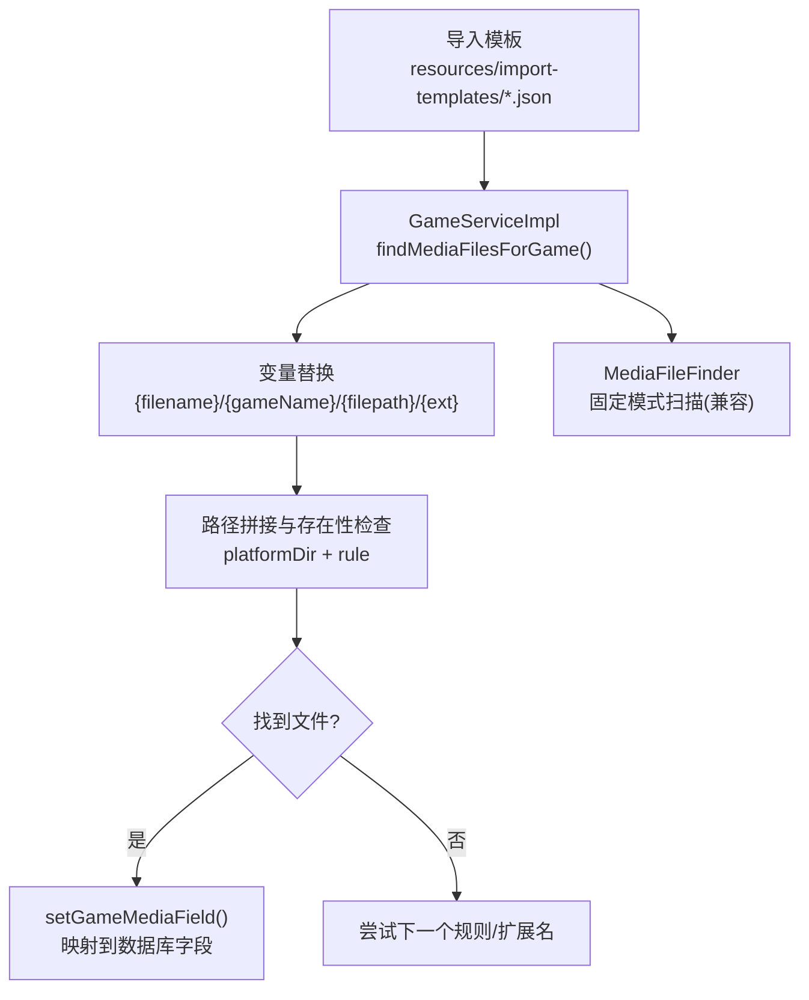
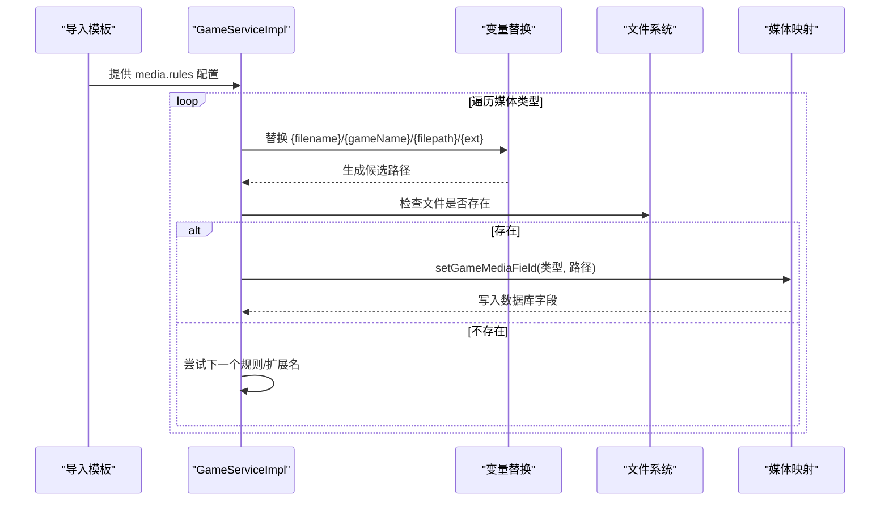
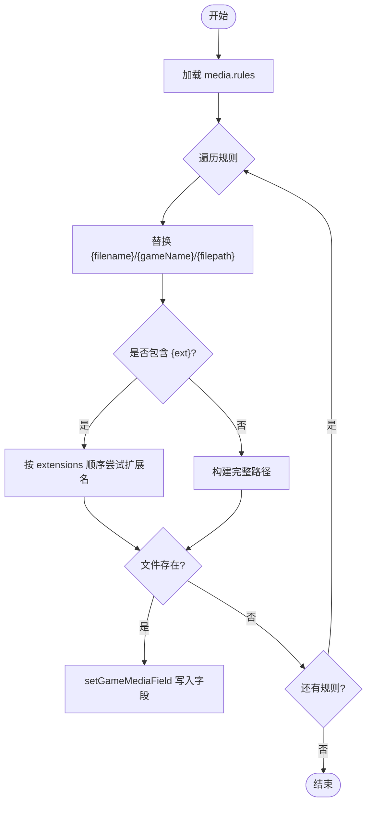
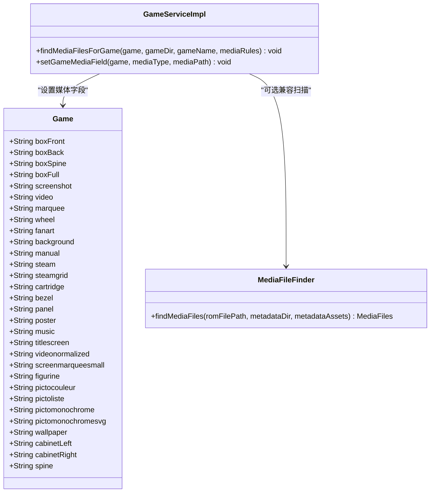
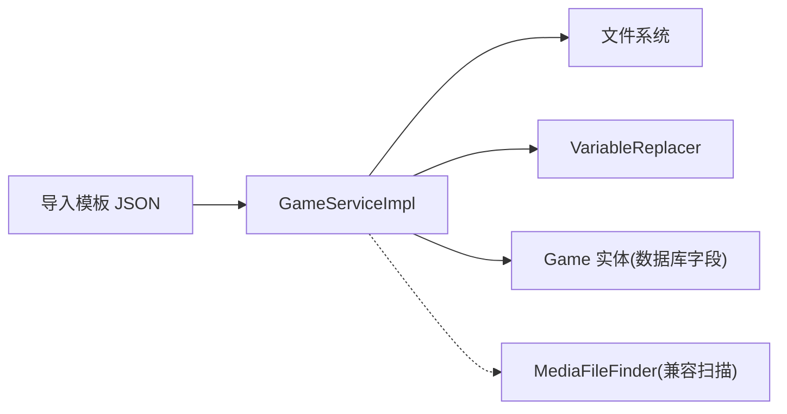

# 媒体文件规则

<cite>
**本文引用的文件**
- [GameServiceImpl.java](file://src/main/java/com/gamelist/service/impl/GameServiceImpl.java)
- [MediaFileFinder.java](file://src/main/java/com/gamelist/util/MediaFileFinder.java)
- [VariableReplacer.java](file://src/main/java/com/gamelist/util/VariableReplacer.java)
- [webgamelistoper.json](file://src/main/resources/import-templates/webgamelistoper.json)
- [emuelec.json](file://src/main/resources/import-templates/emuelec.json)
- [retrobat.json](file://src/main/resources/import-templates/retrobat.json)
- [media-mapping-cn.md](file://docs/media-mapping-cn.md)
- [import-templates-cn.md](file://docs/import-templates-cn.md)
</cite>

## 目录
1. [简介](#简介)
2. [项目结构](#项目结构)
3. [核心组件](#核心组件)
4. [架构总览](#架构总览)
5. [详细组件分析](#详细组件分析)
6. [依赖关系分析](#依赖关系分析)
7. [性能考虑](#性能考虑)
8. [故障排查指南](#故障排查指南)
9. [结论](#结论)
10. [附录：配置示例与最佳实践](#附录配置示例与最佳实践)

## 简介
本文件面向“媒体文件规则系统”，系统性说明 media 对象的结构、source 字段与 rules 数组的配置方法；路径模板语法（{filename}、{gameName}、{filepath}、{ext}）的使用规则；多种媒体类型（boxFront、boxBack、screenshot、video、marquee 等）的差异；扩展名过滤机制（extensions 中 image/video 等）；媒体文件的查找策略与优先级；以及完整的配置示例、性能优化建议与常见问题解决方案。

## 项目结构
- 导入模板位于 resources/import-templates，提供不同平台/前端的媒体映射与规则（如 webgamelistoper、emuelec、retrobat）。
- 运行时媒体匹配逻辑由 GameServiceImpl 负责解析模板中的 media.rules，并执行变量替换与文件存在性检查。
- 通用媒体扫描器 MediaFileFinder 提供基于固定模式的媒体文件发现能力（用于其他场景或兼容模式）。
- 变量替换工具 VariableReplacer 支持在导出/导入流程中替换模板变量。

图表来源
- [GameServiceImpl.java:3870-3944](file://src/main/java/com/gamelist/service/impl/GameServiceImpl.java#L3870-L3944)
- [MediaFileFinder.java:89-159](file://src/main/java/com/gamelist/util/MediaFileFinder.java#L89-L159)

章节来源
- [webgamelistoper.json:86-340](file://src/main/resources/import-templates/webgamelistoper.json#L86-L340)
- [emuelec.json:29-51](file://src/main/resources/import-templates/emuelec.json#L29-L51)
- [retrobat.json:280-330](file://src/main/resources/import-templates/retrobat.json#L280-L330)

## 核心组件
- GameServiceImpl.findMediaFilesForGame：根据模板的 media 配置，遍历每个媒体类型的 rules 列表，进行变量替换与文件存在性检测，命中后写入游戏对象的对应媒体字段。
- GameServiceImpl.setGameMediaField：将媒体类型名称映射到 Game 实体的具体字段（如 boxFront、screenshot、video、marquee 等），支持多别名映射。
- MediaFileFinder：提供一套预定义的模式匹配，按固定目录/命名约定扫描媒体文件（适用于无需模板的场景或兼容旧数据）。
- VariableReplacer：通用的模板变量替换工具，可在导出/导入流程中替换 {platform}、{env.*}、{game.*} 等变量。

章节来源
- [GameServiceImpl.java:3870-4084](file://src/main/java/com/gamelist/service/impl/GameServiceImpl.java#L3870-L4084)
- [MediaFileFinder.java:89-159](file://src/main/java/com/gamelist/util/MediaFileFinder.java#L89-L159)
- [VariableReplacer.java:1-45](file://src/main/java/com/gamelist/util/VariableReplacer.java#L1-L45)

## 架构总览
媒体文件规则系统的核心流程如下：
- 加载导入模板中的 media 配置（键为媒体类型，值为 source 与 rules 数组）。
- 对每条规则进行变量替换（{filename}/{gameName}/{filepath}/{ext}）。
- 以平台目录为基准拼接绝对路径，依次尝试文件是否存在。
- 若命中则通过 setGameMediaField 写入对应数据库字段；否则继续尝试下一条规则或扩展名。
- 对于不支持 {ext} 的规则，直接按完整路径匹配。

图表来源
- [GameServiceImpl.java:3870-3944](file://src/main/java/com/gamelist/service/impl/GameServiceImpl.java#L3870-L3944)
- [GameServiceImpl.java:3949-4084](file://src/main/java/com/gamelist/service/impl/GameServiceImpl.java#L3949-L4084)

## 详细组件分析

### media 对象结构与 source/rules
- media 是一个以“媒体类型”为键的对象。
- 每个媒体类型包含：
  - source：来源字段名（通常与模板 fieldMappings 中的字段一致，便于从外部数据源读取）。
  - rules：路径模板数组，按顺序尝试匹配，直到找到存在的文件。
- 典型示例参考：
  - webgamelistoper 模板：大量媒体类型使用固定路径模板（含 {platform}/{gameId}/{region} 等变量）。
  - emuelec 模板：广泛使用 {filepath}.{ext} 形式，适配按游戏文件目录组织媒体文件的场景。
  - retrobat 模板：同时支持 {filename} 与 {ext} 的组合，覆盖多种常见目录结构。

章节来源
- [webgamelistoper.json:86-340](file://src/main/resources/import-templates/webgamelistoper.json#L86-L340)
- [emuelec.json:29-51](file://src/main/resources/import-templates/emuelec.json#L29-L51)
- [retrobat.json:280-330](file://src/main/resources/import-templates/retrobat.json#L280-L330)

### 路径模板语法与变量
- 支持的变量：
  - {filename} / {gameName}：仅文件名（不含扩展名）。例如 path1/path2/游戏a.a26 → 游戏a。
  - {filepath}：完整路径（不含扩展名）。例如 path1/path2/游戏a.a26 → path1/path2/游戏a。
  - {ext}：扩展名占位符，系统会按配置的 extensions.image/extensions.video 顺序尝试常见扩展名。
- 变量替换发生在 findMediaFilesForGame 中，先替换 {filename}/{gameName}/{filepath}，再处理 {ext}。
- 当规则不包含 {ext} 时，直接使用完整路径进行存在性检查。

章节来源
- [GameServiceImpl.java:3902-3939](file://src/main/java/com/gamelist/service/impl/GameServiceImpl.java#L3902-L3939)
- [import-templates-cn.md:795-850](file://docs/import-templates-cn.md#L795-L850)

### 媒体类型支持与差异
- 支持的媒体类型包括但不限于：boxFront、boxBack、boxSpine、boxFull、screenshot、video、wheel、marquee、fanart、titlescreen、banner、thumbnail、background、music、manual、steam、steamgrid、cartridge、bezel、panel、poster、boxtexture、supporttexture、videonormalized、screenmarqueesmall、figurine、pictocouleur、pictoliste、pictomonochrome、pictomonochromesvg、wallpaper、cabinetLeft、cabinetRight、spine。
- 不同模板对同一媒体类型的 rules 不同：
  - emuelec 模板倾向于使用 {filepath}.{ext}，适合媒体与游戏同构目录。
  - webgamelistoper 模板使用 {platform}/{gameId}/{region} 的集中式目录。
  - retrobat 模板混合使用 {filename} 与 {ext}，覆盖更多历史结构。
- 映射到数据库字段时，系统支持多别名（如 boxFront 可来自 box2dfront、box-2d、box-front 等）。

章节来源
- [media-mapping-cn.md:26-88](file://docs/media-mapping-cn.md#L26-L88)
- [media-mapping-cn.md:91-151](file://docs/media-mapping-cn.md#L91-L151)
- [GameServiceImpl.java:3954-4084](file://src/main/java/com/gamelist/service/impl/GameServiceImpl.java#L3954-L4084)

### 扩展名过滤机制（extensions）
- extensions.image：图片扩展名列表，如 png、jpg、jpeg、gif、webp、svg。
- extensions.video：视频扩展名列表，如 mp4、mkv、avi、wmv、webm。
- 当规则包含 {ext} 时，系统会按上述列表顺序尝试扩展名，直到找到存在的文件。
- 若规则未包含 {ext}，则不进行扩展名尝试，直接按完整路径匹配。

章节来源
- [webgamelistoper.json:333-340](file://src/main/resources/import-templates/webgamelistoper.json#L333-L340)
- [emuelec.json:46-51](file://src/main/resources/import-templates/emuelec.json#L46-L51)
- [GameServiceImpl.java:3908-3925](file://src/main/java/com/gamelist/service/impl/GameServiceImpl.java#L3908-L3925)

### 媒体文件查找策略与优先级
- 规则顺序优先：rules 数组的顺序决定尝试顺序，先匹配到的规则生效。
- 扩展名顺序优先：当规则包含 {ext} 时，按 extensions.image/extensions.video 的顺序尝试扩展名。
- 相对路径基准：媒体路径相对于平台目录（platformDir）进行拼接与存在性检查。
- 兼容扫描：MediaFileFinder 提供固定模式扫描，作为补充能力（不依赖模板）。

图表来源
- [GameServiceImpl.java:3902-3944](file://src/main/java/com/gamelist/service/impl/GameServiceImpl.java#L3902-L3944)

章节来源
- [GameServiceImpl.java:3870-3944](file://src/main/java/com/gamelist/service/impl/GameServiceImpl.java#L3870-L3944)
- [MediaFileFinder.java:89-159](file://src/main/java/com/gamelist/util/MediaFileFinder.java#L89-L159)

### 类图（媒体映射与数据结构）

图表来源
- [GameServiceImpl.java:3949-4084](file://src/main/java/com/gamelist/service/impl/GameServiceImpl.java#L3949-L4084)
- [MediaFileFinder.java:10-87](file://src/main/java/com/gamelist/util/MediaFileFinder.java#L10-L87)

## 依赖关系分析
- GameServiceImpl 依赖：
  - 导入模板（JSON）：提供 media.rules、extensions、fieldMappings 等。
  - 文件系统：用于路径拼接与存在性检查。
  - 变量替换工具：VariableReplacer（在导出/导入流程中使用）。
- MediaFileFinder 独立于模板，提供固定模式扫描，适用于不需要模板的场景。
- 模板间差异主要体现在 media.rules 的路径结构与变量选择上。

图表来源
- [GameServiceImpl.java:3870-4084](file://src/main/java/com/gamelist/service/impl/GameServiceImpl.java#L3870-L4084)
- [VariableReplacer.java:1-45](file://src/main/java/com/gamelist/util/VariableReplacer.java#L1-L45)
- [MediaFileFinder.java:89-159](file://src/main/java/com/gamelist/util/MediaFileFinder.java#L89-L159)

章节来源
- [webgamelistoper.json:86-340](file://src/main/resources/import-templates/webgamelistoper.json#L86-L340)
- [emuelec.json:29-51](file://src/main/resources/import-templates/emuelec.json#L29-L51)
- [retrobat.json:280-330](file://src/main/resources/import-templates/retrobat.json#L280-L330)

## 性能考虑
- 规则顺序优化：将最可能命中的规则放在前面，减少不必要的文件检查。
- 扩展名顺序优化：将常用扩展名（如 png、jpg、mp4）放在 extensions 列表的前面。
- 避免过度递归：尽量使用精确路径模板，减少大范围扫描。
- 批量处理：对大量游戏进行媒体匹配时，复用平台目录与缓存结果，减少重复 I/O。
- 日志与调试：利用系统日志输出（如“尝试媒体路径”“文件不存在”）定位问题，但生产环境可降低日志级别。

[本节为通用指导，不直接分析具体文件]

## 故障排查指南
- 媒体文件未找到：
  - 检查 media.rules 顺序是否正确，确保最可能的路径在前。
  - 确认 {ext} 是否在 extensions.image/extensions.video 中存在。
  - 验证 {filepath} 是否去除了 ./ 前缀与扩展名（见实现中对 filePathWithoutExt 的处理）。
- 路径错误：
  - 确认媒体路径是相对于平台目录的相对路径。
  - 检查模板中的 transform 配置（如 path: "no"）是否影响路径格式。
- 媒体类型映射异常：
  - 核对媒体类型名称与 setGameMediaField 中的别名映射是否一致。
  - 参考媒体映射文档确认目标数据库字段。

章节来源
- [GameServiceImpl.java:3902-3944](file://src/main/java/com/gamelist/service/impl/GameServiceImpl.java#L3902-L3944)
- [GameServiceImpl.java:3949-4084](file://src/main/java/com/gamelist/service/impl/GameServiceImpl.java#L3949-L4084)
- [media-mapping-cn.md:26-88](file://docs/media-mapping-cn.md#L26-L88)

## 结论
媒体文件规则系统通过灵活的模板配置与强大的变量替换机制，能够适配多种存储结构与命名约定。通过合理设置 media.rules、extensions 与变量，可以高效、准确地完成媒体文件的查找与映射。结合性能优化与故障排查指南，可以在大规模媒体管理中保持稳定与高效。

[本节为总结，不直接分析具体文件]

## 附录：配置示例与最佳实践

### 示例一：按游戏文件目录组织媒体文件（emuelec 风格）
- 使用 {filepath}.{ext} 将媒体文件与游戏文件保持相同目录结构。
- 优点：易于维护，媒体与游戏强关联。
- 注意：确保 {filepath} 已去除扩展名与 ./ 前缀。

章节来源
- [emuelec.json:29-51](file://src/main/resources/import-templates/emuelec.json#L29-L51)
- [import-templates-cn.md:795-850](file://docs/import-templates-cn.md#L795-L850)

### 示例二：集中式媒体目录（webgamelistoper 风格）
- 使用 {platform}/{gameId}/{region} 的集中目录管理媒体。
- 优点：统一存储，便于备份与管理。
- 注意：需确保 gameId 与 region 变量可用。

章节来源
- [webgamelistoper.json:86-340](file://src/main/resources/import-templates/webgamelistoper.json#L86-L340)

### 示例三：混合策略（retrobat 风格）
- 同时支持 {filename} 与 {ext}，覆盖多种历史结构。
- 优点：兼容性强，适应复杂场景。
- 注意：规则较多时需优化顺序以提升性能。

章节来源
- [retrobat.json:280-330](file://src/main/resources/import-templates/retrobat.json#L280-L330)

### 最佳实践
- 明确媒体类型与数据库字段映射，参考媒体映射文档。
- 将高频规则置于 rules 前列，提升命中率。
- 合理使用 {filepath} 与 {filename}，避免不必要的目录层级。
- 定期校验 extensions 列表，确保包含实际使用的扩展名。
- 在生产环境降低日志级别，保留关键错误信息。

[本节为通用指导，不直接分析具体文件]