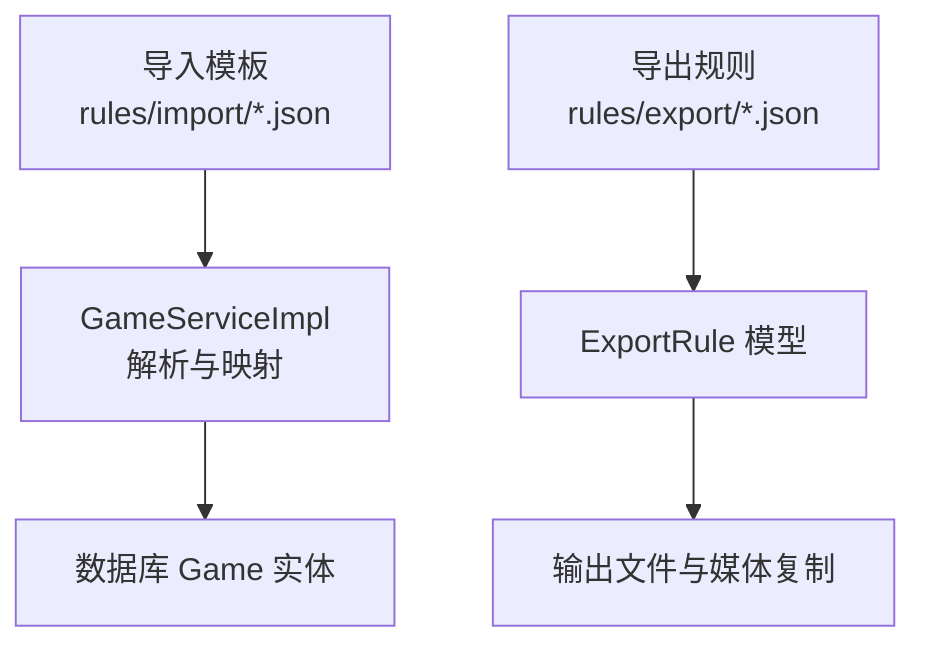
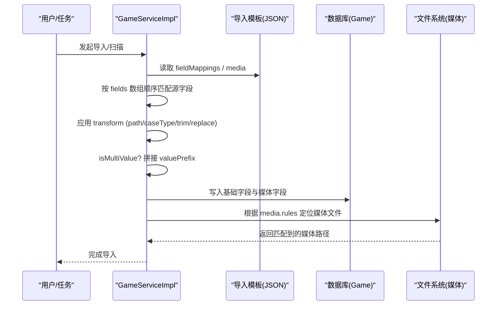
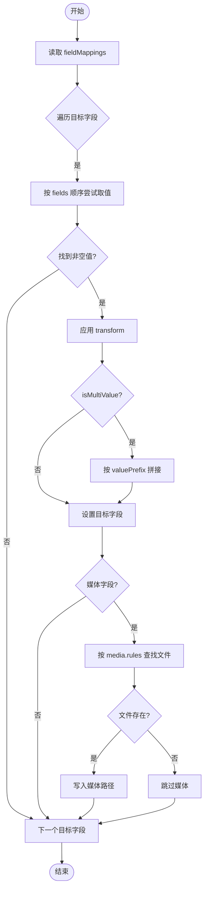
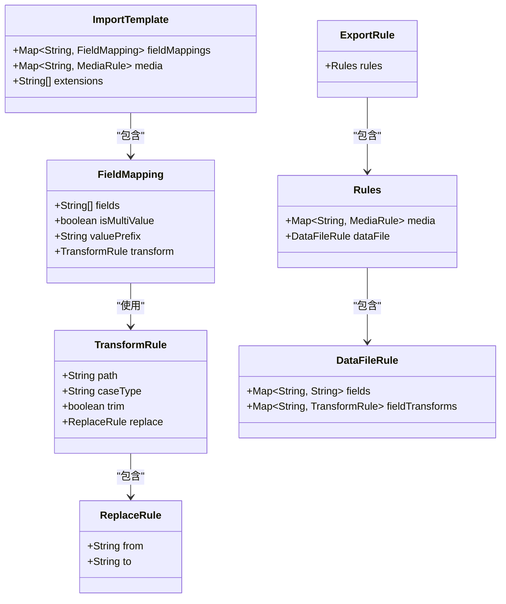

# 字段映射规则

<cite>
**本文引用的文件**
- [rules/import/pegasus.json](file://rules/import/pegasus.json)
- [rules/export/pegasus.json](file://rules/export/pegasus.json)
- [rules/import/emuelec.json](file://rules/import/emuelec.json)
- [rules/import/esde.json](file://rules/import/esde.json)
- [src/main/java/com/gamelist/service/impl/GameServiceImpl.java](file://src/main/java/com/gamelist/service/impl/GameServiceImpl.java)
- [src/main/java/com/gamelist/model/ExportRule.java](file://src/main/java/com/gamelist/model/ExportRule.java)
- [docs/media-mapping-cn.md](file://docs/media-mapping-cn.md)
</cite>

## 目录
1. [简介](#简介)
2. [项目结构](#项目结构)
3. [核心组件](#核心组件)
4. [架构总览](#架构总览)
5. [详细组件分析](#详细组件分析)
6. [依赖关系分析](#依赖关系分析)
7. [性能考虑](#性能考虑)
8. [故障排查指南](#故障排查指南)
9. [结论](#结论)
10. [附录](#附录)

## 简介
本文件面向“字段映射”能力，系统化说明以下要点：
- fieldMappings 配置语法与优先级匹配机制（fields 数组、isMultiValue、valuePrefix）
- transform 转换器选项（path、caseType、trim、replace.from/to）
- 多游戏前端（Pegasus、EmuELEC、ESDE 等）的媒体字段映射示例
- 数据验证与处理流程（空值处理、类型转换、路径清洗、去重与覆盖策略）
- 自定义字段映射创建指南与调试技巧

## 项目结构
本项目将“导入模板”和“导出规则”以 JSON 形式维护在 rules 目录下，并在 Java 服务层进行解析与应用。关键位置如下：
- 导入模板：rules/import/*.json（定义 fieldMappings、media、extensions 等）
- 导出规则：rules/export/*.json（定义 media、dataFile、directory 等）
- 服务实现：GameServiceImpl.java（负责模板加载、字段映射、媒体查找与写入）
- 模型定义：ExportRule.java（导出侧的数据结构与转换器模型）
- 文档：docs/media-mapping-cn.md（媒体映射参考表）

图表来源
- [rules/import/pegasus.json:1-120](file://rules/import/pegasus.json#L1-L120)
- [rules/export/pegasus.json:1-93](file://rules/export/pegasus.json#L1-L93)
- [src/main/java/com/gamelist/service/impl/GameServiceImpl.java:1353-1468](file://src/main/java/com/gamelist/service/impl/GameServiceImpl.java#L1353-L1468)
- [src/main/java/com/gamelist/model/ExportRule.java:184-293](file://src/main/java/com/gamelist/model/ExportRule.java#L184-L293)

章节来源
- [rules/import/pegasus.json:1-120](file://rules/import/pegasus.json#L1-L120)
- [rules/export/pegasus.json:1-93](file://rules/export/pegasus.json#L1-L93)
- [src/main/java/com/gamelist/service/impl/GameServiceImpl.java:1353-1468](file://src/main/java/com/gamelist/service/impl/GameServiceImpl.java#L1353-L1468)
- [src/main/java/com/gamelist/model/ExportRule.java:184-293](file://src/main/java/com/gamelist/model/ExportRule.java#L184-L293)

## 核心组件
- 导入模板（Import Template）
  - fieldMappings：目标字段到源字段名的映射集合
  - media：媒体文件的查找规则（source、rules、transform）
  - extensions：支持的扩展名
- 导出规则（Export Rule）
  - dataFile.fields：导出数据字段映射
  - dataFile.fieldTransforms：字段级转换器
  - media：媒体复制与目标路径模板
- 服务实现（GameServiceImpl）
  - 解析模板、应用 fieldMappings、执行 transform、校验并写入数据库
- 模型（ExportRule）
  - TransformRule、ReplaceRule 等数据结构用于描述转换规则

章节来源
- [rules/import/pegasus.json:39-248](file://rules/import/pegasus.json#L39-L248)
- [rules/import/emuelec.json:13-85](file://rules/import/emuelec.json#L13-L85)
- [rules/import/esde.json:13-57](file://rules/import/esde.json#L13-L57)
- [src/main/java/com/gamelist/model/ExportRule.java:184-293](file://src/main/java/com/gamelist/model/ExportRule.java#L184-L293)
- [src/main/java/com/gamelist/service/impl/GameServiceImpl.java:1353-1468](file://src/main/java/com/gamelist/service/impl/GameServiceImpl.java#L1353-L1468)

## 架构总览
下图展示了从导入模板到最终落库的字段映射与媒体处理流程。

图表来源
- [rules/import/pegasus.json:39-248](file://rules/import/pegasus.json#L39-L248)
- [src/main/java/com/gamelist/service/impl/GameServiceImpl.java:1353-1468](file://src/main/java/com/gamelist/service/impl/GameServiceImpl.java#L1353-L1468)

## 详细组件分析

### fieldMappings 配置语法与优先级匹配
- 目标字段键：如 name、description、files、image、video、screenshot 等
- 每个目标字段包含：
  - fields：源字段名数组，按声明顺序作为优先级匹配
  - isMultiValue：是否多值字段；为 true 时会将多个源值按 valuePrefix 拼接
  - valuePrefix：多值拼接前缀（例如 files 使用空格前缀）
  - transform：可选的转换器，支持 path、caseType、trim、replace.from/to

优先级匹配机制：
- 对每个目标字段，系统按 fields 数组顺序依次尝试取值，取到第一个非空值即停止
- 若未找到任何源字段或值为空，则目标字段为空

示例（来自 Pegasus 模板）：
- name 的 fields: ["title", "name", "game"]，优先取 title，其次 name，最后 game
- files 的 fields: ["files", "file"]，且 isMultiValue: true，valuePrefix: "  "，表示多行文件路径以两个空格开头拼接
- image 的 fields: ["image", "boxFront"]，并设置 transform.path = "no"，表示不自动转换路径

章节来源
- [rules/import/pegasus.json:39-100](file://rules/import/pegasus.json#L39-L100)
- [rules/import/emuelec.json:13-85](file://rules/import/emuelec.json#L13-L85)
- [rules/import/esde.json:13-57](file://rules/import/esde.json#L13-L57)

### isMultiValue 多值字段的处理方式
- 当 isMultiValue 为 true 时，系统将同一目标字段对应的多个源值进行拼接
- 拼接时使用 valuePrefix 作为分隔前缀（例如 files 使用双空格）
- 典型场景：files 字段可能包含多个可执行文件或 ROM 路径

章节来源
- [rules/import/pegasus.json:68-75](file://rules/import/pegasus.json#L68-L75)

### transform 转换器详解
- path：控制路径处理策略
  - 常见值："no" 表示不进行路径转换（保留原始路径），适用于某些前端直接提供完整路径的场景
  - 默认行为：若未显式设置，系统会尝试将相对路径转换为绝对路径并进行存在性检查
- caseType：大小写转换（如 upper/lower/title 等，具体由实现决定）
- trim：是否去除首尾空白
- replace：字符串替换
  - from：正则或子串模式
  - to：替换目标

示例：
- Pegasus 的 files/image/video/screenshot 等媒体字段常设置 transform.path = "no"，避免路径被改写
- EmuELEC/ESDE 的 files 字段也常设置 transform.path = "no"，保持原路径

章节来源
- [rules/import/pegasus.json:68-100](file://rules/import/pegasus.json#L68-L100)
- [rules/import/emuelec.json:50-85](file://rules/import/emuelec.json#L50-L85)
- [rules/import/esde.json:50-57](file://rules/import/esde.json#L50-L57)
- [src/main/java/com/gamelist/service/impl/GameServiceImpl.java:1389-1403](file://src/main/java/com/gamelist/service/impl/GameServiceImpl.java#L1389-L1403)
- [src/main/java/com/gamelist/model/ExportRule.java:269-293](file://src/main/java/com/gamelist/model/ExportRule.java#L269-L293)

### 媒体字段映射示例（Pegasus）
- boxFront：source 可为 image 或 boxFront，媒体规则支持多种命名与目录布局
- screenshot：source 为 screenshot，媒体规则支持多种截图命名与目录
- video：source 为 video，媒体规则支持视频命名与目录
- 其他媒体：wheel、marquee、fanart、titlescreen、banner、boxFull、boxSpine、cartridge、bezel、panel、cabinetLeft/Right、tile、steam、poster、background、music 等

注意：
- 多数媒体字段在导入模板中设置了 transform.path = "no"，以避免路径被改写
- 媒体查找通过 media.rules 中的多条候选路径进行匹配，按顺序尝试

章节来源
- [rules/import/pegasus.json:80-248](file://rules/import/pegasus.json#L80-L248)
- [rules/import/pegasus.json:249-549](file://rules/import/pegasus.json#L249-L549)

### 数据处理流程与验证规则
- 路径处理
  - 若路径为相对路径，基于数据文件所在目录计算绝对路径
  - 若路径以 ./ 或 .\ 开头，先去除该前缀再处理
  - 若 transform.path = "no"，则跳过路径转换逻辑
- 空值处理
  - 若所有源字段均为空或未找到，目标字段为空
  - 媒体字段仅在文件存在时才写入
- 类型与长度限制
  - 部分字段有长度限制（如 gameId、path、source 等），超长会被截断
  - 数值型字段（如 rating）需确保可解析
- 去重与覆盖
  - 媒体字段采用“首次命中即写入”，后续同名字段不会覆盖已存在的值
- 日志与调试
  - 路径转换、存在性检查、替换规则应用均记录日志，便于定位问题

图表来源
- [src/main/java/com/gamelist/service/impl/GameServiceImpl.java:1353-1468](file://src/main/java/com/gamelist/service/impl/GameServiceImpl.java#L1353-L1468)
- [rules/import/pegasus.json:249-549](file://rules/import/pegasus.json#L249-L549)

章节来源
- [src/main/java/com/gamelist/service/impl/GameServiceImpl.java:1353-1468](file://src/main/java/com/gamelist/service/impl/GameServiceImpl.java#L1353-L1468)

### 自定义字段映射创建指南
步骤：
1. 确定目标字段名（如 customField）
2. 在导入模板的 fieldMappings 中添加条目：
   - fields：列出可能的源字段名，按优先级排序
   - isMultiValue：如需多值拼接，设为 true，并配置 valuePrefix
   - transform：按需配置 path、caseType、trim、replace
3. 若涉及媒体文件，在 media 下添加对应条目：
   - source：源字段名
   - rules：媒体路径候选列表，支持 {filename}/{filepath}/{ext} 等变量
   - transform：通常设置 path = "no"
4. 测试导入并查看日志，确认字段映射与媒体查找是否符合预期

注意事项：
- 确保字段名与源数据一致（区分大小写）
- 多值字段务必设置合适的 valuePrefix，避免拼接混乱
- 媒体规则应覆盖实际存储目录结构，必要时增加更多候选路径

章节来源
- [rules/import/pegasus.json:39-248](file://rules/import/pegasus.json#L39-L248)
- [rules/import/emuelec.json:13-85](file://rules/import/emuelec.json#L13-L85)
- [rules/import/esde.json:13-57](file://rules/import/esde.json#L13-L57)

### 调试技巧
- 启用调试日志：关注路径转换、存在性检查、替换规则应用等日志
- 逐步缩小范围：先验证 fieldMappings 是否正确，再验证 media.rules
- 检查路径格式：相对路径是否以 ./ 或 .\ 开头；绝对路径是否存在
- 验证多值拼接：确认 isMultiValue 与 valuePrefix 组合结果符合预期
- 媒体文件定位：核对 media.rules 中的变量与真实目录结构是否一致

章节来源
- [src/main/java/com/gamelist/service/impl/GameServiceImpl.java:1353-1468](file://src/main/java/com/gamelist/service/impl/GameServiceImpl.java#L1353-L1468)
- [wiki/Import.md:534-543](file://wiki/Import.md#L534-L543)

## 依赖关系分析
- 导入模板依赖：fieldMappings、media、extensions
- 服务实现依赖：模板解析、路径处理、媒体查找、数据库写入
- 导出规则依赖：ExportRule 模型、媒体复制与目标路径模板

图表来源
- [src/main/java/com/gamelist/service/impl/GameServiceImpl.java:4357-4392](file://src/main/java/com/gamelist/service/impl/GameServiceImpl.java#L4357-L4392)
- [src/main/java/com/gamelist/model/ExportRule.java:184-293](file://src/main/java/com/gamelist/model/ExportRule.java#L184-L293)

章节来源
- [src/main/java/com/gamelist/service/impl/GameServiceImpl.java:4357-4392](file://src/main/java/com/gamelist/service/impl/GameServiceImpl.java#L4357-L4392)
- [src/main/java/com/gamelist/model/ExportRule.java:184-293](file://src/main/java/com/gamelist/model/ExportRule.java#L184-L293)

## 性能考虑
- 媒体规则候选列表不宜过长，避免过多无效路径尝试
- 多值字段拼接应避免过长的 valuePrefix 导致数据膨胀
- 路径转换与存在性检查应在最小范围内执行，减少不必要的 I/O
- 合理设置 transform.path = "no" 以减少路径改写开销

[本节为通用指导，无需特定文件引用]

## 故障排查指南
常见问题与解决思路：
- 字段未映射：检查字段名是否与源数据完全一致；确认 fields 数组顺序与优先级
- 媒体文件未找到：核对 media.rules 中的路径变量与真实目录结构；确认文件存在
- 路径错误：检查是否误用相对路径；确认 transform.path 设置是否符合预期
- 多值拼接异常：检查 isMultiValue 与 valuePrefix 配置；确认源数据是否为多值

章节来源
- [wiki/Import.md:534-543](file://wiki/Import.md#L534-L543)
- [src/main/java/com/gamelist/service/impl/GameServiceImpl.java:1353-1468](file://src/main/java/com/gamelist/service/impl/GameServiceImpl.java#L1353-L1468)

## 结论
本项目的字段映射能力通过导入模板与导出规则的 JSON 配置，结合服务层的解析与处理，实现了灵活、可扩展的多前端兼容方案。fieldMappings 的优先级匹配、isMultiValue 的多值处理、以及 transform 的路径与内容转换，共同构成了强大的数据适配层。通过合理的模板设计与调试手段，用户可以轻松定制字段映射以满足不同业务需求。

[本节为总结，无需特定文件引用]

## 附录
- 媒体映射参考表：docs/media-mapping-cn.md
- 各前端导入模板：rules/import/*.json
- 导出规则模板：rules/export/*.json

章节来源
- [docs/media-mapping-cn.md:1-274](file://docs/media-mapping-cn.md#L1-L274)
- [rules/import/pegasus.json:1-556](file://rules/import/pegasus.json#L1-L556)
- [rules/export/pegasus.json:1-93](file://rules/export/pegasus.json#L1-L93)