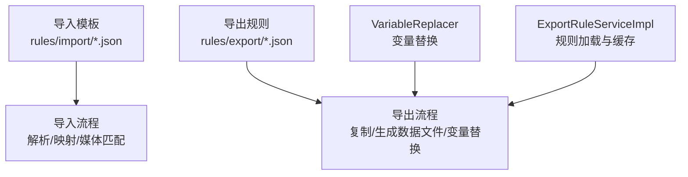
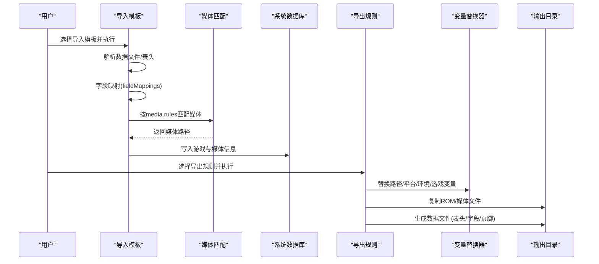
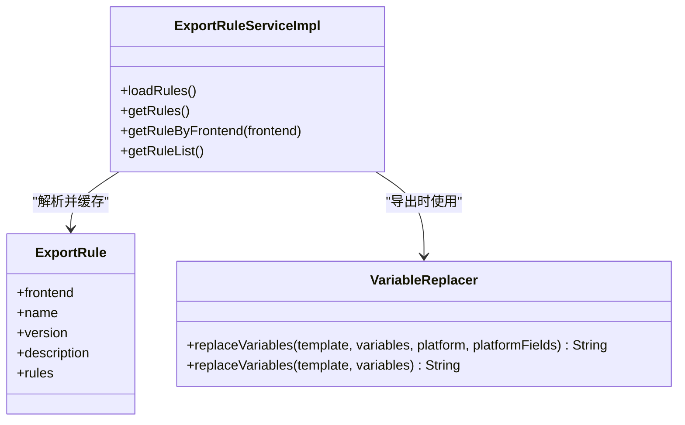

# 模板配置详解

<cite>
**本文引用的文件**
- [rules/import/webgamelistoper.json](file://rules/import/webgamelistoper.json)
- [rules/import/esde.json](file://rules/import/esde.json)
- [src/main/resources/import-templates/webgamelistoper.json](file://src/main/resources/import-templates/webgamelistoper.json)
- [rules/export/retrobat.json](file://rules/export/retrobat.json)
- [src/main/resources/export-rules/retrobat.json](file://src/main/resources/export-rules/retrobat.json)
- [docs/import-templates-cn.md](file://docs/import-templates-cn.md)
- [docs/export-functionality-cn.md](file://docs/export-functionality-cn.md)
- [docs/media-mapping-cn.md](file://docs/media-mapping-cn.md)
- [src/main/java/com/gamelist/util/VariableReplacer.java](file://src/main/java/com/gamelist/util/VariableReplacer.java)
- [src/main/java/com/gamelist/service/impl/ExportRuleServiceImpl.java](file://src/main/java/com/gamelist/service/impl/ExportRuleServiceImpl.java)
</cite>

## 目录
1. [简介](#简介)
2. [项目结构](#项目结构)
3. [核心组件](#核心组件)
4. [架构总览](#架构总览)
5. [详细组件分析](#详细组件分析)
6. [依赖关系分析](#依赖关系分析)
7. [性能与优化建议](#性能与优化建议)
8. [故障排查指南](#故障排查指南)
9. [结论](#结论)
10. [附录：字段与变量速查](#附录字段与变量速查)

## 简介
本文件面向“导入模板”和“导出规则”的 JSON 配置体系，系统性说明根节点定义、字段映射规则、路径变量、条件过滤（多源匹配）、数据转换、格式化规则、错误处理策略等。同时解释变量替换机制的工作原理（内置变量、自定义变量、动态路径生成），并提供完整示例与最佳实践，帮助快速搭建稳定高效的模板配置。

## 项目结构
- 导入模板位于 rules/import 与 src/main/resources/import-templates，用于将外部前端（如 ES-DE、Pegasus、WebGamelistOper）的数据与媒体文件导入系统。
- 导出规则位于 rules/export 与 src/main/resources/export-rules，用于将系统内游戏数据与媒体文件导出为各前端可识别的格式（XML/文本）。
- 文档 docs 提供中文说明与示例；工具类 VariableReplacer 负责变量替换；服务 ExportRuleServiceImpl 负责加载并缓存导出规则。

**图表来源**
- [rules/import/webgamelistoper.json:1-334](file://rules/import/webgamelistoper.json#L1-L334)
- [rules/export/retrobat.json:1-92](file://rules/export/retrobat.json#L1-L92)
- [src/main/java/com/gamelist/util/VariableReplacer.java:17-43](file://src/main/java/com/gamelist/util/VariableReplacer.java#L17-L43)
- [src/main/java/com/gamelist/service/impl/ExportRuleServiceImpl.java:41-68](file://src/main/java/com/gamelist/service/impl/ExportRuleServiceImpl.java#L41-L68)

**章节来源**
- [docs/import-templates-cn.md:16-73](file://docs/import-templates-cn.md#L16-L73)
- [docs/export-functionality-cn.md:18-115](file://docs/export-functionality-cn.md#L18-L115)

## 核心组件
- 导入模板（Import Template）
  - 根节点：frontend、name、version、description、type、dataFile、delimiter
  - rules：包含 header、fieldMappings、media、extensions、gameExtensions
- 导出规则（Export Rule）
  - 根节点：frontend、name、version、description
  - rules：包含 media、dataFile、directory、exportOptions、gameFile、m3u、fieldTransforms
- 变量替换器（VariableReplacer）
  - 支持环境变量与平台字段变量的模板替换
- 规则加载器（ExportRuleServiceImpl）
  - 从外部目录或 classpath 加载导出规则并缓存

**章节来源**
- [rules/import/webgamelistoper.json:1-334](file://rules/import/webgamelistoper.json#L1-L334)
- [rules/export/retrobat.json:1-92](file://rules/export/retrobat.json#L1-L92)
- [src/main/java/com/gamelist/util/VariableReplacer.java:17-43](file://src/main/java/com/gamelist/util/VariableReplacer.java#L17-L43)
- [src/main/java/com/gamelist/service/impl/ExportRuleServiceImpl.java:41-68](file://src/main/java/com/gamelist/service/impl/ExportRuleServiceImpl.java#L41-L68)

## 架构总览
导入与导出的整体流程如下：
- 导入：读取模板 → 解析数据文件 → 字段映射 → 媒体文件匹配 → 写入系统数据库
- 导出：加载规则 → 复制 ROM/媒体 → 生成数据文件（含表头/页脚/字段映射）→ 输出到目标目录

**图表来源**
- [docs/import-templates-cn.md:108-158](file://docs/import-templates-cn.md#L108-L158)
- [docs/export-functionality-cn.md:480-523](file://docs/export-functionality-cn.md#L480-L523)
- [src/main/java/com/gamelist/util/VariableReplacer.java:17-43](file://src/main/java/com/gamelist/util/VariableReplacer.java#L17-L43)

## 详细组件分析

### 导入模板配置结构
- 根节点
  - frontend：标识前端类型
  - name/version/description：模板元信息
  - type/dataFile/delimiter：数据文件格式与分隔符
- rules
  - header：表头配置（enabled/format/startMarker/endMarker/structure/fields）
  - fieldMappings：字段映射（fields/isMultiValue/valuePrefix/transform）
  - media：媒体文件规则（source/rules/transform）
  - extensions/gameExtensions：扩展名白名单

要点：
- 字段映射支持多字段候选（按顺序匹配第一个非空值）
- transform 支持 path/trim/case/replace（正则替换）
- media.rules 支持多路径模板，按顺序尝试匹配
- 内置模板对路径相关字段默认设置 path:"no"，统一路径格式

**章节来源**
- [rules/import/webgamelistoper.json:9-85](file://rules/import/webgamelistoper.json#L9-L85)
- [rules/import/esde.json:9-57](file://rules/import/esde.json#L9-L57)
- [docs/import-templates-cn.md:108-158](file://docs/import-templates-cn.md#L108-L158)

#### 字段映射与转换
- fields：外部字段名列表，按序匹配
- isMultiValue：是否多值字段
- valuePrefix：多值前缀（如 Pegasus 文本中的缩进）
- transform：
  - path："no"/"yes"/"keep" 控制路径前缀
  - trim：去除首尾空格
  - case："upper"/"lower"/"none"
  - replace：正则 from/to 替换

**章节来源**
- [docs/import-templates-cn.md:108-158](file://docs/import-templates-cn.md#L108-L158)

#### 媒体文件规则
- source：对应数据字段名
- rules：路径模板数组，按序尝试匹配
- transform：可对路径进行统一处理（如 path:"no"）

**章节来源**
- [rules/import/webgamelistoper.json:86-332](file://rules/import/webgamelistoper.json#L86-L332)
- [rules/import/esde.json:58-194](file://rules/import/esde.json#L58-L194)

#### 表头配置
- enabled：是否启用
- format：xml/key-value/none
- startMarker/endMarker：XML 表头边界标记
- structure：表头结构模板行
- fields：平台信息字段映射（如 platform.name 等）

**章节来源**
- [docs/import-templates-cn.md:75-107](file://docs/import-templates-cn.md#L75-L107)

### 导出规则配置结构
- 根节点：frontend/name/version/description
- rules
  - media：媒体拷贝与数据文件标签（source/target/dataFileTag）
  - dataFile：文件名、格式、字段映射、表头/页脚、路径格式
  - directory：roms/media 目录模板
  - exportOptions：导出内容开关与提示
  - gameFile：游戏文件重命名模板
  - m3u：播放列表处理
  - fieldTransforms：导出时字段值转换

要点：
- target 支持变量替换（{mediaPath}/{gameName} 等）
- dataFile.fields 将内部字段映射到目标字段（逗号分隔多候选）
- 路径格式 pathFormat/pathPrefix 控制相对/绝对路径与前缀
- 支持 text/xml 两种数据文件格式

**章节来源**
- [rules/export/retrobat.json:1-92](file://rules/export/retrobat.json#L1-L92)
- [docs/export-functionality-cn.md:42-115](file://docs/export-functionality-cn.md#L42-L115)

#### 数据文件生成流程
- 创建文件 → 生成表头（结构+字段映射）→ 逐条生成游戏条目（字段映射+媒体引用）→ 生成页脚 → 写入文件

**章节来源**
- [docs/export-functionality-cn.md:506-515](file://docs/export-functionality-cn.md#L506-L515)

#### 变量替换机制
- 环境变量：{env.appdir}、{env.home}、{env.user}
- 平台变量：{platform.system}、{platform.software}、{platform.database}、{platform.web}、{platform.launch}、{platform.name}、{platform.sortBy}、{platform.folderPath}
- 游戏变量：{game.name}、{game.path}、{game.description}、{game.rating}、{game.developer}、{game.publisher}、{game.genre}、{game.players}
- 路径变量：{outputPath}、{platform}、{gameName}、{mediaPath}、{romsPath}

替换顺序：路径变量 → 平台变量 → 环境变量 → 游戏变量

**章节来源**
- [docs/export-functionality-cn.md:405-442](file://docs/export-functionality-cn.md#L405-L442)
- [src/main/java/com/gamelist/util/VariableReplacer.java:17-43](file://src/main/java/com/gamelist/util/VariableReplacer.java#L17-L43)

#### 媒体文件拷贝与数据文件引用
- 若 media 项包含 dataFileTag，则将相对路径写入数据文件
- 若无 dataFileTag，仅拷贝文件不写入数据文件（如 ES-DE 通过文件名匹配）

**章节来源**
- [docs/export-functionality-cn.md:494-505](file://docs/export-functionality-cn.md#L494-L505)

#### 多值匹配与字段映射
- fields 支持逗号分隔多个候选字段，按序取第一个非空值

**章节来源**
- [docs/export-functionality-cn.md:524-533](file://docs/export-functionality-cn.md#L524-L533)

#### M3U 播放列表处理
- 遇到 .m3u 文件时，解析并复制其中引用的所有文件至目标目录

**章节来源**
- [docs/export-functionality-cn.md:623-625](file://docs/export-functionality-cn.md#L623-L625)

#### 游戏文件重命名
- 通过 gameFile.template 使用 {platform}/{filename}/{name}/{ext} 等变量重命名

**章节来源**
- [docs/export-functionality-cn.md:627-676](file://docs/export-functionality-cn.md#L627-L676)

#### 字段转换（导出）
- fieldTransforms 支持 path/trim/case/replace 等转换选项

**章节来源**
- [docs/export-functionality-cn.md:677-755](file://docs/export-functionality-cn.md#L677-L755)

### 媒体映射与数据库字段
- 导入模板与在线刮削最终统一映射到数据库字段
- 媒体类型多对一归并（如多种封面变体映射到 boxFront）
- 支持图片/视频/音频/文档扩展名白名单

**章节来源**
- [docs/media-mapping-cn.md:1-151](file://docs/media-mapping-cn.md#L1-L151)
- [docs/media-mapping-cn.md:234-269](file://docs/media-mapping-cn.md#L234-L269)

## 依赖关系分析
- 规则加载：ExportRuleServiceImpl 扫描外部目录与 classpath，解析 JSON 为 ExportRule 对象并缓存
- 变量替换：VariableReplacer 在导出过程中替换模板中的变量
- 导入/导出均依赖模板/规则配置驱动行为

**图表来源**
- [src/main/java/com/gamelist/service/impl/ExportRuleServiceImpl.java:41-68](file://src/main/java/com/gamelist/service/impl/ExportRuleServiceImpl.java#L41-L68)
- [src/main/java/com/gamelist/util/VariableReplacer.java:17-43](file://src/main/java/com/gamelist/util/VariableReplacer.java#L17-L43)

**章节来源**
- [src/main/java/com/gamelist/service/impl/ExportRuleServiceImpl.java:70-101](file://src/main/java/com/gamelist/service/impl/ExportRuleServiceImpl.java#L70-L101)
- [src/main/java/com/gamelist/service/impl/ExportRuleServiceImpl.java:103-145](file://src/main/java/com/gamelist/service/impl/ExportRuleServiceImpl.java#L103-L145)

## 性能与优化建议
- 媒体匹配顺序优化：将更常见路径模板置于 media.rules 前列，减少无效尝试
- 字段映射精简：避免过多候选字段，降低解析开销
- 路径格式统一：使用 transform.path 统一路径前缀，减少后续处理分支
- 批量导出：合理设置并发与内存，避免大库导出时 OOM
- 规则缓存：利用 ExportRuleServiceImpl 的内存缓存，避免重复 IO
- 扩展名白名单：限制支持的扩展名集合，减少无效文件扫描

[本节为通用指导，无需具体文件引用]

## 故障排查指南
- 规则未加载
  - 检查外部规则目录是否存在且可读
  - 查看日志中规则扫描与解析结果
- 变量替换失败
  - 确认模板中变量名与可用变量一致
  - 检查平台字段映射是否正确
- 媒体文件未匹配
  - 核对 media.rules 路径模板与实际目录结构
  - 确认扩展名在白名单中
- 数据文件格式错误
  - 校验 XML/文本格式与分隔符配置
  - 检查表头/页脚结构是否符合目标前端要求

**章节来源**
- [src/main/java/com/gamelist/service/impl/ExportRuleServiceImpl.java:41-68](file://src/main/java/com/gamelist/service/impl/ExportRuleServiceImpl.java#L41-L68)
- [docs/export-functionality-cn.md:506-523](file://docs/export-functionality-cn.md#L506-L523)

## 结论
本模板配置体系通过标准化的 JSON 结构，实现了导入与导出的灵活、可扩展与高兼容能力。借助字段映射、媒体规则、变量替换与数据文件生成，能够适配多种前端生态。遵循本文的最佳实践与排障建议，可显著提升配置效率与运行稳定性。

## 附录：字段与变量速查
- 导入模板关键字段
  - fieldMappings：fields/isMultiValue/valuePrefix/transform
  - media：source/rules/transform
  - header：enabled/format/startMarker/endMarker/structure/fields
- 导出规则关键字段
  - media：source/target/dataFileTag
  - dataFile：filename/format/fieldSeparator/entrySeparator/header/footer/fields
  - directory：roms/media
  - exportOptions：gameFiles/mediaFiles/gameListFile/showWarning
  - gameFile：enabled/template
  - m3u：enabled/target
  - fieldTransforms：path/trim/case/replace
- 变量类别
  - 路径变量：{outputPath}/{platform}/{gameName}/{mediaPath}/{romsPath}
  - 平台变量：{platform.system/software/database/web/launch/name/sortBy/folderPath}
  - 环境变量：{env.appdir/home/user}
  - 游戏变量：{game.name/path/description/rating/developer/publisher/genre/players}

**章节来源**
- [docs/import-templates-cn.md:108-158](file://docs/import-templates-cn.md#L108-L158)
- [docs/export-functionality-cn.md:405-442](file://docs/export-functionality-cn.md#L405-L442)
- [docs/export-functionality-cn.md:627-755](file://docs/export-functionality-cn.md#L627-L755)