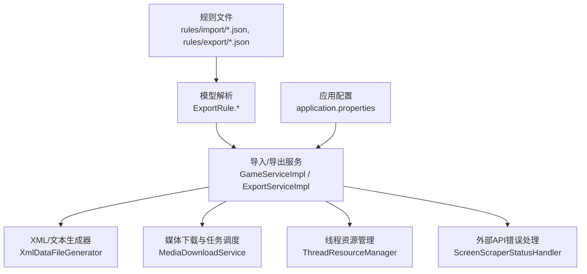
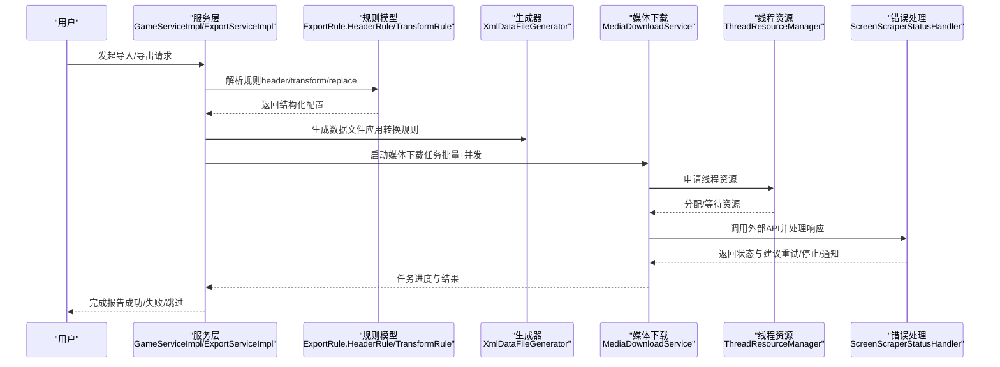
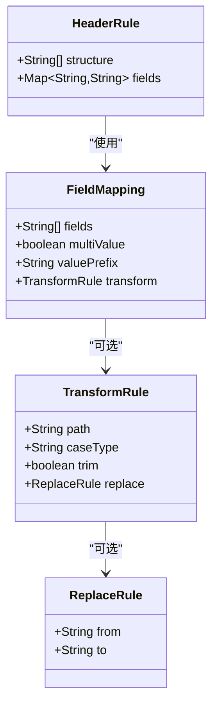
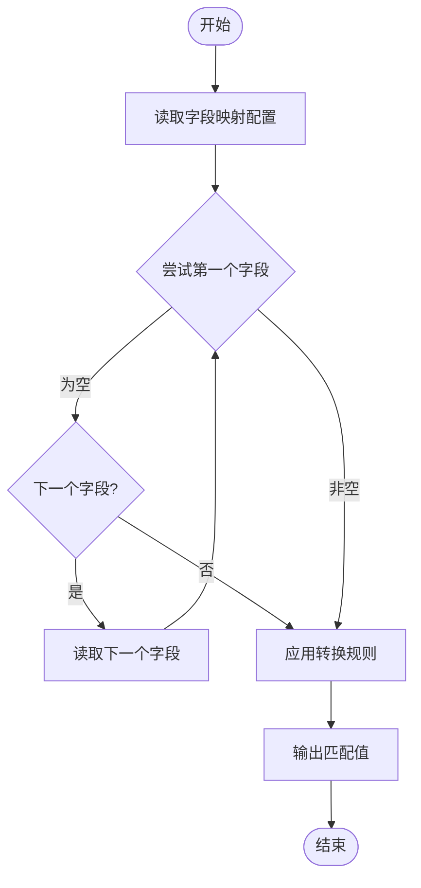
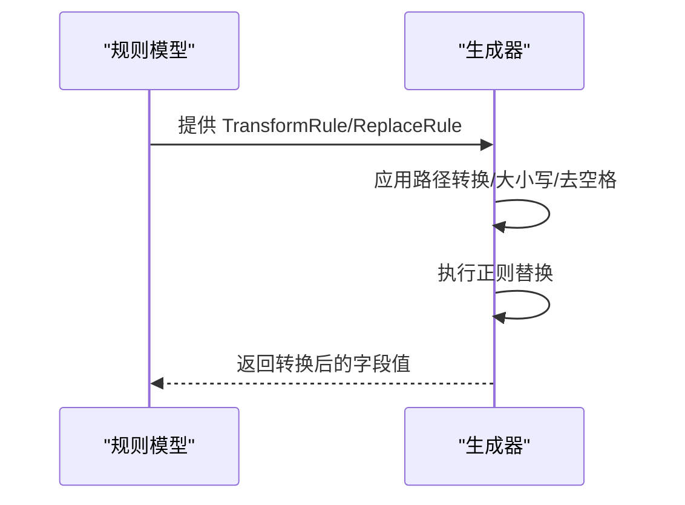
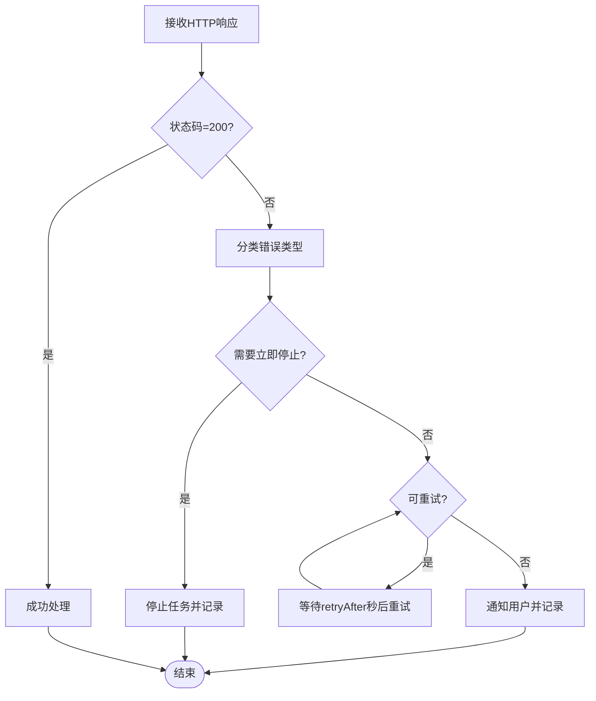
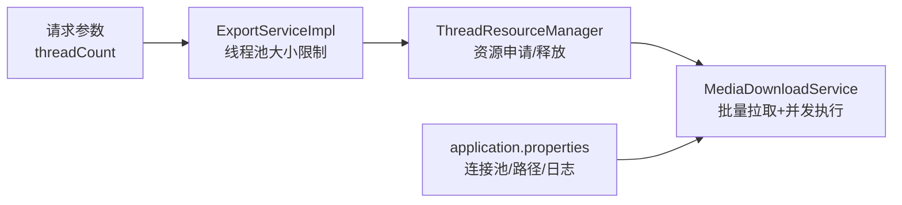
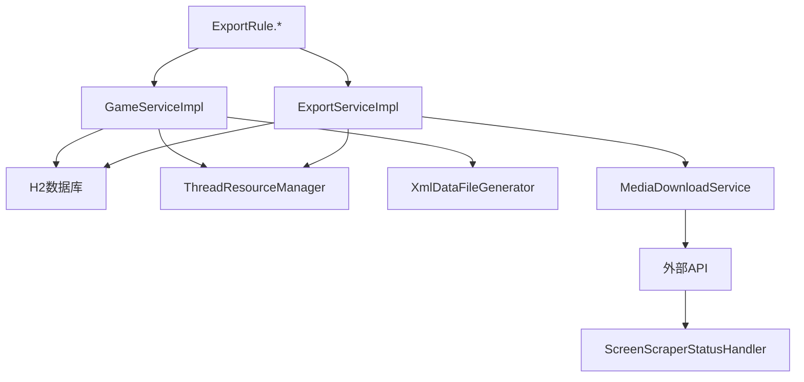

# 高级配置功能

<cite>
**本文引用的文件**
- [ExportRule.java](file://src/main/java/com/gamelist/model/ExportRule.java)
- [GameServiceImpl.java](file://src/main/java/com/gamelist/service/impl/GameServiceImpl.java)
- [XmlDataFileGenerator.java](file://src/main/java/com/gamelist/service/impl/XmlDataFileGenerator.java)
- [ExportServiceImpl.java](file://src/main/java/com/gamelist/service/impl/ExportServiceImpl.java)
- [ScreenScraperStatusHandler.java](file://src/main/java/com/gamelist/util/ScreenScraperStatusHandler.java)
- [ThreadResourceManager.java](file://src/main/java/com/gamelist/service/ThreadResourceManager.java)
- [MediaDownloadService.java](file://src/main/java/com/gamelist/service/impl/MediaDownloadService.java)
- [ConfigManager.java](file://src/main/java/com/gamelist/service/impl/ConfigManager.java)
- [SettingController.java](file://src/main/java/com/gamelist/controller/SettingController.java)
- [application.properties](file://src/main/resources/application.properties)
- [emuelec.json（导出）](file://rules/export/emuelec.json)
- [emuelec.json（导入）](file://rules/import/emuelec.json)
- [import-templates-cn.md](file://docs/import-templates-cn.md)
- [export-functionality-en.md](file://src/main/resources/export-functionality-en.md)
</cite>

## 目录
1. [简介](#简介)
2. [项目结构](#项目结构)
3. [核心组件](#核心组件)
4. [架构总览](#架构总览)
5. [详细组件分析](#详细组件分析)
6. [依赖关系分析](#依赖关系分析)
7. [性能调优](#性能调优)
8. [故障排除指南](#故障排除指南)
9. [结论](#结论)
10. [附录：配置示例与最佳实践](#附录：配置示例与最佳实践)

## 简介
本章节面向高级用户，系统阐述“高级配置功能”的完整能力与使用方法，重点覆盖：
- 表头（header）的高级选项：startMarker、endMarker、structure 等字段的自定义设置
- 条件过滤语法与基于字段值的动态规则匹配
- 数据转换与处理管道：字符串格式化、数值计算、日期转换等
- 错误处理策略：跳过错误记录、重试机制、异常恢复
- 性能调优：批量大小、并发控制、内存管理
- 复杂业务场景配置：多格式混合处理、数据验证规则、自定义逻辑集成
- 测试方法与故障排除

## 项目结构
本项目将“高级配置”以 JSON 规则文件为核心，配合后端模型与服务实现进行解析与应用。关键位置如下：
- 规则定义与模型映射：ExportRule 及其内部类（HeaderRule、TransformRule、ReplaceRule 等）
- 导入/导出模板：rules/import/*.json、rules/export/*.json
- 文档说明：docs/import-templates-*.md、src/main/resources/export-functionality-*.md
- 运行时配置：application.properties（数据库、路径、日志等）
- 服务层：GameServiceImpl、ExportServiceImpl、XmlDataFileGenerator、MediaDownloadService 等

图表来源
- [ExportRule.java:18-323](file://src/main/java/com/gamelist/model/ExportRule.java#L18-L323)
- [GameServiceImpl.java:276-324](file://src/main/java/com/gamelist/service/impl/GameServiceImpl.java#L276-L324)
- [ExportServiceImpl.java:41-69](file://src/main/java/com/gamelist/service/impl/ExportServiceImpl.java#L41-L69)
- [XmlDataFileGenerator.java:407-421](file://src/main/java/com/gamelist/service/impl/XmlDataFileGenerator.java#L407-L421)
- [MediaDownloadService.java:70-97](file://src/main/java/com/gamelist/service/impl/MediaDownloadService.java#L70-L97)
- [ThreadResourceManager.java:82-124](file://src/main/java/com/gamelist/service/ThreadResourceManager.java#L82-L124)
- [ScreenScraperStatusHandler.java:84-213](file://src/main/java/com/gamelist/util/ScreenScraperStatusHandler.java#L84-L213)
- [application.properties:1-86](file://src/main/resources/application.properties#L1-L86)

章节来源
- [ExportRule.java:18-323](file://src/main/java/com/gamelist/model/ExportRule.java#L18-L323)
- [application.properties:1-86](file://src/main/resources/application.properties#L1-L86)

## 核心组件
- 规则模型（ExportRule 及嵌套类）
  - HeaderRule：支持旧版数组结构与新版对象结构（含 structure、fields），提供向后兼容的反序列化
  - TransformRule/ReplaceRule：字段值转换（路径格式、大小写、去空格、正则替换）
  - DataFileRule：数据文件输出格式、分隔符、路径格式、头部/尾部、字段映射与转换
- 导入/导出服务
  - GameServiceImpl：多线程导入、批处理、过滤与插入
  - ExportServiceImpl：平台导出流程、线程池大小控制
  - XmlDataFileGenerator：将导出规则中的 TransformRule 转换为 XML 生成所需的转换规则
- 任务与资源管理
  - MediaDownloadService：批量拉取、并发执行、进度更新
  - ThreadResourceManager：线程资源申请与释放、优先级控制
- 外部 API 错误处理
  - ScreenScraperStatusHandler：状态码分类、建议、是否立即停止、重试间隔、通知用户

章节来源
- [ExportRule.java:18-323](file://src/main/java/com/gamelist/model/ExportRule.java#L18-L323)
- [GameServiceImpl.java:276-324](file://src/main/java/com/gamelist/service/impl/GameServiceImpl.java#L276-L324)
- [ExportServiceImpl.java:41-69](file://src/main/java/com/gamelist/service/impl/ExportServiceImpl.java#L41-L69)
- [XmlDataFileGenerator.java:407-421](file://src/main/java/com/gamelist/service/impl/XmlDataFileGenerator.java#L407-L421)
- [MediaDownloadService.java:70-97](file://src/main/java/com/gamelist/service/impl/MediaDownloadService.java#L70-L97)
- [ThreadResourceManager.java:82-124](file://src/main/java/com/gamelist/service/ThreadResourceManager.java#L82-L124)
- [ScreenScraperStatusHandler.java:84-213](file://src/main/java/com/gamelist/util/ScreenScraperStatusHandler.java#L84-L213)

## 架构总览
下图展示从规则文件到数据产出的整体流程，包括导入、导出、媒体下载与错误处理。

图表来源
- [GameServiceImpl.java:276-324](file://src/main/java/com/gamelist/service/impl/GameServiceImpl.java#L276-L324)
- [ExportServiceImpl.java:41-69](file://src/main/java/com/gamelist/service/impl/ExportServiceImpl.java#L41-L69)
- [XmlDataFileGenerator.java:407-421](file://src/main/java/com/gamelist/service/impl/XmlDataFileGenerator.java#L407-L421)
- [MediaDownloadService.java:70-97](file://src/main/java/com/gamelist/service/impl/MediaDownloadService.java#L70-L97)
- [ThreadResourceManager.java:82-124](file://src/main/java/com/gamelist/service/ThreadResourceManager.java#L82-L124)
- [ScreenScraperStatusHandler.java:84-213](file://src/main/java/com/gamelist/util/ScreenScraperStatusHandler.java#L84-L213)

## 详细组件分析

### 表头（header）高级配置
- 支持两种结构：
  - 旧版：直接为字符串数组（结构模板）
  - 新版：对象结构，包含 structure（结构模板列表）、fields（平台信息字段映射）
- 关键字段：
  - startMarker/endMarker：用于标记表头开始与结束（在导入模板中常见）
  - format：xml/key-value/none
  - structure：表头结构模板，支持变量占位（如 {platform.name}）
  - fields：平台信息字段映射，支持多值字段与转换
- 反序列化兼容：HeaderRuleDeserializer 自动识别数组或对象结构

图表来源
- [ExportRule.java:295-366](file://src/main/java/com/gamelist/model/ExportRule.java#L295-L366)
- [GameServiceImpl.java:4343-4392](file://src/main/java/com/gamelist/service/impl/GameServiceImpl.java#L4343-L4392)

章节来源
- [ExportRule.java:295-366](file://src/main/java/com/gamelist/model/ExportRule.java#L295-L366)
- [GameServiceImpl.java:4343-4392](file://src/main/java/com/gamelist/service/impl/GameServiceImpl.java#L4343-L4392)
- [import-templates-cn.md:75-106](file://docs/import-templates-cn.md#L75-L106)

### 条件过滤与动态规则匹配
- 多值匹配机制：在字段映射中使用逗号分隔多个字段名，按顺序匹配直到找到非空值
- 字段映射支持：
  - fields：外部数据文件中的字段名列表，按顺序匹配
  - isMultiValue：是否为多值字段
  - valuePrefix：多值字段的前缀
  - transform：路径格式、去空格、大小写、正则替换
- 内置路径转换：no/yes/keep 控制是否带 ./ 前缀

图表来源
- [export-functionality-en.md:79-87](file://src/main/resources/export-functionality-en.md#L79-L87)
- [import-templates-cn.md:131-150](file://docs/import-templates-cn.md#L131-L150)

章节来源
- [export-functionality-en.md:79-87](file://src/main/resources/export-functionality-en.md#L79-L87)
- [import-templates-cn.md:131-150](file://docs/import-templates-cn.md#L131-L150)

### 数据转换与处理管道
- 转换类型：
  - 字符串格式化：trim、case（upper/lower/none）
  - 路径转换：path（no/yes/keep）
  - 正则替换：from/to（支持分组引用）
- 转换链：导出规则中的 TransformRule 会被转换为 XML 生成所需的转换规则，确保一致性
- 典型用法：
  - 去除路径前缀，仅保留文件名
  - 统一大小写
  - 清理首尾空白

图表来源
- [XmlDataFileGenerator.java:407-421](file://src/main/java/com/gamelist/service/impl/XmlDataFileGenerator.java#L407-L421)
- [ExportRule.java:269-293](file://src/main/java/com/gamelist/model/ExportRule.java#L269-L293)

章节来源
- [XmlDataFileGenerator.java:407-421](file://src/main/java/com/gamelist/service/impl/XmlDataFileGenerator.java#L407-L421)
- [ExportRule.java:269-293](file://src/main/java/com/gamelist/model/ExportRule.java#L269-L293)

### 错误处理策略
- 外部 API 错误分类：
  - 成功：正常处理
  - 认证错误：401/403，建议稍后重试或登录
  - 限流：429/430/431，降低速度或等待
  - 服务端错误：423/5xx，等待修复
- 行为控制：
  - shouldStopImmediately：某些状态码需立即停止
  - canRetry：可重试的状态码集合
  - retryAfterSeconds：根据状态码计算重试间隔
  - notifyUser：是否需要通知用户
- 本地任务错误：
  - 多线程导入时捕获异常并统计失败任务数
  - 媒体下载任务中记录进度与错误

图表来源
- [ScreenScraperStatusHandler.java:84-213](file://src/main/java/com/gamelist/util/ScreenScraperStatusHandler.java#L84-L213)
- [GameServiceImpl.java:313-324](file://src/main/java/com/gamelist/service/impl/GameServiceImpl.java#L313-L324)
- [MediaDownloadService.java:70-97](file://src/main/java/com/gamelist/service/impl/MediaDownloadService.java#L70-L97)

章节来源
- [ScreenScraperStatusHandler.java:84-213](file://src/main/java/com/gamelist/util/ScreenScraperStatusHandler.java#L84-L213)
- [GameServiceImpl.java:313-324](file://src/main/java/com/gamelist/service/impl/GameServiceImpl.java#L313-L324)
- [MediaDownloadService.java:70-97](file://src/main/java/com/gamelist/service/impl/MediaDownloadService.java#L70-L97)

### 性能调优配置
- 并发控制：
  - 默认线程池大小：CPU核心数（至少4）
  - 最大线程池大小：CPU核心数的2倍（至少10）
  - 可通过请求参数 threadCount 调整（有上限）
- 批量处理：
  - 导入/导出分片处理，避免一次性加载过多数据
  - 媒体下载任务分批拉取（BATCH_SIZE）
- 内存管理：
  - 数据库连接池：最大连接数、空闲超时、连接超时、生命周期
  - 上传临时目录与静态资源映射，避免权限问题
- 线程资源管理：
  - 高优先级任务（游戏信息）优先获取资源
  - 动态调整最大线程数，谨慎减少以避免中断

图表来源
- [ExportServiceImpl.java:41-69](file://src/main/java/com/gamelist/service/impl/ExportServiceImpl.java#L41-L69)
- [ThreadResourceManager.java:82-124](file://src/main/java/com/gamelist/service/ThreadResourceManager.java#L82-L124)
- [MediaDownloadService.java:70-97](file://src/main/java/com/gamelist/service/impl/MediaDownloadService.java#L70-L97)
- [application.properties:15-27](file://src/main/resources/application.properties#L15-L27)

章节来源
- [ExportServiceImpl.java:41-69](file://src/main/java/com/gamelist/service/impl/ExportServiceImpl.java#L41-L69)
- [application.properties:15-27](file://src/main/resources/application.properties#L15-L27)
- [ThreadResourceManager.java:82-124](file://src/main/java/com/gamelist/service/ThreadResourceManager.java#L82-L124)
- [MediaDownloadService.java:70-97](file://src/main/java/com/gamelist/service/impl/MediaDownloadService.java#L70-L97)

### 复杂业务场景配置示例
- 多格式混合处理：
  - 导入模板支持 xml/text/none，通过 delimiter 与 fieldMappings 适配不同格式
  - 导出模板支持 xml 输出，结合 header/footer 与字段映射
- 数据验证规则：
  - 翻译服务配置校验 requiredVariables，缺失则标记无效
  - 外部 API 状态码分类与重试策略
- 自定义逻辑集成：
  - 通过 TransformRule/ReplaceRule 实现复杂字符串处理
  - 使用 ConfigManager 加载 variables 与 services 配置，动态选择翻译服务

章节来源
- [emuelec.json（导入）:1-206](file://rules/import/emuelec.json#L1-L206)
- [emuelec.json（导出）:1-102](file://rules/export/emuelec.json#L1-L102)
- [ConfigManager.java:14-197](file://src/main/java/com/gamelist/service/impl/ConfigManager.java#L14-L197)
- [TranslationServiceManager.java:47-110](file://src/main/java/com/gamelist/service/impl/TranslationServiceManager.java#L47-L110)

## 依赖关系分析
- 规则模型依赖 Jackson 进行 JSON 反序列化，支持兼容旧版与新版的 header 结构
- 服务层依赖数据库（H2）与 MyBatis 进行数据持久化
- 媒体下载依赖外部 API，通过错误处理器统一处理状态码与重试
- 线程资源管理器协调导入/导出与媒体下载的并发执行

图表来源
- [ExportRule.java:18-323](file://src/main/java/com/gamelist/model/ExportRule.java#L18-L323)
- [GameServiceImpl.java:276-324](file://src/main/java/com/gamelist/service/impl/GameServiceImpl.java#L276-L324)
- [ExportServiceImpl.java:41-69](file://src/main/java/com/gamelist/service/impl/ExportServiceImpl.java#L41-L69)
- [XmlDataFileGenerator.java:407-421](file://src/main/java/com/gamelist/service/impl/XmlDataFileGenerator.java#L407-L421)
- [MediaDownloadService.java:70-97](file://src/main/java/com/gamelist/service/impl/MediaDownloadService.java#L70-L97)
- [ScreenScraperStatusHandler.java:84-213](file://src/main/java/com/gamelist/util/ScreenScraperStatusHandler.java#L84-L213)

## 性能调优
- 线程池大小：根据 CPU 核心数自动设定，支持请求参数覆盖，但有上限保护
- 批量大小：媒体下载任务分批拉取，避免内存峰值过高
- 数据库连接池：合理设置最大连接数与超时，避免连接耗尽
- 日志与监控：启用文件日志与控制台日志，便于定位瓶颈
- 资源回收：线程资源管理器确保资源及时归还，避免泄漏

[本节为通用指导，不直接分析具体文件]

## 故障排除指南
- 规则文件加载失败：检查 JSON 格式与必填字段（frontend/name/version）
- 表头解析异常：确认 header 结构为新对象格式或兼容旧数组格式
- 字段映射不生效：检查 fields 列表顺序与 isMultiValue 设置
- 转换规则无效：确认 path/case/trim/replace 配置正确
- 外部 API 错误：查看状态码与建议，必要时调整重试间隔或停止策略
- 并发导致阻塞：调整 threadCount 与 BATCH_SIZE，观察线程资源使用情况
- 设置保存失败：检查数据库连接与权限，查看 SettingController 的错误返回

章节来源
- [ExportRuleServiceImpl.java:74-93](file://src/main/java/com/gamelist/service/impl/ExportRuleServiceImpl.java#L74-L93)
- [SettingController.java:41-96](file://src/main/java/com/gamelist/controller/SettingController.java#L41-L96)
- [ScreenScraperStatusHandler.java:84-213](file://src/main/java/com/gamelist/util/ScreenScraperStatusHandler.java#L84-L213)

## 结论
本项目通过 JSON 规则驱动的高级配置能力，实现了灵活的导入/导出、字段转换、媒体管理与错误处理。借助线程资源管理与批量处理，系统在大规模数据处理场景中具备良好性能与稳定性。建议在生产环境中结合实际负载调优线程池与批量大小，并完善日志与监控以快速定位问题。

[本节为总结性内容，不直接分析具体文件]

## 附录：配置示例与最佳实践
- 表头配置示例：参考导入模板中的 header 配置，设置 startMarker/endMarker/structure/fields
- 字段映射与转换：使用 fields 列表与 transform 组合，实现路径清理、大小写统一、正则替换
- 多格式混合：根据数据类型选择 xml/text/none，并配置 delimiter 与 fieldMappings
- 错误处理：利用 ScreenScraperStatusHandler 的分类与建议，制定重试与停止策略
- 性能调优：根据 CPU 核心数设置线程池，调整 BATCH_SIZE 与连接池参数
- 测试方法：
  - 单元测试：针对 TransformRule/ReplaceRule 的转换逻辑
  - 集成测试：端到端导入/导出流程，验证规则生效与数据一致性
  - 压力测试：模拟大量数据与并发请求，观察线程资源与内存占用
- 故障排除：
  - 检查规则文件语法与字段映射
  - 查看日志输出，定位错误阶段（解析/转换/写入/网络）
  - 逐步禁用部分规则，缩小问题范围

章节来源
- [emuelec.json（导入）:1-206](file://rules/import/emuelec.json#L1-L206)
- [emuelec.json（导出）:1-102](file://rules/export/emuelec.json#L1-L102)
- [import-templates-cn.md:75-150](file://docs/import-templates-cn.md#L75-L150)
- [export-functionality-en.md:66-87](file://src/main/resources/export-functionality-en.md#L66-L87)