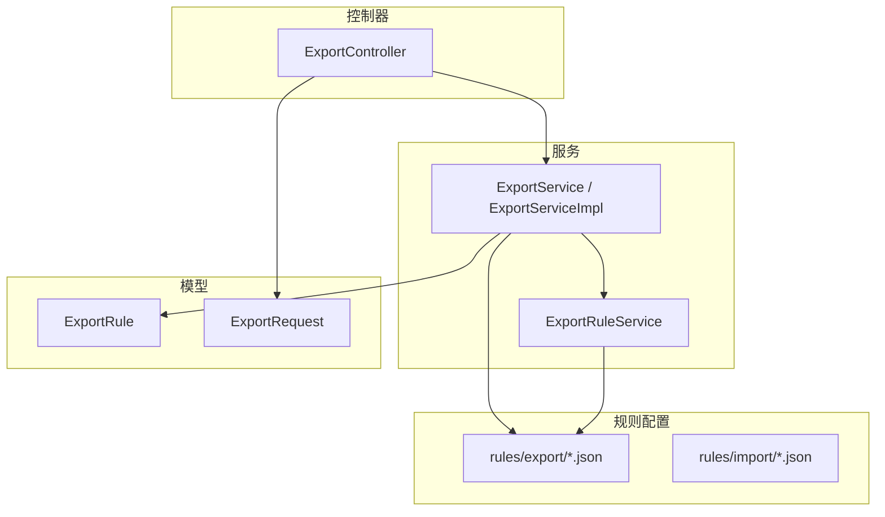
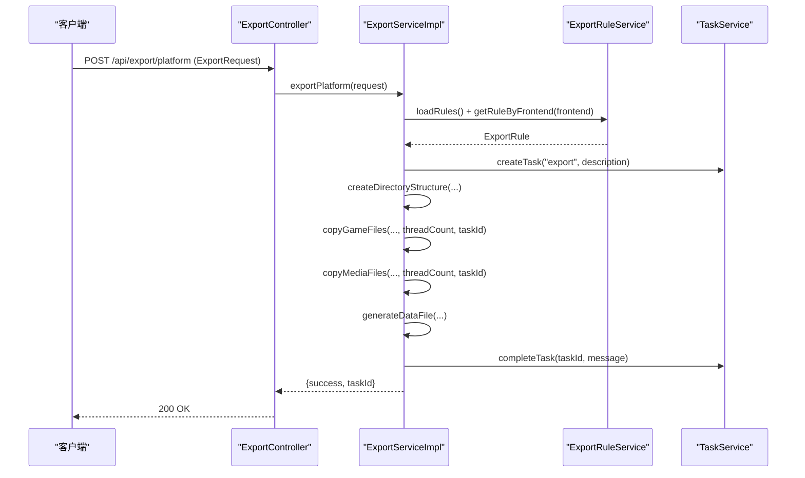
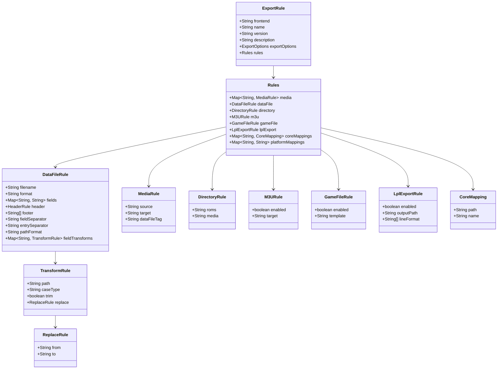
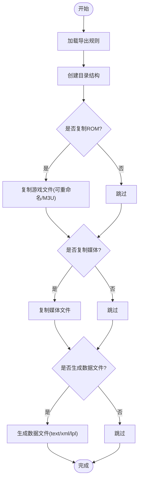
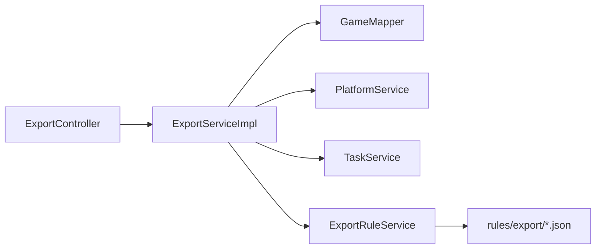

# 自定义开发指南

<cite>
**本文引用的文件**
- [ExportRule.java](file://src/main/java/com/gamelist/model/ExportRule.java)
- [ExportService.java](file://src/main/java/com/gamelist/service/ExportService.java)
- [ExportServiceImpl.java](file://src/main/java/com/gamelist/service/impl/ExportServiceImpl.java)
- [ExportController.java](file://src/main/java/com/gamelist/controller/ExportController.java)
- [ExportRequest.java](file://src/main/java/com/gamelist/model/ExportRequest.java)
- [ExportRuleService.java](file://src/main/java/com/gamelist/service/ExportRuleService.java)
- [emuelec.json](file://rules/export/emuelec.json)
- [webgamelistoper.json](file://rules/import/webgamelistoper.json)
- [import-templates-cn.md](file://docs/import-templates-cn.md)
- [export-functionality-cn.md](file://docs/export-functionality-cn.md)
</cite>

## 目录
1. [简介](#简介)
2. [项目结构](#项目结构)
3. [核心组件](#核心组件)
4. [架构总览](#架构总览)
5. [详细组件分析](#详细组件分析)
6. [依赖关系分析](#依赖关系分析)
7. [性能考虑](#性能考虑)
8. [故障排查指南](#故障排查指南)
9. [结论](#结论)
10. [附录：API与模板速查](#附录api与模板速查)

## 简介
本指南面向需要扩展系统“导入/导出”能力的开发者，提供从模板设计、字段映射、路径变量到实现自定义数据转换逻辑的完整流程。重点包括：
- 如何创建新的导入模板（JSON）和导出规则（JSON），以及语法规则与变量体系
- ExportRule 模型的结构说明与使用方法
- 如何实现自定义的数据转换逻辑（字段变换、路径处理、媒体映射等）
- API 接口使用示例（批量导入/导出）、错误处理机制与性能优化技巧
- 从模板设计到测试部署的全流程指导

## 项目结构
与导入/导出能力相关的代码与配置主要分布在以下位置：
- 模型层：ExportRule、ExportRequest 等数据结构定义
- 服务层：ExportService/ExportServiceImpl 负责执行导出任务；ExportRuleService 负责加载规则
- 控制器层：ExportController 暴露 REST 接口
- 规则配置：rules/export/*.json（导出规则）、rules/import/*.json（导入模板）
- 文档：docs/* 提供了详细的模板语法、变量与示例

图表来源
- [ExportController.java:14-59](file://src/main/java/com/gamelist/controller/ExportController.java#L14-L59)
- [ExportService.java:7-37](file://src/main/java/com/gamelist/service/ExportService.java#L7-L37)
- [ExportServiceImpl.java:31-181](file://src/main/java/com/gamelist/service/impl/ExportServiceImpl.java#L31-L181)
- [ExportRule.java:17-518](file://src/main/java/com/gamelist/model/ExportRule.java#L17-L518)
- [ExportRequest.java:5-69](file://src/main/java/com/gamelist/model/ExportRequest.java#L5-L69)
- [ExportRuleService.java:8-28](file://src/main/java/com/gamelist/service/ExportRuleService.java#L8-L28)

章节来源
- [ExportController.java:14-59](file://src/main/java/com/gamelist/controller/ExportController.java#L14-L59)
- [ExportService.java:7-37](file://src/main/java/com/gamelist/service/ExportService.java#L7-L37)
- [ExportServiceImpl.java:31-181](file://src/main/java/com/gamelist/service/impl/ExportServiceImpl.java#L31-L181)
- [ExportRule.java:17-518](file://src/main/java/com/gamelist/model/ExportRule.java#L17-L518)
- [ExportRequest.java:5-69](file://src/main/java/com/gamelist/model/ExportRequest.java#L5-L69)
- [ExportRuleService.java:8-28](file://src/main/java/com/gamelist/service/ExportRuleService.java#L8-L28)

## 核心组件
- ExportRule：描述导出规则的完整模型，包含媒体映射、数据文件生成、目录结构、M3U 处理、游戏文件重命名、LPL 导出、平台/核心映射等
- ExportService/ExportServiceImpl：导出业务编排，含任务创建、进度更新、并发复制、数据文件生成、异常处理
- ExportController：REST 接口，提供导出入口与规则列表查询
- ExportRequest：导出请求参数（平台ID、前端、输出路径、线程数、是否复制ROM/媒体/生成数据文件）
- ExportRuleService：规则加载与获取（按前端名称匹配）

章节来源
- [ExportRule.java:17-518](file://src/main/java/com/gamelist/model/ExportRule.java#L17-L518)
- [ExportService.java:7-37](file://src/main/java/com/gamelist/service/ExportService.java#L7-L37)
- [ExportServiceImpl.java:52-181](file://src/main/java/com/gamelist/service/impl/ExportServiceImpl.java#L52-L181)
- [ExportController.java:14-59](file://src/main/java/com/gamelist/controller/ExportController.java#L14-L59)
- [ExportRequest.java:5-69](file://src/main/java/com/gamelist/model/ExportRequest.java#L5-L69)
- [ExportRuleService.java:8-28](file://src/main/java/com/gamelist/service/ExportRuleService.java#L8-L28)

## 架构总览
导出流程由控制器接收请求，服务层根据前端名称加载对应规则，创建异步任务并分阶段执行：创建目录、复制游戏文件、复制媒体文件、生成数据文件。过程中通过任务服务上报进度与日志。

图表来源
- [ExportController.java:25-41](file://src/main/java/com/gamelist/controller/ExportController.java#L25-L41)
- [ExportServiceImpl.java:52-181](file://src/main/java/com/gamelist/service/impl/ExportServiceImpl.java#L52-L181)
- [ExportRuleService.java:8-28](file://src/main/java/com/gamelist/service/ExportRuleService.java#L8-L28)

## 详细组件分析

### ExportRule 模型与 JSON 规则
- 顶层字段：frontend、name、version、description、exportOptions、rules
- rules 子对象：
  - media：媒体类型映射（source/target/dataFileTag）
  - dataFile：数据文件生成（filename/format/header/footer/fields/pathFormat/fieldTransforms）
  - directory：roms/media 目录模板
  - m3u：M3U 播放列表处理开关与目标路径
  - gameFile：游戏文件重命名开关与模板
  - lplExport：Lakka LPL 播放列表导出配置
  - coreMappings/platformMappings：核心与平台映射
- HeaderRule 支持旧格式（字符串数组）与新格式（structure+fields）的双解析

图表来源
- [ExportRule.java:17-518](file://src/main/java/com/gamelist/model/ExportRule.java#L17-L518)

章节来源
- [ExportRule.java:17-518](file://src/main/java/com/gamelist/model/ExportRule.java#L17-L518)

### 导出服务与任务编排
- 入口：ExportController.exportPlatform 接收 ExportRequest
- 核心流程：
  - 校验平台与规则
  - 创建后台任务并上报进度
  - 创建目录结构（roms/media）
  - 复制游戏文件（支持重命名、M3U 处理）
  - 复制媒体文件（按规则 target 模板复制）
  - 生成数据文件（text/xml/lpl）
  - 完成任务或失败上报

图表来源
- [ExportServiceImpl.java:52-181](file://src/main/java/com/gamelist/service/impl/ExportServiceImpl.java#L52-L181)
- [ExportServiceImpl.java:183-581](file://src/main/java/com/gamelist/service/impl/ExportServiceImpl.java#L183-L581)

章节来源
- [ExportController.java:25-41](file://src/main/java/com/gamelist/controller/ExportController.java#L25-L41)
- [ExportServiceImpl.java:52-181](file://src/main/java/com/gamelist/service/impl/ExportServiceImpl.java#L52-L181)
- [ExportServiceImpl.java:183-581](file://src/main/java/com/gamelist/service/impl/ExportServiceImpl.java#L183-L581)

### 导入模板（JSON）与字段映射
- 模板文件位于 rules/import/*.json，以 webgamelistoper.json 为例
- 关键结构：
  - 基本信息：frontend/name/version/description/type/dataFile/delimiter
  - rules.header：表头配置（enabled/format/startMarker/endMarker/structure/fields）
  - rules.fieldMappings：字段映射（多字段回退、多值字段、transform 路径/大小写/替换）
  - rules.media：媒体文件路径规则（source/rules/transform）
  - rules.extensions/gameExtensions：扩展名集合
- 变量体系：{gameName}/{filename}/{filepath}/{platform}/{ext}/{outputPath}/{mediaPath}/{romsPath}

章节来源
- [webgamelistoper.json:1-334](file://rules/import/webgamelistoper.json#L1-L334)
- [import-templates-cn.md:1-800](file://docs/import-templates-cn.md#L1-L800)

### 导出规则（JSON）与数据文件生成
- 规则文件位于 rules/export/*.json，以 emuelec.json 为例
- 关键结构：
  - exportOptions：控制是否允许导出游戏文件/媒体/列表，是否显示警告
  - rules.media：媒体源字段与目标路径模板，可选 dataFileTag
  - rules.dataFile：文件名、格式（text/xml）、分隔符、header/footer、fields、pathFormat、fieldTransforms
  - rules.directory：roms/media 目录模板
  - rules.m3u：M3U 处理开关与目标路径
  - rules.gameFile：游戏文件重命名开关与模板
  - rules.lplExport/coreMappings/platformMappings：LPL 播放列表与核心/平台映射
- 变量体系与内置路径格式见文档

章节来源
- [emuelec.json:1-102](file://rules/export/emuelec.json#L1-L102)
- [export-functionality-cn.md:1-800](file://docs/export-functionality-cn.md#L1-L800)

### 自定义数据转换逻辑
- 字段转换：在 dataFile.fieldTransforms 中为特定字段配置 path/trim/case/replace
- 路径转换：通过 pathFormat 与 fieldTransforms.path 控制是否带 ./ 前缀
- 媒体映射：media.source 指向数据库字段，media.target 为目标路径模板，dataFileTag 用于写入数据文件引用
- 游戏文件重命名：gameFile.enabled + template，支持 {platform}/{filename}/{name}/{ext}
- M3U 处理：m3u.enabled + target，自动复制播放列表中引用的文件
- LPL 导出：lplExport.enabled + outputPath + lineFormat，结合 coreMappings/platformMappings 生成 Lakka 播放列表

章节来源
- [ExportRule.java:184-469](file://src/main/java/com/gamelist/model/ExportRule.java#L184-L469)
- [ExportServiceImpl.java:507-668](file://src/main/java/com/gamelist/service/impl/ExportServiceImpl.java#L507-L668)
- [export-functionality-cn.md:627-776](file://docs/export-functionality-cn.md#L627-L776)

## 依赖关系分析
- ExportController 依赖 ExportService 与 ExportRuleService
- ExportServiceImpl 依赖 GameMapper、PlatformService、TaskService 与 ExportRuleService
- ExportRuleService 负责加载 rules/export/*.json 并缓存
- ExportRule 作为规则载体贯穿整个导出流程

图表来源
- [ExportController.java:14-59](file://src/main/java/com/gamelist/controller/ExportController.java#L14-L59)
- [ExportServiceImpl.java:31-46](file://src/main/java/com/gamelist/service/impl/ExportServiceImpl.java#L31-L46)
- [ExportRuleService.java:8-28](file://src/main/java/com/gamelist/service/ExportRuleService.java#L8-L28)

章节来源
- [ExportController.java:14-59](file://src/main/java/com/gamelist/controller/ExportController.java#L14-L59)
- [ExportServiceImpl.java:31-46](file://src/main/java/com/gamelist/service/impl/ExportServiceImpl.java#L31-L46)
- [ExportRuleService.java:8-28](file://src/main/java/com/gamelist/service/ExportRuleService.java#L8-L28)

## 性能考虑
- 并发复制：copyGameFiles/copyMediaFiles 使用固定大小线程池，默认基于 CPU 核心数设置，最大限制避免过度并行
- 任务粒度：每个游戏独立提交任务，减少阻塞
- 预检查：提前判断是否启用重命名/M3U 处理，减少循环内分支开销
- 线程安全：媒体复制时为每个任务构建独立的变量映射，避免共享状态竞争
- I/O 优化：确保目标目录预先创建，减少重复 mkdir 调用

章节来源
- [ExportServiceImpl.java:47-50](file://src/main/java/com/gamelist/service/impl/ExportServiceImpl.java#L47-L50)
- [ExportServiceImpl.java:231-359](file://src/main/java/com/gamelist/service/impl/ExportServiceImpl.java#L231-L359)
- [ExportServiceImpl.java:408-501](file://src/main/java/com/gamelist/service/impl/ExportServiceImpl.java#L408-L501)

## 故障排查指南
- 常见错误定位：
  - 未找到平台：检查 platformId 是否存在
  - 未找到导出规则：检查 frontend 是否与规则文件 frontend 字段一致
  - 源文件不存在：检查游戏/媒体路径是否正确
  - 不支持的数据文件格式：检查 dataFile.format
- 日志与任务：
  - 查看任务进度与日志，定位具体失败步骤
  - 关注 WARN/ERROR 日志中的路径与文件名信息
- 规则问题：
  - 确认 rules.media 的 source 字段与数据库字段一致
  - 确认 dataFile.fields 映射正确
  - 检查 pathFormat 与 fieldTransforms 的路径前缀是否符合目标前端要求

章节来源
- [ExportServiceImpl.java:76-109](file://src/main/java/com/gamelist/service/impl/ExportServiceImpl.java#L76-L109)
- [ExportServiceImpl.java:162-179](file://src/main/java/com/gamelist/service/impl/ExportServiceImpl.java#L162-L179)
- [ExportController.java:28-41](file://src/main/java/com/gamelist/controller/ExportController.java#L28-L41)

## 结论
通过 ExportRule 模型与 JSON 规则，系统实现了高度可配置的导入/导出能力。开发者只需新增或修改规则文件，即可适配不同前端的数据结构与路径约定。配合服务层的并发与任务管理，可在保证稳定性的同时提升大批量数据处理效率。建议遵循本文档的模板设计与字段映射规范，充分利用变量体系与转换能力，快速落地新需求。

## 附录：API与模板速查

### API 接口
- POST /api/export/platform
  - 请求体：ExportRequest（platformId/frontend/outputPath/copyRoms/copyMedia/generateDataFile/threadCount）
  - 响应：包含 success/message/taskId 或错误信息
- GET /api/export/rules
  - 返回可用导出规则列表（已加载）

章节来源
- [ExportController.java:25-59](file://src/main/java/com/gamelist/controller/ExportController.java#L25-L59)
- [ExportRequest.java:5-69](file://src/main/java/com/gamelist/model/ExportRequest.java#L5-L69)

### 模板与规则要点
- 导入模板（rules/import/*.json）
  - 关键字段：type/dataFile/delimiter、rules.header、rules.fieldMappings、rules.media、rules.extensions/gameExtensions
  - 变量：{gameName}/{filename}/{filepath}/{platform}/{ext}/{outputPath}/{mediaPath}/{romsPath}
- 导出规则（rules/export/*.json）
  - 关键字段：exportOptions、rules.media、rules.dataFile、rules.directory、rules.m3u、rules.gameFile、rules.lplExport
  - 变量：同导入模板，另含 {env.*}、{platform.*}、{game.*} 等
  - 路径格式：pathFormat 与 fieldTransforms.path 控制 ./ 前缀

章节来源
- [webgamelistoper.json:1-334](file://rules/import/webgamelistoper.json#L1-L334)
- [emuelec.json:1-102](file://rules/export/emuelec.json#L1-L102)
- [import-templates-cn.md:1-800](file://docs/import-templates-cn.md#L1-L800)
- [export-functionality-cn.md:1-800](file://docs/export-functionality-cn.md#L1-L800)