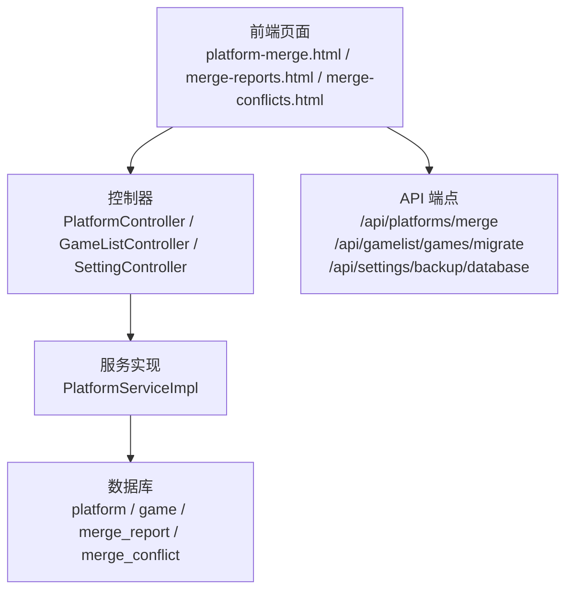
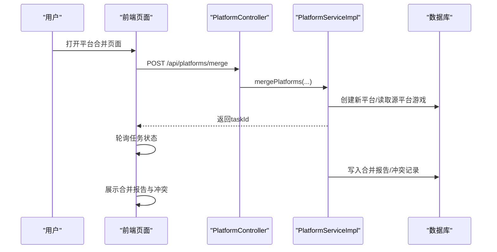
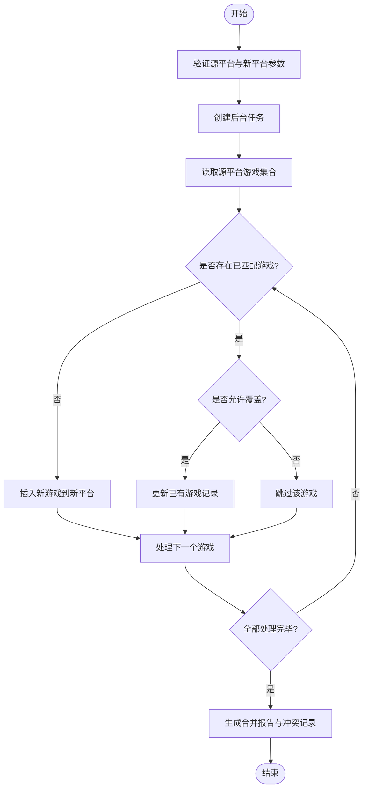
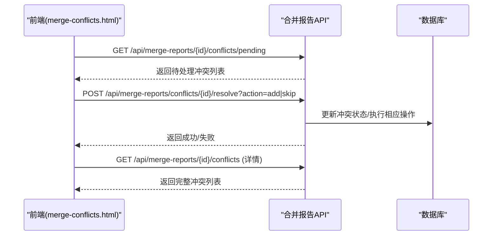
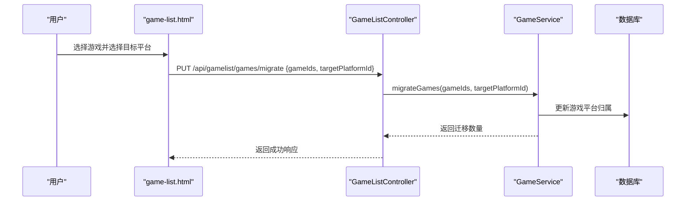
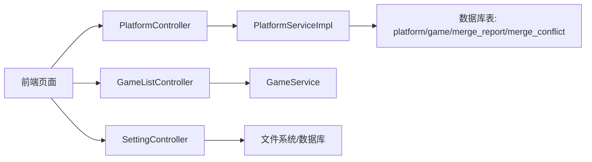

# 平台合并与数据迁移

<cite>
**本文引用的文件**
- [PlatformController.java](file://src/main/java/com/gamelist/controller/PlatformController.java)
- [PlatformServiceImpl.java](file://src/main/java/com/gamelist/service/impl/PlatformServiceImpl.java)
- [GameListController.java](file://src/main/java/com/gamelist/controller/GameListController.java)
- [SettingController.java](file://src/main/java/com/gamelist/controller/SettingController.java)
- [init.sql](file://src/main/resources/sql/init.sql)
- [V1.0.3__baseline_migration.sql](file://src/main/resources/db/migration/V1.0.3__baseline_migration.sql)
- [platform-merge.html](file://src/main/resources/static/platform-merge.html)
- [merge-reports.html](file://src/main/resources/static/merge-reports.html)
- [merge-conflicts.html](file://src/main/resources/static/merge-conflicts.html)
- [merge-report-details.html](file://src/main/resources/static/merge-report-details.html)
- [game-list.html](file://src/main/resources/static/game-list.html)
- [system-settings.html](file://src/main/resources/static/system-settings.html)
- [MergeOperation.java](file://src/main/java/com/gamelist/model/MergeOperation.java)
- [PlatformStatistics.java](file://src/main/java/com/gamelist/model/PlatformStatistics.java)
</cite>

## 目录
1. [简介](#简介)
2. [项目结构](#项目结构)
3. [核心组件](#核心组件)
4. [架构总览](#架构总览)
5. [详细组件分析](#详细组件分析)
6. [依赖关系分析](#依赖关系分析)
7. [性能考虑](#性能考虑)
8. [故障排查指南](#故障排查指南)
9. [结论](#结论)
10. [附录](#附录)

## 简介
本文件面向“平台合并与数据迁移”功能，系统性说明多平台数据合并流程（平台识别、冲突检测、数据整合）、平台间数据迁移操作方法与注意事项、重复数据处理策略（去重规则、优先级设置、手动干预）、平台统计信息的查看与分析能力，以及大规模迁移的最佳实践、性能优化建议和数据备份恢复机制。

## 项目结构
- 前端页面：提供平台合并入口、合并报告管理、冲突处理界面、游戏列表中的批量迁转操作、系统设置中的数据库备份与恢复。
- 后端控制器：暴露平台合并、游戏迁移、统计查询等接口。
- 服务实现：封装合并逻辑、冲突检测、任务进度更新、异步执行。
- 数据模型与迁移脚本：定义平台、游戏、合并报告、合并冲突等表结构及版本化迁移。

图表来源
- [PlatformController.java:109-141](file://src/main/java/com/gamelist/controller/PlatformController.java#L109-L141)
- [GameListController.java:393-413](file://src/main/java/com/gamelist/controller/GameListController.java#L393-L413)
- [SettingController.java:311-339](file://src/main/java/com/gamelist/controller/SettingController.java#L311-L339)
- [PlatformServiceImpl.java:634-732](file://src/main/java/com/gamelist/service/impl/PlatformServiceImpl.java#L634-L732)

章节来源
- [PlatformController.java:109-141](file://src/main/java/com/gamelist/controller/PlatformController.java#L109-L141)
- [GameListController.java:393-413](file://src/main/java/com/gamelist/controller/GameListController.java#L393-L413)
- [SettingController.java:311-339](file://src/main/java/com/gamelist/controller/SettingController.java#L311-L339)
- [PlatformServiceImpl.java:634-732](file://src/main/java/com/gamelist/service/impl/PlatformServiceImpl.java#L634-L732)

## 核心组件
- 平台合并入口与任务编排：通过控制器接收合并请求，创建后台任务并异步执行合并。
- 合并算法与冲突检测：基于唯一标识（gameId、crc32）、文件名精确匹配、名称不区分大小写匹配进行去重与冲突判定。
- 合并报告与冲突处理：持久化合并报告与冲突记录，支持前端查看与手动解决（添加或跳过）。
- 游戏迁移：支持在单个平台内将选中的游戏批量迁移到目标平台。
- 统计信息：提供平台维度的统计指标（总游戏数、完全刮削、部分刮削、未完成刮削、缺失游戏）。
- 备份与恢复：提供数据库备份与恢复能力，保障数据安全。

章节来源
- [PlatformController.java:109-141](file://src/main/java/com/gamelist/controller/PlatformController.java#L109-L141)
- [PlatformServiceImpl.java:634-732](file://src/main/java/com/gamelist/service/impl/PlatformServiceImpl.java#L634-L732)
- [PlatformServiceImpl.java:782-852](file://src/main/java/com/gamelist/service/impl/PlatformServiceImpl.java#L782-L852)
- [PlatformServiceImpl.java:854-893](file://src/main/java/com/gamelist/service/impl/PlatformServiceImpl.java#L854-L893)
- [GameListController.java:393-413](file://src/main/java/com/gamelist/controller/GameListController.java#L393-L413)
- [PlatformStatistics.java:1-55](file://src/main/java/com/gamelist/model/PlatformStatistics.java#L1-L55)
- [SettingController.java:311-339](file://src/main/java/com/gamelist/controller/SettingController.java#L311-L339)

## 架构总览
平台合并采用“前端触发 → 控制器校验 → 服务层异步合并 → 数据库持久化 → 前端轮询任务状态与报告”的闭环流程；数据迁移则通过游戏列表页选择目标平台后调用迁移接口完成。

图表来源
- [PlatformController.java:109-141](file://src/main/java/com/gamelist/controller/PlatformController.java#L109-L141)
- [PlatformServiceImpl.java:634-732](file://src/main/java/com/gamelist/service/impl/PlatformServiceImpl.java#L634-L732)
- [init.sql:203-233](file://src/main/resources/sql/init.sql#L203-L233)

## 详细组件分析

### 平台合并流程
- 入口与参数：前端选择多个源平台、输入新平台名称与可选文件夹路径，提交合并请求。
- 任务创建：后端创建后台任务并异步执行合并，返回任务ID供前端轮询。
- 数据整合：从源平台读取游戏，按去重规则判断是否新增或覆盖，写入新平台。
- 冲突检测：当检测到同名或同文件冲突时，记录到合并冲突表，等待人工处理。
- 结果反馈：完成后更新任务状态，前端可进入合并报告与冲突处理页面。

图表来源
- [PlatformServiceImpl.java:680-732](file://src/main/java/com/gamelist/service/impl/PlatformServiceImpl.java#L680-L732)
- [PlatformServiceImpl.java:782-852](file://src/main/java/com/gamelist/service/impl/PlatformServiceImpl.java#L782-L852)
- [PlatformServiceImpl.java:854-893](file://src/main/java/com/gamelist/service/impl/PlatformServiceImpl.java#L854-L893)
- [init.sql:203-233](file://src/main/resources/sql/init.sql#L203-L233)

章节来源
- [platform-merge.html:588-662](file://src/main/resources/static/platform-merge.html#L588-L662)
- [PlatformController.java:109-141](file://src/main/java/com/gamelist/controller/PlatformController.java#L109-L141)
- [PlatformServiceImpl.java:680-732](file://src/main/java/com/gamelist/service/impl/PlatformServiceImpl.java#L680-L732)
- [PlatformServiceImpl.java:782-852](file://src/main/java/com/gamelist/service/impl/PlatformServiceImpl.java#L782-L852)
- [PlatformServiceImpl.java:854-893](file://src/main/java/com/gamelist/service/impl/PlatformServiceImpl.java#L854-L893)
- [init.sql:203-233](file://src/main/resources/sql/init.sql#L203-L233)

### 冲突检测与手动干预
- 冲突类型：名称冲突、文件冲突、两者皆冲突。
- 前端展示：合并报告详情页列出冲突项，支持“添加到平台”或“跳过冲突”。
- 后端处理：根据用户选择更新冲突状态，必要时执行新增或跳过逻辑。

图表来源
- [merge-conflicts.html:398-537](file://src/main/resources/static/merge-conflicts.html#L398-L537)
- [merge-report-details.html:517-564](file://src/main/resources/static/merge-report-details.html#L517-L564)
- [init.sql:218-233](file://src/main/resources/sql/init.sql#L218-L233)

章节来源
- [merge-conflicts.html:398-537](file://src/main/resources/static/merge-conflicts.html#L398-L537)
- [merge-report-details.html:517-564](file://src/main/resources/static/merge-report-details.html#L517-L564)
- [init.sql:218-233](file://src/main/resources/sql/init.sql#L218-L233)

### 平台间数据迁移
- 操作方式：在游戏列表中选择若干游戏，指定目标平台，提交迁移请求。
- 后端处理：校验目标平台有效性，执行迁移并返回迁移数量。
- 注意事项：迁移会改变游戏的平台归属，需确保目标平台配置正确。

图表来源
- [game-list.html:2419-2484](file://src/main/resources/static/game-list.html#L2419-L2484)
- [GameListController.java:393-413](file://src/main/java/com/gamelist/controller/GameListController.java#L393-L413)

章节来源
- [game-list.html:2419-2484](file://src/main/resources/static/game-list.html#L2419-L2484)
- [GameListController.java:393-413](file://src/main/java/com/gamelist/controller/GameListController.java#L393-L413)

### 重复数据处理策略
- 去重规则优先级：
  1) gameId 匹配
  2) crc32 匹配
  3) 文件名精确匹配
  4) 游戏名称不区分大小写匹配
- 优先级设置：当前实现为固定优先级顺序，可通过扩展匹配策略或配置开关调整。
- 手动干预：通过合并冲突页面选择“添加”或“跳过”，对特定冲突进行人工裁决。

章节来源
- [PlatformServiceImpl.java:854-893](file://src/main/java/com/gamelist/service/impl/PlatformServiceImpl.java#L854-L893)
- [merge-conflicts.html:498-530](file://src/main/resources/static/merge-conflicts.html#L498-L530)

### 平台统计信息查看与分析
- 统计维度：平台ID、平台名称、总游戏数、完全刮削、部分刮削、未完成刮削、缺失游戏。
- 展示位置：平台管理页与平台详情页均提供统计卡片。
- 数据来源：服务层聚合计算后返回给前端渲染。

章节来源
- [PlatformStatistics.java:1-55](file://src/main/java/com/gamelist/model/PlatformStatistics.java#L1-L55)
- [platform-management.html:1250-1276](file://src/main/resources/static/platform-management.html#L1250-L1276)
- [platform-details.html:719-741](file://src/main/resources/static/platform-details.html#L719-L741)

### 数据备份与恢复机制
- 备份：系统设置页提供“备份数据库”按钮，将数据库导出至指定目录。
- 恢复：列出备份文件，选择SQL备份文件执行恢复，恢复前会删除相关表以避免外键冲突。
- 安全建议：在执行合并或迁移前建议先备份数据库，以便回滚。

章节来源
- [system-settings.html:690-834](file://src/main/resources/static/system-settings.html#L690-L834)
- [SettingController.java:311-339](file://src/main/java/com/gamelist/controller/SettingController.java#L311-L339)
- [SettingController.java:373-403](file://src/main/java/com/gamelist/controller/SettingController.java#L373-L403)

## 依赖关系分析
- 控制器依赖服务实现，服务实现依赖数据访问层与任务服务。
- 前端页面通过REST API与后端交互，使用任务ID轮询进度。
- 数据库表结构由迁移脚本与初始化脚本维护，合并报告与冲突表支撑可视化处理。

图表来源
- [PlatformController.java:109-141](file://src/main/java/com/gamelist/controller/PlatformController.java#L109-L141)
- [GameListController.java:393-413](file://src/main/java/com/gamelist/controller/GameListController.java#L393-L413)
- [SettingController.java:311-339](file://src/main/java/com/gamelist/controller/SettingController.java#L311-L339)
- [PlatformServiceImpl.java:634-732](file://src/main/java/com/gamelist/service/impl/PlatformServiceImpl.java#L634-L732)
- [init.sql:203-233](file://src/main/resources/sql/init.sql#L203-L233)

章节来源
- [PlatformController.java:109-141](file://src/main/java/com/gamelist/controller/PlatformController.java#L109-L141)
- [GameListController.java:393-413](file://src/main/java/com/gamelist/controller/GameListController.java#L393-L413)
- [SettingController.java:311-339](file://src/main/java/com/gamelist/controller/SettingController.java#L311-L339)
- [PlatformServiceImpl.java:634-732](file://src/main/java/com/gamelist/service/impl/PlatformServiceImpl.java#L634-L732)
- [init.sql:203-233](file://src/main/resources/sql/init.sql#L203-L233)

## 性能考虑
- 异步执行：合并任务使用异步方法执行，避免阻塞主线程，提升用户体验。
- 进度更新：在服务中持续更新任务进度与日志，便于前端实时反馈。
- 批量处理：在临时子集等场景中采用分批插入（如每批1000条），减少单次事务压力。
- 去重优化：优先使用唯一标识（gameId、crc32）进行匹配，降低全名匹配开销。
- 建议：
  - 大库合并时拆分批次，控制单次处理规模。
  - 合理设置覆盖策略，避免不必要的更新。
  - 监控任务队列与数据库连接池，防止资源耗尽。

章节来源
- [PlatformServiceImpl.java:734-777](file://src/main/java/com/gamelist/service/impl/PlatformServiceImpl.java#L734-L777)
- [PlatformServiceImpl.java:782-852](file://src/main/java/com/gamelist/service/impl/PlatformServiceImpl.java#L782-L852)
- [PlatformServiceImpl.java:146-159](file://src/main/java/com/gamelist/service/impl/PlatformServiceImpl.java#L146-L159)

## 故障排查指南
- 合并失败：检查源平台是否存在、新平台参数是否合法；查看任务日志与错误消息。
- 冲突未解决：确认冲突类型与状态，必要时重新加载冲突列表并再次处理。
- 迁移失败：校验目标平台ID有效性；检查游戏是否已被迁移或存在权限问题。
- 备份/恢复异常：确认备份文件路径与权限；恢复前确保有足够磁盘空间与数据库权限。

章节来源
- [PlatformController.java:109-141](file://src/main/java/com/gamelist/controller/PlatformController.java#L109-L141)
- [GameListController.java:393-413](file://src/main/java/com/gamelist/controller/GameListController.java#L393-L413)
- [SettingController.java:311-339](file://src/main/java/com/gamelist/controller/SettingController.java#L311-L339)
- [merge-conflicts.html:498-537](file://src/main/resources/static/merge-conflicts.html#L498-L537)

## 结论
平台合并与数据迁移功能通过清晰的流程设计、严格的去重策略、可视化的冲突处理与完善的备份恢复机制，保障了多平台数据整合的安全性与可操作性。建议在大规模迁移中结合异步任务、分批处理与严格备份策略，以获得稳定高效的体验。

## 附录
- 数据模型概览（平台、游戏、合并报告、合并冲突）
- 关键API参考（平台合并、游戏迁移、备份恢复）
- 前端页面导航（平台合并、合并报告、冲突处理、系统设置）

章节来源
- [init.sql:203-233](file://src/main/resources/sql/init.sql#L203-L233)
- [V1.0.3__baseline_migration.sql:5-82](file://src/main/resources/db/migration/V1.0.3__baseline_migration.sql#L5-L82)
- [PlatformController.java:109-141](file://src/main/java/com/gamelist/controller/PlatformController.java#L109-L141)
- [GameListController.java:393-413](file://src/main/java/com/gamelist/controller/GameListController.java#L393-L413)
- [SettingController.java:311-339](file://src/main/java/com/gamelist/controller/SettingController.java#L311-L339)