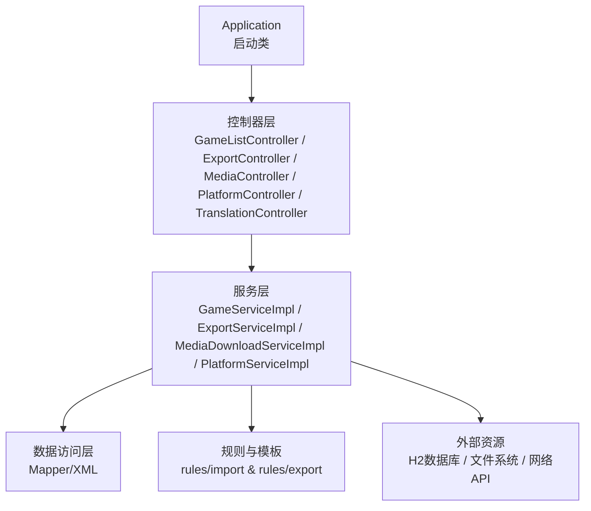
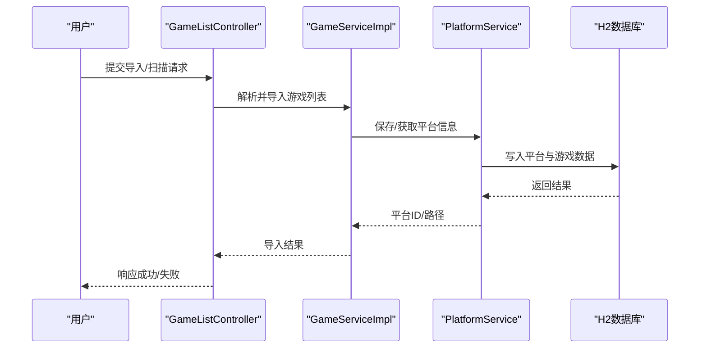
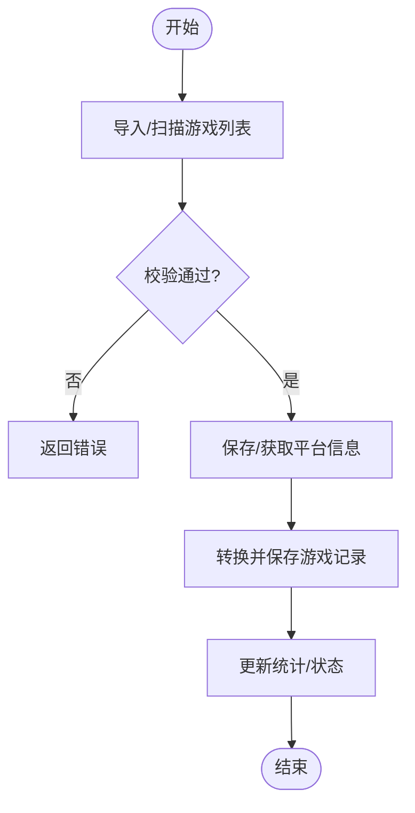
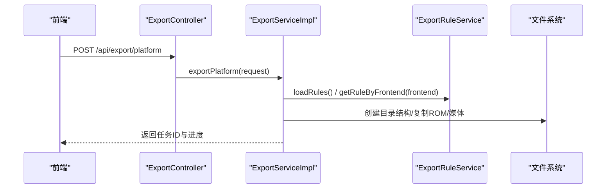
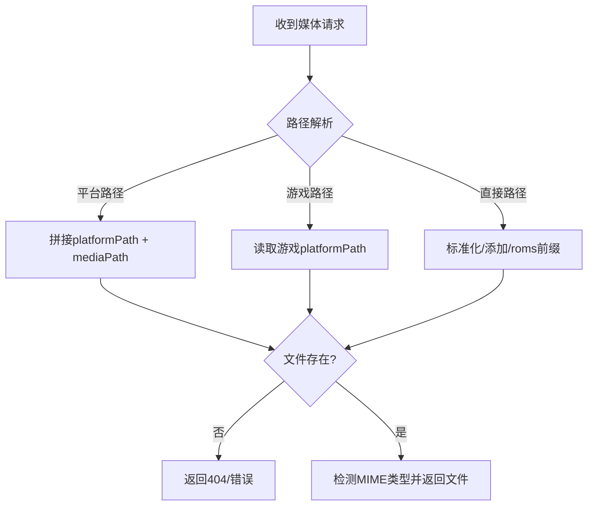
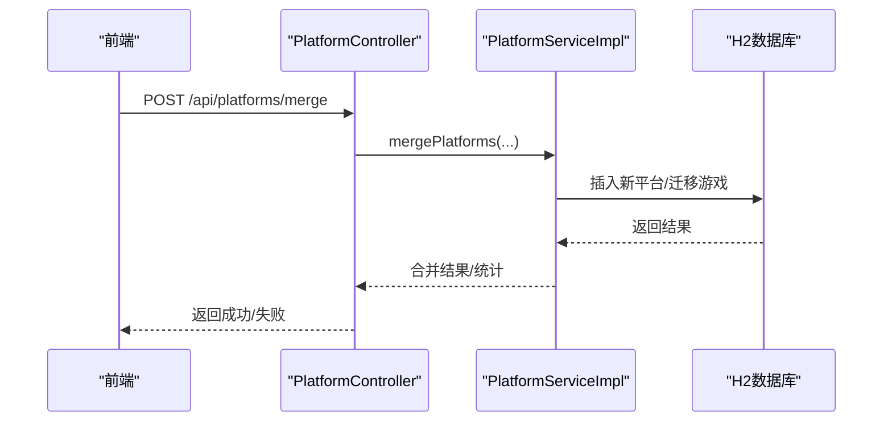
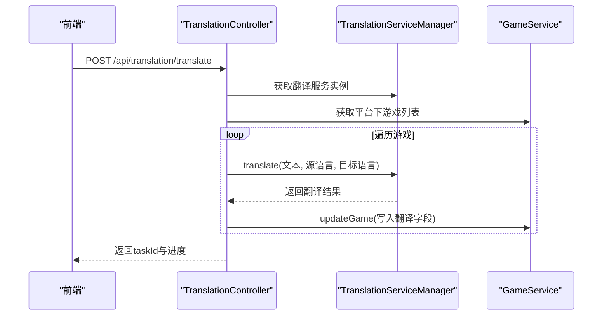
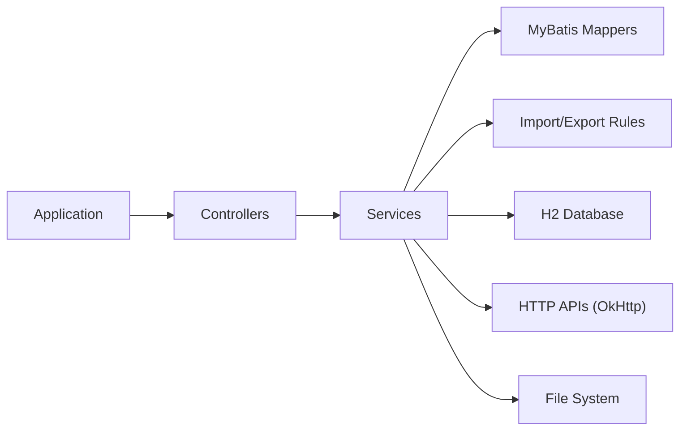

# 核心特性

<cite>
**本文引用的文件**
- [README.md](file://README.md)
- [Application.java](file://src/main/java/com/gamelist/Application.java)
- [pom.xml](file://pom.xml)
- [application.properties](file://src/main/resources/application.properties)
- [GameListController.java](file://src/main/java/com/gamelist/controller/GameListController.java)
- [ExportController.java](file://src/main/java/com/gamelist/controller/ExportController.java)
- [MediaController.java](file://src/main/java/com/gamelist/controller/MediaController.java)
- [PlatformController.java](file://src/main/java/com/gamelist/controller/PlatformController.java)
- [TranslationController.java](file://src/main/java/com/gamelist/controller/TranslationController.java)
- [GameServiceImpl.java](file://src/main/java/com/gamelist/service/impl/GameServiceImpl.java)
- [ExportServiceImpl.java](file://src/main/java/com/gamelist/service/impl/ExportServiceImpl.java)
- [MediaDownloadServiceImpl.java](file://src/main/java/com/gamelist/service/impl/MediaDownloadServiceImpl.java)
- [PlatformServiceImpl.java](file://src/main/java/com/gamelist/service/impl/PlatformServiceImpl.java)
- [Game.java](file://src/main/java/com/gamelist/model/Game.java)
- [Platform.java](file://src/main/java/com/gamelist/model/Platform.java)
</cite>

## 目录
1. [简介](#简介)
2. [项目结构](#项目结构)
3. [核心组件](#核心组件)
4. [架构总览](#架构总览)
5. [详细组件分析](#详细组件分析)
6. [依赖关系分析](#依赖关系分析)
7. [性能考虑](#性能考虑)
8. [故障排查指南](#故障排查指南)
9. [结论](#结论)
10. [附录](#附录)

## 简介
本文件面向WebGameListOper项目的核心特性，聚焦以下能力：游戏列表管理（增删改查）、多格式导入导出（Pegasus、RetroBat、EmuELEC等前端模板）、媒体文件管理（图片/视频缓存与下载）、平台合并与数据迁移、多语言国际化支持。文档从功能描述、使用场景、配置选项、操作步骤、最佳实践、关联协作、性能与限制等方面展开，帮助读者高效理解并正确使用系统。

## 项目结构
- 应用入口与装配
  - 启动类启用异步任务与MyBatis Mapper扫描，提供Spring Boot Web服务基础能力。
- 控制器层
  - 暴露REST API：游戏列表、平台、导出、媒体、翻译、任务等。
- 服务层
  - 实现业务逻辑：导入/扫描、导出、媒体下载、平台合并、翻译任务编排等。
- 模型与规则
  - 数据模型：Game、Platform等；规则文件：rules/import、rules/export下的JSON模板。
- 资源与配置
  - application.properties定义端口、数据库、静态资源、上传目录、规则路径等。

图表来源
- [Application.java:8-14](file://src/main/java/com/gamelist/Application.java#L8-L14)
- [GameListController.java:39-50](file://src/main/java/com/gamelist/controller/GameListController.java#L39-L50)
- [ExportController.java:14-24](file://src/main/java/com/gamelist/controller/ExportController.java#L14-L24)
- [MediaController.java:28-31](file://src/main/java/com/gamelist/controller/MediaController.java#L28-L31)
- [PlatformController.java:22-28](file://src/main/java/com/gamelist/controller/PlatformController.java#L22-L28)
- [TranslationController.java:30-48](file://src/main/java/com/gamelist/controller/TranslationController.java#L30-L48)

章节来源
- [Application.java:8-14](file://src/main/java/com/gamelist/Application.java#L8-L14)
- [application.properties:1-86](file://src/main/resources/application.properties#L1-L86)

## 核心组件
- 游戏列表管理
  - 提供导入XML/Pegasus元数据、扫描导入、分页查询、筛选、批量更新/删除、迁移到目标平台、合盘等操作。
- 多格式导入导出
  - 导入：支持多种前端模板的映射规则（rules/import/*.json）。
  - 导出：按前端模板规则生成目标结构（rules/export/*.json），支持复制ROM/媒体、生成数据文件。
- 媒体文件管理
  - 本地缓存与预览、路径解析与标准化、批量下载与限流控制、失败重试与停止策略。
- 平台合并与数据迁移
  - 合并多个平台为统一平台，迁移游戏归属，统计与刮削集成。
- 多语言国际化
  - 基于翻译服务的批量/单条翻译，进度跟踪与错误子集分离。

章节来源
- [GameListController.java:51-550](file://src/main/java/com/gamelist/controller/GameListController.java#L51-L550)
- [ExportController.java:25-58](file://src/main/java/com/gamelist/controller/ExportController.java#L25-L58)
- [MediaController.java:34-269](file://src/main/java/com/gamelist/controller/MediaController.java#L34-L269)
- [PlatformController.java:29-172](file://src/main/java/com/gamelist/controller/PlatformController.java#L29-L172)
- [TranslationController.java:56-642](file://src/main/java/com/gamelist/controller/TranslationController.java#L56-L642)

## 架构总览
系统采用分层架构：控制器接收请求，调用服务完成业务处理，服务通过Mapper访问H2数据库，结合规则文件进行导入/导出转换，必要时调用网络API或文件系统完成媒体下载与缓存。

图表来源
- [GameListController.java:51-94](file://src/main/java/com/gamelist/controller/GameListController.java#L51-L94)
- [GameServiceImpl.java:116-200](file://src/main/java/com/gamelist/service/impl/GameServiceImpl.java#L116-L200)
- [PlatformServiceImpl.java:55-61](file://src/main/java/com/gamelist/service/impl/PlatformServiceImpl.java#L55-L61)
- [application.properties:15-27](file://src/main/resources/application.properties#L15-L27)

## 详细组件分析

### 游戏列表管理（增删改查、导入/扫描、迁移）
- 功能描述
  - 支持XML与Pegasus元数据导入、路径扫描导入、分页与多维筛选、批量更新/删除、迁移至目标平台、合盘操作。
- 使用场景
  - 从不同前端导出数据后集中管理；跨平台整理与归并；批量修正字段或状态。
- 配置选项
  - 导入模板路径：app.import.templates.path（默认./data/rules/import）。
  - 输出/输入目录：app.output.directory、app.input.directory。
- 操作步骤
  - 导入XML：POST /api/gamelist/import，上传gamelist.xml。
  - 扫描导入：POST /api/gamelist/scan，传入路径与深度。
  - Pegasus扫描：POST /api/gamelist/scan-pegasus。
  - 查询/筛选：GET /api/gamelist/games 或 /platforms/{id}/games，支持分页与过滤参数。
  - 批量更新/删除：PUT /api/gamelist/games/batch，DELETE /api/gamelist/games/batch-delete。
  - 迁移：PUT /api/gamelist/games/migrate，指定目标平台ID。
  - 合盘：POST /api/gamelist/merge-discs。
- 最佳实践
  - 大集合建议分批导入与筛选，避免一次性加载过多数据。
  - 迁移前备份数据库或导出当前平台数据。
- 关联协作
  - 与平台管理、导出规则、媒体下载联动，确保路径与媒体一致性。

图表来源
- [GameListController.java:51-114](file://src/main/java/com/gamelist/controller/GameListController.java#L51-L114)
- [GameServiceImpl.java:116-200](file://src/main/java/com/gamelist/service/impl/GameServiceImpl.java#L116-L200)

章节来源
- [GameListController.java:51-550](file://src/main/java/com/gamelist/controller/GameListController.java#L51-L550)
- [GameServiceImpl.java:116-200](file://src/main/java/com/gamelist/service/impl/GameServiceImpl.java#L116-L200)

### 多格式导入导出（Pegasus、RetroBat、EmuELEC等）
- 功能描述
  - 导入：依据rules/import/*.json将不同前端的数据映射到内部模型。
  - 导出：依据rules/export/*.json将内部数据转换为目标前端所需结构与字段。
- 使用场景
  - 在不同前端之间迁移游戏库；为特定前端定制输出布局与字段。
- 配置选项
  - 规则目录：app.rules.directory、app.export.rules.path、app.import.templates.path。
  - 导出线程数：ExportRequest.threadCount（默认根据CPU核心计算，上限受控）。
- 操作步骤
  - 获取导出规则：GET /api/export/rules。
  - 导出平台：POST /api/export/platform，传入平台ID、前端类型、输出路径、是否复制ROM/媒体、是否生成数据文件。
- 最佳实践
  - 首次导出建议开启“仅生成数据文件”验证字段映射；确认无误后再复制ROM/媒体。
  - 合理设置线程数，避免磁盘IO瓶颈。
- 关联协作
  - 与平台管理、媒体下载配合，确保导出路径与媒体引用一致。

图表来源
- [ExportController.java:25-58](file://src/main/java/com/gamelist/controller/ExportController.java#L25-L58)
- [ExportServiceImpl.java:52-180](file://src/main/java/com/gamelist/service/impl/ExportServiceImpl.java#L52-L180)
- [application.properties:76-86](file://src/main/resources/application.properties#L76-L86)

章节来源
- [ExportController.java:25-58](file://src/main/java/com/gamelist/controller/ExportController.java#L25-L58)
- [ExportServiceImpl.java:52-200](file://src/main/java/com/gamelist/service/impl/ExportServiceImpl.java#L52-L200)
- [application.properties:76-86](file://src/main/resources/application.properties#L76-L86)

### 媒体文件管理（缓存、预览、下载）
- 功能描述
  - 本地缓存：将源媒体复制到media目录，生成稳定URL供前端预览。
  - 预览：根据平台/游戏路径解析真实文件并返回对应MIME类型。
  - 下载：后台任务多线程下载，具备限流、暂停/停止、404快速停止策略。
- 使用场景
  - 统一管理封面、截图、视频；在离线环境预取媒体；修复缺失媒体。
- 配置选项
  - 静态资源位置：spring.web.resources.static-locations包含classpath:/static/, file:./, file:./media/。
  - 上传临时目录：spring.servlet.multipart.location=./data。
- 操作步骤
  - 缓存媒体：POST /api/media/cache?localPath=...
  - 预览媒体：GET /api/media/view?localPath=...&platformId=...&gameId=...
  - 清空缓存：DELETE /api/media/clear
  - 批量下载：通过媒体下载任务接口（由服务层管理任务队列与线程池）。
- 最佳实践
  - 优先使用平台folderPath构建绝对路径，减少路径歧义。
  - 下载任务建议设置合理最大线程数，并结合限流避免被封禁。
- 关联协作
  - 与导出流程协同，确保导出时复制媒体；与翻译流程协同，保证媒体路径一致性。

图表来源
- [MediaController.java:96-243](file://src/main/java/com/gamelist/controller/MediaController.java#L96-L243)
- [application.properties:10-13](file://src/main/resources/application.properties#L10-L13)

章节来源
- [MediaController.java:34-269](file://src/main/java/com/gamelist/controller/MediaController.java#L34-L269)
- [MediaDownloadServiceImpl.java:64-200](file://src/main/java/com/gamelist/service/impl/MediaDownloadServiceImpl.java#L64-L200)
- [application.properties:10-13](file://src/main/resources/application.properties#L10-L13)

### 平台合并与数据迁移
- 功能描述
  - 合并多个平台为一个新平台，可选择覆盖策略；迁移游戏归属到新平台；提供统计与刮削入口。
- 使用场景
  - 整合分散的平台库；统一命名与排序；清理重复条目。
- 配置选项
  - 平台folderPath用于定位ROM与媒体；systemId/region等字段影响刮削行为。
- 操作步骤
  - 合并：POST /api/platforms/merge，传入sourcePlatformIds、newPlatformName、newPlatformFolderPath、overwrite。
  - 统计：GET /api/platforms/{id}/statistics。
  - 刮削：POST /api/platforms/{id}/scrape，传入systemId、region、mediaTypes。
- 最佳实践
  - 合并前备份数据库；先小批量测试覆盖策略。
  - 合并后检查媒体路径与ROM路径一致性。
- 关联协作
  - 与导出/导入、媒体下载、翻译任务联动，确保数据一致性与可维护性。

图表来源
- [PlatformController.java:109-141](file://src/main/java/com/gamelist/controller/PlatformController.java#L109-L141)
- [PlatformServiceImpl.java:55-61](file://src/main/java/com/gamelist/service/impl/PlatformServiceImpl.java#L55-L61)

章节来源
- [PlatformController.java:29-172](file://src/main/java/com/gamelist/controller/PlatformController.java#L29-L172)
- [PlatformServiceImpl.java:55-61](file://src/main/java/com/gamelist/service/impl/PlatformServiceImpl.java#L55-L61)

### 多语言国际化支持（翻译服务）
- 功能描述
  - 支持对游戏名称/描述进行翻译，可选Google/Baidu/Youdao/DeepSeek等后端；提供批量与单条翻译；任务进度与错误子集分离。
- 使用场景
  - 将英文库翻译为中文；批量修正标题与描述；隔离失败条目以便人工复核。
- 配置选项
  - 翻译服务类型与密钥：apiType、apiKey、appId、appSecret。
  - 任务进度：通过taskId查询进度与错误列表。
- 操作步骤
  - 批量翻译：POST /api/translation/translate，传入platformId、apiType、sourceLang、targetLang、translateType、密钥。
  - 单条翻译：POST /api/translation/translate/game。
  - 批量翻译（按ID）：POST /api/translation/translate/games。
  - 查询进度：GET /api/translation/progress/{taskId}。
  - 创建错误子集：POST /api/translation/create-error-subset/{taskId}。
- 最佳实践
  - 大批量翻译建议分批次执行，避免超时；监控404/限流情况。
  - 翻译完成后核对关键游戏条目，必要时手动修正。
- 关联协作
  - 与平台管理、游戏列表、媒体下载协同，确保翻译后的内容与媒体路径一致。

图表来源
- [TranslationController.java:84-235](file://src/main/java/com/gamelist/controller/TranslationController.java#L84-L235)
- [TranslationController.java:307-480](file://src/main/java/com/gamelist/controller/TranslationController.java#L307-L480)

章节来源
- [TranslationController.java:56-642](file://src/main/java/com/gamelist/controller/TranslationController.java#L56-L642)

## 依赖关系分析
- 技术栈
  - Spring Boot 3.2.x、MyBatis、H2数据库、Flyway（已禁用自动迁移）、OkHttp、JAXB、JSON库。
- 模块耦合
  - 控制器与服务解耦清晰；服务通过Mapper访问数据库；规则文件驱动导入/导出；媒体下载与限流器解耦。
- 外部依赖
  - 网络API（翻译服务、ScreenScraper）；文件系统（ROM/媒体）；H2数据库。

图表来源
- [pom.xml:23-106](file://pom.xml#L23-L106)
- [Application.java:8-14](file://src/main/java/com/gamelist/Application.java#L8-L14)

章节来源
- [pom.xml:23-106](file://pom.xml#L23-L106)
- [application.properties:15-41](file://src/main/resources/application.properties#L15-L41)

## 性能考虑
- 导入/扫描
  - 大集合建议分批导入；避免一次性加载全部游戏到内存。
- 导出
  - 线程数默认按CPU核心计算，上限受控；磁盘IO瓶颈时可降低线程数。
- 媒体下载
  - 限流器与404快速停止策略；多线程并发但受资源管理器协调；建议根据网络状况调整maxThreads。
- 数据库
  - HikariCP连接池大小与超时时间已配置；避免长事务与频繁小查询。
- 日志
  - 控制台与文件日志已配置；生产环境建议调低日志级别以减少IO。

[本节为通用指导，不直接分析具体文件]

## 故障排查指南
- 导入失败
  - 检查XML/Pegasus元数据格式；查看导入日志；确认路径与平台folderPath一致。
- 导出失败
  - 检查规则是否存在；确认输出目录权限；降低线程数观察IO压力。
- 媒体无法预览
  - 检查路径标准化逻辑；确认静态资源映射包含media目录；核对平台/游戏路径。
- 下载中断
  - 关注限流与404计数；适当降低并发；检查网络与目标站点可用性。
- 翻译失败
  - 检查API密钥与配额；查看任务进度与错误列表；必要时创建错误子集单独处理。

章节来源
- [GameListController.java:51-114](file://src/main/java/com/gamelist/controller/GameListController.java#L51-L114)
- [ExportController.java:25-58](file://src/main/java/com/gamelist/controller/ExportController.java#L25-L58)
- [MediaController.java:34-269](file://src/main/java/com/gamelist/controller/MediaController.java#L34-L269)
- [MediaDownloadServiceImpl.java:64-200](file://src/main/java/com/gamelist/service/impl/MediaDownloadServiceImpl.java#L64-L200)
- [TranslationController.java:84-235](file://src/main/java/com/gamelist/controller/TranslationController.java#L84-L235)

## 结论
WebGameListOper提供了完整的游戏库管理能力，涵盖导入/导出、媒体管理、平台合并与翻译等多维度特性。通过规则驱动的导入/导出与稳健的媒体下载机制，用户可在不同前端间灵活迁移与维护游戏库。建议在生产环境中合理配置线程数与限流策略，结合备份与分批操作保障数据安全与稳定性。

## 附录
- 常用API路径
  - 游戏列表：/api/gamelist/*
  - 导出：/api/export/*
  - 媒体：/api/media/*
  - 平台：/api/platforms/*
  - 翻译：/api/translation/*
- 关键模型
  - Game：游戏实体，包含名称、描述、媒体字段、平台ID等。
  - Platform：平台实体，包含名称、folderPath、systemId等。

章节来源
- [Game.java:1-200](file://src/main/java/com/gamelist/model/Game.java#L1-L200)
- [Platform.java:1-141](file://src/main/java/com/gamelist/model/Platform.java#L1-L141)