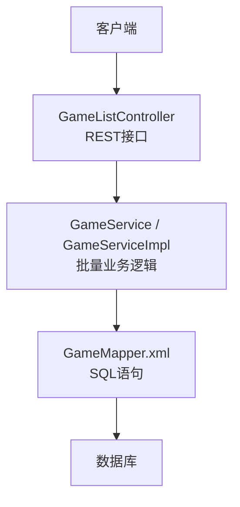
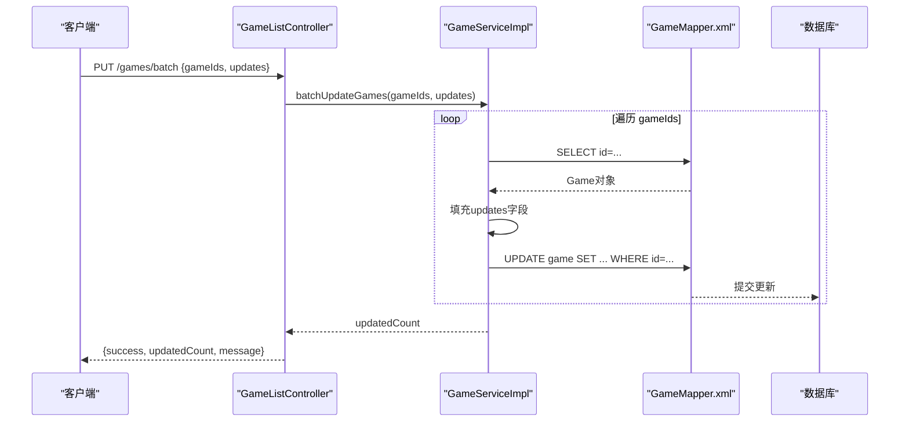
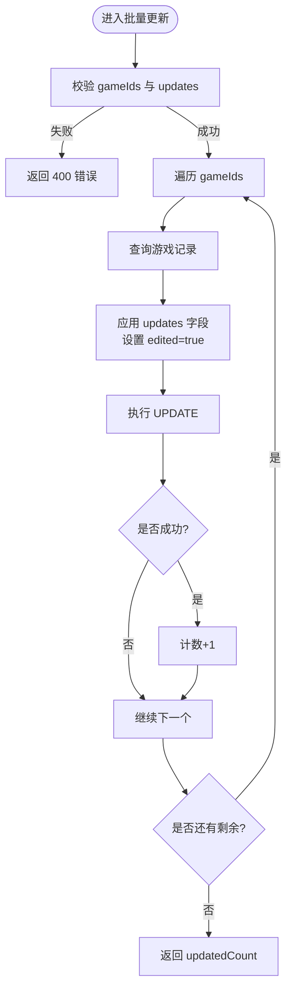
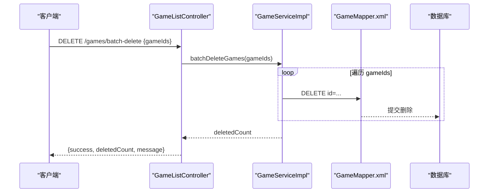
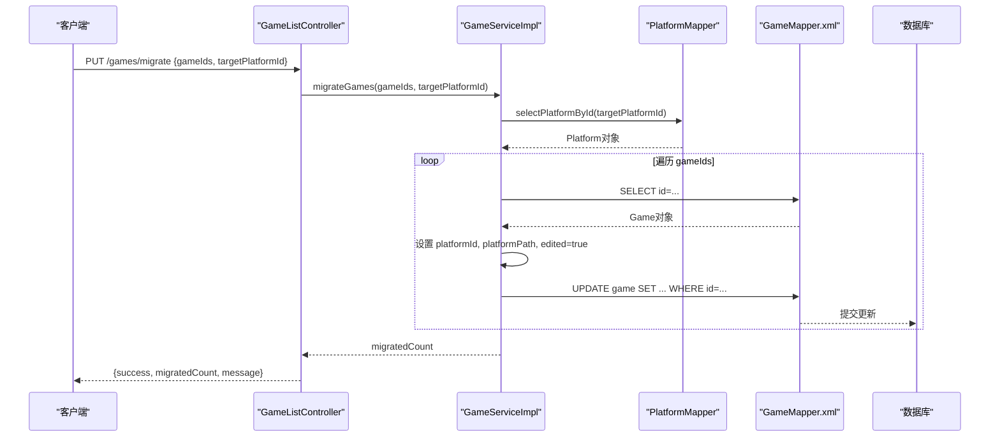
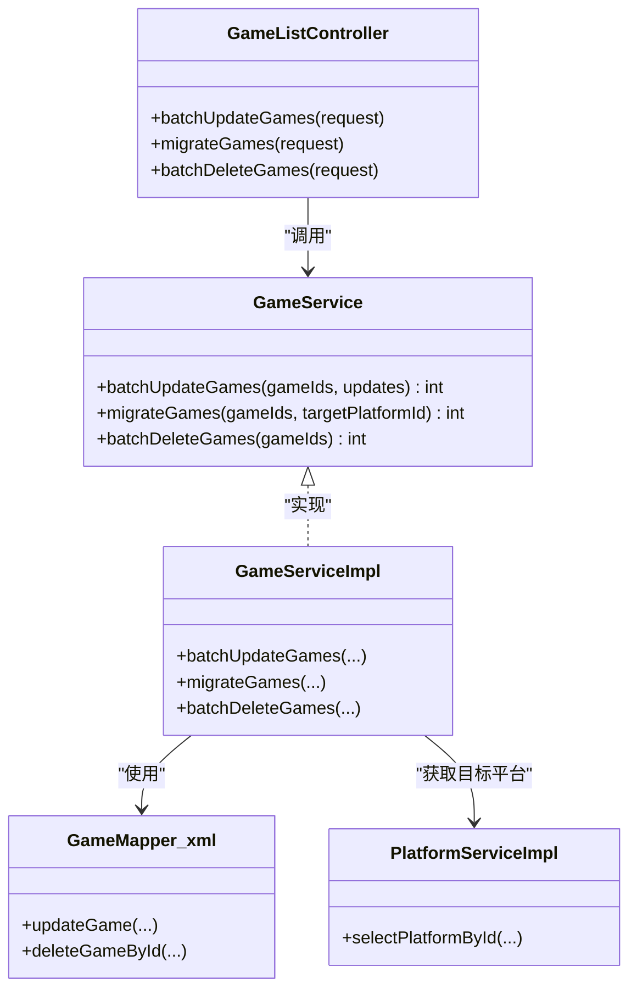

# 批量操作功能

<cite>
**本文引用的文件**
- [GameListController.java](file://src/main/java/com/gamelist/controller/GameListController.java)
- [GameService.java](file://src/main/java/com/gamelist/service/GameService.java)
- [GameServiceImpl.java](file://src/main/java/com/gamelist/service/impl/GameServiceImpl.java)
- [GameMapper.xml](file://src/main/resources/mappers/GameMapper.xml)
- [PlatformServiceImpl.java](file://src/main/java/com/gamelist/service/impl/PlatformServiceImpl.java)
- [DatabaseInitializer.java](file://src/main/java/com/gamelist/config/DatabaseInitializer.java)
</cite>

## 目录
1. [简介](#简介)
2. [项目结构](#项目结构)
3. [核心组件](#核心组件)
4. [架构总览](#架构总览)
5. [详细组件分析](#详细组件分析)
6. [依赖关系分析](#依赖关系分析)
7. [性能考虑](#性能考虑)
8. [故障排查指南](#故障排查指南)
9. [结论](#结论)
10. [附录：API 参考与示例](#附录api-参考与示例)

## 简介
本章节面向“批量操作”能力，覆盖以下高级功能：
- 批量更新游戏信息（按游戏ID列表统一更新若干字段）
- 批量删除游戏（按游戏ID列表删除）
- 迁移游戏到目标平台（将一批游戏从原平台迁移至指定目标平台）

文档将说明请求格式、参数结构、响应语义、事务与错误回滚机制、性能优化建议以及最佳实践。

## 项目结构
批量操作相关代码主要分布在控制器层、服务层与数据访问层：
- 控制器层：接收HTTP请求、校验参数、调用服务层并返回结果
- 服务层：实现批量业务逻辑（批量更新、批量删除、迁移）
- 数据访问层：通过MyBatis映射执行单条更新/删除SQL

图表来源
- [GameListController.java:288-413](file://src/main/java/com/gamelist/controller/GameListController.java#L288-L413)
- [GameService.java:57-60](file://src/main/java/com/gamelist/service/GameService.java#L57-L60)
- [GameServiceImpl.java:3025-3169](file://src/main/java/com/gamelist/service/impl/GameServiceImpl.java#L3025-L3169)
- [GameMapper.xml:440-507](file://src/main/resources/mappers/GameMapper.xml#L440-L507)

章节来源
- [GameListController.java:288-413](file://src/main/java/com/gamelist/controller/GameListController.java#L288-L413)
- [GameService.java:57-60](file://src/main/java/com/gamelist/service/GameService.java#L57-L60)
- [GameServiceImpl.java:3025-3169](file://src/main/java/com/gamelist/service/impl/GameServiceImpl.java#L3025-L3169)
- [GameMapper.xml:440-507](file://src/main/resources/mappers/GameMapper.xml#L440-L507)

## 核心组件
- 批量更新接口：PUT /api/gamelist/games/batch
- 批量删除接口：DELETE /api/gamelist/games/batch-delete
- 迁移接口：PUT /api/gamelist/games/migrate

这些接口由控制器暴露，服务层实现具体逻辑，数据访问层通过MyBatis执行SQL。

章节来源
- [GameListController.java:288-413](file://src/main/java/com/gamelist/controller/GameListController.java#L288-L413)
- [GameService.java:57-60](file://src/main/java/com/gamelist/service/GameService.java#L57-L60)

## 架构总览
批量操作的调用链如下：
- 客户端发送JSON请求到控制器
- 控制器进行参数校验与类型转换
- 控制器调用服务层的批量方法
- 服务层遍历ID列表，逐条读取、修改或写入数据库
- 数据访问层执行单条UPDATE/DELETE SQL

图表来源
- [GameListController.java:288-341](file://src/main/java/com/gamelist/controller/GameListController.java#L288-L341)
- [GameServiceImpl.java:3025-3071](file://src/main/java/com/gamelist/service/impl/GameServiceImpl.java#L3025-L3071)
- [GameMapper.xml:440-507](file://src/main/resources/mappers/GameMapper.xml#L440-L507)

## 详细组件分析

### 批量更新游戏信息
- 接口路径：PUT /api/gamelist/games/batch
- 请求体结构：
  - gameIds：数组，元素可为数字或字符串，支持Integer/Long/String类型自动转换
  - updates：键值对映射，支持的键包括 developer、publisher、genre、players、lang
- 处理流程：
  - 控制器校验gameIds与updates非空
  - 将gameIds转换为Long列表
  - 服务层逐个读取游戏记录，设置updates中的字段，标记edited为true，执行更新
  - 返回成功数量updatedCount
- 错误处理：
  - 参数为空或无效时返回400
  - 异常捕获后返回500及错误信息

图表来源
- [GameListController.java:288-341](file://src/main/java/com/gamelist/controller/GameListController.java#L288-L341)
- [GameServiceImpl.java:3025-3071](file://src/main/java/com/gamelist/service/impl/GameServiceImpl.java#L3025-L3071)
- [GameMapper.xml:440-507](file://src/main/resources/mappers/GameMapper.xml#L440-L507)

章节来源
- [GameListController.java:288-341](file://src/main/java/com/gamelist/controller/GameListController.java#L288-L341)
- [GameService.java:57](file://src/main/java/com/gamelist/service/GameService.java#L57)
- [GameServiceImpl.java:3025-3071](file://src/main/java/com/gamelist/service/impl/GameServiceImpl.java#L3025-L3071)
- [GameMapper.xml:440-507](file://src/main/resources/mappers/GameMapper.xml#L440-L507)

### 批量删除游戏
- 接口路径：DELETE /api/gamelist/games/batch-delete
- 请求体结构：
  - gameIds：数组，元素为Long类型
- 处理流程：
  - 控制器校验gameIds非空
  - 服务层遍历ID列表，逐个调用deleteGameById执行删除
  - 返回成功数量deletedCount
- 错误处理：
  - 参数为空时返回400
  - 异常捕获后返回500及错误信息

图表来源
- [GameListController.java:482-507](file://src/main/java/com/gamelist/controller/GameListController.java#L482-L507)
- [GameServiceImpl.java:3139-3169](file://src/main/java/com/gamelist/service/impl/GameServiceImpl.java#L3139-L3169)
- [GameMapper.xml:289-291](file://src/main/resources/mappers/GameMapper.xml#L289-L291)

章节来源
- [GameListController.java:482-507](file://src/main/java/com/gamelist/controller/GameListController.java#L482-L507)
- [GameService.java:60](file://src/main/java/com/gamelist/service/GameService.java#L60)
- [GameServiceImpl.java:3139-3169](file://src/main/java/com/gamelist/service/impl/GameServiceImpl.java#L3139-L3169)
- [GameMapper.xml:289-291](file://src/main/resources/mappers/GameMapper.xml#L289-L291)

### 迁移游戏到目标平台
- 接口路径：PUT /api/gamelist/games/migrate
- 请求体结构：
  - gameIds：数组，元素可为数字或字符串，支持Integer/Long/String类型自动转换
  - targetPlatformId：目标平台ID（数字或字符串）
- 处理流程：
  - 控制器校验gameIds与targetPlatformId非空并进行类型转换
  - 服务层校验目标平台存在
  - 服务层遍历ID列表，逐个读取游戏记录，设置platformId与platformPath为目标平台信息，标记edited为true，执行更新
  - 返回成功数量migratedCount
- 错误处理：
  - 参数为空或无效时返回400
  - 异常捕获后返回500及错误信息

图表来源
- [GameListController.java:343-413](file://src/main/java/com/gamelist/controller/GameListController.java#L343-L413)
- [GameServiceImpl.java:3074-3117](file://src/main/java/com/gamelist/service/impl/GameServiceImpl.java#L3074-L3117)
- [GameMapper.xml:440-507](file://src/main/resources/mappers/GameMapper.xml#L440-L507)
- [PlatformServiceImpl.java:593-616](file://src/main/java/com/gamelist/service/impl/PlatformServiceImpl.java#L593-L616)

章节来源
- [GameListController.java:343-413](file://src/main/java/com/gamelist/controller/GameListController.java#L343-L413)
- [GameService.java:58](file://src/main/java/com/gamelist/service/GameService.java#L58)
- [GameServiceImpl.java:3074-3117](file://src/main/java/com/gamelist/service/impl/GameServiceImpl.java#L3074-L3117)
- [PlatformServiceImpl.java:593-616](file://src/main/java/com/gamelist/service/impl/PlatformServiceImpl.java#L593-L616)

## 依赖关系分析
- 控制器依赖服务接口与平台服务
- 服务实现依赖MyBatis映射与平台映射
- 数据访问层通过XML映射定义SQL

图表来源
- [GameListController.java:288-413](file://src/main/java/com/gamelist/controller/GameListController.java#L288-L413)
- [GameService.java:57-60](file://src/main/java/com/gamelist/service/GameService.java#L57-L60)
- [GameServiceImpl.java:3025-3169](file://src/main/java/com/gamelist/service/impl/GameServiceImpl.java#L3025-L3169)
- [GameMapper.xml:440-507](file://src/main/resources/mappers/GameMapper.xml#L440-L507)
- [PlatformServiceImpl.java:593-616](file://src/main/java/com/gamelist/service/impl/PlatformServiceImpl.java#L593-L616)

章节来源
- [GameListController.java:288-413](file://src/main/java/com/gamelist/controller/GameListController.java#L288-L413)
- [GameService.java:57-60](file://src/main/java/com/gamelist/service/GameService.java#L57-L60)
- [GameServiceImpl.java:3025-3169](file://src/main/java/com/gamelist/service/impl/GameServiceImpl.java#L3025-L3169)
- [GameMapper.xml:440-507](file://src/main/resources/mappers/GameMapper.xml#L440-L507)
- [PlatformServiceImpl.java:593-616](file://src/main/java/com/gamelist/service/impl/PlatformServiceImpl.java#L593-L616)

## 性能考虑
- 当前实现采用逐条读取与更新/删除的方式，适合中小规模数据集；对于大规模数据，建议分批处理以降低内存占用与锁竞争
- 可结合线程池与批大小策略（如每批固定数量）提升吞吐，但需注意并发写一致性与数据库连接池配置
- 在导入等场景已有分片与并行处理的模式，可借鉴其批量插入与同步策略用于批量更新/删除的优化
- 建议在大批量操作前评估数据库索引与统计信息，确保WHERE条件高效

[本节为通用性能指导，不直接分析具体文件]

## 故障排查指南
- 常见错误：
  - 参数为空或类型不合法：控制器会返回400并附带错误消息
  - 服务层异常：捕获后返回500并附带错误信息
- 日志定位：
  - 服务层记录警告与错误日志，便于定位问题
- 事务与回滚：
  - 当前批量更新/删除未显式使用事务注解；若需原子性，可在服务方法上添加事务管理，并在异常时回滚
  - 系统其他部分展示了手动事务控制（设置autoCommit=false并在异常时rollback），可作为参考

章节来源
- [GameListController.java:288-413](file://src/main/java/com/gamelist/controller/GameListController.java#L288-L413)
- [GameServiceImpl.java:3025-3169](file://src/main/java/com/gamelist/service/impl/GameServiceImpl.java#L3025-L3169)
- [DatabaseInitializer.java:76-102](file://src/main/java/com/gamelist/config/DatabaseInitializer.java#L76-L102)

## 结论
本批量操作功能提供了便捷的批量更新、批量删除与平台迁移能力，适用于常规规模的数据维护。对于超大数据集，建议引入分批与并行策略，并结合事务管理保证一致性。通过合理的参数校验、错误处理与日志记录，可有效提升系统的稳定性与可维护性。

[本节为总结性内容，不直接分析具体文件]

## 附录：API 参考与示例

### 批量更新游戏信息
- 方法：PUT
- 路径：/api/gamelist/games/batch
- 请求体字段：
  - gameIds：数组，元素可为数字或字符串（支持Integer/Long/String）
  - updates：对象，键包括 developer、publisher、genre、players、lang
- 响应：
  - success：布尔
  - updatedCount：整数
  - message：字符串

章节来源
- [GameListController.java:288-341](file://src/main/java/com/gamelist/controller/GameListController.java#L288-L341)
- [GameServiceImpl.java:3025-3071](file://src/main/java/com/gamelist/service/impl/GameServiceImpl.java#L3025-L3071)

### 批量删除游戏
- 方法：DELETE
- 路径：/api/gamelist/games/batch-delete
- 请求体字段：
  - gameIds：数组，元素为Long
- 响应：
  - success：布尔
  - deletedCount：整数
  - message：字符串

章节来源
- [GameListController.java:482-507](file://src/main/java/com/gamelist/controller/GameListController.java#L482-L507)
- [GameServiceImpl.java:3139-3169](file://src/main/java/com/gamelist/service/impl/GameServiceImpl.java#L3139-L3169)

### 迁移游戏到目标平台
- 方法：PUT
- 路径：/api/gamelist/games/migrate
- 请求体字段：
  - gameIds：数组，元素可为数字或字符串（支持Integer/Long/String）
  - targetPlatformId：数字或字符串
- 响应：
  - success：布尔
  - migratedCount：整数
  - message：字符串

章节来源
- [GameListController.java:343-413](file://src/main/java/com/gamelist/controller/GameListController.java#L343-L413)
- [GameServiceImpl.java:3074-3117](file://src/main/java/com/gamelist/service/impl/GameServiceImpl.java#L3074-L3117)