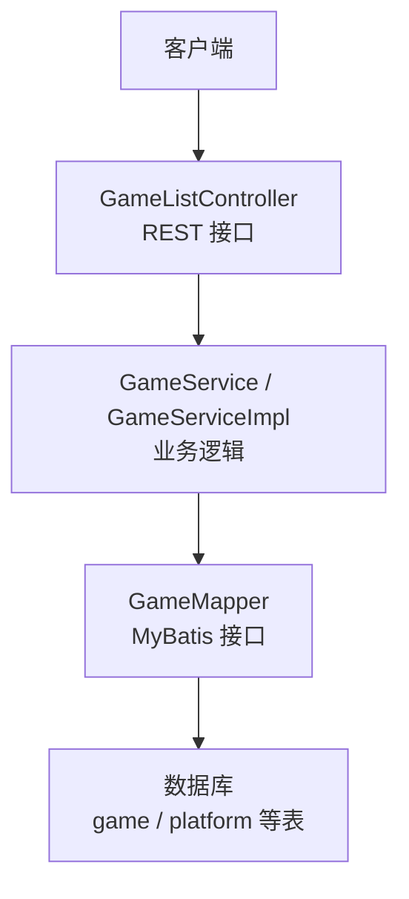
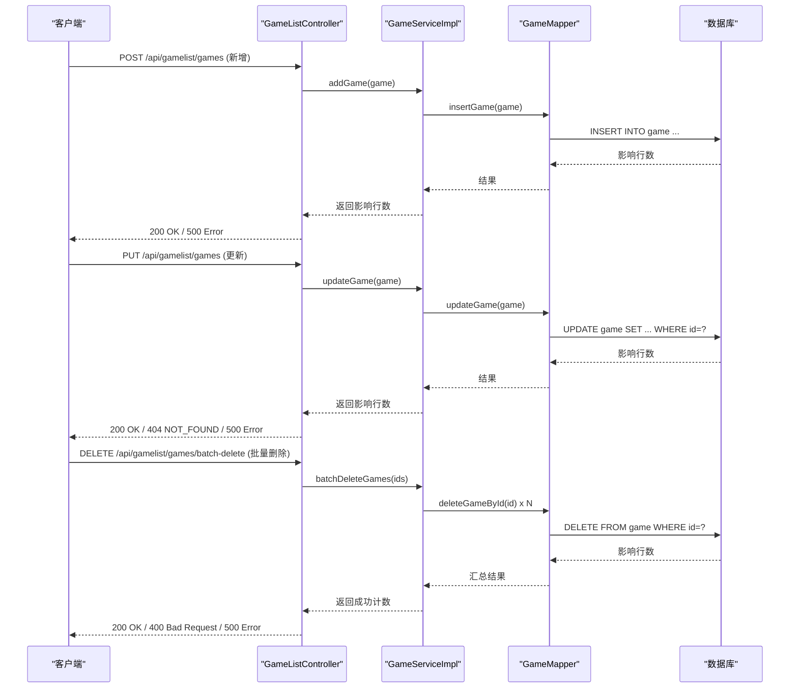
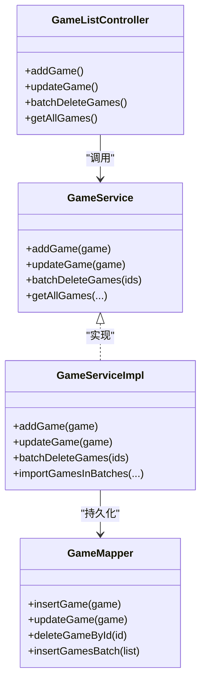

# 游戏CRUD操作

<cite>
**本文引用的文件**
- [GameListController.java](file://src/main/java/com/gamelist/controller/GameListController.java)
- [GameService.java](file://src/main/java/com/gamelist/service/GameService.java)
- [GameServiceImpl.java](file://src/main/java/com/gamelist/service/impl/GameServiceImpl.java)
- [GameMapper.java](file://src/main/java/com/gamelist/mapper/GameMapper.java)
- [Game.java](file://src/main/java/com/gamelist/model/Game.java)
- [V1.0.3__baseline_migration.sql](file://src/main/resources/db/migration/V1.0.3__baseline_migration.sql)
- [schema.sql](file://src/main/resources/schema.sql)
- [API.md](file://wiki/API.md)
</cite>

## 目录
1. [简介](#简介)
2. [项目结构](#项目结构)
3. [核心组件](#核心组件)
4. [架构总览](#架构总览)
5. [详细组件分析](#详细组件分析)
6. [依赖关系分析](#依赖关系分析)
7. [性能考虑](#性能考虑)
8. [故障排查指南](#故障排查指南)
9. [结论](#结论)
10. [附录：API与数据模型](#附录api与数据模型)

## 简介
本章节面向游戏管理系统的增删改查（CRUD）能力，覆盖单个游戏的创建、更新、删除以及批量删除；详细说明 Game 模型的字段含义与约束；提供完整的 API 调用示例（请求体与响应解析）；说明数据验证规则与错误处理机制；并给出最佳实践与性能优化建议。

## 项目结构
系统采用典型的分层架构：
- 控制器层：暴露 RESTful API，负责参数校验、路由与响应封装
- 服务层：业务逻辑编排、事务边界、异常处理
- 数据访问层：MyBatis Mapper 接口与 SQL 映射
- 模型层：领域对象（如 Game）
- 数据库迁移脚本：Flyway 管理的版本化 DDL

图表来源
- [GameListController.java:39-551](file://src/main/java/com/gamelist/controller/GameListController.java#L39-L551)
- [GameService.java:13-61](file://src/main/java/com/gamelist/service/GameService.java#L13-L61)
- [GameServiceImpl.java:46-800](file://src/main/java/com/gamelist/service/impl/GameServiceImpl.java#L46-L800)
- [GameMapper.java:11-76](file://src/main/java/com/gamelist/mapper/GameMapper.java#L11-L76)

章节来源
- [GameListController.java:39-551](file://src/main/java/com/gamelist/controller/GameListController.java#L39-L551)
- [GameService.java:13-61](file://src/main/java/com/gamelist/service/GameService.java#L13-L61)
- [GameMapper.java:11-76](file://src/main/java/com/gamelist/mapper/GameMapper.java#L11-L76)

## 核心组件
- 控制器：统一入口，定义 /api/gamelist/games 的 CRUD 与批量操作
- 服务：实现新增、更新、删除、批量删除、统计、筛选等业务
- 数据访问：通过 MyBatis 执行 SQL，支持批量插入、批量查询路径去重等
- 模型：Game 承载游戏元数据与媒体资源路径

章节来源
- [GameListController.java:125-507](file://src/main/java/com/gamelist/controller/GameListController.java#L125-L507)
- [GameService.java:38-61](file://src/main/java/com/gamelist/service/GameService.java#L38-L61)
- [GameServiceImpl.java:3123-3144](file://src/main/java/com/gamelist/service/impl/GameServiceImpl.java#L3123-L3144)
- [Game.java:5-650](file://src/main/java/com/gamelist/model/Game.java#L5-L650)

## 架构总览
下图展示了从 HTTP 请求到数据库操作的完整链路，包括新增、更新、删除与批量删除。

图表来源
- [GameListController.java:465-507](file://src/main/java/com/gamelist/controller/GameListController.java#L465-L507)
- [GameServiceImpl.java:3123-3144](file://src/main/java/com/gamelist/service/impl/GameServiceImpl.java#L3123-L3144)
- [GameMapper.java:13-75](file://src/main/java/com/gamelist/mapper/GameMapper.java#L13-L75)

## 详细组件分析

### 数据模型：Game
Game 是游戏实体的核心模型，包含基础信息、媒体资源、平台关联与状态标记等。关键字段与约束要点如下（基于模型与数据库迁移脚本归纳）：
- 标识与来源
  - id: 自增主键
  - gameId: 外部唯一标识（非空）
  - source: 数据来源
- 路径与存在性
  - path: ROM/可执行文件路径（非空）
  - absolutePath: 绝对路径
  - exists: 是否存在标志
  - platform_path: 平台根路径
- 名称与描述
  - name: 游戏名称（非空）
  - desc: 描述
  - translatedName / translatedDesc: 翻译后的名称与描述
- 媒体资源（字符串路径或URL）
  - image, video, marquee, thumbnail, manual, boxFront/Back/Spine/Full, cartridge, logo, bezel, panel, cabinetLeft/Right, tile, banner, steam, poster, background, music, screenshot, titlescreen, box3d, steamgrid, fanart, boxtexture, supporttexture, videonormalized, wheelcarbon, wheelsteel, screenmarqueesmall, boxside, figurine, pictoliste, pictomonochrome, pictomonochromesvg, pictocouleur, wallpaper
- 元数据
  - rating: 评分（Double）
  - releasedate: 发布日期
  - developer, publisher, genre, players, lang, genreid
  - crc32, md5, hash: 校验值
- 平台与排序
  - platformId: 平台外键
  - platformType: 平台类型
  - sortBy: 排序字段
- 状态与编辑标记
  - scraped: 是否已刮削
  - edited: 是否被编辑过
- 扩展字段（Lakka .lpl）
  - corePath, coreName, databaseLink

注意：
- 数据库层对部分字段有长度限制（如 VARCHAR(255)、TEXT），媒体字段多为字符串路径/URL，需确保长度与格式合理。
- 平台关联通过 platform_id 外键约束。

章节来源
- [Game.java:5-650](file://src/main/java/com/gamelist/model/Game.java#L5-L650)
- [V1.0.3__baseline_migration.sql:19-82](file://src/main/resources/db/migration/V1.0.3__baseline_migration.sql#L19-L82)
- [schema.sql:5-29](file://src/main/resources/schema.sql#L5-L29)

### 控制器：GameListController
提供以下关键接口：
- 新增游戏：POST /api/gamelist/games
- 更新游戏：PUT /api/gamelist/games
- 批量删除：DELETE /api/gamelist/games/batch-delete
- 获取详情：GET /api/gamelist/games/{gameId}
- 列表与分页：GET /api/gamelist/games?page&pageSize&...
- 按平台获取：GET /api/gamelist/platforms/{platformId}/games
- 其他：导入、扫描、统计、筛选、迁移等

请求与响应要点：
- 新增/更新使用 JSON 请求体，绑定到 Game 模型
- 批量删除请求体为 { "gameIds": [1,2,3] }
- 成功时返回 200 及文本或结构化结果；失败时返回 400/404/500 及错误信息

章节来源
- [GameListController.java:125-507](file://src/main/java/com/gamelist/controller/GameListController.java#L125-L507)

### 服务：GameService / GameServiceImpl
- 新增：addGame(Game) -> 设置 edited=true -> 插入记录
- 更新：updateGame(Game) -> 根据 id 更新
- 批量删除：batchDeleteGames(List<?>) -> 遍历删除
- 批量更新：batchUpdateGames(List<Long>, Map<String,Object>) -> 动态更新指定字段
- 过滤与统计：getGamesByFilter/getGamesCountByFilter/getOverallStatistics 等
- 导入与扫描：importGamesFromXml/scanAndImportGames 等（用于批量导入场景）

章节来源
- [GameService.java:38-61](file://src/main/java/com/gamelist/service/GameService.java#L38-L61)
- [GameServiceImpl.java:3123-3144](file://src/main/java/com/gamelist/service/impl/GameServiceImpl.java#L3123-L3144)

### 数据访问：GameMapper
- 单条：insertGame, updateGame, deleteGameById, selectGameById
- 批量：insertGamesBatch
- 查询：selectAllGamesWithFilter, selectGamesByPlatformIdWithFilter, selectGamesByScrapeStatus
- 去重与统计：selectExistingGamePaths/selectExistingGamePathsByPlatformId, countTotalGames 等
- 平台相关：countGamesByPlatformId, updatePlatformPathForAllGames

章节来源
- [GameMapper.java:11-76](file://src/main/java/com/gamelist/mapper/GameMapper.java#L11-L76)

### 数据库：表结构与约束
- 平台表 platform：system/software/database/web/name/sort_by/launch/folder_path 等
- 游戏表 game：包含大量媒体字段、元数据、平台外键、状态字段（scraped/edited/exists）、路径字段等
- 临时子集表：temp_subset_game 与 game 结构类似，用于临时分组
- 额外迁移：添加 system_id/system_region 等字段

章节来源
- [V1.0.3__baseline_migration.sql:5-238](file://src/main/resources/db/migration/V1.0.3__baseline_migration.sql#L5-L238)
- [schema.sql:1-29](file://src/main/resources/schema.sql#L1-L29)

## 依赖关系分析
- 控制器依赖服务接口，服务实现依赖 Mapper 与平台服务
- 服务实现内部使用线程池与分批策略提升导入性能
- Mapper 通过 MyBatis 注解声明 SQL 方法
- 数据库通过 Flyway 迁移脚本演进

图表来源
- [GameListController.java:39-551](file://src/main/java/com/gamelist/controller/GameListController.java#L39-L551)
- [GameService.java:13-61](file://src/main/java/com/gamelist/service/GameService.java#L13-L61)
- [GameServiceImpl.java:46-800](file://src/main/java/com/gamelist/service/impl/GameServiceImpl.java#L46-L800)
- [GameMapper.java:11-76](file://src/main/java/com/gamelist/mapper/GameMapper.java#L11-L76)

章节来源
- [GameListController.java:39-551](file://src/main/java/com/gamelist/controller/GameListController.java#L39-L551)
- [GameServiceImpl.java:242-395](file://src/main/java/com/gamelist/service/impl/GameServiceImpl.java#L242-L395)

## 性能考虑
- 批量导入与去重
  - 分批处理（每批约1000条）与批量插入（每批约500条）
  - 批量查询已存在路径以避免重复插入
  - 多线程并行处理大批量数据
- 网络与IO
  - 控制批次大小，避免一次性加载过多数据导致内存压力
  - 在批量插入间隙短暂休眠，降低数据库瞬时压力
- 前端分页
  - 列表接口支持 page/pageSize 分页，减少传输体积

章节来源
- [GameServiceImpl.java:242-395](file://src/main/java/com/gamelist/service/impl/GameServiceImpl.java#L242-L395)
- [GameServiceImpl.java:505-543](file://src/main/java/com/gamelist/service/impl/GameServiceImpl.java#L505-L543)

## 故障排查指南
- 常见错误码
  - 200 OK：成功
  - 400 Bad Request：请求参数无效（如 gameIds 为空或包含非法ID）
  - 404 Not Found：未找到指定游戏
  - 500 Internal Server Error：服务器内部错误（如数据库异常、IO异常）
- 日志与诊断
  - 控制器与服务层均记录异常堆栈与关键上下文
  - 导入过程会写入错误日志文件，便于定位跳过的路径或缺失字段
- 建议
  - 检查请求体字段是否符合 Game 模型约定（尤其是必填字段）
  - 确认数据库连接与权限正常
  - 对于批量操作，先小批量测试再扩大规模

章节来源
- [GameListController.java:271-340](file://src/main/java/com/gamelist/controller/GameListController.java#L271-L340)
- [GameListController.java:465-507](file://src/main/java/com/gamelist/controller/GameListController.java#L465-L507)
- [GameServiceImpl.java:3123-3144](file://src/main/java/com/gamelist/service/impl/GameServiceImpl.java#L3123-L3144)

## 结论
本系统提供了完善的游戏 CRUD 能力，涵盖单条与批量操作，具备健壮的错误处理与良好的性能设计。通过清晰的层次划分与批量优化策略，能够高效支撑大规模游戏元数据的导入与管理。建议在生产环境结合监控与限流策略，进一步提升稳定性与可观测性。

## 附录：API与数据模型

### API 概览（游戏CRUD）
- 新增游戏
  - 方法：POST
  - 路径：/api/gamelist/games
  - 请求体：Game 对象（至少包含 name/path 等必要字段）
  - 响应：200 OK（成功消息）或 500（异常）
- 更新游戏
  - 方法：PUT
  - 路径：/api/gamelist/games
  - 请求体：Game 对象（必须包含 id）
  - 响应：200 OK（成功消息）或 404（未找到）或 500（异常）
- 批量删除
  - 方法：DELETE
  - 路径：/api/gamelist/games/batch-delete
  - 请求体：{ "gameIds": [1,2,3] }
  - 响应：200 OK（包含 success/deletedCount/message）或 400/500
- 获取详情
  - 方法：GET
  - 路径：/api/gamelist/games/{gameId}
  - 响应：200 OK（Game 对象）或 404
- 列表与分页
  - 方法：GET
  - 路径：/api/gamelist/games?page=1&pageSize=20&search=&startDate=&endDate=&developers=&genres=&players=&scrapeStatuses=&folderPath=
  - 响应：200 OK（包含 games、totalPages、totalElements）

章节来源
- [GameListController.java:125-507](file://src/main/java/com/gamelist/controller/GameListController.java#L125-L507)
- [API.md:182-265](file://wiki/API.md#L182-L265)

### 数据模型：Game 字段说明（节选）
- 基础信息
  - id: 主键
  - gameId: 外部唯一标识
  - source: 来源
  - path: 文件路径（必填）
  - name: 名称（必填）
  - desc: 描述
  - translatedName / translatedDesc: 翻译后名称/描述
- 媒体资源（字符串路径/URL）
  - image/video/marquee/thumbnail/manual/boxFront/Back/Spine/Full/cartridge/logo/bezel/panel/cabinetLeft/Right/tile/banner/steam/poster/background/music/screenshot/titlescreen/box3d/steamgrid/fanart/boxtexture/supporttexture/videonormalized/wheelcarbon/wheelsteel/screenmarqueesmall/boxside/figurine/pictoliste/pictomonochrome/pictomonochromesvg/pictocouleur/wallpaper
- 元数据
  - rating: 评分（Double）
  - releasedate: 发布日期
  - developer/publisher/genre/players/lang/genreid
  - crc32/md5/hash
- 平台与排序
  - platformId: 平台ID（外键）
  - platformType: 平台类型
  - sortBy: 排序字段
- 状态与编辑
  - scraped: 是否已刮削
  - edited: 是否被编辑过
  - exists: 是否存在
- 路径
  - absolutePath: 绝对路径
  - platformPath: 平台路径
- Lakka .lpl 扩展
  - corePath/coreName/databaseLink

章节来源
- [Game.java:5-650](file://src/main/java/com/gamelist/model/Game.java#L5-L650)
- [V1.0.3__baseline_migration.sql:19-82](file://src/main/resources/db/migration/V1.0.3__baseline_migration.sql#L19-L82)
- [schema.sql:5-29](file://src/main/resources/schema.sql#L5-L29)

### 请求与响应示例（文字描述）
- 新增游戏
  - 请求体：包含 name、path、可选的媒体与元数据字段
  - 成功响应：200 OK，提示“游戏新增成功！”
  - 失败响应：500，提示“新增失败：...”
- 更新游戏
  - 请求体：包含 id 与需要更新的字段
  - 成功响应：200 OK，提示“游戏信息更新成功！”
  - 失败响应：404（未找到）或 500（异常）
- 批量删除
  - 请求体：{ "gameIds": [1,2,3] }
  - 成功响应：200 OK，包含 success、deletedCount、message
  - 失败响应：400（gameIds 为空或包含非法ID）或 500（异常）

章节来源
- [GameListController.java:271-340](file://src/main/java/com/gamelist/controller/GameListController.java#L271-L340)
- [GameListController.java:465-507](file://src/main/java/com/gamelist/controller/GameListController.java#L465-L507)

### 数据验证与错误处理
- 参数校验
  - 批量操作要求 gameIds 为非空列表且元素为有效数字
  - 更新操作要求包含有效的 id
- 错误处理
  - 控制器捕获异常并返回合适的 HTTP 状态码与错误消息
  - 服务层记录详细日志，便于定位问题
  - 导入流程将跳过无效路径并记录错误日志文件

章节来源
- [GameListController.java:271-340](file://src/main/java/com/gamelist/controller/GameListController.java#L271-L340)
- [GameListController.java:465-507](file://src/main/java/com/gamelist/controller/GameListController.java#L465-L507)
- [GameServiceImpl.java:242-395](file://src/main/java/com/gamelist/service/impl/GameServiceImpl.java#L242-L395)

### 最佳实践与性能优化
- 批量操作优先：使用批量删除/更新接口减少往返次数
- 分页查询：列表接口使用 page/pageSize 控制数据量
- 媒体字段管理：仅上传必要的媒体资源，避免过大 payload
- 导入优化：利用批量导入与去重机制，分批次提交
- 监控与日志：关注服务端日志与错误日志文件，及时发现问题

[本节为通用指导，不直接引用具体代码文件]