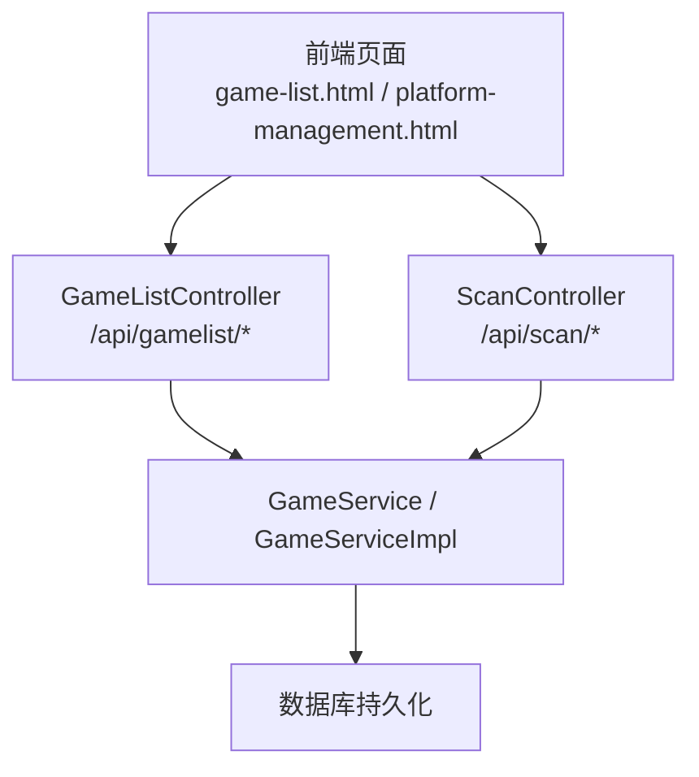
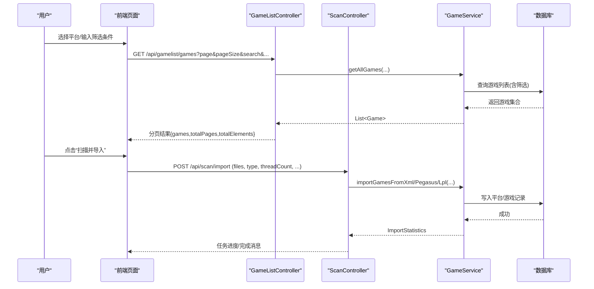
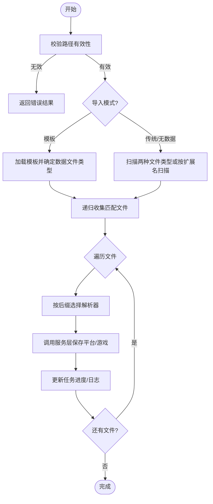
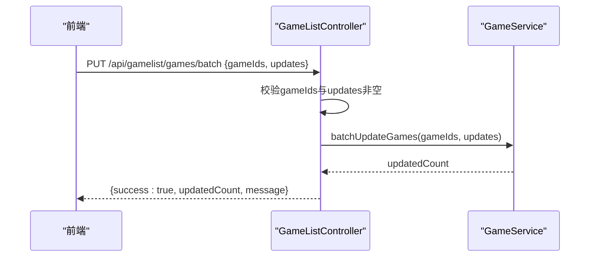
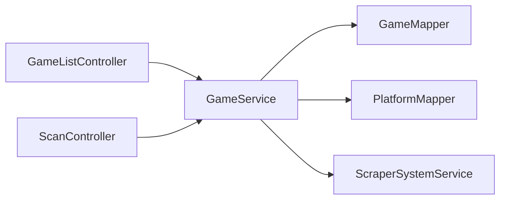

# 游戏列表管理

<cite>
**本文引用的文件**
- [GameListController.java](file://src/main/java/com/gamelist/controller/GameListController.java)
- [ScanController.java](file://src/main/java/com/gamelist/controller/ScanController.java)
- [GameService.java](file://src/main/java/com/gamelist/service/GameService.java)
- [GameServiceImpl.java](file://src/main/java/com/gamelist/service/impl/GameServiceImpl.java)
- [Game.java](file://src/main/java/com/gamelist/model/Game.java)
- [ScanRequest.java](file://src/main/java/com/gamelist/model/ScanRequest.java)
- [ScanResult.java](file://src/main/java/com/gamelist/model/ScanResult.java)
- [ImportRequest.java](file://src/main/java/com/gamelist/model/ImportRequest.java)
- [game-list.html](file://src/main/resources/static/game-list.html)
- [platform-management.html](file://src/main/resources/static/platform-management.html)
- [README.md](file://README.md)
</cite>

## 目录
1. [简介](#简介)
2. [项目结构](#项目结构)
3. [核心组件](#核心组件)
4. [架构总览](#架构总览)
5. [详细组件分析](#详细组件分析)
6. [依赖关系分析](#依赖关系分析)
7. [性能考虑](#性能考虑)
8. [故障排查指南](#故障排查指南)
9. [结论](#结论)
10. [附录：API与界面操作指南](#附录api与界面操作指南)

## 简介
本章节面向“游戏列表管理”功能，覆盖游戏的扫描、导入、编辑、删除等核心能力；详细说明游戏信息字段（名称、平台、描述、封面、截图等）的管理方式；解释批量操作（批量删除、批量更新、迁移平台等）；说明筛选与搜索（按平台、状态、文件存在性等条件）的使用方法；提供API调用示例与界面操作指引；并给出数据验证规则、错误处理与性能优化建议。

## 项目结构
- 控制器层：负责HTTP接口定义与请求参数校验，转发到服务层执行具体业务逻辑。
- 服务层：封装游戏导入、扫描、CRUD、统计、筛选、批量操作等核心业务。
- 模型层：定义游戏实体、扫描请求/结果、导入请求等数据结构。
- 前端页面：提供游戏列表展示、筛选、分页、批量操作等交互。

图表来源
- [GameListController.java:39-551](file://src/main/java/com/gamelist/controller/GameListController.java#L39-L551)
- [ScanController.java:26-579](file://src/main/java/com/gamelist/controller/ScanController.java#L26-L579)
- [GameService.java:13-61](file://src/main/java/com/gamelist/service/GameService.java#L13-L61)

章节来源
- [GameListController.java:39-551](file://src/main/java/com/gamelist/controller/GameListController.java#L39-L551)
- [ScanController.java:26-579](file://src/main/java/com/gamelist/controller/ScanController.java#L26-L579)
- [GameService.java:13-61](file://src/main/java/com/gamelist/service/GameService.java#L13-L61)

## 核心组件
- 游戏实体 Game：包含基础信息（名称、描述、平台）、媒体资源（封面、截图、视频等）、刮削与编辑状态、文件存在性标记、路径信息等。
- 扫描与导入：支持扫描指定路径下的元数据文件（gamelist.xml、metadata.pegasus.txt、.lpl），支持模板导入与无数据文件模式。
- 游戏CRUD：新增、查询（分页+多条件筛选）、更新、删除（单条/批量）。
- 批量操作：批量更新字段、批量删除、批量迁移至目标平台。
- 统计与筛选：总体统计、平台统计、按刮削状态筛选、按平台/开发商/类型/玩家数/语言/日期范围/文件存在性等筛选。

章节来源
- [Game.java:5-650](file://src/main/java/com/gamelist/model/Game.java#L5-L650)
- [GameListController.java:51-551](file://src/main/java/com/gamelist/controller/GameListController.java#L51-L551)
- [ScanController.java:37-579](file://src/main/java/com/gamelist/controller/ScanController.java#L37-L579)
- [GameService.java:13-61](file://src/main/java/com/gamelist/service/GameService.java#L13-L61)

## 架构总览
下图展示了从前端到后端的核心调用链路，包括扫描、导入、列表查询、筛选、批量操作等。

图表来源
- [GameListController.java:128-199](file://src/main/java/com/gamelist/controller/GameListController.java#L128-L199)
- [ScanController.java:244-410](file://src/main/java/com/gamelist/controller/ScanController.java#L244-L410)
- [GameService.java:13-61](file://src/main/java/com/gamelist/service/GameService.java#L13-L61)

## 详细组件分析

### 游戏实体与字段管理
- 基本信息：id、name、desc、releasedate、developer、publisher、genre、players、lang、rating 等。
- 平台关联：platformId、platformType、platformPath、sortBy。
- 媒体资源：image、video、marquee、thumbnail、wheel、manual、boxFront/Back/Spine/Full、cartridge、logo、bezel、panel、cabinetLeft/Right、tile、banner、steam、poster、background、music、screenshot、titlescreen、box3d、steamgrid、fanart、boxtexture、supporttexture、videonormalized、wheelcarbon、wheelsteel、screenmarqueesmall、boxside、figurine、pictoliste、pictomonochrome、pictomonochromesvg、pictocouleur、wallpaper。
- 状态与校验：scraped（是否已刮削）、edited（是否已编辑）、exists（文件是否存在）、absolutePath、platformPath。
- 扩展字段：platformSpecificFields（平台特定字段映射）、corePath/coreName/databaseLink（Lakka .lpl 专用）。

使用场景
- 导入时根据XML/文本解析填充上述字段。
- 编辑时通过PUT更新任意可写字段。
- 筛选时可按平台、开发商、类型、玩家数、语言、发布日期区间、刮削状态、文件存在性等进行过滤。

章节来源
- [Game.java:5-650](file://src/main/java/com/gamelist/model/Game.java#L5-L650)
- [GameListController.java:128-199](file://src/main/java/com/gamelist/controller/GameListController.java#L128-L199)

### 扫描与导入
- 扫描：支持递归扫描指定根目录，查找 gamelist.xml、metadata.pegasus.txt、.lpl 等元数据文件；可配置深度与模板。
- 导入：支持传统导入、模板导入、无数据文件模式；支持多线程导入；支持选择Scraper系统ID以影响平台systemId设置。
- 异步任务：导入过程创建后台任务，实时反馈进度与日志。

关键流程
- 扫描：根据模板或默认策略确定目标数据文件类型，递归收集文件列表。
- 导入：遍历文件，按后缀选择解析器（XML/PEGASUS/LPL），调用服务层批量保存，统计平台/游戏数量，更新任务进度与日志。

图表来源
- [ScanController.java:173-239](file://src/main/java/com/gamelist/controller/ScanController.java#L173-L239)
- [ScanController.java:244-410](file://src/main/java/com/gamelist/controller/ScanController.java#L244-L410)
- [GameServiceImpl.java:116-200](file://src/main/java/com/gamelist/service/impl/GameServiceImpl.java#L116-L200)

章节来源
- [ScanController.java:37-579](file://src/main/java/com/gamelist/controller/ScanController.java#L37-L579)
- [GameServiceImpl.java:116-200](file://src/main/java/com/gamelist/service/impl/GameServiceImpl.java#L116-L200)

### 游戏增删改查与批量操作
- 新增：POST /api/gamelist/games，提交Game对象。
- 查询：GET /api/gamelist/games 与 GET /api/gamelist/platforms/{platformId}/games，支持分页与多条件筛选。
- 更新：PUT /api/gamelist/games，提交Game对象。
- 删除：DELETE /api/gamelist/games（清空全部）；DELETE /api/gamelist/games/batch-delete（批量删除）。
- 批量更新：PUT /api/gamelist/games/batch，传入gameIds与updates键值对。
- 迁移平台：PUT /api/gamelist/games/migrate，将选定游戏迁移到目标平台。
- 合并光盘：POST /api/gamelist/merge-discs，合并多张光盘为一个条目。

图表来源
- [GameListController.java:288-341](file://src/main/java/com/gamelist/controller/GameListController.java#L288-L341)
- [GameService.java:57-57](file://src/main/java/com/gamelist/service/GameService.java#L57-L57)

章节来源
- [GameListController.java:213-507](file://src/main/java/com/gamelist/controller/GameListController.java#L213-L507)
- [GameService.java:38-61](file://src/main/java/com/gamelist/service/GameService.java#L38-L61)

### 筛选与搜索
- 通用筛选：支持按平台、开发商、类型、玩家数、刮削状态、文件夹路径、日期范围、关键词搜索等。
- 平台内筛选：在平台维度下进一步支持文件存在性筛选（exists/not_exists）。
- 唯一值获取：GET /api/gamelist/games/unique-values，用于构建筛选下拉选项。
- 计数筛选：POST /api/gamelist/games/filter，返回满足条件的总数。

前端交互要点
- 平台管理页中可组合勾选刮削状态（fully/partially/not）与文件存在性（exists/not_exists），并传递至后端筛选。
- 游戏列表页支持分页、搜索词、平台/子集切换。

章节来源
- [GameListController.java:128-199](file://src/main/java/com/gamelist/controller/GameListController.java#L128-L199)
- [GameListController.java:418-446](file://src/main/java/com/gamelist/controller/GameListController.java#L418-L446)
- [platform-management.html:2274-3055](file://src/main/resources/static/platform-management.html#L2274-L3055)
- [game-list.html:1962-1995](file://src/main/resources/static/game-list.html#L1962-L1995)

### 数据验证规则
- 必填校验：批量更新/删除/迁移接口要求gameIds非空且至少一个有效ID；批量更新还需updates非空。
- 类型转换：controller层对gameIds进行Integer/Long/String兼容转换，非法值将被忽略。
- 路径校验：扫描接口校验根路径存在且为目录。
- 文件类型：导入接口根据文件后缀选择解析器，不支持的类型会被跳过并记录日志。

章节来源
- [GameListController.java:288-413](file://src/main/java/com/gamelist/controller/GameListController.java#L288-L413)
- [ScanController.java:173-239](file://src/main/java/com/gamelist/controller/ScanController.java#L173-L239)

### 错误处理
- 扫描/导入异常：捕获异常并返回ScanResult失败标志与错误消息；异步任务中记录详细堆栈到任务日志。
- 列表/统计接口：捕获异常后返回5xx状态码与错误提示。
- 批量操作：参数校验失败返回4xx；运行时异常返回5xx并附带错误信息。

章节来源
- [GameListController.java:79-114](file://src/main/java/com/gamelist/controller/GameListController.java#L79-L114)
- [GameListController.java:222-247](file://src/main/java/com/gamelist/controller/GameListController.java#L222-L247)
- [ScanController.java:359-410](file://src/main/java/com/gamelist/controller/ScanController.java#L359-L410)

## 依赖关系分析
- Controller依赖Service：GameListController与ScanController均依赖GameService实现业务逻辑。
- Service依赖Mapper与外部工具：GameServiceImpl依赖GameMapper、PlatformMapper、ScraperSystemService等。
- 前端依赖静态资源：game-list.html与platform-management.html通过AJAX调用后端API。

图表来源
- [GameListController.java:39-551](file://src/main/java/com/gamelist/controller/GameListController.java#L39-L551)
- [ScanController.java:26-579](file://src/main/java/com/gamelist/controller/ScanController.java#L26-L579)
- [GameServiceImpl.java:46-69](file://src/main/java/com/gamelist/service/impl/GameServiceImpl.java#L46-L69)

章节来源
- [GameListController.java:39-551](file://src/main/java/com/gamelist/controller/GameListController.java#L39-L551)
- [ScanController.java:26-579](file://src/main/java/com/gamelist/controller/ScanController.java#L26-L579)
- [GameServiceImpl.java:46-69](file://src/main/java/com/gamelist/service/impl/GameServiceImpl.java#L46-L69)

## 性能考虑
- 分页查询：列表接口采用内存分页（先取全量再切片），适用于中小规模数据集；大数据量建议在后端SQL层分页。
- 并发导入：支持线程池导入，合理设置threadCount（默认4，上限10）以提升吞吐。
- 扫描深度：限制递归深度避免过大目录树导致IO压力。
- 媒体资源：大量媒体字段会增加存储与传输开销，按需启用或延迟加载。
- 缓存与索引：建议在数据库层为常用筛选字段建立索引（如platformId、scraped、exists等）。

[本节为通用性能建议，不直接分析具体文件]

## 故障排查指南
- 扫描失败：检查路径是否存在且为目录；确认模板配置是否正确；查看任务日志中的详细错误。
- 导入失败：确认文件格式与后缀匹配；查看跳过文件原因；核对scraperSystemId是否有效。
- 批量操作失败：确认gameIds格式正确；检查updates字段是否合法；关注服务端返回的错误消息。
- 列表/统计异常：检查网络请求参数；查看服务端日志定位异常堆栈。

章节来源
- [ScanController.java:173-239](file://src/main/java/com/gamelist/controller/ScanController.java#L173-L239)
- [ScanController.java:359-410](file://src/main/java/com/gamelist/controller/ScanController.java#L359-L410)
- [GameListController.java:288-413](file://src/main/java/com/gamelist/controller/GameListController.java#L288-L413)

## 结论
本模块提供了完整的“游戏列表管理”能力，涵盖扫描、导入、CRUD、批量操作、筛选与统计等功能。通过清晰的控制器-服务分层、丰富的模型字段与灵活的前端交互，能够满足游戏库的维护与管理需求。建议在生产环境中结合数据库索引与分页优化提升性能，并通过任务日志完善问题定位。

[本节为总结性内容，不直接分析具体文件]

## 附录：API与界面操作指南

### API概览
- 扫描与导入
  - POST /api/scan/scan：扫描指定路径，返回找到的元数据文件列表。
  - POST /api/scan/import：异步导入文件，返回任务ID与进度。
  - POST /api/gamelist/scan：扫描并导入gamelist.xml。
  - POST /api/gamelist/scan-pegasus：扫描并导入metadata.pegasus.txt。
- 游戏列表
  - GET /api/gamelist/games：分页获取所有游戏，支持search、日期范围、开发者、类型、玩家数、刮削状态、文件夹路径等筛选。
  - GET /api/gamelist/platforms/{platformId}/games：按平台分页获取游戏，支持fileStatuses等筛选。
  - GET /api/gamelist/games/{gameId}：获取单个游戏详情。
- 游戏操作
  - POST /api/gamelist/games：新增游戏。
  - PUT /api/gamelist/games：更新游戏。
  - DELETE /api/gamelist/games：清空所有游戏。
  - DELETE /api/gamelist/games/batch-delete：批量删除。
  - PUT /api/gamelist/games/batch：批量更新字段。
  - PUT /api/gamelist/games/migrate：批量迁移至目标平台。
  - POST /api/gamelist/merge-discs：合并光盘。
- 统计与筛选
  - GET /api/gamelist/statistics/overall：总体统计。
  - GET /api/gamelist/statistics/platforms：各平台统计。
  - GET /api/gamelist/games/by-status：按刮削状态获取游戏。
  - POST /api/gamelist/games/filter：按条件筛选计数。
  - GET /api/gamelist/games/unique-values：获取唯一值（开发商、类型、玩家数等）。

章节来源
- [GameListController.java:51-551](file://src/main/java/com/gamelist/controller/GameListController.java#L51-L551)
- [ScanController.java:173-579](file://src/main/java/com/gamelist/controller/ScanController.java#L173-L579)

### 界面操作指南
- 游戏列表页
  - 支持分页、搜索框、平台/子集切换。
  - 显示状态指示器（完整/部分/缺失）便于快速识别。
- 平台管理页
  - 支持组合筛选：刮削状态（fully/partially/not）、文件存在性（exists/not_exists）、开发商、类型、玩家数、语言、日期范围、正则表达式等。
  - 支持批量分离/迁移等操作。

章节来源
- [game-list.html:1962-1995](file://src/main/resources/static/game-list.html#L1962-L1995)
- [platform-management.html:2274-3055](file://src/main/resources/static/platform-management.html#L2274-L3055)

### 数据模型参考
- 扫描请求：ScanRequest（path、scanDepth）。
- 扫描结果：ScanResult（success、message、foundFiles、importedFiles、details[]）。
- 导入请求：ImportRequest（filePaths、scanDepth）。
- 游戏实体：Game（详见字段说明）。

章节来源
- [ScanRequest.java:7-27](file://src/main/java/com/gamelist/model/ScanRequest.java#L7-L27)
- [ScanResult.java:5-93](file://src/main/java/com/gamelist/model/ScanResult.java#L5-L93)
- [ImportRequest.java:9-29](file://src/main/java/com/gamelist/model/ImportRequest.java#L9-L29)
- [Game.java:5-650](file://src/main/java/com/gamelist/model/Game.java#L5-L650)