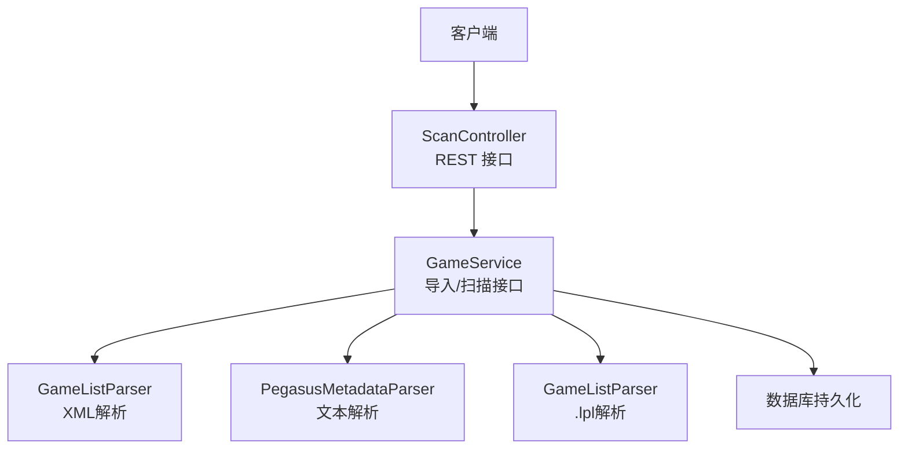
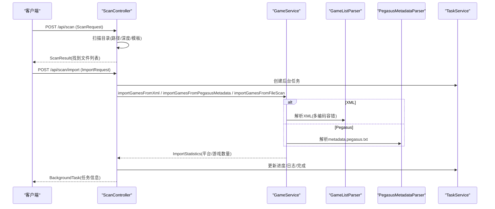
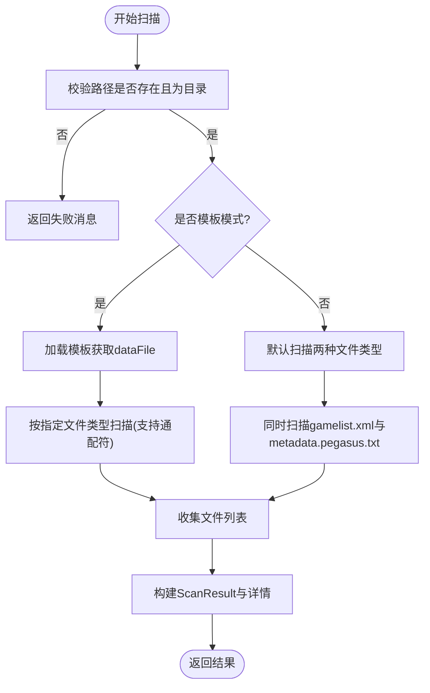
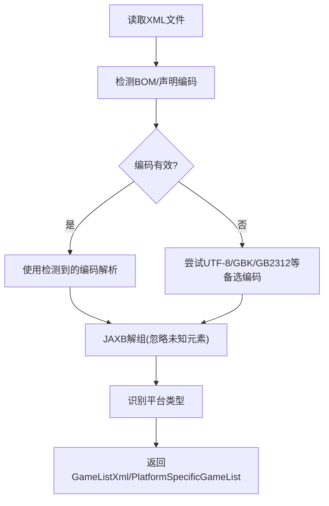
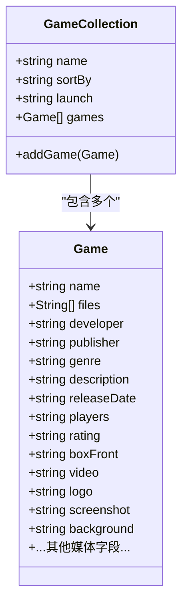
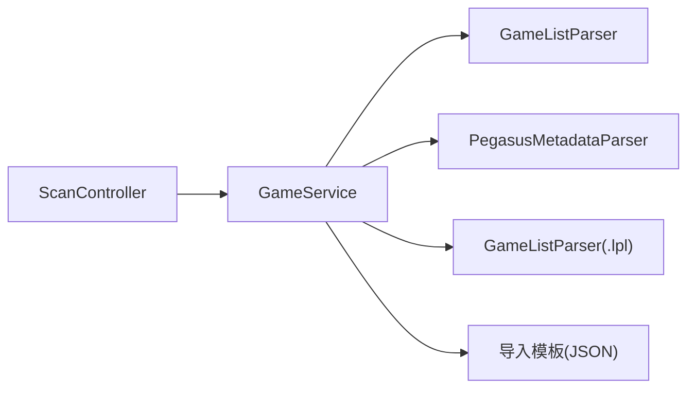

# 游戏扫描与导入

<cite>
**本文引用的文件**
- [ScanController.java](file://src/main/java/com/gamelist/controller/ScanController.java)
- [GameService.java](file://src/main/java/com/gamelist/service/GameService.java)
- [GameListParser.java](file://src/main/java/com/gamelist/xml/GameListParser.java)
- [PegasusMetadataParser.java（util）](file://src/main/java/com/gamelist/util/PegasusMetadataParser.java)
- [PegasusMetadataParser.java（xml）](file://src/main/java/com/gamelist/xml/PegasusMetadataParser.java)
- [ImportRequest.java](file://src/main/java/com/gamelist/model/ImportRequest.java)
- [ScanResult.java](file://src/main/java/com/gamelist/model/ScanResult.java)
- [import-templates-cn.md](file://docs/import-templates-cn.md)
</cite>

## 目录
1. [简介](#简介)
2. [项目结构](#项目结构)
3. [核心组件](#核心组件)
4. [架构总览](#架构总览)
5. [详细组件分析](#详细组件分析)
6. [依赖关系分析](#依赖关系分析)
7. [性能考虑](#性能考虑)
8. [故障排查指南](#故障排查指南)
9. [结论](#结论)
10. [附录：API调用示例与最佳实践](#附录api调用示例与最佳实践)

## 简介
本文件面向“游戏扫描与导入”功能，覆盖以下能力：
- XML 文件导入（gamelist.xml）
- 目录扫描导入（自动发现 gamelist.xml、metadata.pegasus.txt、Lakka .lpl 等）
- Pegasus 元数据导入（metadata.pegasus.txt）
- ScanRequest/ScanResult 对象结构与参数说明（路径、深度、导入方式、模板、扩展名、Scraper系统ID）
- 批量导入游戏列表的 API 调用流程
- 导入过程中的错误处理机制与数据验证规则
- 性能优化建议与常见问题解决方案

## 项目结构
该功能主要由控制器层、服务接口、XML/文本解析器以及模型对象组成：
- 控制器：提供扫描、导入、浏览目录等 REST 接口
- 服务接口：定义导入、扫描、统计等能力
- 解析器：负责解析 XML（JAXB）、Pegasus 文本、Lakka .lpl 播放列表
- 模型：封装请求与响应结构（如 ScanRequest、ScanResult、ImportRequest）
- 模板配置：通过 JSON 模板控制字段映射、媒体匹配、扩展名等



图表来源
- [ScanController.java:170-240](file://src/main/java/com/gamelist/controller/ScanController.java#L170-L240)
- [GameService.java:13-37](file://src/main/java/com/gamelist/service/GameService.java#L13-L37)
- [GameListParser.java:319-384](file://src/main/java/com/gamelist/xml/GameListParser.java#L319-L384)
- [PegasusMetadataParser.java（util）:284-614](file://src/main/java/com/gamelist/util/PegasusMetadataParser.java#L284-L614)

章节来源
- [ScanController.java:170-240](file://src/main/java/com/gamelist/controller/ScanController.java#L170-L240)
- [GameService.java:13-37](file://src/main/java/com/gamelist/service/GameService.java#L13-L37)

## 核心组件
- ScanController：提供 /api/scan、/api/scan/import、/api/scan/browse 等接口；内部定义了 ScanRequest、ImportRequest 等请求体结构；实现目录扫描、异步导入任务。
- GameService：定义导入与扫描相关方法签名，包括从 XML、Pegasus 文本、.lpl 文件导入，以及按路径扫描导入。
- GameListParser：支持多编码检测与容错解析 XML，识别平台类型，解析 Lakka .lpl 播放列表。
- PegasusMetadataParser：解析 metadata.pegasus.txt，支持 collection/game 分段、多值 files、assets 块等多种格式。
- ImportRequest/ScanResult：封装导入请求与扫描结果的结构。

章节来源
- [ScanController.java:40-168](file://src/main/java/com/gamelist/controller/ScanController.java#L40-L168)
- [GameService.java:13-37](file://src/main/java/com/gamelist/service/GameService.java#L13-L37)
- [GameListParser.java:319-384](file://src/main/java/com/gamelist/xml/GameListParser.java#L319-L384)
- [PegasusMetadataParser.java（util）:284-614](file://src/main/java/com/gamelist/util/PegasusMetadataParser.java#L284-L614)
- [ScanResult.java:5-92](file://src/main/java/com/gamelist/model/ScanResult.java#L5-L92)
- [ImportRequest.java:9-28](file://src/main/java/com/gamelist/model/ImportRequest.java#L9-L28)

## 架构总览
整体流程：
- 扫描阶段：根据路径与深度，递归查找目标数据文件（gamelist.xml、metadata.pegasus.txt、*.lpl），返回 ScanResult。
- 导入阶段：根据文件类型选择对应解析器，结合导入模板进行字段映射与媒体匹配，最终持久化到数据库。
- 异步执行：导入任务以后台任务形式执行，支持进度与日志更新。



图表来源
- [ScanController.java:170-240](file://src/main/java/com/gamelist/controller/ScanController.java#L170-L240)
- [ScanController.java:244-410](file://src/main/java/com/gamelist/controller/ScanController.java#L244-L410)
- [GameService.java:13-37](file://src/main/java/com/gamelist/service/GameService.java#L13-L37)
- [GameListParser.java:319-384](file://src/main/java/com/gamelist/xml/GameListParser.java#L319-L384)
- [PegasusMetadataParser.java（util）:284-614](file://src/main/java/com/gamelist/util/PegasusMetadataParser.java#L284-L614)

## 详细组件分析

### 扫描与导入控制器（ScanController）
- 扫描接口 /api/scan：
  - 接收 ScanRequest（path、depth、importMethod、importTemplate、noDataFile、fileExtensions、scraperSystemId）。
  - 若使用模板模式，则加载模板并确定目标数据文件类型；否则默认同时扫描两种文件类型。
  - 递归扫描子目录，支持通配符（如 *.lpl）与精确文件名匹配。
  - 返回 ScanResult，包含 foundFiles、details（每个文件的类型与状态）。
- 导入接口 /api/scan/import：
  - 接收 ImportRequest（files、type、metadataOnly、threadCount、importMethod、importTemplate、scanPath、noDataFile、fileExtensions、scraperSystemId）。
  - 校验线程数范围，解析 scraperSystemId。
  - 无数据文件模式：直接按 scanPath + fileExtensions 扫描并导入。
  - 有数据文件模式：遍历文件列表，根据后缀选择解析器（XML、Pegasus、.lpl），累计统计并更新任务进度与日志。
  - 异常捕获：记录详细堆栈，跳过失败文件，汇总结果。
- 目录浏览 /api/scan/browse：
  - 返回指定路径下的子目录列表，用于前端选择路径。



图表来源
- [ScanController.java:170-240](file://src/main/java/com/gamelist/controller/ScanController.java#L170-L240)
- [ScanController.java:418-506](file://src/main/java/com/gamelist/controller/ScanController.java#L418-L506)

章节来源
- [ScanController.java:40-168](file://src/main/java/com/gamelist/controller/ScanController.java#L40-L168)
- [ScanController.java:170-240](file://src/main/java/com/gamelist/controller/ScanController.java#L170-L240)
- [ScanController.java:244-410](file://src/main/java/com/gamelist/controller/ScanController.java#L244-L410)
- [ScanController.java:418-506](file://src/main/java/com/gamelist/controller/ScanController.java#L418-L506)

### XML 导入与解析（GameListParser）
- 多编码检测与容错：
  - 优先检测 BOM（UTF-8/16/32 BE/LE），其次尝试 XML 声明中的 encoding。
  - 若未检测到，默认 UTF-8；支持 GBK/GB2312 等备选编码。
  - 设置 JAXB 忽略未知元素，提升兼容性。
- 平台类型识别：
  - 基于 Provider.System/Software 或特定字段（如 hash）推断平台类型。
- Lakka .lpl 播放列表解析：
  - 自动检测 5 行或 6 行格式，支持 ZIP 压缩 ROM 路径处理、playlistName 提取平台名等。



图表来源
- [GameListParser.java:42-139](file://src/main/java/com/gamelist/xml/GameListParser.java#L42-L139)
- [GameListParser.java:148-276](file://src/main/java/com/gamelist/xml/GameListParser.java#L148-L276)
- [GameListParser.java:319-384](file://src/main/java/com/gamelist/xml/GameListParser.java#L319-L384)
- [GameListParser.java:496-547](file://src/main/java/com/gamelist/xml/GameListParser.java#L496-L547)
- [GameListParser.java:578-697](file://src/main/java/com/gamelist/xml/GameListParser.java#L578-L697)

章节来源
- [GameListParser.java:42-139](file://src/main/java/com/gamelist/xml/GameListParser.java#L42-L139)
- [GameListParser.java:148-276](file://src/main/java/com/gamelist/xml/GameListParser.java#L148-L276)
- [GameListParser.java:319-384](file://src/main/java/com/gamelist/xml/GameListParser.java#L319-L384)
- [GameListParser.java:496-547](file://src/main/java/com/gamelist/xml/GameListParser.java#L496-L547)
- [GameListParser.java:578-697](file://src/main/java/com/gamelist/xml/GameListParser.java#L578-L697)

### Pegasus 元数据导入（PegasusMetadataParser）
- 解析 metadata.pegasus.txt：
  - 支持 collection 与 game 分段，处理 sort-by、launch、description 等多行内容。
  - 支持 assets 块与多种变体键名（如 boxFront/box_front、background/bg 等）。
  - 支持多值 files 字段（缩进延续行）。
- 数据结构：
  - GameCollection：集合名称、排序、启动命令、游戏列表。
  - Game：名称、文件、开发者、发行商、类型、描述、发布日期、玩家数、评分、各类媒体资源路径等。



图表来源
- [PegasusMetadataParser.java（util）:12-45](file://src/main/java/com/gamelist/util/PegasusMetadataParser.java#L12-L45)
- [PegasusMetadataParser.java（util）:47-282](file://src/main/java/com/gamelist/util/PegasusMetadataParser.java#L47-L282)

章节来源
- [PegasusMetadataParser.java（util）:284-614](file://src/main/java/com/gamelist/util/PegasusMetadataParser.java#L284-L614)
- [PegasusMetadataParser.java（xml）:15-107](file://src/main/java/com/gamelist/xml/PegasusMetadataParser.java#L15-L107)

### 扫描与导入请求/响应模型
- ScanRequest（控制器内局部类）：
  - path：扫描根路径
  - depth：扫描深度（-1 递归所有；0 当前目录；1-3 指定深度）
  - importMethod：traditional/template/noDataFile
  - importTemplate：模板文件名
  - noDataFile：无数据文件导入模式开关
  - fileExtensions：逗号分隔的文件扩展名过滤
  - scraperSystemId：选中的 Scraper 系统 ID
- ImportRequest（控制器内局部类）：
  - files：要导入的文件路径列表
  - type：gamelist.xml/metadata.pegasus.txt/none
  - metadataOnly：仅使用数据文件标签，不进行自动匹配
  - threadCount：导入线程数（默认4，上限10）
  - importMethod/importTemplate：同 ScanRequest
  - scanPath/fileExtensions：无数据文件模式时使用
  - scraperSystemId：同 ScanRequest
- ScanResult：
  - success/message/foundFiles/importedFiles
  - details：每个文件的 filePath、type、message、success

章节来源
- [ScanController.java:40-168](file://src/main/java/com/gamelist/controller/ScanController.java#L40-L168)
- [ScanResult.java:5-92](file://src/main/java/com/gamelist/model/ScanResult.java#L5-L92)
- [ImportRequest.java:9-28](file://src/main/java/com/gamelist/model/ImportRequest.java#L9-L28)

## 依赖关系分析
- 控制器依赖服务接口，服务接口再委托具体解析器完成数据解析与导入。
- 解析器之间职责清晰：XML 由 GameListParser 处理，Pegasus 文本由 PegasusMetadataParser 处理，.lpl 由 GameListParser 处理。
- 模板配置通过 JSON 驱动字段映射与媒体匹配，增强导入灵活性。



图表来源
- [ScanController.java:170-240](file://src/main/java/com/gamelist/controller/ScanController.java#L170-L240)
- [GameService.java:13-37](file://src/main/java/com/gamelist/service/GameService.java#L13-L37)
- [import-templates-cn.md:18-73](file://docs/import-templates-cn.md#L18-L73)

章节来源
- [GameService.java:13-37](file://src/main/java/com/gamelist/service/GameService.java#L13-L37)
- [import-templates-cn.md:18-73](file://docs/import-templates-cn.md#L18-L73)

## 性能考虑
- 多线程导入：
  - 支持 threadCount 参数，默认 4，最大 10，避免过多线程导致资源争用。
- 编码检测与容错：
  - 多编码尝试可能带来额外开销，但能显著提升兼容性与成功率。
- 模板匹配：
  - 合理配置 fieldMappings 与 media 规则，减少不必要的文件匹配计算。
- 扫描深度控制：
  - 使用 depth 限制递归层级，避免大目录树带来的性能问题。
- 异步任务：
  - 导入过程采用后台任务，避免阻塞请求线程，提升用户体验。

[本节为通用指导，不直接分析具体文件]

## 故障排查指南
- 路径无效：
  - 扫描前校验路径存在且为目录，否则返回失败消息。
- 文件不存在：
  - 导入时检查文件存在性，不存在则记录跳过原因。
- 不支持的文件类型：
  - 仅支持 gamelist.xml、metadata.pegasus.txt、.lpl，其他类型将被跳过并记录。
- XML 解析失败：
  - 多编码尝试后仍失败会抛出异常；可检查文件编码、BOM、XML 结构是否符合预期。
- 异常堆栈记录：
  - 导入过程中捕获异常并记录详细堆栈，便于定位问题。
- 模板加载失败：
  - 模板加载失败将降级为默认扫描方式，并记录警告日志。

章节来源
- [ScanController.java:170-240](file://src/main/java/com/gamelist/controller/ScanController.java#L170-L240)
- [ScanController.java:244-410](file://src/main/java/com/gamelist/controller/ScanController.java#L244-L410)
- [GameListParser.java:319-384](file://src/main/java/com/gamelist/xml/GameListParser.java#L319-L384)

## 结论
该扫描与导入功能提供了灵活的 XML、Pegasus 元数据与目录扫描导入能力，支持模板驱动的字段映射与媒体匹配，具备多编码容错、异步任务、详细日志与错误处理机制。通过合理配置模板与参数，可实现高效稳定的批量导入。

[本节为总结，不直接分析具体文件]

## 附录：API调用示例与最佳实践

### 扫描接口
- 端点：POST /api/scan
- 请求体（ScanRequest）：
  - path：必填，扫描根路径
  - depth：可选，-1/0/1-3
  - importMethod：可选，traditional/template/noDataFile
  - importTemplate：可选，模板文件名
  - noDataFile：可选，无数据文件模式开关
  - fileExtensions：可选，逗号分隔扩展名
  - scraperSystemId：可选，Scraper 系统 ID
- 响应（ScanResult）：
  - success/message/foundFiles/importedFiles/details[]

章节来源
- [ScanController.java:170-240](file://src/main/java/com/gamelist/controller/ScanController.java#L170-L240)
- [ScanResult.java:5-92](file://src/main/java/com/gamelist/model/ScanResult.java#L5-L92)

### 导入接口
- 端点：POST /api/scan/import
- 请求体（ImportRequest）：
  - files：可选，文件路径列表
  - type：可选，gamelist.xml/metadata.pegasus.txt/none
  - metadataOnly：可选，仅使用数据文件标签
  - threadCount：可选，默认4，上限10
  - importMethod/importTemplate：可选
  - scanPath/fileExtensions：无数据文件模式时使用
  - scraperSystemId：可选
- 响应：BackgroundTask（任务ID、状态、进度、日志）

章节来源
- [ScanController.java:244-410](file://src/main/java/com/gamelist/controller/ScanController.java#L244-L410)

### 批量导入流程（序列图）
```mermaid
sequenceDiagram
participant U as "用户"
participant API as "ScanController"
participant SVC as "GameService"
participant PAR as "解析器(XML/Pegasus/.lpl)"
participant TSK as "TaskService"
U->>API : 提交ImportRequest(files, threadCount, ...)
API->>TSK : 创建后台任务
loop 遍历files
API->>SVC : 根据文件类型调用导入方法
SVC->>PAR : 解析数据
PAR-->>SVC : 结构化数据
SVC-->>API : ImportStatistics
API->>TSK : 更新进度/日志
end
API-->>U : 返回任务信息(可轮询)
```

图表来源
- [ScanController.java:244-410](file://src/main/java/com/gamelist/controller/ScanController.java#L244-L410)
- [GameService.java:13-37](file://src/main/java/com/gamelist/service/GameService.java#L13-L37)

### 导入模板要点
- 字段映射：通过 rules.fieldMappings 将外部字段映射到系统字段，支持多值字段与转换规则（路径、大小写、替换等）。
- 媒体匹配：rules.media 定义媒体类型与路径模板，支持变量替换（{gameName}/{filepath}/{ext} 等）。
- 扩展名：extensions 与 gameExtensions 控制支持的媒体与游戏文件类型。
- 表头处理：header 支持 XML 或 key-value 格式，用于提取平台信息与结构。

章节来源
- [import-templates-cn.md:108-158](file://docs/import-templates-cn.md#L108-L158)
- [import-templates-cn.md:159-223](file://docs/import-templates-cn.md#L159-L223)
- [import-templates-cn.md:224-526](file://docs/import-templates-cn.md#L224-L526)
- [import-templates-cn.md:780-800](file://docs/import-templates-cn.md#L780-L800)