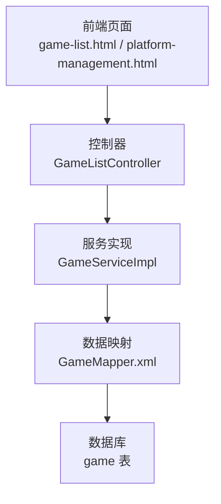
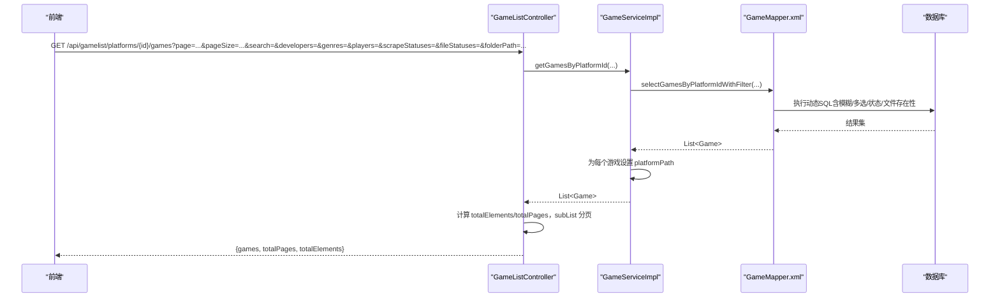
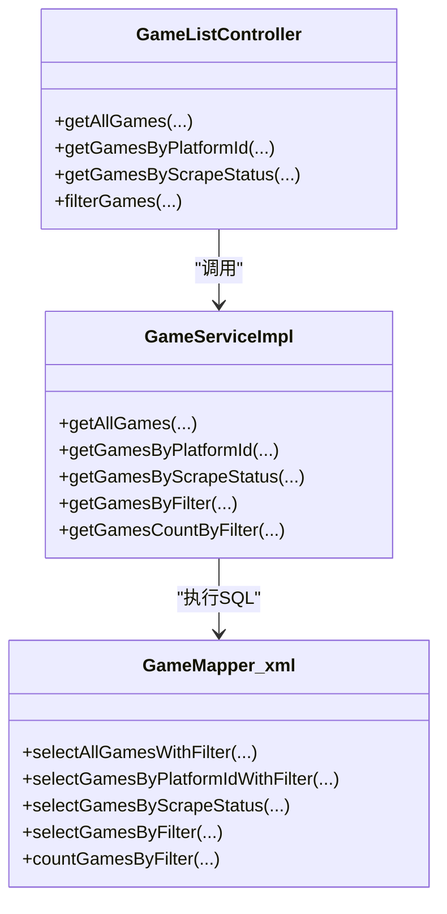

# 游戏筛选与搜索

<cite>
**本文引用的文件**
- [GameListController.java](file://src/main/java/com/gamelist/controller/GameListController.java)
- [GameService.java](file://src/main/java/com/gamelist/service/GameService.java)
- [GameServiceImpl.java](file://src/main/java/com/gamelist/service/impl/GameServiceImpl.java)
- [GameMapper.xml](file://src/main/resources/mappers/GameMapper.xml)
- [game-list.html](file://src/main/resources/static/game-list.html)
- [platform-management.html](file://src/main/resources/static/platform-management.html)
</cite>

## 目录
1. [简介](#简介)
2. [项目结构](#项目结构)
3. [核心组件](#核心组件)
4. [架构总览](#架构总览)
5. [详细组件分析](#详细组件分析)
6. [依赖关系分析](#依赖关系分析)
7. [性能考量](#性能考量)
8. [故障排查指南](#故障排查指南)
9. [结论](#结论)
10. [附录：API 与示例](#附录api-与示例)

## 简介
本章节面向“游戏筛选与搜索”功能，系统说明支持的筛选条件、分页参数、模糊匹配机制、复杂查询组合方式以及常用场景的最佳实践。内容基于后端控制器、服务实现、MyBatis 映射与前端调用代码进行梳理，确保与实际实现一致。

## 项目结构
- 控制器层：提供 REST 接口，接收筛选与分页参数，返回分页后的游戏列表或计数。
- 服务层：封装业务逻辑，负责参数组装、平台路径填充、结果处理等。
- 数据访问层：通过 MyBatis XML 动态拼装 SQL，支持多条件组合、模糊匹配、状态判定与分页。
- 前端页面：构造请求 URL 或请求体，传递筛选条件与分页参数，并渲染结果。

图表来源
- [GameListController.java:128-199](file://src/main/java/com/gamelist/controller/GameListController.java#L128-L199)
- [GameServiceImpl.java:2001-2153](file://src/main/java/com/gamelist/service/impl/GameServiceImpl.java#L2001-L2153)
- [GameMapper.xml:105-275](file://src/main/resources/mappers/GameMapper.xml#L105-L275)

章节来源
- [GameListController.java:128-199](file://src/main/java/com/gamelist/controller/GameListController.java#L128-L199)
- [GameServiceImpl.java:2001-2153](file://src/main/java/com/gamelist/service/impl/GameServiceImpl.java#L2001-L2153)
- [GameMapper.xml:105-275](file://src/main/resources/mappers/GameMapper.xml#L105-L275)

## 核心组件
- 控制器接口
  - 获取全部游戏（支持通用筛选与分页）
  - 按平台 ID 获取游戏（支持更丰富的筛选与分页）
  - 按刮削状态获取游戏（分页）
  - 筛选计数（用于高级筛选的“结果数量”预览）
  - 获取唯一值（开发商、发行商、类型、玩家数等，供前端下拉框使用）
- 服务实现
  - 将筛选参数传递给 Mapper
  - 为返回的游戏对象补充 platformPath
  - 对文件夹路径进行后处理过滤（当需要时）
- 数据映射
  - 动态 SQL 支持：名称/路径模糊匹配、年份区间、多选（开发商/类型/玩家）、刮削状态、文件存在性、正则表达式等
  - 分页：LIMIT/OFFSET 或应用层切片

章节来源
- [GameListController.java:128-199](file://src/main/java/com/gamelist/controller/GameListController.java#L128-L199)
- [GameService.java:40-61](file://src/main/java/com/gamelist/service/GameService.java#L40-L61)
- [GameServiceImpl.java:2001-2253](file://src/main/java/com/gamelist/service/impl/GameServiceImpl.java#L2001-L2253)
- [GameMapper.xml:105-275](file://src/main/resources/mappers/GameMapper.xml#L105-L275)

## 架构总览
以下序列图展示一次“按平台+多条件+分页”的查询流程：

图表来源
- [GameListController.java:165-199](file://src/main/java/com/gamelist/controller/GameListController.java#L165-L199)
- [GameServiceImpl.java:2109-2153](file://src/main/java/com/gamelist/service/impl/GameServiceImpl.java#L2109-L2153)
- [GameMapper.xml:185-275](file://src/main/resources/mappers/GameMapper.xml#L185-L275)

## 详细组件分析

### 筛选条件详解
- 平台 ID 筛选
  - 接口：GET /api/gamelist/platforms/{platformId}/games
  - 作用：限定在指定平台下检索
  - 注意：该接口同时支持其他筛选条件叠加
  - 参考：[GameListController.java:165-199](file://src/main/java/com/gamelist/controller/GameListController.java#L165-L199)

- 开发商筛选（多选）
  - 参数名：developers（数组）
  - 行为：IN 匹配多个开发商
  - 参考：[GameMapper.xml:196-201](file://src/main/resources/mappers/GameMapper.xml#L196-L201)

- 游戏类型筛选（多选）
  - 参数名：genres（数组）
  - 行为：IN 匹配多个类型
  - 参考：[GameMapper.xml:202-207](file://src/main/resources/mappers/GameMapper.xml#L202-L207)

- 玩家数量筛选（多选）
  - 参数名：players（数组）
  - 行为：IN 匹配多个玩家数（如 "1", "2+", "多人" 等）
  - 参考：[GameMapper.xml:208-213](file://src/main/resources/mappers/GameMapper.xml#L208-L213)

- 刮削状态筛选（多选）
  - 参数名：scrapeStatuses（数组），取值：fully/partially/not
  - 语义：
    - fully：描述完整且媒体资源充足
    - partially：描述与媒体不完整组合
    - not：未刮削或信息缺失
  - 参考：[GameMapper.xml:214-275](file://src/main/resources/mappers/GameMapper.xml#L214-L275)

- 文件状态筛选（多选）
  - 参数名：fileStatuses（数组），取值：exists/not_exists
  - 语义：根据 exists 字段判断文件是否存在
  - 参考：[GameMapper.xml:262-275](file://src/main/resources/mappers/GameMapper.xml#L262-L275)

- 名称/路径模糊匹配
  - 参数名：search
  - 行为：对 name、translated_name、path 进行大小写不敏感模糊匹配
  - 参考：[GameMapper.xml:187-189](file://src/main/resources/mappers/GameMapper.xml#L187-L189)

- 年份区间筛选
  - 参数名：startDate、endDate
  - 行为：按 releasedate 前四位年份比较
  - 参考：[GameMapper.xml:190-195](file://src/main/resources/mappers/GameMapper.xml#L190-L195)

- 文件夹路径筛选（可选）
  - 参数名：folderPath
  - 行为：在服务层对 path 进行层级片段匹配（忽略大小写）
  - 参考：[GameServiceImpl.java:2123-2153](file://src/main/java/com/gamelist/service/impl/GameServiceImpl.java#L2123-L2153)

- 高级筛选（POST /api/gamelist/games/filter）
  - 支持：platformIds、ratingMin、yearMin/yearMax、developer/publisher/genre/minPlayers/language、scrapeStatus、fileStatus、startDate/endDate、developers/publishers/genres/players（多选）、gameNameRegex（正则）
  - 用途：用于“筛选预览计数”，便于前端显示符合条件的总数
  - 参考：
    - [GameListController.java:418-431](file://src/main/java/com/gamelist/controller/GameListController.java#L418-L431)
    - [GameServiceImpl.java:2250-2253](file://src/main/java/com/gamelist/service/impl/GameServiceImpl.java#L2250-L2253)
    - [GameMapper.xml:573-800](file://src/main/resources/mappers/GameMapper.xml#L573-L800)

章节来源
- [GameListController.java:128-199](file://src/main/java/com/gamelist/controller/GameListController.java#L128-L199)
- [GameListController.java:418-431](file://src/main/java/com/gamelist/controller/GameListController.java#L418-L431)
- [GameServiceImpl.java:2001-2253](file://src/main/java/com/gamelist/service/impl/GameServiceImpl.java#L2001-L2253)
- [GameMapper.xml:105-275](file://src/main/resources/mappers/GameMapper.xml#L105-L275)
- [GameMapper.xml:573-800](file://src/main/resources/mappers/GameMapper.xml#L573-L800)

### 分页参数
- 页码与每页大小
  - 参数：page（默认 1）、pageSize（默认 20）
  - 行为：控制器在内存中对结果进行 subList 切片，并计算 totalPages、totalElements
  - 参考：[GameListController.java:128-159](file://src/main/java/com/gamelist/controller/GameListController.java#L128-L159), [GameListController.java:165-199](file://src/main/java/com/gamelist/controller/GameListController.java#L165-L199)
- 按刮削状态分页
  - 接口：GET /api/gamelist/games/by-status?platformId=&status=&page=&size=
  - 行为：服务端使用 LIMIT/OFFSET 分页
  - 参考：[GameListController.java:250-266](file://src/main/java/com/gamelist/controller/GameListController.java#L250-L266), [GameMapper.xml:390-438](file://src/main/resources/mappers/GameMapper.xml#L390-L438)

章节来源
- [GameListController.java:128-199](file://src/main/java/com/gamelist/controller/GameListController.java#L128-L199)
- [GameListController.java:250-266](file://src/main/java/com/gamelist/controller/GameListController.java#L250-L266)
- [GameMapper.xml:390-438](file://src/main/resources/mappers/GameMapper.xml#L390-L438)

### 模糊匹配机制
- 名称/路径模糊匹配：LOWER(name/path) LIKE CONCAT('%', LOWER(search), '%')
- 正则表达式匹配：name REGEXP #{gameNameRegex}（用于高级筛选）
- 年份区间：SUBSTRING(releasedate, 1, 4) 与整数比较
- 多选 IN：developers、genres、players 等以 IN (...) 形式匹配
- 参考：[GameMapper.xml:107-115](file://src/main/resources/mappers/GameMapper.xml#L107-L115), [GameMapper.xml:187-213](file://src/main/resources/mappers/GameMapper.xml#L187-L213), [GameMapper.xml:776-779](file://src/main/resources/mappers/GameMapper.xml#L776-L779)

章节来源
- [GameMapper.xml:107-115](file://src/main/resources/mappers/GameMapper.xml#L107-L115)
- [GameMapper.xml:187-213](file://src/main/resources/mappers/GameMapper.xml#L187-L213)
- [GameMapper.xml:776-779](file://src/main/resources/mappers/GameMapper.xml#L776-L779)

### 复杂查询组合
- 典型组合：平台 + 开发商 + 类型 + 玩家数 + 刮削状态 + 文件状态 + 年份区间 + 名称模糊
- 前端构建 URL 示例（节选关键参数）：
  - search、startYear/endYear、developers[]、genres[]、players[]、scrapeStatuses[]、fileStatuses[]、folderPath
  - 参考：[game-list.html:3598-3637](file://src/main/resources/static/game-list.html#L3598-L3637)
- 高级筛选（POST）：可一次性传入 platformIds、ratingMin、yearMin/yearMax、developer/publisher/genre/minPlayers/language、scrapeStatus、fileStatus、startDate/endDate、developers/publishers/genres/players、gameNameRegex
  - 参考：[GameMapper.xml:573-800](file://src/main/resources/mappers/GameMapper.xml#L573-L800)

章节来源
- [game-list.html:3598-3637](file://src/main/resources/static/game-list.html#L3598-L3637)
- [GameMapper.xml:573-800](file://src/main/resources/mappers/GameMapper.xml#L573-L800)

### 常用筛选场景最佳实践
- 仅按平台筛选：直接调用平台接口，减少不必要条件，提升响应速度
- 精确到开发商/类型/玩家数：优先使用多选 IN 条件，避免宽泛模糊
- 结合刮削状态：快速定位需要补全资源的游戏（fully/partially/not）
- 结合文件状态：快速发现缺失文件（not_exists）以便修复
- 年份区间 + 名称模糊：适合历史库整理与重命名批量处理
- 高级筛选计数：先 POST /games/filter 获取 count，再按需加载具体数据，降低带宽与渲染压力

## 依赖关系分析
- 控制器依赖服务接口，服务实现依赖 MyBatis Mapper
- 前端页面通过 URL 参数或 JSON 请求体传递筛选条件
- 动态 SQL 根据传入参数选择性拼接条件，保证灵活性与性能

图表来源
- [GameListController.java:128-199](file://src/main/java/com/gamelist/controller/GameListController.java#L128-L199)
- [GameServiceImpl.java:2001-2253](file://src/main/java/com/gamelist/service/impl/GameServiceImpl.java#L2001-L2253)
- [GameMapper.xml:105-275](file://src/main/resources/mappers/GameMapper.xml#L105-L275)

章节来源
- [GameListController.java:128-199](file://src/main/java/com/gamelist/controller/GameListController.java#L128-L199)
- [GameServiceImpl.java:2001-2253](file://src/main/java/com/gamelist/service/impl/GameServiceImpl.java#L2001-L2253)
- [GameMapper.xml:105-275](file://src/main/resources/mappers/GameMapper.xml#L105-L275)

## 性能考量
- 分页策略
  - 列表接口采用应用层 subList 分页，简单直观；对于大数据量建议配合合理 pageSize（如 20~50）
  - 按刮削状态接口使用 LIMIT/OFFSET，数据库侧分页更高效
- 模糊匹配
  - 名称/路径模糊使用 LIKE '%...%'，在大表上可能较慢；建议优先使用精确或多选 IN 条件
  - 正则表达式 REGEXP 仅在高级筛选中使用，谨慎开启
- 多选条件
  - developers、genres、players 使用 IN (...)，条件过多会影响性能；建议限制选择数量
- 文件夹路径筛选
  - 在服务层对 path 进行字符串拆分与匹配，属于 CPU 密集型操作；建议在数据量较大时尽量前置平台/年份/类型等条件以减少数据集
- 统计与计数
  - 使用专门的 count 查询（如 countGamesByFilter）获取总数，避免拉取全量数据后再计数

章节来源
- [GameListController.java:128-199](file://src/main/java/com/gamelist/controller/GameListController.java#L128-L199)
- [GameMapper.xml:390-438](file://src/main/resources/mappers/GameMapper.xml#L390-L438)
- [GameMapper.xml:573-800](file://src/main/resources/mappers/GameMapper.xml#L573-L800)
- [GameServiceImpl.java:2123-2153](file://src/main/java/com/gamelist/service/impl/GameServiceImpl.java#L2123-L2153)

## 故障排查指南
- 无结果返回
  - 检查是否传入了冲突的多选条件（如同时选择了互斥的刮削状态）
  - 确认年份区间格式正确（YYYY）
  - 若使用 folderPath，确认路径片段大小写与分隔符
- 分页异常
  - page 从 1 开始；pageSize 过大可能导致内存占用高
  - 按刮削状态分页使用 size/page，注意与列表分页参数区分
- 性能问题
  - 避免过大的模糊匹配范围；优先使用精确或多选 IN
  - 合理使用高级筛选计数接口，减少不必要的数据传输

章节来源
- [GameListController.java:128-199](file://src/main/java/com/gamelist/controller/GameListController.java#L128-L199)
- [GameMapper.xml:105-275](file://src/main/resources/mappers/GameMapper.xml#L105-L275)
- [GameServiceImpl.java:2123-2153](file://src/main/java/com/gamelist/service/impl/GameServiceImpl.java#L2123-L2153)

## 结论
本系统提供了丰富且灵活的筛选能力，覆盖平台、开发商、类型、玩家数、刮削状态、文件状态、年份区间、名称模糊与正则等维度，并通过分页控制数据量。推荐优先使用精确与多选条件，结合刮削与文件状态快速定位问题，必要时使用高级筛选计数接口优化交互体验。

## 附录：API 与示例

### 接口一览
- 获取全部游戏（支持通用筛选与分页）
  - GET /api/gamelist/games?page={}&pageSize={}
  - 可选参数：search、startDate、endDate、developers[]、genres[]、players[]、scrapeStatuses[]、folderPath
  - 参考：[GameListController.java:128-159](file://src/main/java/com/gamelist/controller/GameListController.java#L128-L159)

- 按平台 ID 获取游戏（支持更丰富筛选与分页）
  - GET /api/gamelist/platforms/{platformId}/games?page={}&pageSize={}
  - 可选参数：search、startDate、endDate、developers[]、genres[]、players[]、scrapeStatuses[]、fileStatuses[]、folderPath
  - 参考：[GameListController.java:165-199](file://src/main/java/com/gamelist/controller/GameListController.java#L165-L199)

- 按刮削状态获取游戏（分页）
  - GET /api/gamelist/games/by-status?platformId={}&status={}&page={}&size={}
  - status 取值：fully/partially/not
  - 参考：[GameListController.java:250-266](file://src/main/java/com/gamelist/controller/GameListController.java#L250-L266)

- 筛选计数（高级筛选）
  - POST /api/gamelist/games/filter
  - 请求体键：platformIds、ratingMin、yearMin、yearMax、developer、publisher、genre、minPlayers、language、scrapeStatus[]、fileStatus[]、startDate、endDate、developers[]、publishers[]、genres[]、players[]、gameNameRegex
  - 参考：
    - [GameListController.java:418-431](file://src/main/java/com/gamelist/controller/GameListController.java#L418-L431)
    - [GameMapper.xml:573-800](file://src/main/resources/mappers/GameMapper.xml#L573-L800)

- 获取唯一值（用于前端下拉框）
  - GET /api/gamelist/games/unique-values
  - 参考：[GameListController.java:433-446](file://src/main/java/com/gamelist/controller/GameListController.java#L433-L446)

### 前端参数传递示例（节选）
- 基础筛选参数拼接（URL 查询串）
  - search、startYear/endYear、developers[]、genres[]、players[]、scrapeStatuses[]、fileStatuses[]、folderPath
  - 参考：[game-list.html:3598-3637](file://src/main/resources/static/game-list.html#L3598-L3637)

- 高级筛选请求体（JSON）
  - filter.scrapeStatus、filter.fileStatus、filter.developers、filter.genres、filter.players、filter.gameNameRegex 等
  - 参考：[platform-management.html:2274-2298](file://src/main/resources/static/platform-management.html#L2274-L2298)

### 复杂查询组合示例
- 示例一：查找某平台下“动作/冒险”类型、支持“多人”、已完全刮削且有文件的游戏
  - 接口：GET /api/gamelist/platforms/{id}/games
  - 参数：genres=["动作","冒险"], players=["多人"], scrapeStatuses=["fully"], fileStatuses=["exists"]
  - 参考：[GameMapper.xml:202-213](file://src/main/resources/mappers/GameMapper.xml#L202-L213), [GameMapper.xml:214-275](file://src/main/resources/mappers/GameMapper.xml#L214-L275)

- 示例二：查找 2010-2020 年间发布、名称包含“最终幻想”、开发商为“Square Enix”的游戏
  - 接口：GET /api/gamelist/games
  - 参数：startDate="2010", endDate="2020", search="最终幻想", developers=["Square Enix"]
  - 参考：[GameMapper.xml:107-115](file://src/main/resources/mappers/GameMapper.xml#L107-L115), [GameMapper.xml:187-201](file://src/main/resources/mappers/GameMapper.xml#L187-L201)

- 示例三：使用高级筛选计数，快速预览符合正则条件的游戏数量
  - 接口：POST /api/gamelist/games/filter
  - 请求体：{ "gameNameRegex": "^.*\\d{4}$", "scrapeStatus": ["not"] }
  - 参考：[GameMapper.xml:776-779](file://src/main/resources/mappers/GameMapper.xml#L776-L779), [GameMapper.xml:781-800](file://src/main/resources/mappers/GameMapper.xml#L781-L800)

章节来源
- [GameListController.java:128-199](file://src/main/java/com/gamelist/controller/GameListController.java#L128-L199)
- [GameListController.java:250-266](file://src/main/java/com/gamelist/controller/GameListController.java#L250-L266)
- [GameListController.java:418-446](file://src/main/java/com/gamelist/controller/GameListController.java#L418-L446)
- [game-list.html:3598-3637](file://src/main/resources/static/game-list.html#L3598-L3637)
- [platform-management.html:2274-2298](file://src/main/resources/static/platform-management.html#L2274-L2298)
- [GameMapper.xml:107-115](file://src/main/resources/mappers/GameMapper.xml#L107-L115)
- [GameMapper.xml:187-275](file://src/main/resources/mappers/GameMapper.xml#L187-L275)
- [GameMapper.xml:573-800](file://src/main/resources/mappers/GameMapper.xml#L573-L800)