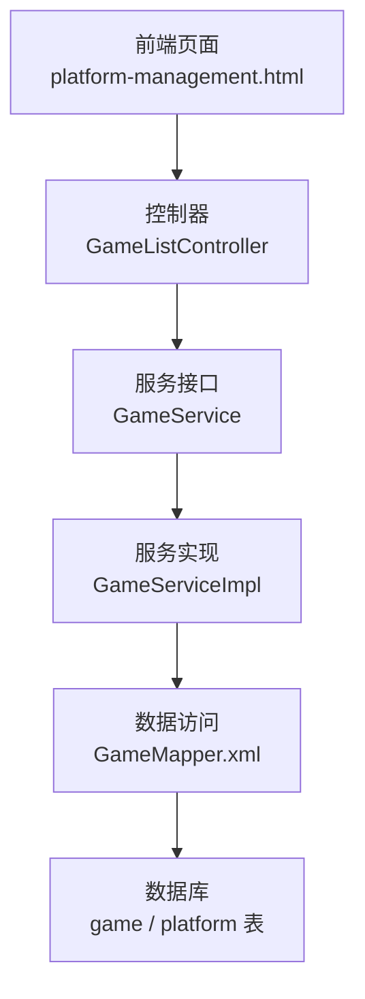
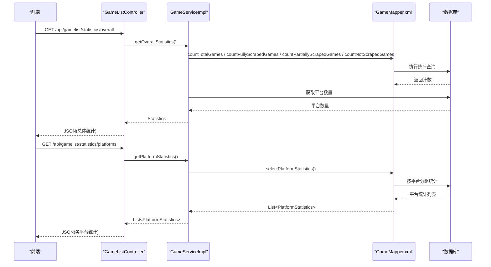
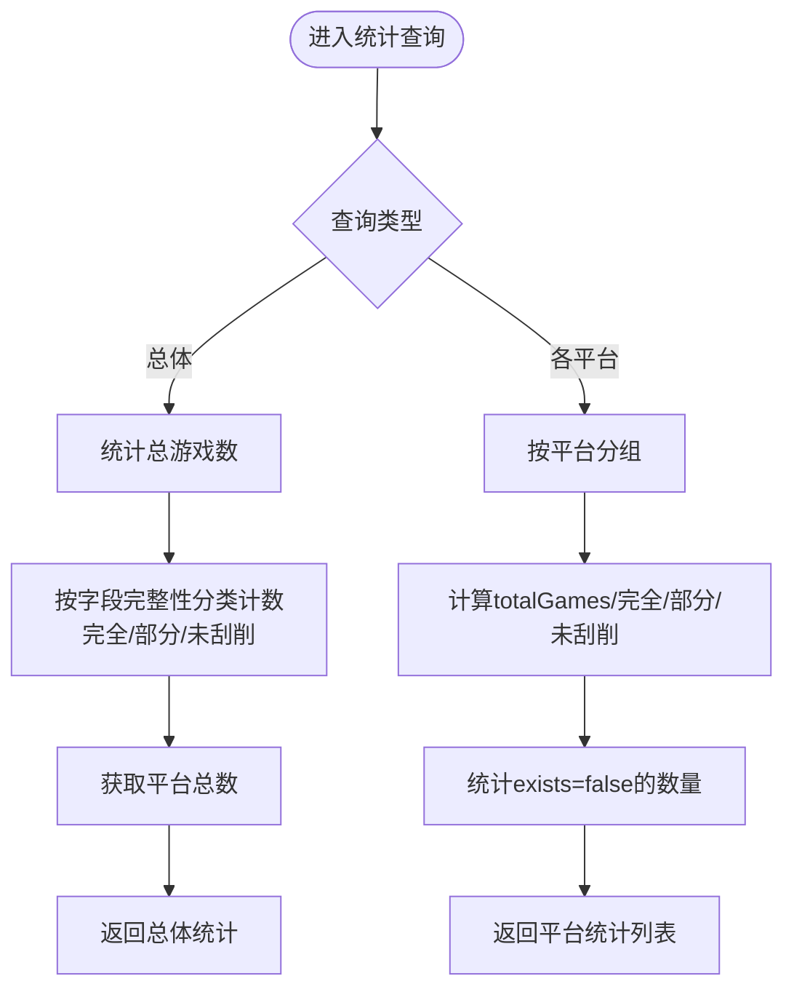
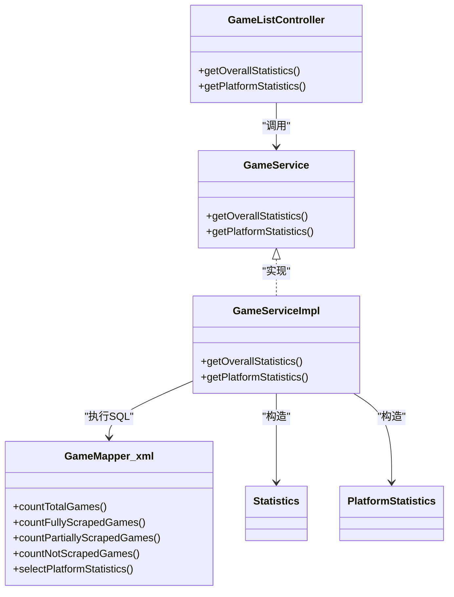

# 统计信息管理

<cite>
**本文引用的文件**
- [GameListController.java](file://src/main/java/com/gamelist/controller/GameListController.java)
- [GameService.java](file://src/main/java/com/gamelist/service/GameService.java)
- [GameServiceImpl.java](file://src/main/java/com/gamelist/service/impl/GameServiceImpl.java)
- [Statistics.java](file://src/main/java/com/gamelist/model/Statistics.java)
- [PlatformStatistics.java](file://src/main/java/com/gamelist/model/PlatformStatistics.java)
- [GameMapper.xml](file://src/main/resources/mappers/GameMapper.xml)
- [platform-management.html](file://src/main/resources/static/platform-management.html)
</cite>

## 目录
1. [简介](#简介)
2. [项目结构](#项目结构)
3. [核心组件](#核心组件)
4. [架构总览](#架构总览)
5. [详细组件分析](#详细组件分析)
6. [依赖关系分析](#依赖关系分析)
7. [性能考虑](#性能考虑)
8. [故障排查指南](#故障排查指南)
9. [结论](#结论)
10. [附录：API调用示例与可视化建议](#附录api调用示例与可视化建议)

## 简介
本章节面向“统计信息管理”功能，覆盖总体统计与各平台统计的获取方法、数据结构定义、计算逻辑与更新机制，并提供前端调用示例与可视化展示建议。该功能用于帮助管理员掌握游戏库的整体质量（如元数据完整度）以及各平台的完成情况，从而指导刮削、补全和运营决策。

## 项目结构
统计信息相关代码主要分布在以下层次：
- 控制器层：暴露REST接口，提供总体统计与各平台统计查询
- 服务层：封装业务逻辑，聚合统计数据
- 数据访问层：通过MyBatis映射执行SQL统计查询
- 模型层：定义返回给前端的统计对象
- 前端页面：调用统计接口并渲染图表与列表

图示来源
- [GameListController.java:222-247](file://src/main/java/com/gamelist/controller/GameListController.java#L222-L247)
- [GameService.java:49-50](file://src/main/java/com/gamelist/service/GameService.java#L49-L50)
- [GameServiceImpl.java:2176-2190](file://src/main/java/com/gamelist/service/impl/GameServiceImpl.java#L2176-L2190)
- [GameMapper.xml:297-388](file://src/main/resources/mappers/GameMapper.xml#L297-L388)

章节来源
- [GameListController.java:222-247](file://src/main/java/com/gamelist/controller/GameListController.java#L222-L247)
- [GameService.java:49-50](file://src/main/java/com/gamelist/service/GameService.java#L49-L50)
- [GameServiceImpl.java:2176-2190](file://src/main/java/com/gamelist/service/impl/GameServiceImpl.java#L2176-L2190)
- [GameMapper.xml:297-388](file://src/main/resources/mappers/GameMapper.xml#L297-L388)

## 核心组件
- Statistics：总体统计对象，包含总游戏数、完全刮削数、部分刮削数、未刮削数、平台总数等
- PlatformStatistics：各平台统计对象，包含平台ID、名称、总游戏数、完全/部分/未刮削数、缺失游戏数
- GameListController：对外暴露 /api/gamelist/statistics/overall 与 /api/gamelist/statistics/platforms
- GameService/GameServiceImpl：实现统计数据的聚合与组装
- GameMapper.xml：定义统计相关的SQL查询，包括按平台分组统计与按状态计数

章节来源
- [Statistics.java:1-40](file://src/main/java/com/gamelist/model/Statistics.java#L1-L40)
- [PlatformStatistics.java:1-54](file://src/main/java/com/gamelist/model/PlatformStatistics.java#L1-L54)
- [GameListController.java:222-247](file://src/main/java/com/gamelist/controller/GameListController.java#L222-L247)
- [GameServiceImpl.java:2176-2190](file://src/main/java/com/gamelist/service/impl/GameServiceImpl.java#L2176-L2190)
- [GameMapper.xml:297-388](file://src/main/resources/mappers/GameMapper.xml#L297-L388)

## 架构总览
统计信息的请求链路如下：
- 前端发起GET请求到 /api/gamelist/statistics/overall 或 /api/gamelist/statistics/platforms
- 控制器将请求转发至服务层
- 服务层调用数据访问层执行SQL统计
- 数据访问层从 game 与 platform 表中聚合结果
- 控制器将结果以JSON形式返回给前端

图示来源
- [GameListController.java:222-247](file://src/main/java/com/gamelist/controller/GameListController.java#L222-L247)
- [GameServiceImpl.java:2176-2190](file://src/main/java/com/gamelist/service/impl/GameServiceImpl.java#L2176-L2190)
- [GameMapper.xml:297-388](file://src/main/resources/mappers/GameMapper.xml#L297-L388)

## 详细组件分析

### 数据结构定义
- Statistics
  - totalGames：总游戏数
  - fullyScraped：完全刮削的游戏数（具备名称、描述或翻译描述、图片、视频、海报、缩略图、手册等必要字段）
  - partiallyScraped：部分刮削的游戏数（具备名称与描述/翻译描述，但缺少若干媒体字段）
  - notScraped：未刮削的游戏数（不满足完全或部分条件）
  - totalPlatforms：平台总数
- PlatformStatistics
  - platformId：平台ID
  - platformName：平台名称
  - totalGames：该平台下游戏总数
  - fullyScraped：完全刮削数
  - partiallyScraped：部分刮削数
  - notScraped：未刮削数
  - missingGames：缺失游戏数（对应 exists=false）

章节来源
- [Statistics.java:1-40](file://src/main/java/com/gamelist/model/Statistics.java#L1-L40)
- [PlatformStatistics.java:1-54](file://src/main/java/com/gamelist/model/PlatformStatistics.java#L1-L54)

### API接口说明
- 获取总体统计
  - 路径：GET /api/gamelist/statistics/overall
  - 响应体：Statistics 对象
- 获取各平台统计
  - 路径：GET /api/gamelist/statistics/platforms
  - 响应体：List<PlatformStatistics>

章节来源
- [GameListController.java:222-247](file://src/main/java/com/gamelist/controller/GameListController.java#L222-L247)

### 计算逻辑与更新机制
- 总体统计
  - 总游戏数：直接对 game 表COUNT
  - 完全/部分/未刮削：依据 name、desc/translated_desc 及 image/video/marquee/thumbnail/manual 等字段的非空情况分类计数
  - 平台总数：通过平台服务获取所有平台后取size
- 各平台统计
  - 基于 platform LEFT JOIN game，按平台分组统计 totalGames、fullyScraped、partiallyScraped、notScraped
  - missingGames：统计 exists=false 的游戏数量
- 更新机制
  - 统计为实时计算型，每次请求触发数据库查询；无独立缓存或定时任务更新
  - 当游戏元数据变更（新增、编辑、删除、迁移）时，下一次请求即反映最新状态

图示来源
- [GameMapper.xml:297-388](file://src/main/resources/mappers/GameMapper.xml#L297-L388)
- [GameServiceImpl.java:2176-2190](file://src/main/java/com/gamelist/service/impl/GameServiceImpl.java#L2176-L2190)

章节来源
- [GameMapper.xml:297-388](file://src/main/resources/mappers/GameMapper.xml#L297-L388)
- [GameServiceImpl.java:2176-2190](file://src/main/java/com/gamelist/service/impl/GameServiceImpl.java#L2176-L2190)

### 类关系图

图示来源
- [GameListController.java:222-247](file://src/main/java/com/gamelist/controller/GameListController.java#L222-L247)
- [GameService.java:49-50](file://src/main/java/com/gamelist/service/GameService.java#L49-L50)
- [GameServiceImpl.java:2176-2190](file://src/main/java/com/gamelist/service/impl/GameServiceImpl.java#L2176-L2190)
- [GameMapper.xml:297-388](file://src/main/resources/mappers/GameMapper.xml#L297-L388)

## 依赖关系分析
- 控制器依赖服务接口，服务实现依赖数据访问层
- 数据访问层依赖数据库表结构与索引
- 前端页面依赖控制器暴露的REST接口

图示来源
- [GameListController.java:222-247](file://src/main/java/com/gamelist/controller/GameListController.java#L222-L247)
- [GameServiceImpl.java:2176-2190](file://src/main/java/com/gamelist/service/impl/GameServiceImpl.java#L2176-L2190)
- [GameMapper.xml:297-388](file://src/main/resources/mappers/GameMapper.xml#L297-L388)

章节来源
- [GameListController.java:222-247](file://src/main/java/com/gamelist/controller/GameListController.java#L222-L247)
- [GameServiceImpl.java:2176-2190](file://src/main/java/com/gamelist/service/impl/GameServiceImpl.java#L2176-L2190)
- [GameMapper.xml:297-388](file://src/main/resources/mappers/GameMapper.xml#L297-L388)

## 性能考虑
- 统计为实时计算，数据量大时可能产生较重SQL；建议在高频场景增加缓存（如Redis）或异步预计算
- 针对平台统计的GROUP BY与多CASE WHEN条件，确保在 game.platform_id、exists 及相关字段上有合适索引
- 前端可结合分页与懒加载减少首屏压力；对总体统计可设置较短刷新间隔

[本节为通用性能建议，不直接分析具体文件]

## 故障排查指南
- 接口返回空或错误
  - 检查控制器异常处理与日志输出
  - 确认数据库连接与表结构正确
- 统计数据不准确
  - 核对统计SQL中的字段完整性判断逻辑是否符合预期
  - 检查是否存在脏数据（如name为空但其他字段存在）
- 前端无法渲染
  - 确认接口路径与返回结构一致
  - 检查跨域与网络请求状态码

章节来源
- [GameListController.java:222-247](file://src/main/java/com/gamelist/controller/GameListController.java#L222-L247)
- [GameMapper.xml:297-388](file://src/main/resources/mappers/GameMapper.xml#L297-L388)

## 结论
统计信息管理通过清晰的三层架构与明确的SQL统计逻辑，提供了总体与各平台的实时统计能力。其优势在于结构简单、易于维护；潜在优化点在于大数据量下的查询性能与缓存策略。结合可视化展示，可有效支撑运营与内容治理工作。

[本节为总结性内容，不直接分析具体文件]

## 附录：API调用示例与可视化建议

### API调用示例
- 获取总体统计
  - 方法：GET
  - 路径：/api/gamelist/statistics/overall
  - 响应：Statistics 对象
- 获取各平台统计
  - 方法：GET
  - 路径：/api/gamelist/statistics/platforms
  - 响应：List<PlatformStatistics>

前端使用参考（来自页面脚本）：
- 平台管理页面会同时拉取平台列表与平台统计数据，并构建映射进行渲染
- 示例片段路径：[platform-management.html:1224-1252](file://src/main/resources/static/platform-management.html#L1224-L1252)

章节来源
- [GameListController.java:222-247](file://src/main/java/com/gamelist/controller/GameListController.java#L222-L247)
- [platform-management.html:1224-1252](file://src/main/resources/static/platform-management.html#L1224-L1252)

### 可视化展示建议
- 总体概览
  - 环形图：完全/部分/未刮削占比
  - 指标卡：总游戏数、平台总数
- 平台维度
  - 柱状图：各平台 totalGames 对比
  - 堆叠柱状图：各平台完全/部分/未刮削构成
  - 表格：平台名称、缺失游戏数（missingGames），支持排序与筛选
- 交互建议
  - 点击平台项跳转到平台详情，查看具体游戏列表与状态
  - 支持按状态筛选（完全/部分/未刮削）快速定位问题游戏

[本节为概念性建议，不直接分析具体文件]