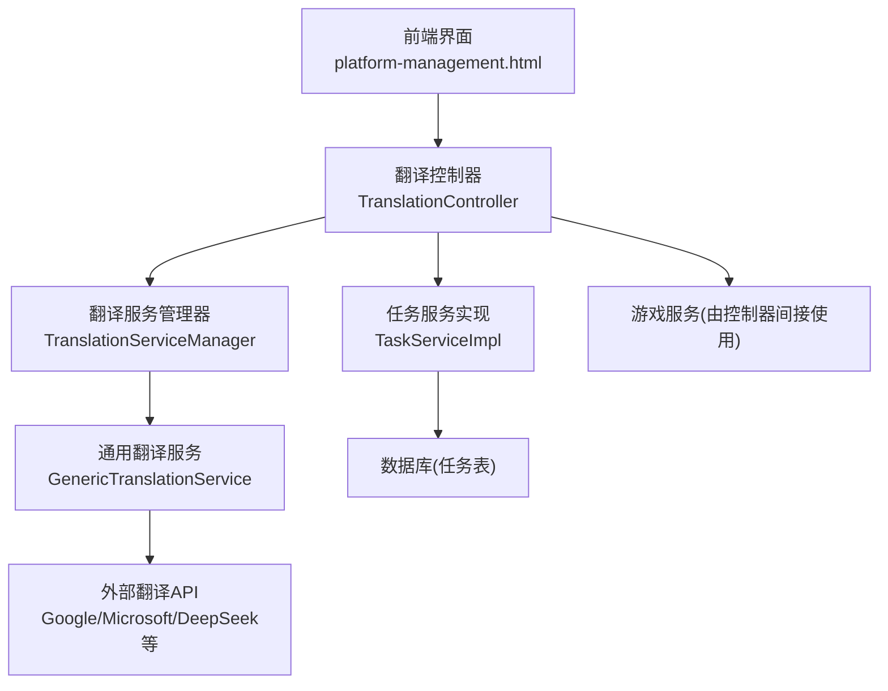
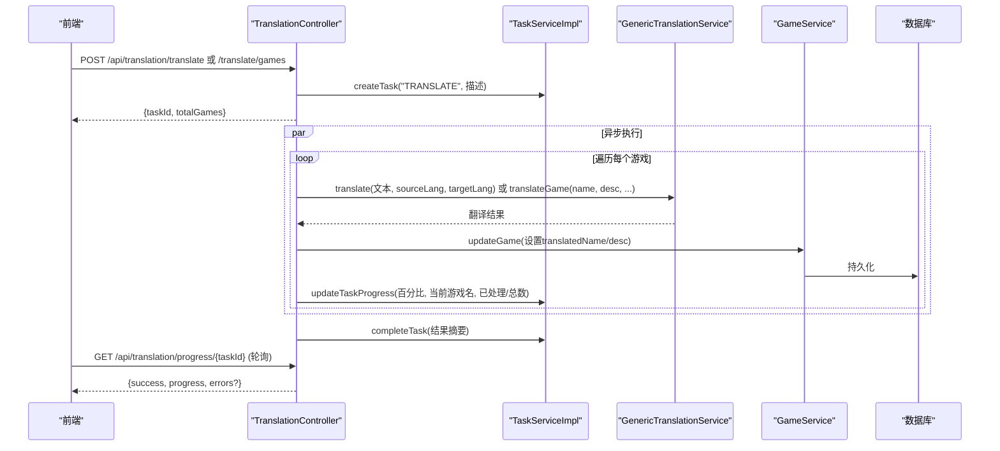
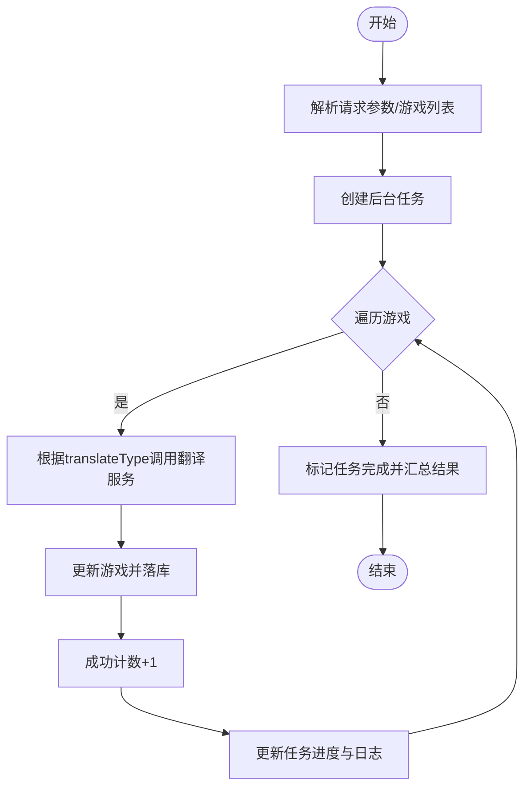
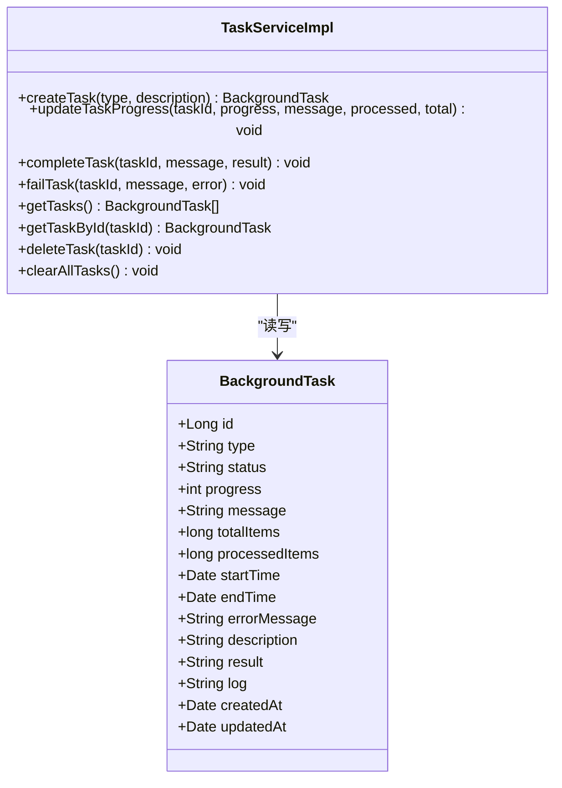
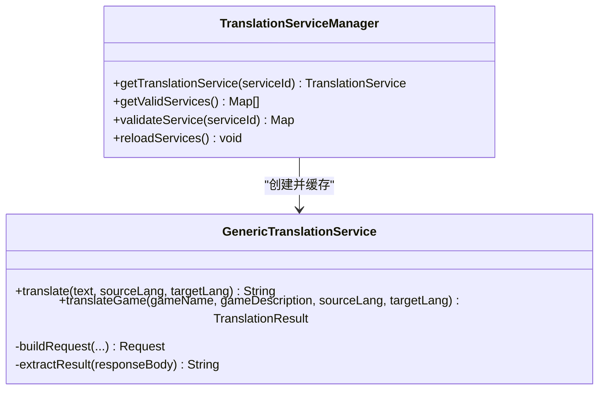
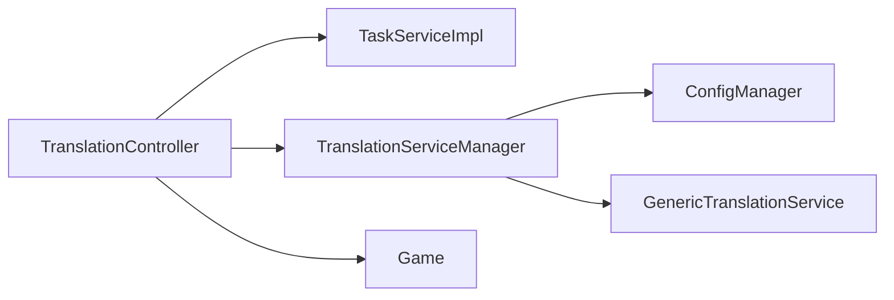

# 批量翻译操作

<cite>
**本文引用的文件**
- [TranslationController.java](file://src/main/java/com/gamelist/controller/TranslationController.java)
- [TaskServiceImpl.java](file://src/main/java/com/gamelist/service/impl/TaskServiceImpl.java)
- [BackgroundTask.java](file://src/main/java/com/gamelist/model/BackgroundTask.java)
- [GenericTranslationService.java](file://src/main/java/com/gamelist/service/impl/GenericTranslationService.java)
- [TranslationServiceManager.java](file://src/main/java/com/gamelist/service/impl/TranslationServiceManager.java)
- [ConfigManager.java](file://src/main/java/com/gamelist/service/impl/ConfigManager.java)
- [translation-config.json](file://rules/translation-config.json)
- [Game.java](file://src/main/java/com/gamelist/model/Game.java)
- [platform-management.html](file://src/main/resources/static/platform-management.html)
</cite>

## 目录
1. [简介](#简介)
2. [项目结构](#项目结构)
3. [核心组件](#核心组件)
4. [架构总览](#架构总览)
5. [详细组件分析](#详细组件分析)
6. [依赖关系分析](#依赖关系分析)
7. [性能与最佳实践](#性能与最佳实践)
8. [故障排查指南](#故障排查指南)
9. [结论](#结论)
10. [附录：API调用示例](#附录api调用示例)

## 简介
本文件面向“批量翻译”功能，系统化说明其启动方式、参数配置、执行流程、异步任务机制（创建、进度跟踪、错误处理、结果获取）、支持的游戏字段类型（名称、描述、同时翻译），并提供最佳实践与完整的API调用示例。该能力通过控制器暴露REST接口，使用通用翻译服务适配多种后端翻译API，并以后台任务持久化进度和结果，前端轮询展示实时状态。

## 项目结构
围绕批量翻译的关键代码分布在以下位置：
- 控制器层：提供批量翻译的HTTP入口与进度查询接口
- 服务层：任务管理、翻译服务管理与实现、游戏数据访问
- 模型层：后台任务、游戏实体
- 配置层：翻译服务配置与变量注入
- 前端：平台管理页中的翻译UI与轮询逻辑

图表来源
- [TranslationController.java:84-235](file://src/main/java/com/gamelist/controller/TranslationController.java#L84-L235)
- [TaskServiceImpl.java:59-123](file://src/main/java/com/gamelist/service/impl/TaskServiceImpl.java#L59-L123)
- [GenericTranslationService.java:203-244](file://src/main/java/com/gamelist/service/impl/GenericTranslationService.java#L203-L244)
- [platform-management.html:2590-2783](file://src/main/resources/static/platform-management.html#L2590-L2783)

章节来源
- [TranslationController.java:84-235](file://src/main/java/com/gamelist/controller/TranslationController.java#L84-L235)
- [platform-management.html:2590-2783](file://src/main/resources/static/platform-management.html#L2590-L2783)

## 核心组件
- 翻译控制器：负责接收批量翻译请求、创建异步任务、维护进度与错误记录、提供进度查询接口
- 任务服务：负责后台任务的创建、更新进度、完成或失败、日志追加与持久化
- 翻译服务管理器：从配置中加载并缓存翻译服务实例，校验必填变量
- 通用翻译服务：基于JSON配置动态构建HTTP请求、解析响应，支持单文本与“名称+描述”双字段翻译
- 游戏模型：包含原始名称/描述与翻译后字段，用于落库保存
- 配置管理器：读取翻译服务配置与全局变量，支持热重载

章节来源
- [TranslationController.java:30-643](file://src/main/java/com/gamelist/controller/TranslationController.java#L30-L643)
- [TaskServiceImpl.java:17-175](file://src/main/java/com/gamelist/service/impl/TaskServiceImpl.java#L17-L175)
- [TranslationServiceManager.java:11-110](file://src/main/java/com/gamelist/service/impl/TranslationServiceManager.java#L11-L110)
- [GenericTranslationService.java:21-443](file://src/main/java/com/gamelist/service/impl/GenericTranslationService.java#L21-L443)
- [Game.java:1-650](file://src/main/java/com/gamelist/model/Game.java#L1-L650)
- [ConfigManager.java:148-197](file://src/main/java/com/gamelist/service/impl/ConfigManager.java#L148-L197)

## 架构总览
批量翻译的整体流程如下：
- 前端发起批量翻译请求（按平台或指定游戏ID列表）
- 控制器创建后台任务并立即返回任务ID
- 控制器在独立线程中遍历游戏，调用翻译服务进行翻译，更新数据库并累计成功/失败计数
- 每处理一个游戏即更新任务进度与消息
- 前端定时轮询进度接口，直至任务完成，显示报告与错误明细

图表来源
- [TranslationController.java:84-235](file://src/main/java/com/gamelist/controller/TranslationController.java#L84-L235)
- [TranslationController.java:307-480](file://src/main/java/com/gamelist/controller/TranslationController.java#L307-L480)
- [TaskServiceImpl.java:59-123](file://src/main/java/com/gamelist/service/impl/TaskServiceImpl.java#L59-L123)
- [GenericTranslationService.java:203-244](file://src/main/java/com/gamelist/service/impl/GenericTranslationService.java#L203-L244)

## 详细组件分析

### 批量翻译控制器（TranslationController）
- 支持的批量入口
  - 按平台批量：POST /api/translation/translate，参数包括 platformId、apiType、sourceLang、targetLang、translateType、apiKey、可选 appId/appSecret
  - 按游戏ID列表批量：POST /api/translation/games，请求体包含 gameIds、apiType、sourceLang、targetLang、translateType、apiKey、可选 appId/appSecret
- 翻译字段类型
  - name：仅翻译游戏名称
  - desc：仅翻译游戏描述
  - both：同时翻译名称与描述（优先调用 translateGame）
- 异步执行与进度
  - 为每次批量创建后台任务，记录任务ID映射
  - 在独立线程中逐条处理，更新进度、成功/失败计数，捕获异常并记录错误明细
  - 完成后将错误列表附加到进度信息，并标记任务完成
- 进度查询
  - GET /api/translation/progress/{taskId}，返回进度与错误列表（如有）

图表来源
- [TranslationController.java:84-235](file://src/main/java/com/gamelist/controller/TranslationController.java#L84-L235)
- [TranslationController.java:307-480](file://src/main/java/com/gamelist/controller/TranslationController.java#L307-L480)

章节来源
- [TranslationController.java:84-235](file://src/main/java/com/gamelist/controller/TranslationController.java#L84-L235)
- [TranslationController.java:307-480](file://src/main/java/com/gamelist/controller/TranslationController.java#L307-L480)
- [TranslationController.java:505-529](file://src/main/java/com/gamelist/controller/TranslationController.java#L505-L529)

### 任务管理服务（TaskServiceImpl）
- 任务生命周期
  - 创建：初始化状态为PENDING，写入描述与初始日志
  - 更新进度：切换至RUNNING，追加日志，持久化进度、消息、已处理/总数
  - 完成：状态COMPLETED，进度100%，写入结果与结束时间
  - 失败：状态FAILED，记录错误信息与结束时间
- 缓存与并发
  - 使用ConcurrentHashMap缓存任务对象，减少重复查询
  - 延迟初始化ID生成器，兼容数据库迁移阶段

图表来源
- [BackgroundTask.java:1-114](file://src/main/java/com/gamelist/model/BackgroundTask.java#L1-L114)
- [TaskServiceImpl.java:17-175](file://src/main/java/com/gamelist/service/impl/TaskServiceImpl.java#L17-L175)

章节来源
- [TaskServiceImpl.java:59-123](file://src/main/java/com/gamelist/service/impl/TaskServiceImpl.java#L59-L123)
- [BackgroundTask.java:1-114](file://src/main/java/com/gamelist/model/BackgroundTask.java#L1-L114)

### 翻译服务管理器与通用翻译服务
- 服务管理
  - 从配置文件中读取 services 列表，校验必填变量，缓存实例
  - 提供 getValidServices 供前端选择可用服务
- 通用翻译服务
  - 支持GET/POST、URL参数、请求头、请求体变量替换
  - 支持 responsePath 提取与 responseParser 解析
  - 支持“名称+描述”双字段一次性翻译（如 microsoft-both、deepseek-both）
  - 内置超时与错误封装，统一抛出 TranslationException

图表来源
- [TranslationServiceManager.java:11-110](file://src/main/java/com/gamelist/service/impl/TranslationServiceManager.java#L11-L110)
- [GenericTranslationService.java:21-443](file://src/main/java/com/gamelist/service/impl/GenericTranslationService.java#L21-L443)

章节来源
- [TranslationServiceManager.java:28-41](file://src/main/java/com/gamelist/service/impl/TranslationServiceManager.java#L28-L41)
- [GenericTranslationService.java:203-244](file://src/main/java/com/gamelist/service/impl/GenericTranslationService.java#L203-L244)
- [GenericTranslationService.java:23-106](file://src/main/java/com/gamelist/service/impl/GenericTranslationService.java#L23-L106)

### 配置与变量
- 配置文件位于 rules/translation-config.json，定义：
  - variables：全局变量（如 google_api_key、microsoft_api_key、microsoft_region、deepseek_api_key）
  - translation.services：各翻译服务的URL、方法、请求体、参数、响应路径、解析器、必填变量校验
  - defaultService：默认服务ID
- 配置管理器负责加载变量与服务配置，支持热重载

章节来源
- [translation-config.json:1-149](file://rules/translation-config.json#L1-L149)
- [ConfigManager.java:148-197](file://src/main/java/com/gamelist/service/impl/ConfigManager.java#L148-L197)

### 前端交互与轮询
- 平台管理页面提供翻译入口，支持选择平台或子集、选择翻译服务与语言、输入API密钥
- 启动翻译后，前端禁用按钮并显示进度区域
- 每2秒轮询 /api/translation/progress/{taskId}，更新进度条与统计
- 任务完成后展示报告与错误明细

章节来源
- [platform-management.html:2590-2783](file://src/main/resources/static/platform-management.html#L2590-L2783)

## 依赖关系分析
- 控制器依赖任务服务与翻译服务管理器；翻译服务管理器依赖配置管理器；通用翻译服务依赖OkHttp与Jackson
- 游戏模型包含翻译后字段，用于持久化
- 前端依赖控制器提供的REST接口

图表来源
- [TranslationController.java:30-643](file://src/main/java/com/gamelist/controller/TranslationController.java#L30-L643)
- [TaskServiceImpl.java:17-175](file://src/main/java/com/gamelist/service/impl/TaskServiceImpl.java#L17-L175)
- [TranslationServiceManager.java:11-110](file://src/main/java/com/gamelist/service/impl/TranslationServiceManager.java#L11-L110)
- [GenericTranslationService.java:21-443](file://src/main/java/com/gamelist/service/impl/GenericTranslationService.java#L21-L443)
- [Game.java:1-650](file://src/main/java/com/gamelist/model/Game.java#L1-L650)

章节来源
- [TranslationController.java:30-643](file://src/main/java/com/gamelist/controller/TranslationController.java#L30-L643)
- [TaskServiceImpl.java:17-175](file://src/main/java/com/gamelist/service/impl/TaskServiceImpl.java#L17-L175)
- [TranslationServiceManager.java:11-110](file://src/main/java/com/gamelist/service/impl/TranslationServiceManager.java#L11-L110)
- [GenericTranslationService.java:21-443](file://src/main/java/com/gamelist/service/impl/GenericTranslationService.java#L21-L443)
- [Game.java:1-650](file://src/main/java/com/gamelist/model/Game.java#L1-L650)

## 性能与最佳实践
- 分批处理
  - 建议对超大平台或长列表分批提交（例如每批100-500个游戏），避免单次请求过大导致超时或内存压力
  - 可通过多次调用 /api/translation/games 实现分片
- 重试机制
  - 针对网络抖动或临时限流，可在前端或服务端增加指数退避重试（建议最多3次，间隔递增）
  - 对于翻译服务返回的明确错误码，可区分重试与不可重试错误
- 并发控制
  - 当前实现为顺序处理单个批次内的游戏，如需提升吞吐，可在服务端引入线程池与限流（注意API速率限制）
- 资源与超时
  - 通用翻译服务已设置连接/读写超时，建议根据目标API调整
  - 合理设置最大令牌数与温度参数（如DeepSeek配置），避免过长响应
- 错误隔离与回滚
  - 单个游戏翻译失败不影响其他游戏；建议在失败率较高时暂停批次并告警
  - 可利用“创建错误子集”能力将失败条目分离，便于后续重跑
- 缓存与去重
  - 对相同文本可考虑本地缓存翻译结果，减少重复请求
  - 对同一批次的重复提交做幂等控制（基于taskId或业务键）

[本节为通用指导，不直接分析具体文件]

## 故障排查指南
- 任务不存在
  - 检查传入的taskId是否正确，确认任务是否已被清理或过期
- 无有效游戏
  - 检查gameIds是否为空或无效；确保游戏存在于数据库中
- 翻译失败
  - 查看进度返回的errors列表，定位具体游戏与错误类型（translation/update）
  - 检查翻译服务配置与变量（如API Key、Region）是否完整
- 网络错误
  - 检查目标翻译API可达性与鉴权；关注超时与限流
- 任务未结束
  - 检查是否有异常导致线程提前退出；查看任务日志与数据库状态

章节来源
- [TranslationController.java:505-529](file://src/main/java/com/gamelist/controller/TranslationController.java#L505-L529)
- [TranslationController.java:177-197](file://src/main/java/com/gamelist/controller/TranslationController.java#L177-L197)
- [TranslationController.java:422-442](file://src/main/java/com/gamelist/controller/TranslationController.java#L422-L442)
- [GenericTranslationService.java:229-244](file://src/main/java/com/gamelist/service/impl/GenericTranslationService.java#L229-L244)

## 结论
批量翻译通过控制器暴露简洁的REST接口，结合后台任务与通用翻译服务，实现了可扩展、可观测、可恢复的翻译流水线。支持名称、描述及同时翻译三种模式，配合前端轮询与错误明细，满足大规模游戏数据的本地化需求。建议在生产环境采用分批、重试与限流策略，并结合配置化管理灵活接入不同翻译服务。

[本节为总结性内容，不直接分析具体文件]

## 附录：API调用示例
以下为常用接口的调用要点（以表单/JSON形式说明，不包含具体代码）：

- 按平台批量翻译
  - 方法：POST
  - 路径：/api/translation/translate
  - 参数：
    - platformId：平台ID
    - apiType：google/microsoft/deepseek/youdao/baidu 等
    - sourceLang：源语言代码（如 en）
    - targetLang：目标语言代码（如 zh）
    - translateType：name/desc/both
    - apiKey：对应服务的API密钥
    - appId/appSecret：部分服务需要（如百度、有道）
  - 响应：{ success, taskId, message, totalGames }

- 按游戏ID列表批量翻译
  - 方法：POST
  - 路径：/api/translation/games
  - 请求体：
    - gameIds：数组或逗号分隔字符串
    - apiType、sourceLang、targetLang、translateType、apiKey、可选 appId/appSecret
  - 响应：{ success, taskId, message, totalGames }

- 查询翻译进度
  - 方法：GET
  - 路径：/api/translation/progress/{taskId}
  - 响应：{ success, progress: { total, completed, success, failed, status }, errors?: [...] }

- 获取可用翻译服务
  - 方法：GET
  - 路径：/api/translation/services
  - 响应：{ success, services: [{id, name, valid}] }

- 创建错误子集（可选）
  - 方法：POST
  - 路径：/api/translation/create-error-subset/{taskId}
  - 作用：将本次翻译失败的条目分离到新平台，便于后续重跑

章节来源
- [TranslationController.java:84-235](file://src/main/java/com/gamelist/controller/TranslationController.java#L84-L235)
- [TranslationController.java:307-480](file://src/main/java/com/gamelist/controller/TranslationController.java#L307-L480)
- [TranslationController.java:505-529](file://src/main/java/com/gamelist/controller/TranslationController.java#L505-L529)
- [TranslationController.java:534-616](file://src/main/java/com/gamelist/controller/TranslationController.java#L534-L616)
- [TranslationController.java:67-79](file://src/main/java/com/gamelist/controller/TranslationController.java#L67-L79)