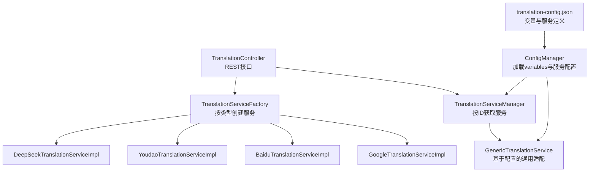
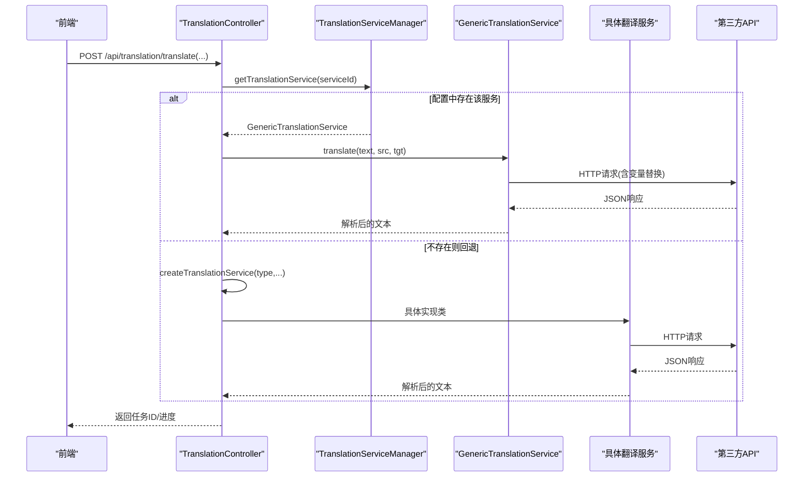
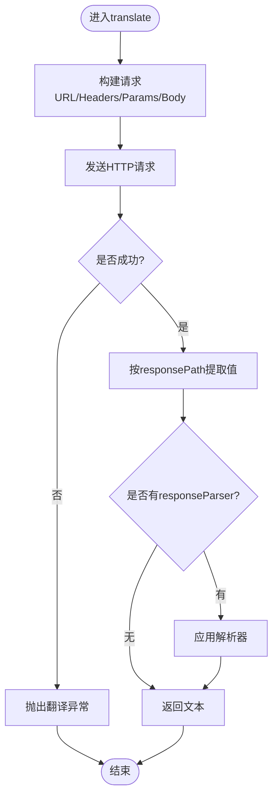
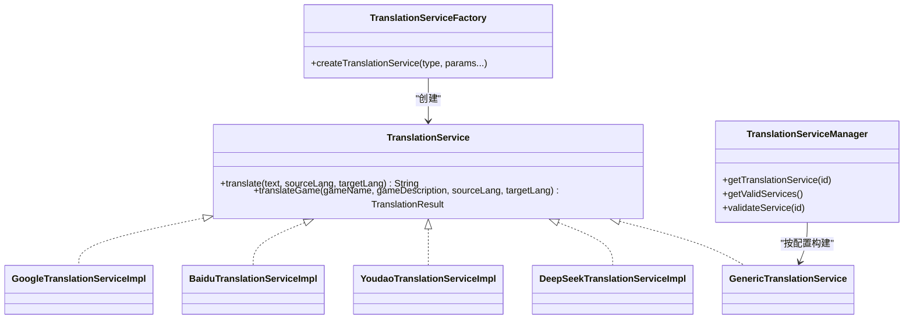
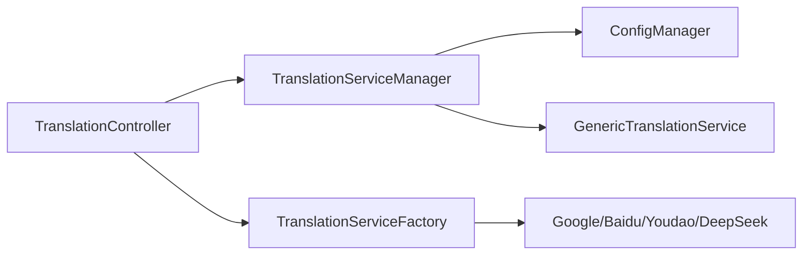

# 翻译API提供商配置

<cite>
**本文引用的文件**
- [BaiduTranslationServiceImpl.java](file://src/main/java/com/gamelist/service/impl/BaiduTranslationServiceImpl.java)
- [YoudaoTranslationServiceImpl.java](file://src/main/java/com/gamelist/service/impl/YoudaoTranslationServiceImpl.java)
- [GoogleTranslationServiceImpl.java](file://src/main/java/com/gamelist/service/impl/GoogleTranslationServiceImpl.java)
- [DeepSeekTranslationServiceImpl.java](file://src/main/java/com/gamelist/service/impl/DeepSeekTranslationServiceImpl.java)
- [GenericTranslationService.java](file://src/main/java/com/gamelist/service/impl/GenericTranslationService.java)
- [TranslationService.java](file://src/main/java/com/gamelist/service/TranslationService.java)
- [TranslationServiceFactory.java](file://src/main/java/com/gamelist/service/impl/TranslationServiceFactory.java)
- [TranslationServiceManager.java](file://src/main/java/com/gamelist/service/impl/TranslationServiceManager.java)
- [ConfigManager.java](file://src/main/java/com/gamelist/service/impl/ConfigManager.java)
- [translation-config.json](file://rules/translation-config.json)
- [TranslationController.java](file://src/main/java/com/gamelist/controller/TranslationController.java)
- [RateLimitCounter.java](file://src/main/java/com/gamelist/util/RateLimitCounter.java)
</cite>

## 目录
1. [简介](#简介)
2. [项目结构](#项目结构)
3. [核心组件](#核心组件)
4. [架构总览](#架构总览)
5. [详细组件分析](#详细组件分析)
6. [依赖关系分析](#依赖关系分析)
7. [性能与限流](#性能与限流)
8. [故障排除指南](#故障排除指南)
9. [结论](#结论)
10. [附录：新增翻译服务提供商](#附录新增翻译服务提供商)

## 简介
本文件面向需要为游戏列表管理工具配置翻译能力的用户与开发者，详细说明如何注册并配置支持的翻译服务（百度、有道、Google、DeepSeek），包括密钥获取、认证参数设置、请求限制配置等；对比各提供商优缺点与适用场景；提供完整配置示例与故障排除方法；并说明如何添加新的翻译服务提供商。同时给出成本控制建议与最佳实践。

## 项目结构
翻译能力由“控制器 + 工厂/管理器 + 具体实现 + 通用适配器 + 配置文件”构成：
- 控制器暴露REST接口，接收翻译任务并调度执行
- 工厂与管理器负责根据类型或配置创建并缓存翻译服务实例
- 具体实现封装各厂商的HTTP调用、签名与响应解析
- 通用适配器通过JSON配置驱动任意HTTP翻译服务
- 配置文件集中声明变量、服务定义、默认服务与校验规则

图表来源
- [TranslationController.java:30-79](file://src/main/java/com/gamelist/controller/TranslationController.java#L30-L79)
- [TranslationServiceManager.java:11-41](file://src/main/java/com/gamelist/service/impl/TranslationServiceManager.java#L11-L41)
- [GenericTranslationService.java:191-244](file://src/main/java/com/gamelist/service/impl/GenericTranslationService.java#L191-L244)
- [TranslationServiceFactory.java:5-44](file://src/main/java/com/gamelist/service/impl/TranslationServiceFactory.java#L5-L44)
- [ConfigManager.java:13-21](file://src/main/java/com/gamelist/service/impl/ConfigManager.java#L13-L21)
- [translation-config.json:1-149](file://rules/translation-config.json#L1-L149)

章节来源
- [TranslationController.java:30-79](file://src/main/java/com/gamelist/controller/TranslationController.java#L30-L79)
- [TranslationServiceManager.java:11-41](file://src/main/java/com/gamelist/service/impl/TranslationServiceManager.java#L11-L41)
- [ConfigManager.java:13-21](file://src/main/java/com/gamelist/service/impl/ConfigManager.java#L13-L21)
- [translation-config.json:1-149](file://rules/translation-config.json#L1-L149)

## 核心组件
- 接口与结果模型
  - 统一翻译接口与“名称+描述”批量翻译结果模型，便于不同服务复用
- 服务工厂与管理器
  - 工厂按字符串类型创建具体服务实例并包装统一错误处理
  - 管理器从配置中读取服务定义，构建通用服务并缓存
- 具体实现
  - Google、百度、有道、DeepSeek各自实现HTTP请求、签名与响应解析
- 通用适配器
  - 通过JSON配置动态构造请求URL、Headers、Body、查询参数与响应路径，支持变量替换与自定义解析器
- 配置管理
  - 集中管理变量（如API Key）与服务清单，支持热重载

章节来源
- [TranslationService.java:1-33](file://src/main/java/com/gamelist/service/TranslationService.java#L1-L33)
- [TranslationServiceFactory.java:5-44](file://src/main/java/com/gamelist/service/impl/TranslationServiceFactory.java#L5-L44)
- [TranslationServiceManager.java:11-110](file://src/main/java/com/gamelist/service/impl/TranslationServiceManager.java#L11-L110)
- [GenericTranslationService.java:21-443](file://src/main/java/com/gamelist/service/impl/GenericTranslationService.java#L21-L443)
- [ConfigManager.java:13-197](file://src/main/java/com/gamelist/service/impl/ConfigManager.java#L13-L197)

## 架构总览
系统采用“配置驱动 + 多实现并存”的架构：
- 优先使用通用适配器（基于translation-config.json）
- 若未找到对应服务ID，回退到工厂模式创建具体实现
- 所有异常统一抛出为翻译异常，便于上层捕获与展示

图表来源
- [TranslationController.java:84-235](file://src/main/java/com/gamelist/controller/TranslationController.java#L84-L235)
- [TranslationServiceManager.java:28-41](file://src/main/java/com/gamelist/service/impl/TranslationServiceManager.java#L28-L41)
- [GenericTranslationService.java:203-244](file://src/main/java/com/gamelist/service/impl/GenericTranslationService.java#L203-L244)
- [TranslationServiceFactory.java:5-44](file://src/main/java/com/gamelist/service/impl/TranslationServiceFactory.java#L5-L44)

## 详细组件分析

### 通用适配器（GenericTranslationService）
- 作用：以JSON配置驱动HTTP调用，支持URL、Headers、Params、Body、ResponsePath、ResponseParser、变量替换
- 关键能力：
  - 变量替换：${var}、{text}/{sourceLang}/{targetLang}、{gameName}/{gameDescription}
  - 数组/对象体构建与序列化
  - 响应路径提取与内置解析器（如微软双字段、游戏名+描述）
  - 超时与日志输出（调试用）
- 复杂度：O(N) 遍历配置节点与JSON路径解析

图表来源
- [GenericTranslationService.java:203-244](file://src/main/java/com/gamelist/service/impl/GenericTranslationService.java#L203-L244)
- [GenericTranslationService.java:246-379](file://src/main/java/com/gamelist/service/impl/GenericTranslationService.java#L246-L379)

章节来源
- [GenericTranslationService.java:21-443](file://src/main/java/com/gamelist/service/impl/GenericTranslationService.java#L21-L443)

### Google 翻译
- 认证：通过URL参数key传入API Key
- 请求：POST JSON，包含q、source、target、format
- 响应：data.translations[0].translatedText
- 适用：通用文本翻译，成本可控，适合大批量基础翻译

章节来源
- [GoogleTranslationServiceImpl.java:10-59](file://src/main/java/com/gamelist/service/impl/GoogleTranslationServiceImpl.java#L10-L59)
- [translation-config.json:10-30](file://rules/translation-config.json#L10-L30)

### 百度翻译
- 认证：appId + appKey，生成MD5签名(sign)，附带salt
- 请求：GET URL拼接参数，包含q、from、to、appid、salt、sign
- 响应：trans_result[0].dst
- 适用：中文生态完善，适合中日英互译

章节来源
- [BaiduTranslationServiceImpl.java:14-100](file://src/main/java/com/gamelist/service/impl/BaiduTranslationServiceImpl.java#L14-L100)

### 有道翻译
- 认证：appKey + appSecret，SHA-256签名，signType=v3
- 请求：POST表单，包含q、from、to、appKey、salt、sign、signType
- 响应：errorCode=0时取translation[0]
- 适用：中英日等多语种，稳定性较好

章节来源
- [YoudaoTranslationServiceImpl.java:13-94](file://src/main/java/com/gamelist/service/impl/YoudaoTranslationServiceImpl.java#L13-L94)

### DeepSeek（大模型）
- 认证：Authorization: Bearer <apiKey>
- 请求：POST JSON，messages包含system与user消息，temperature低以保证稳定
- 响应：choices[0].message.content
- 适用：高质量本地化翻译，尤其适合游戏术语与风格化标题

章节来源
- [DeepSeekTranslationServiceImpl.java:17-118](file://src/main/java/com/gamelist/service/impl/DeepSeekTranslationServiceImpl.java#L17-L118)
- [translation-config.json:85-145](file://rules/translation-config.json#L85-L145)

### 服务工厂与管理器
- 工厂：根据serviceType创建具体实现，并统一包装为带错误处理的Wrapper
- 管理器：从配置加载服务，按id获取并缓存；支持校验requiredVariables

图表来源
- [TranslationService.java:1-33](file://src/main/java/com/gamelist/service/TranslationService.java#L1-L33)
- [TranslationServiceFactory.java:5-44](file://src/main/java/com/gamelist/service/impl/TranslationServiceFactory.java#L5-L44)
- [TranslationServiceManager.java:11-110](file://src/main/java/com/gamelist/service/impl/TranslationServiceManager.java#L11-L110)

章节来源
- [TranslationServiceFactory.java:5-44](file://src/main/java/com/gamelist/service/impl/TranslationServiceFactory.java#L5-L44)
- [TranslationServiceManager.java:11-110](file://src/main/java/com/gamelist/service/impl/TranslationServiceManager.java#L11-L110)

## 依赖关系分析
- 控制器依赖管理器与工厂，优先走配置驱动，否则回退到类型创建
- 管理器依赖配置管理器加载变量与服务定义
- 具体实现依赖OkHttp与JSON库进行网络与数据交互
- 限流工具可用于控制并发访问频率，避免触发第三方限流

图表来源
- [TranslationController.java:618-641](file://src/main/java/com/gamelist/controller/TranslationController.java#L618-L641)
- [TranslationServiceManager.java:28-41](file://src/main/java/com/gamelist/service/impl/TranslationServiceManager.java#L28-L41)
- [ConfigManager.java:13-21](file://src/main/java/com/gamelist/service/impl/ConfigManager.java#L13-L21)

章节来源
- [TranslationController.java:618-641](file://src/main/java/com/gamelist/controller/TranslationController.java#L618-L641)
- [TranslationServiceManager.java:28-41](file://src/main/java/com/gamelist/service/impl/TranslationServiceManager.java#L28-L41)

## 性能与限流
- 连接与超时：通用服务设置了合理的连接/读写超时，避免长时间阻塞
- 并发与队列：批量翻译在后台线程执行，逐条更新进度与任务状态
- 限流：提供RateLimitCounter用于窗口内请求计数与暂停，可结合业务使用以避免触发第三方限流
- 建议：
  - 对高并发场景增加重试与退避策略
  - 对长文本分片翻译，降低单次请求大小
  - 合理选择provider：低成本批量用Google/百度；高质量本地化用DeepSeek

章节来源
- [GenericTranslationService.java:191-201](file://src/main/java/com/gamelist/service/impl/GenericTranslationService.java#L191-L201)
- [TranslationController.java:138-221](file://src/main/java/com/gamelist/controller/TranslationController.java#L138-L221)
- [RateLimitCounter.java:13-138](file://src/main/java/com/gamelist/util/RateLimitCounter.java#L13-L138)

## 故障排除指南
- 常见错误定位
  - 网络错误：检查网络连通性与代理设置
  - 认证失败：确认API Key/Secret正确且已填入variables
  - 签名错误：核对签名算法与参数顺序（百度MD5、有道SHA-256）
  - 响应解析失败：检查responsePath是否与提供方一致
- 调试技巧
  - 查看控制台输出的请求URL、Body与响应体（通用服务会打印）
  - 使用“获取有效服务”接口验证配置是否生效
- 典型问题
  - 缺少必填变量：validation.requiredVariables未满足将导致服务不可用
  - 超时：增大超时或拆分请求
  - 限流：降低并发或使用限流器

章节来源
- [GenericTranslationService.java:203-244](file://src/main/java/com/gamelist/service/impl/GenericTranslationService.java#L203-L244)
- [TranslationServiceManager.java:64-104](file://src/main/java/com/gamelist/service/impl/TranslationServiceManager.java#L64-L104)
- [TranslationController.java:67-79](file://src/main/java/com/gamelist/controller/TranslationController.java#L67-L79)

## 结论
本项目提供了灵活可扩展的翻译能力：既可通过JSON配置快速接入任意HTTP翻译服务，也内置了主流提供商的具体实现。通过统一的接口、工厂与管理器，实现了配置驱动与代码实现的解耦，便于维护与扩展。结合限流与超时控制，可在保证质量的同时兼顾成本与稳定性。

## 附录：新增翻译服务提供商

### 方式一：通过配置新增（推荐）
步骤：
1. 在variables中新增变量（如your_api_key）
2. 在translation.services中添加新服务条目，填写：
   - id、name、type（可为自定义）
   - url、method、headers、params、requestBody
   - responsePath、responseParser（可选）
   - validation.requiredVariables（必填变量）
3. 如需作为默认服务，设置defaultService为该id
4. 重启或调用重载接口使配置生效

参考位置
- [translation-config.json:1-149](file://rules/translation-config.json#L1-L149)
- [ConfigManager.java:154-164](file://src/main/java/com/gamelist/service/impl/ConfigManager.java#L154-L164)

### 方式二：通过代码新增具体实现
步骤：
1. 新建类实现TranslationService接口
2. 在TranslationServiceFactory中增加case分支，创建实例并返回包装器
3. 在控制器中确保该类型可被识别（如需要）
4. 测试端到端流程

参考位置
- [TranslationService.java:1-33](file://src/main/java/com/gamelist/service/TranslationService.java#L1-L33)
- [TranslationServiceFactory.java:5-44](file://src/main/java/com/gamelist/service/impl/TranslationServiceFactory.java#L5-L44)

### 各提供商注册与配置要点
- Google
  - 获取API Key并在variables中配置google_api_key
  - 使用translation-config.json中的google服务条目
  - 适用：通用翻译、成本低、速度快
- 百度
  - 申请AppID与AppKey，注意签名算法与参数
  - 使用工厂模式创建（baidu类型）
  - 适用：中日英互译、中文生态好
- 有道
  - 申请AppKey与AppSecret，注意signType=v3与SHA-256
  - 使用工厂模式创建（youdao类型）
  - 适用：多语种、稳定性好
- DeepSeek
  - 获取API Key并通过Bearer认证
  - 可使用配置条目deepseek/deepseek-both
  - 适用：高质量本地化、术语友好

章节来源
- [TranslationServiceFactory.java:5-44](file://src/main/java/com/gamelist/service/impl/TranslationServiceFactory.java#L5-L44)
- [translation-config.json:10-145](file://rules/translation-config.json#L10-L145)

## 成本控制建议与最佳实践
- 成本控制
  - 批量基础翻译优先使用Google/百度；高质量内容使用DeepSeek
  - 对长文本分片，减少单次请求大小
  - 启用缓存（可按文本哈希缓存翻译结果）
  - 使用限流器避免超额计费
- 最佳实践
  - 严格校验必填变量，避免运行时错误
  - 使用responsePath精准提取，减少后处理
  - 对第三方错误码做统一映射与重试
  - 记录请求与响应摘要以便排障
  - 定期轮换API Key并最小化权限

章节来源
- [RateLimitCounter.java:13-138](file://src/main/java/com/gamelist/util/RateLimitCounter.java#L13-L138)
- [GenericTranslationService.java:203-244](file://src/main/java/com/gamelist/service/impl/GenericTranslationService.java#L203-L244)