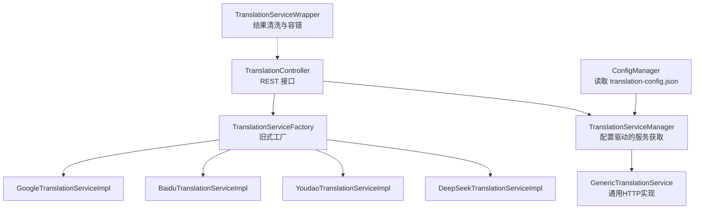
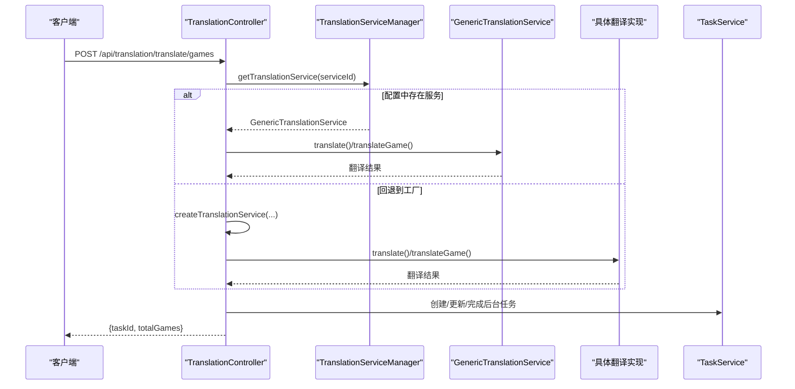
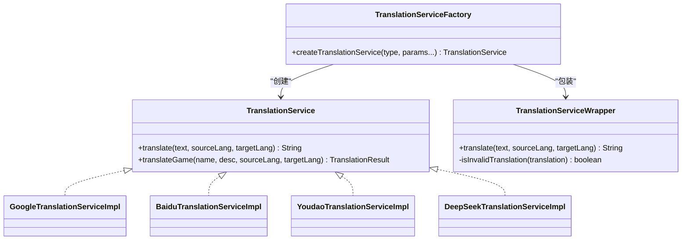
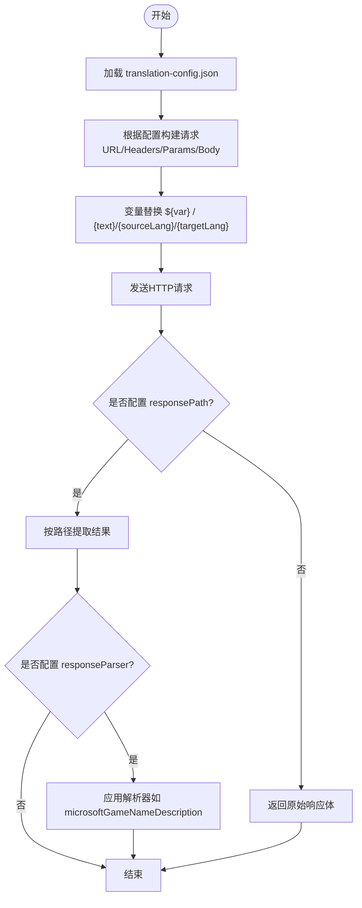
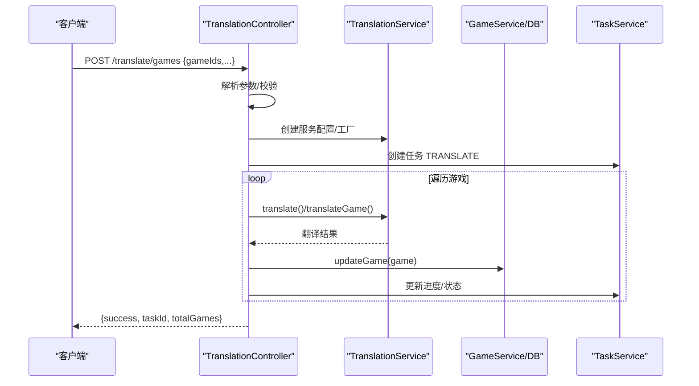
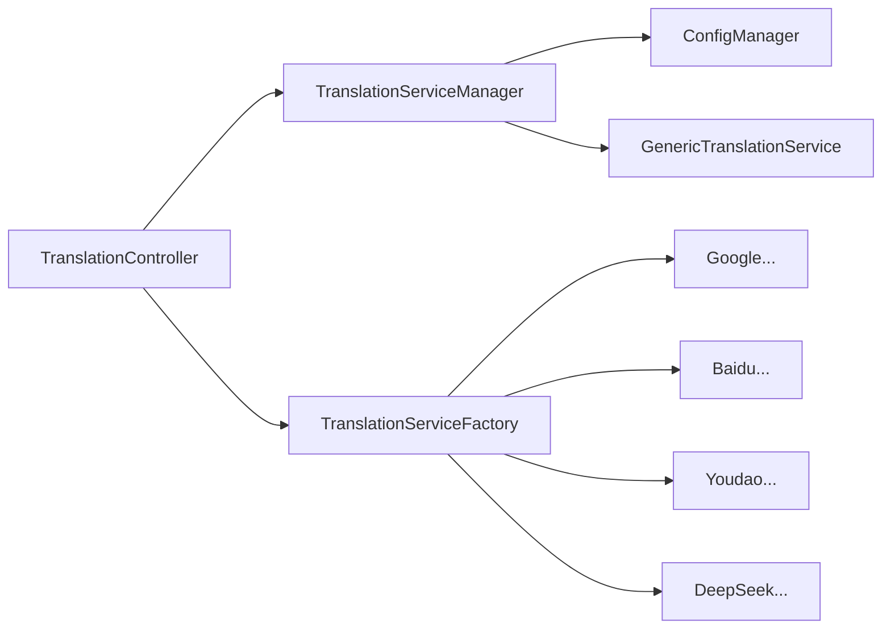

# 翻译服务

<cite>
**本文引用的文件**
- [TranslationService.java](file://src/main/java/com/gamelist/service/TranslationService.java)
- [TranslationController.java](file://src/main/java/com/gamelist/controller/TranslationController.java)
- [TranslationServiceFactory.java](file://src/main/java/com/gamelist/service/impl/TranslationServiceFactory.java)
- [TranslationServiceManager.java](file://src/main/java/com/gamelist/service/impl/TranslationServiceManager.java)
- [GenericTranslationService.java](file://src/main/java/com/gamelist/service/impl/GenericTranslationService.java)
- [GoogleTranslationServiceImpl.java](file://src/main/java/com/gamelist/service/impl/GoogleTranslationServiceImpl.java)
- [BaiduTranslationServiceImpl.java](file://src/main/java/com/gamelist/service/impl/BaiduTranslationServiceImpl.java)
- [YoudaoTranslationServiceImpl.java](file://src/main/java/com/gamelist/service/impl/YoudaoTranslationServiceImpl.java)
- [DeepSeekTranslationServiceImpl.java](file://src/main/java/com/gamelist/service/impl/DeepSeekTranslationServiceImpl.java)
- [ConfigManager.java](file://src/main/java/com/gamelist/service/impl/ConfigManager.java)
- [translation-config.json](file://rules/translation-config.json)
- [LanguageDetector.java](file://src/main/java/com/gamelist/util/LanguageDetector.java)
- [TranslationException.java](file://src/main/java/com/gamelist/service/TranslationException.java)
- [TranslationServiceWrapper.java](file://src/main/java/com/gamelist/service/impl/TranslationServiceWrapper.java)
</cite>

## 目录
1. [简介](#简介)
2. [项目结构](#项目结构)
3. [核心组件](#核心组件)
4. [架构总览](#架构总览)
5. [详细组件分析](#详细组件分析)
6. [依赖关系分析](#依赖关系分析)
7. [性能与成本优化](#性能与成本优化)
8. [故障排查指南](#故障排查指南)
9. [结论](#结论)
10. [附录：配置与安全](#附录配置与安全)

## 简介
本文件为“翻译服务”功能的全面技术文档，覆盖以下要点：
- 支持的翻译API提供商：百度、有道、Google、DeepSeek（以及通过通用配置可接入的Microsoft等）
- 工厂模式与扩展机制：如何通过配置文件新增第三方翻译服务
- 批量翻译流程：语言检测、文本预处理、结果后处理、错误记录与任务进度
- API密钥配置与安全设置
- 翻译质量优化技巧与错误处理机制
- 性能调优与成本控制建议

## 项目结构
翻译功能由控制器、服务接口、具体实现、配置管理、工具类共同组成。关键路径如下：
- 控制器层：对外暴露REST接口，负责参数校验、任务创建、异步执行与进度上报
- 服务抽象：统一翻译接口，支持单条与批量（名称+描述）翻译
- 具体实现：各厂商SDK或HTTP调用封装；通用实现基于JSON配置动态构建请求
- 配置管理：加载并缓存翻译服务配置与变量替换表
- 工具与异常：语言检测、统一异常类型、包装器用于结果清洗

图表来源
- [TranslationController.java:30-643](file://src/main/java/com/gamelist/controller/TranslationController.java#L30-L643)
- [TranslationServiceFactory.java:5-46](file://src/main/java/com/gamelist/service/impl/TranslationServiceFactory.java#L5-L46)
- [TranslationServiceManager.java:11-110](file://src/main/java/com/gamelist/service/impl/TranslationServiceManager.java#L11-L110)
- [GenericTranslationService.java:21-443](file://src/main/java/com/gamelist/service/impl/GenericTranslationService.java#L21-L443)
- [ConfigManager.java:13-197](file://src/main/java/com/gamelist/service/impl/ConfigManager.java#L13-L197)

章节来源
- [TranslationController.java:30-643](file://src/main/java/com/gamelist/controller/TranslationController.java#L30-L643)
- [ConfigManager.java:13-197](file://src/main/java/com/gamelist/service/impl/ConfigManager.java#L13-L197)

## 核心组件
- 翻译接口与结果模型：定义 translate(text, sourceLang, targetLang) 与 translateGame(name, desc, sourceLang, targetLang)，并提供 TranslationResult 封装
- 工厂模式：根据 serviceType 创建具体实现，并统一用包装器包裹以增强健壮性
- 配置驱动管理器：从 JSON 配置中解析服务定义，按 id 获取并缓存服务实例
- 通用HTTP服务：通过 JSON 配置动态拼装 URL、Headers、Params、Body，并支持 responsePath/responseParser 提取结果
- 控制器：提供平台级、单个游戏、批量游戏的翻译入口，异步执行并维护任务进度与错误列表

章节来源
- [TranslationService.java:3-33](file://src/main/java/com/gamelist/service/TranslationService.java#L3-L33)
- [TranslationServiceFactory.java:5-46](file://src/main/java/com/gamelist/service/impl/TranslationServiceFactory.java#L5-L46)
- [TranslationServiceManager.java:11-110](file://src/main/java/com/gamelist/service/impl/TranslationServiceManager.java#L11-L110)
- [GenericTranslationService.java:21-443](file://src/main/java/com/gamelist/service/impl/GenericTranslationService.java#L21-L443)
- [TranslationController.java:30-643](file://src/main/java/com/gamelist/controller/TranslationController.java#L30-L643)

## 架构总览
系统采用“配置驱动 + 工厂/管理器 + 具体实现”的分层设计。控制器接收请求，优先尝试从配置管理器获取通用服务；若未命中则回退到传统工厂创建具体实现。所有服务最终通过统一的接口进行调用，并通过包装器对结果进行清洗与容错。

图表来源
- [TranslationController.java:307-480](file://src/main/java/com/gamelist/controller/TranslationController.java#L307-L480)
- [TranslationServiceManager.java:28-41](file://src/main/java/com/gamelist/service/impl/TranslationServiceManager.java#L28-L41)
- [GenericTranslationService.java:203-244](file://src/main/java/com/gamelist/service/impl/GenericTranslationService.java#L203-L244)
- [TranslationServiceFactory.java:5-46](file://src/main/java/com/gamelist/service/impl/TranslationServiceFactory.java#L5-L46)

## 详细组件分析

### 接口与结果模型
- 统一接口：translate(text, sourceLang, targetLang)
- 批量语义：translateGame(name, desc, sourceLang, targetLang) 默认分别调用 translate，返回 TranslationResult
- 异常：统一抛出 TranslationException

章节来源
- [TranslationService.java:3-33](file://src/main/java/com/gamelist/service/TranslationService.java#L3-L33)
- [TranslationException.java:1-12](file://src/main/java/com/gamelist/service/TranslationException.java#L1-L12)

### 工厂模式与扩展机制
- 工厂方法：根据 serviceType 创建对应实现，并对每个实现进行必要参数校验
- 包装器：返回前统一用 TranslationServiceWrapper 包裹，对异常和无效结果做兜底处理
- 扩展方式：新增服务时，可在工厂中添加分支，或在配置管理器中增加通用服务条目（推荐后者）

图表来源
- [TranslationServiceFactory.java:5-46](file://src/main/java/com/gamelist/service/impl/TranslationServiceFactory.java#L5-L46)
- [TranslationServiceWrapper.java:6-71](file://src/main/java/com/gamelist/service/impl/TranslationServiceWrapper.java#L6-L71)
- [GoogleTranslationServiceImpl.java:10-59](file://src/main/java/com/gamelist/service/impl/GoogleTranslationServiceImpl.java#L10-L59)
- [BaiduTranslationServiceImpl.java:14-100](file://src/main/java/com/gamelist/service/impl/BaiduTranslationServiceImpl.java#L14-L100)
- [YoudaoTranslationServiceImpl.java:13-94](file://src/main/java/com/gamelist/service/impl/YoudaoTranslationServiceImpl.java#L13-L94)
- [DeepSeekTranslationServiceImpl.java:17-118](file://src/main/java/com/gamelist/service/impl/DeepSeekTranslationServiceImpl.java#L17-L118)

章节来源
- [TranslationServiceFactory.java:5-46](file://src/main/java/com/gamelist/service/impl/TranslationServiceFactory.java#L5-L46)
- [TranslationServiceWrapper.java:6-71](file://src/main/java/com/gamelist/service/impl/TranslationServiceWrapper.java#L6-L71)

### 配置驱动的通用服务（推荐扩展方式）
- 配置文件：rules/translation-config.json 定义 variables 与 services
- 变量替换：${varName} 在 URL/Header/Body/Param 中会被替换
- 动态请求：支持 method、headers、params、requestBody、responsePath、responseParser
- 服务校验：validation.requiredVariables 确保必需变量存在

图表来源
- [GenericTranslationService.java:203-443](file://src/main/java/com/gamelist/service/impl/GenericTranslationService.java#L203-L443)
- [ConfigManager.java:154-197](file://src/main/java/com/gamelist/service/impl/ConfigManager.java#L154-L197)
- [translation-config.json:1-149](file://rules/translation-config.json#L1-L149)

章节来源
- [GenericTranslationService.java:203-443](file://src/main/java/com/gamelist/service/impl/GenericTranslationService.java#L203-L443)
- [ConfigManager.java:154-197](file://src/main/java/com/gamelist/service/impl/ConfigManager.java#L154-L197)
- [translation-config.json:1-149](file://rules/translation-config.json#L1-L149)

### 批量翻译流程与选项
- 入口：/api/translation/translate/games（批量）、/api/translation/translate/game（单个）、/api/translation/translate（平台级）
- 参数：gameIds/apiType/sourceLang/targetLang/translateType/apiKey/appId/appSecret
- 流程：
  - 解析并校验输入
  - 创建翻译服务（优先配置驱动，否则工厂）
  - 生成 taskId，初始化进度与错误列表
  - 创建后台任务，异步逐条翻译
  - 更新任务进度与状态，完成后汇总错误
- 选项：
  - translateType=name|desc|both
  - 支持同时翻译名称与描述（使用 translateGame）
  - 失败项单独记录，支持后续导出为“错误子集”

图表来源
- [TranslationController.java:307-480](file://src/main/java/com/gamelist/controller/TranslationController.java#L307-L480)
- [TranslationController.java:84-235](file://src/main/java/com/gamelist/controller/TranslationController.java#L84-L235)
- [TranslationController.java:240-302](file://src/main/java/com/gamelist/controller/TranslationController.java#L240-L302)

章节来源
- [TranslationController.java:84-480](file://src/main/java/com/gamelist/controller/TranslationController.java#L84-L480)

### 语言检测与文本预处理
- 语言检测：提供 containsChinese 判断是否包含中文，可用于前端或上游逻辑选择源语言
- 文本预处理：
  - 空串/空白过滤（通用服务内部已处理）
  - 长度限制与敏感字符清理可在上层扩展
  - 针对LLM（如DeepSeek）可通过 system prompt 约束输出格式

章节来源
- [LanguageDetector.java:3-34](file://src/main/java/com/gamelist/util/LanguageDetector.java#L3-L34)
- [GenericTranslationService.java:203-207](file://src/main/java/com/gamelist/service/impl/GenericTranslationService.java#L203-L207)

### 结果后处理与质量保障
- 包装器清洗：拒绝包含错误提示、换行、列表标记、说明性文字、超长字符串的结果，回退为原文
- 解析器：支持 microsoftGameNameDescription、gameNameDescription 等专用解析策略
- 配置化：通过 responsePath/responseParser 灵活适配不同厂商响应结构

章节来源
- [TranslationServiceWrapper.java:6-71](file://src/main/java/com/gamelist/service/impl/TranslationServiceWrapper.java#L6-L71)
- [GenericTranslationService.java:365-441](file://src/main/java/com/gamelist/service/impl/GenericTranslationService.java#L365-L441)

### 各提供商实现要点
- Google：POST JSON，key 作为查询参数，解析 data.translations[0].translatedText
- 百度：GET 签名URL，MD5 签名，解析 trans_result[0].dst
- 有道：POST FormBody，SHA-256 签名 v3，解析 translation[0]
- DeepSeek：POST chat/completions，system prompt 约束只输出简洁翻译，解析 choices[0].message.content
- Microsoft（通过通用配置）：支持数组请求体与 region 头，支持 both name/desc 的双段解析

章节来源
- [GoogleTranslationServiceImpl.java:10-59](file://src/main/java/com/gamelist/service/impl/GoogleTranslationServiceImpl.java#L10-L59)
- [BaiduTranslationServiceImpl.java:14-100](file://src/main/java/com/gamelist/service/impl/BaiduTranslationServiceImpl.java#L14-L100)
- [YoudaoTranslationServiceImpl.java:13-94](file://src/main/java/com/gamelist/service/impl/YoudaoTranslationServiceImpl.java#L13-L94)
- [DeepSeekTranslationServiceImpl.java:17-118](file://src/main/java/com/gamelist/service/impl/DeepSeekTranslationServiceImpl.java#L17-L118)
- [translation-config.json:31-84](file://rules/translation-config.json#L31-L84)

## 依赖关系分析
- 控制器依赖：GameService、PlatformService、TaskService、TranslationService（通过工厂或管理器）
- 管理器依赖：ConfigManager（读取配置与变量）
- 通用服务依赖：OkHttpClient、Jackson ObjectMapper
- 具体实现依赖：各自厂商HTTP协议与签名算法

图表来源
- [TranslationController.java:30-643](file://src/main/java/com/gamelist/controller/TranslationController.java#L30-L643)
- [TranslationServiceManager.java:11-110](file://src/main/java/com/gamelist/service/impl/TranslationServiceManager.java#L11-L110)
- [TranslationServiceFactory.java:5-46](file://src/main/java/com/gamelist/service/impl/TranslationServiceFactory.java#L5-L46)
- [GenericTranslationService.java:21-443](file://src/main/java/com/gamelist/service/impl/GenericTranslationService.java#L21-L443)

章节来源
- [TranslationController.java:30-643](file://src/main/java/com/gamelist/controller/TranslationController.java#L30-L643)
- [TranslationServiceManager.java:11-110](file://src/main/java/com/gamelist/service/impl/TranslationServiceManager.java#L11-L110)
- [TranslationServiceFactory.java:5-46](file://src/main/java/com/gamelist/service/impl/TranslationServiceFactory.java#L5-L46)

## 性能与成本优化
- 连接池与超时：通用服务使用 OkHttpClient 并设置连接/读写超时，建议复用客户端实例以降低握手开销
- 并发控制：当前为顺序循环，可按平台规模引入线程池与限流（结合 RateLimitCounter）
- 批量请求：优先使用支持批量的API（如微软数组请求体），减少往返次数
- 缓存策略：对相同文本与目标语言的翻译结果进行本地缓存（键：text+targetLang）
- 重试与退避：对网络抖动与限频错误实施指数退避重试
- 成本控制：
  - 合理设置 max_tokens/temperature，避免LLM长输出
  - 仅翻译必要字段（name/desc），避免冗余
  - 使用低成本提供商处理短文本，高质量LLM用于复杂场景
  - 监控各服务商配额与费用，设置告警阈值

[本节为通用指导，不直接分析具体文件]

## 故障排查指南
- 常见错误
  - 网络错误：检查网络连通性与代理设置
  - 鉴权失败：确认 apiKey/appId/appSecret 正确且有效
  - 签名错误：核对签名算法与参数顺序（百度/有道）
  - 响应解析失败：检查 responsePath 是否正确匹配实际响应结构
- 日志定位
  - 通用服务打印了请求URL、方法、Body与响应状态码，便于定位问题
  - 控制器在启动失败或任务异常时会返回错误信息
- 恢复手段
  - 使用包装器的容错机制，失败时保留原文
  - 通过“错误子集”接口将失败条目分离，便于二次处理

章节来源
- [GenericTranslationService.java:203-244](file://src/main/java/com/gamelist/service/impl/GenericTranslationService.java#L203-L244)
- [TranslationController.java:505-529](file://src/main/java/com/gamelist/controller/TranslationController.java#L505-L529)
- [TranslationController.java:534-616](file://src/main/java/com/gamelist/controller/TranslationController.java#L534-L616)

## 结论
本翻译服务采用“配置驱动 + 工厂/管理器 + 具体实现”的架构，既支持快速接入主流翻译API，又具备灵活的扩展能力。通过包装器与解析器保证结果质量，配合后台任务与错误子集机制提升可运维性。建议在大规模场景下引入并发控制、缓存与重试策略，并结合业务需求选择合适的提供商与参数，以达到质量、性能与成本的平衡。

[本节为总结性内容，不直接分析具体文件]

## 附录：配置与安全
- 配置文件位置：rules/translation-config.json
- 变量区 variables：集中存放各服务商密钥与区域等敏感信息
- 服务定义 services：每个服务包含 id/name/type/url/method/headers/params/requestBody/responsePath/responseParser/validation
- 安全建议
  - 不要将密钥硬编码到代码中，统一放入 variables
  - 生产环境建议使用环境变量注入或外部密钥管理服务
  - 最小权限原则：仅授予必要的API访问范围
  - 传输安全：确保HTTPS，必要时启用证书校验
  - 日志脱敏：避免在日志中输出完整请求体或密钥

章节来源
- [translation-config.json:1-149](file://rules/translation-config.json#L1-L149)
- [ConfigManager.java:154-197](file://src/main/java/com/gamelist/service/impl/ConfigManager.java#L154-L197)