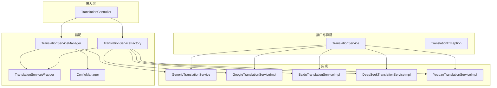
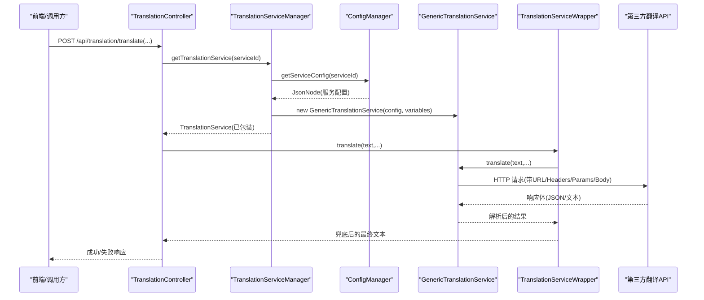
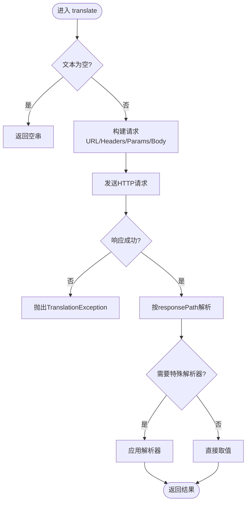
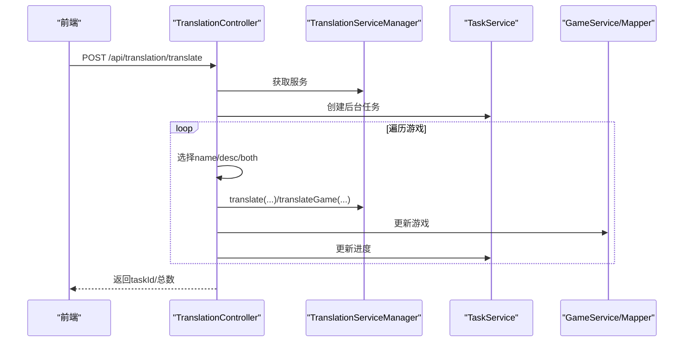
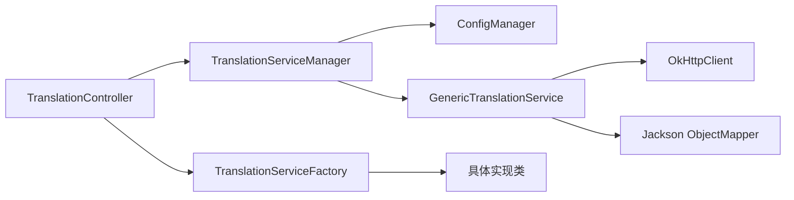

# 翻译服务扩展开发

<cite>
**本文引用的文件**
- [TranslationService.java](file://src/main/java/com/gamelist/service/TranslationService.java)
- [TranslationException.java](file://src/main/java/com/gamelist/service/TranslationException.java)
- [TranslationServiceFactory.java](file://src/main/java/com/gamelist/service/impl/TranslationServiceFactory.java)
- [TranslationServiceManager.java](file://src/main/java/com/gamelist/service/impl/TranslationServiceManager.java)
- [GenericTranslationService.java](file://src/main/java/com/gamelist/service/impl/GenericTranslationService.java)
- [TranslationServiceWrapper.java](file://src/main/java/com/gamelist/service/impl/TranslationServiceWrapper.java)
- [ConfigManager.java](file://src/main/java/com/gamelist/service/impl/ConfigManager.java)
- [GoogleTranslationServiceImpl.java](file://src/main/java/com/gamelist/service/impl/GoogleTranslationServiceImpl.java)
- [BaiduTranslationServiceImpl.java](file://src/main/java/com/gamelist/service/impl/BaiduTranslationServiceImpl.java)
- [DeepSeekTranslationServiceImpl.java](file://src/main/java/com/gamelist/service/impl/DeepSeekTranslationServiceImpl.java)
- [YoudaoTranslationServiceImpl.java](file://src/main/java/com/gamelist/service/impl/YoudaoTranslationServiceImpl.java)
- [translation-config.json](file://rules/translation-config.json)
- [TranslationController.java](file://src/main/java/com/gamelist/controller/TranslationController.java)
</cite>

## 目录
1. [简介](#简介)
2. [项目结构](#项目结构)
3. [核心组件](#核心组件)
4. [架构总览](#架构总览)
5. [详细组件分析](#详细组件分析)
6. [依赖关系分析](#依赖关系分析)
7. [性能与可靠性](#性能与可靠性)
8. [故障排查指南](#故障排查指南)
9. [结论](#结论)
10. [附录：自定义服务实现步骤与示例](#附录自定义服务实现步骤与示例)

## 简介
本指南面向需要在现有游戏清单系统中扩展“翻译服务”的开发者。文档围绕 TranslationService 接口、工厂模式与管理器模式的使用，说明如何注册和发现新的翻译服务；提供通用翻译服务的原理与使用方式；并给出自定义翻译服务的完整开发流程（含 API 集成、错误处理、日志记录）、测试、部署与版本管理最佳实践。

## 项目结构
翻译能力位于 service 层，采用“接口 + 多实现 + 工厂 + 管理器 + 包装器”的分层设计：
- 接口与异常：定义统一翻译契约与异常类型
- 具体实现：内置 Google、百度、有道、DeepSeek 等适配器
- 通用实现：基于配置的 HTTP 调用适配任意 REST 翻译 API
- 工厂：按类型创建具体实现（兼容旧式）
- 管理器：从配置加载服务、缓存实例、校验变量
- 包装器：统一拦截异常与无效结果，提升健壮性
- 控制器：对外暴露翻译相关 API，编排任务与进度

图表来源
- [TranslationService.java:1-33](file://src/main/java/com/gamelist/service/TranslationService.java#L1-L33)
- [GenericTranslationService.java:21-201](file://src/main/java/com/gamelist/service/impl/GenericTranslationService.java#L21-L201)
- [TranslationServiceFactory.java:5-45](file://src/main/java/com/gamelist/service/impl/TranslationServiceFactory.java#L5-L45)
- [TranslationServiceManager.java:11-110](file://src/main/java/com/gamelist/service/impl/TranslationServiceManager.java#L11-L110)
- [TranslationServiceWrapper.java:6-71](file://src/main/java/com/gamelist/service/impl/TranslationServiceWrapper.java#L6-L71)
- [ConfigManager.java:13-197](file://src/main/java/com/gamelist/service/impl/ConfigManager.java#L13-L197)
- [TranslationController.java:30-643](file://src/main/java/com/gamelist/controller/TranslationController.java#L30-L643)

章节来源
- [TranslationService.java:1-33](file://src/main/java/com/gamelist/service/TranslationService.java#L1-L33)
- [TranslationController.java:30-643](file://src/main/java/com/gamelist/controller/TranslationController.java#L30-L643)

## 核心组件
- TranslationService：定义 translate(text, sourceLang, targetLang) 与 translateGame(name, desc, sourceLang, targetLang) 的统一契约，并提供 TranslationResult 封装双字段结果。
- GenericTranslationService：基于 JSON 配置驱动，通过 OkHttp 发起 HTTP 请求，支持 URL/Headers/Params/Body/ResponsePath/ResponseParser 等灵活拼装，适配多种第三方翻译 API。
- TranslationServiceFactory：按字符串类型创建具体实现（google/baidu/youdao/deepseek），并统一返回包装后的服务。
- TranslationServiceManager：单例管理器，从 ConfigManager 读取 services 配置，构建并缓存 GenericTranslationService 实例，提供有效服务列表与校验。
- TranslationServiceWrapper：装饰器，捕获异常并将无效响应回退为原文，避免污染数据。
- ConfigManager：加载 rules/translation-config.json，维护 variables 变量表与服务配置，支持热重载。
- TranslationException：统一异常类型，便于上层区分网络/解析/业务错误。

章节来源
- [TranslationService.java:1-33](file://src/main/java/com/gamelist/service/TranslationService.java#L1-L33)
- [GenericTranslationService.java:21-443](file://src/main/java/com/gamelist/service/impl/GenericTranslationService.java#L21-L443)
- [TranslationServiceFactory.java:5-45](file://src/main/java/com/gamelist/service/impl/TranslationServiceFactory.java#L5-L45)
- [TranslationServiceManager.java:11-110](file://src/main/java/com/gamelist/service/impl/TranslationServiceManager.java#L11-L110)
- [TranslationServiceWrapper.java:6-71](file://src/main/java/com/gamelist/service/impl/TranslationServiceWrapper.java#L6-L71)
- [ConfigManager.java:13-197](file://src/main/java/com/gamelist/service/impl/ConfigManager.java#L13-L197)
- [TranslationException.java:1-12](file://src/main/java/com/gamelist/service/TranslationException.java#L1-L12)

## 架构总览
系统通过控制器接收翻译请求，优先尝试从管理器获取基于配置的通用服务；若未命中则回退到工厂创建的具体实现。所有服务均被包装器包裹，确保异常与无效结果得到兜底处理。

图表来源
- [TranslationController.java:84-235](file://src/main/java/com/gamelist/controller/TranslationController.java#L84-L235)
- [TranslationServiceManager.java:28-41](file://src/main/java/com/gamelist/service/impl/TranslationServiceManager.java#L28-L41)
- [GenericTranslationService.java:203-244](file://src/main/java/com/gamelist/service/impl/GenericTranslationService.java#L203-L244)
- [TranslationServiceWrapper.java:13-29](file://src/main/java/com/gamelist/service/impl/TranslationServiceWrapper.java#L13-L29)

## 详细组件分析

### 接口与结果模型
- 统一方法：translate(text, sourceLang, targetLang)
- 批量语义：translateGame(name, desc, sourceLang, targetLang) 默认分别调用 translate，但允许实现优化（如一次请求同时翻译名称与描述）
- 结果模型：TranslationResult 包含 gameName 与 gameDescription

章节来源
- [TranslationService.java:3-31](file://src/main/java/com/gamelist/service/TranslationService.java#L3-L31)

### 工厂模式：TranslationServiceFactory
- 根据 serviceType 创建具体实现（google/baidu/youdao/deepseek）
- 参数校验：不同服务要求不同的密钥或凭据
- 统一返回包装后的服务，增强容错

章节来源
- [TranslationServiceFactory.java:5-45](file://src/main/java/com/gamelist/service/impl/TranslationServiceFactory.java#L5-L45)

### 管理器模式：TranslationServiceManager
- 单例：getInstance()
- 服务发现：getTranslationService(serviceId) 从配置中读取服务节点，构造 GenericTranslationService 并缓存
- 有效性检查：getValidServices/isServiceValid 校验 requiredVariables 是否齐全
- 热更新：reloadServices 清空缓存并重新加载配置

章节来源
- [TranslationServiceManager.java:11-110](file://src/main/java/com/gamelist/service/impl/TranslationServiceManager.java#L11-L110)

### 通用翻译服务：GenericTranslationService
- 配置驱动：url/method/headers/params/requestBody/responsePath/responseParser
- 变量替换：支持 ${var} 全局变量与 {text}/{sourceLang}/{targetLang}/{gameName}/{gameDescription} 运行时变量
- 请求构建：自动拼接 URL 参数、设置请求头、序列化请求体
- 响应解析：按 responsePath 提取值；支持 microsoftGameNameDescription 与 gameNameDescription 两种解析器
- 超时与日志：OkHttpClient 设置连接/读写超时；调试阶段输出请求/响应信息
- 异常处理：网络/解析异常统一抛出 TranslationException

图表来源
- [GenericTranslationService.java:203-244](file://src/main/java/com/gamelist/service/impl/GenericTranslationService.java#L203-L244)
- [GenericTranslationService.java:246-379](file://src/main/java/com/gamelist/service/impl/GenericTranslationService.java#L246-L379)
- [GenericTranslationService.java:381-441](file://src/main/java/com/gamelist/service/impl/GenericTranslationService.java#L381-L441)

章节来源
- [GenericTranslationService.java:21-443](file://src/main/java/com/gamelist/service/impl/GenericTranslationService.java#L21-L443)

### 包装器：TranslationServiceWrapper
- 捕获异常：任何异常都返回原始文本，保证不中断主流程
- 无效结果过滤：识别错误提示、段落式输出、列表标记、超长文本等，回退为原文
- 目标：避免将非简洁翻译结果写入数据库

章节来源
- [TranslationServiceWrapper.java:6-71](file://src/main/java/com/gamelist/service/impl/TranslationServiceWrapper.java#L6-L71)

### 配置中心：ConfigManager
- 配置文件路径：rules/translation-config.json
- 变量表：variables 用于注入 API Key、区域等敏感信息
- 服务配置：services 数组定义多个翻译服务，每个服务包含 id/name/type/url/method/headers/params/requestBody/responsePath/validation
- 默认配置：当文件不存在时生成内存默认配置，便于快速启动
- 热重载：reloadConfig 可刷新变量与服务配置

章节来源
- [ConfigManager.java:13-197](file://src/main/java/com/gamelist/service/impl/ConfigManager.java#L13-L197)
- [translation-config.json:1-149](file://rules/translation-config.json#L1-L149)

### 内置适配器示例
- GoogleTranslationServiceImpl：调用 Google Translate v2，POST JSON，解析 data.translations[0].translatedText
- BaiduTranslationServiceImpl：调用百度翻译 VIP 接口，GET 签名请求，解析 trans_result[0].dst
- DeepSeekTranslationServiceImpl：调用大模型聊天接口，messages 中注入 system/user 提示词，解析 choices[0].message.content
- YoudaoTranslationServiceImpl：有道翻译适配器（结构与上述类似）

章节来源
- [GoogleTranslationServiceImpl.java:10-59](file://src/main/java/com/gamelist/service/impl/GoogleTranslationServiceImpl.java#L10-L59)
- [BaiduTranslationServiceImpl.java:14-100](file://src/main/java/com/gamelist/service/impl/BaiduTranslationServiceImpl.java#L14-L100)
- [DeepSeekTranslationServiceImpl.java:1-200](file://src/main/java/com/gamelist/service/impl/DeepSeekTranslationServiceImpl.java#L1-L200)
- [YoudaoTranslationServiceImpl.java:1-200](file://src/main/java/com/gamelist/service/impl/YoudaoTranslationServiceImpl.java#L1-L200)

### 控制器与API
- GET /api/translation/services：列出当前有效的翻译服务
- POST /api/translation/translate：平台级批量翻译（异步任务，返回 taskId）
- POST /api/translation/translate/game：单个游戏翻译
- POST /api/translation/translate/games：批量游戏翻译（支持数组/逗号分隔ID）
- GET /api/translation/progress/{taskId}：查询翻译进度与错误列表
- 内部策略：优先使用管理器（通用服务），否则回退到工厂（具体实现）

图表来源
- [TranslationController.java:84-235](file://src/main/java/com/gamelist/controller/TranslationController.java#L84-L235)
- [TranslationController.java:307-480](file://src/main/java/com/gamelist/controller/TranslationController.java#L307-L480)
- [TranslationController.java:505-529](file://src/main/java/com/gamelist/controller/TranslationController.java#L505-L529)

章节来源
- [TranslationController.java:30-643](file://src/main/java/com/gamelist/controller/TranslationController.java#L30-L643)

## 依赖关系分析
- 松耦合：接口隔离了具体实现，新增服务无需修改调用方
- 配置化：通过 translation-config.json 即可接入新服务，无需改代码（推荐）
- 缓存：管理器对服务实例进行缓存，减少重复构建开销
- 外部依赖：OkHttp、Jackson、JSON 库用于网络与序列化

图表来源
- [TranslationController.java:618-641](file://src/main/java/com/gamelist/controller/TranslationController.java#L618-L641)
- [TranslationServiceManager.java:28-41](file://src/main/java/com/gamelist/service/impl/TranslationServiceManager.java#L28-L41)
- [GenericTranslationService.java:191-201](file://src/main/java/com/gamelist/service/impl/GenericTranslationService.java#L191-L201)

章节来源
- [TranslationController.java:618-641](file://src/main/java/com/gamelist/controller/TranslationController.java#L618-L641)
- [TranslationServiceManager.java:28-41](file://src/main/java/com/gamelist/service/impl/TranslationServiceManager.java#L28-L41)
- [GenericTranslationService.java:191-201](file://src/main/java/com/gamelist/service/impl/GenericTranslationService.java#L191-L201)

## 性能与可靠性
- 连接池与超时：OkHttpClient 设置合理的 connect/read/write 超时，避免阻塞
- 并发控制：批量翻译在控制器内以线程循环执行，建议在生产环境替换为线程池/任务队列
- 重试与限流：可在包装器或服务实现中加入指数退避重试与速率限制
- 结果质量：包装器会过滤非简洁结果，降低脏数据入库风险
- 配置热更：reloadServices 可动态刷新服务配置，无需重启

章节来源
- [GenericTranslationService.java:191-201](file://src/main/java/com/gamelist/service/impl/GenericTranslationService.java#L191-L201)
- [TranslationServiceWrapper.java:13-71](file://src/main/java/com/gamelist/service/impl/TranslationServiceWrapper.java#L13-L71)
- [TranslationServiceManager.java:106-110](file://src/main/java/com/gamelist/service/impl/TranslationServiceManager.java#L106-L110)

## 故障排查指南
- 常见错误
  - 网络错误：IOException 包装为 TranslationException，检查网络连通性与代理
  - API 鉴权失败：检查 variables 中的 API Key/Region 是否正确
  - 响应解析失败：核对 responsePath 与实际返回结构是否一致
  - 无效翻译结果：包装器会回退原文，检查上游是否返回了错误提示或长文本
- 定位手段
  - 查看控制器返回的 progress/errors，定位失败条目
  - 开启调试日志（GenericTranslationService 中有打印语句），观察请求/响应
  - 使用 /api/translation/services 验证当前可用服务
- 恢复策略
  - 修正配置后调用 reloadServices
  - 针对失败条目单独重试（translate/game）

章节来源
- [TranslationController.java:505-529](file://src/main/java/com/gamelist/controller/TranslationController.java#L505-L529)
- [GenericTranslationService.java:212-243](file://src/main/java/com/gamelist/service/impl/GenericTranslationService.java#L212-L243)
- [TranslationServiceWrapper.java:31-71](file://src/main/java/com/gamelist/service/impl/TranslationServiceWrapper.java#L31-L71)

## 结论
本项目提供了可扩展、配置驱动的翻译服务框架。通过接口抽象、工厂与管理器模式，既支持快速接入第三方翻译 API，又具备统一的错误处理与结果质量控制。推荐优先使用 GenericTranslationService 配合 translation-config.json 完成新服务接入，必要时再编写专用适配器以获得更高性能或定制逻辑。

## 附录：自定义服务实现步骤与示例

### 方案A：纯配置接入（推荐）
- 编辑 rules/translation-config.json，新增一个 services 项
- 填写 url/method/headers/params/requestBody/responsePath/responseParser
- 在 variables 中配置所需密钥（如 api_key）
- 通过 /api/translation/services 验证服务可见且有效
- 通过 /api/translation/translate 触发翻译

章节来源
- [translation-config.json:1-149](file://rules/translation-config.json#L1-L149)
- [TranslationServiceManager.java:43-83](file://src/main/java/com/gamelist/service/impl/TranslationServiceManager.java#L43-L83)

### 方案B：编写专用适配器
- 新建类实现 TranslationService
- 在 TranslationServiceFactory 中添加分支，按 type 创建实例
- 如需统一管理，也可在 ConfigManager 默认配置中增加该服务并通过管理器加载
- 在控制器 createTranslationService 中增加对应 case（若走工厂）

章节来源
- [TranslationServiceFactory.java:5-45](file://src/main/java/com/gamelist/service/impl/TranslationServiceFactory.java#L5-L45)
- [TranslationController.java:618-641](file://src/main/java/com/gamelist/controller/TranslationController.java#L618-L641)

### 关键实现要点
- API 集成
  - 使用 OkHttp 发起请求，合理设置超时
  - 使用 Jackson 解析 JSON，注意空指针与缺失字段
- 错误处理
  - 统一抛出 TranslationException，携带上下文信息
  - 在包装器层面兜底，避免脏数据入库
- 日志记录
  - 建议在服务实现中记录关键请求/响应摘要（脱敏）
  - 生产环境建议使用结构化日志框架替代 System.out
- 变量与模板
  - 使用 ${var} 注入全局变量，{text}/{sourceLang}/{targetLang} 注入运行时变量
  - 对于名称+描述一体化翻译，可使用 {gameName}/{gameDescription} 并在 responseParser 中拆分

章节来源
- [GenericTranslationService.java:159-166](file://src/main/java/com/gamelist/service/impl/GenericTranslationService.java#L159-L166)
- [GenericTranslationService.java:350-363](file://src/main/java/com/gamelist/service/impl/GenericTranslationService.java#L350-L363)
- [TranslationServiceWrapper.java:13-71](file://src/main/java/com/gamelist/service/impl/TranslationServiceWrapper.java#L13-L71)

### 测试建议
- 单元测试
  - 针对 translate/translateGame 的正向用例与边界用例（空串、超长文本）
  - 模拟网络异常与非法响应，验证异常与回退行为
- 集成测试
  - 使用 MockServer 或真实沙箱环境调用第三方 API
  - 校验 responsePath 与 responseParser 的正确性
- 端到端
  - 通过 /api/translation/translate 发起批量任务，验证进度与错误报告

章节来源
- [TranslationController.java:84-235](file://src/main/java/com/gamelist/controller/TranslationController.java#L84-L235)
- [TranslationController.java:505-529](file://src/main/java/com/gamelist/controller/TranslationController.java#L505-L529)

### 部署与版本管理
- 配置管理
  - 将 rules/translation-config.json 纳入版本控制，变更需评审
  - 敏感信息（API Key）建议使用环境变量或密钥管理服务注入到 variables
- 服务发布
  - 修改配置后调用 reloadServices 生效，或重启服务
  - 灰度发布：先启用新服务的小流量任务，验证稳定后再全量
- 监控与告警
  - 统计成功率、失败原因分布
  - 对频繁失败的 serviceId 设置告警

章节来源
- [ConfigManager.java:194-197](file://src/main/java/com/gamelist/service/impl/ConfigManager.java#L194-L197)
- [TranslationServiceManager.java:106-110](file://src/main/java/com/gamelist/service/impl/TranslationServiceManager.java#L106-L110)