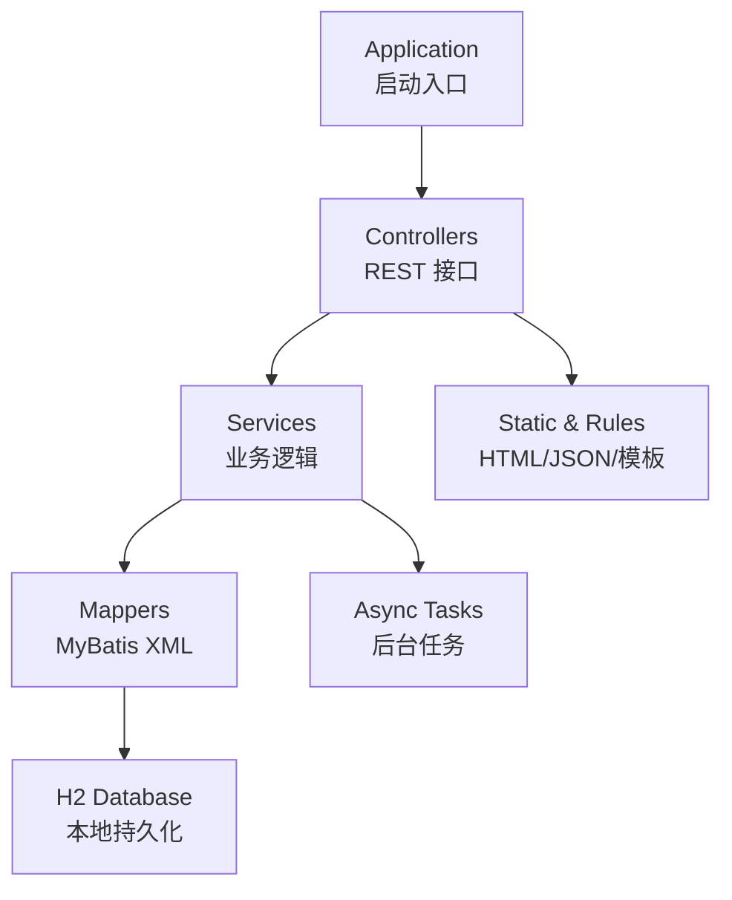
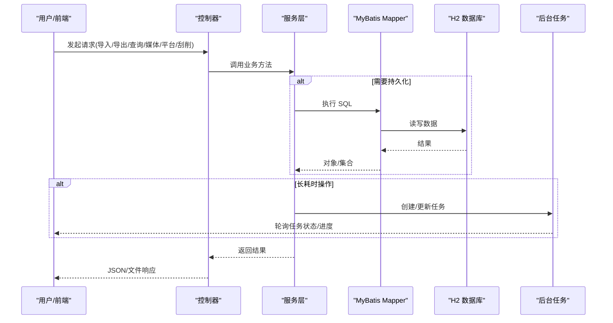
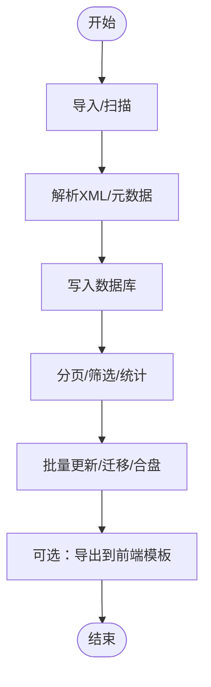
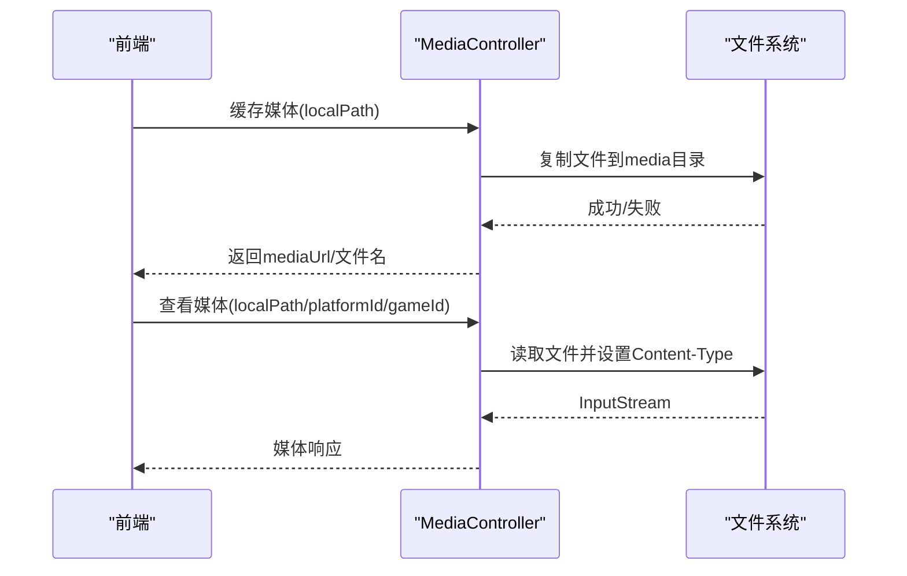
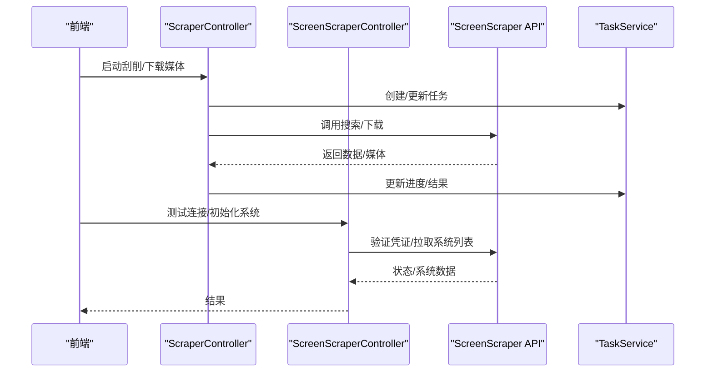
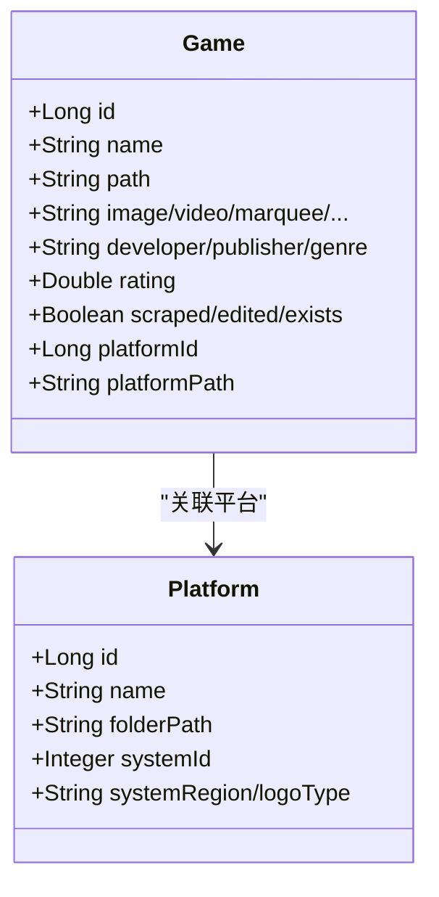
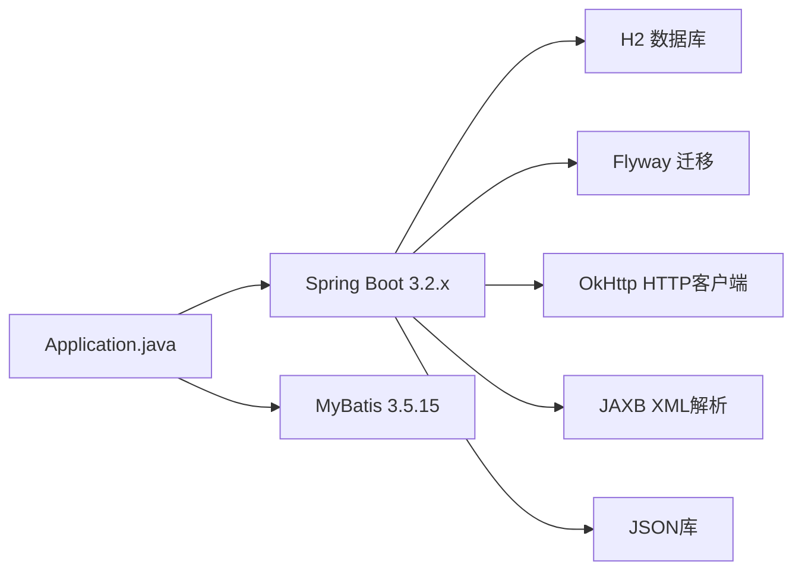

# 项目介绍

<cite>
**本文引用的文件**
- [README.md](file://README.md)
- [pom.xml](file://pom.xml)
- [Application.java](file://src/main/java/com/gamelist/Application.java)
- [application.properties](file://src/main/resources/application.properties)
- [GameListController.java](file://src/main/java/com/gamelist/controller/GameListController.java)
- [ExportController.java](file://src/main/java/com/gamelist/controller/ExportController.java)
- [MediaController.java](file://src/main/java/com/gamelist/controller/MediaController.java)
- [PlatformController.java](file://src/main/java/com/gamelist/controller/PlatformController.java)
- [ScraperController.java](file://src/main/java/com/gamelist/controller/ScraperController.java)
- [ScreenScraperController.java](file://src/main/java/com/gamelist/controller/ScreenScraperController.java)
- [Game.java](file://src/main/java/com/gamelist/model/Game.java)
- [Platform.java](file://src/main/java/com/gamelist/model/Platform.java)
- [BackgroundTaskMapper.xml](file://src/main/resources/mappers/BackgroundTaskMapper.xml)
- [BackgroundTaskMapper.java](file://src/main/java/com/gamelist/mapper/BackgroundTaskMapper.java)
- [TaskService.java](file://src/main/java/com/gamelist/service/TaskService.java)
- [i18n.js](file://src/main/resources/static/js/i18n.js)
</cite>

## 目录
1. [简介](#简介)
2. [项目结构](#项目结构)
3. [核心组件](#核心组件)
4. [架构总览](#架构总览)
5. [详细组件分析](#详细组件分析)
6. [依赖关系分析](#依赖关系分析)
7. [性能考量](#性能考量)
8. [故障排查指南](#故障排查指南)
9. [结论](#结论)
10. [附录](#附录)

## 简介
WebGameListOper 是一个基于 Spring Boot 的游戏列表管理系统，面向游戏收藏者、模拟器前端用户与系统管理员，提供游戏元数据管理、多格式导入导出、媒体资源管理与平台合并等能力。项目以“统一治理游戏清单”为核心目标，帮助不同前端（如 Pegasus、RetroBat、Lakka 等）在统一的数据库与规则体系下高效维护游戏信息，降低跨平台迁移成本，提升内容质量与一致性。

核心价值主张
- 一站式游戏清单治理：集中存储与管理游戏元数据与媒体引用，支持多前端模板的导入与导出。
- 多格式兼容：内置多种导入模板与导出规则，适配主流模拟器前端生态。
- 媒体资源管理：提供媒体缓存、路径解析与访问接口，简化图片/视频等资源的使用。
- 平台合并与迁移：将分散的平台数据整合为统一平台，便于长期维护与扩展。
- 异步任务与可观测性：后台任务进度可视化，便于长耗时操作（如刮削、下载）的管理。
- 多语言支持：界面与提示支持中文、英文、日文，降低使用门槛。

目标用户
- 游戏收藏者：批量导入/导出、媒体管理、平台合并，快速整理个人库。
- 模拟器前端用户：将统一清单输出到指定前端模板，保障封面、截图、说明等一致呈现。
- 系统管理员：配置导入/导出规则、监控任务状态、维护平台与媒体资源。

解决的核心问题
- 游戏元数据管理：统一字段模型、去重与校验、批量更新与迁移。
- 多格式兼容性：通过模板与规则实现跨前端的数据互通。
- 媒体资源管理：路径标准化、缓存与访问控制，减少重复下载与路径错误。

主要特性
- 游戏列表 CRUD：新增、查询、分页、筛选、批量更新与删除。
- 多前端模板导入导出：支持 Pegasus、RetroBat、Lakka、ESDE 等。
- 媒体文件管理：上传缓存、路径映射、在线预览与清理。
- 平台合并：多源平台数据聚合为新平台，支持覆盖策略。
- 异步任务处理：任务创建、进度更新、完成/失败回调与日志记录。
- 多语言支持：前端 i18n 动态加载与页面刷新。
- Scraper 集成：对接 ScreenScraper API，自动获取元数据与媒体。

版本历史与发展规划
- 当前版本：1.0.6-beta3（详见 README 与 pom.xml）。
- 近期改进：导入时文件存在性校验、文件状态过滤、国际化完善、XML 解析增强、错误日志工具。
- 未来规划：多文件游戏支持、文件夹导出配置、高级筛选与统计面板、原生 Windows EXE 分发、ScreenScraper API 深度集成、数据分析看板等。

**章节来源**
- [README.md:25-74](file://README.md#L25-L74)
- [pom.xml:7-10](file://pom.xml#L7-L10)

## 项目结构
项目采用分层架构：控制器层暴露 REST API，服务层封装业务逻辑，数据访问层通过 MyBatis 与 H2 交互，静态资源与规则文件位于 resources 目录。启动类启用异步任务扫描，配置文件定义端口、编码、数据库连接池、Flyway 迁移、MyBatis 映射与日志策略。

**图表来源**
- [Application.java:8-14](file://src/main/java/com/gamelist/Application.java#L8-L14)
- [application.properties:1-86](file://src/main/resources/application.properties#L1-L86)

**章节来源**
- [Application.java:8-14](file://src/main/java/com/gamelist/Application.java#L8-L14)
- [application.properties:1-86](file://src/main/resources/application.properties#L1-L86)

## 核心组件
- 游戏列表管理：提供导入、扫描、分页查询、筛选、批量更新、迁移与合盘等操作。
- 导出服务：按规则导出至多种前端模板，并返回结果与统计。
- 媒体管理：缓存本地媒体、解析路径、提供在线查看与清理接口。
- 平台管理：CRUD、统计、合并、按条件创建平台并关联游戏。
- 刮削与下载：启动/暂停/恢复/停止刮削任务，搜索游戏与下载媒体。
- 后台任务：任务生命周期管理（创建、进度、完成/失败、查询、删除）。

**章节来源**
- [GameListController.java:51-550](file://src/main/java/com/gamelist/controller/GameListController.java#L51-L550)
- [ExportController.java:14-59](file://src/main/java/com/gamelist/controller/ExportController.java#L14-L59)
- [MediaController.java:28-271](file://src/main/java/com/gamelist/controller/MediaController.java#L28-L271)
- [PlatformController.java:22-174](file://src/main/java/com/gamelist/controller/PlatformController.java#L22-L174)
- [ScraperController.java:21-131](file://src/main/java/com/gamelist/controller/ScraperController.java#L21-L131)
- [BackgroundTaskMapper.xml:1-54](file://src/main/resources/mappers/BackgroundTaskMapper.xml#L1-L54)
- [TaskService.java:7-61](file://src/main/java/com/gamelist/service/TaskService.java#L7-L61)

## 架构总览
系统以 Spring Boot 应用为中心，控制器接收请求后调用服务层完成业务处理，必要时通过 MyBatis 访问 H2 数据库；异步任务用于长耗时操作（如刮削、下载），并通过任务表持久化进度与日志。静态资源与规则文件由 Web 服务器直接提供，便于前端渲染与规则加载。

**图表来源**
- [GameListController.java:51-550](file://src/main/java/com/gamelist/controller/GameListController.java#L51-L550)
- [ExportController.java:14-59](file://src/main/java/com/gamelist/controller/ExportController.java#L14-L59)
- [MediaController.java:28-271](file://src/main/java/com/gamelist/controller/MediaController.java#L28-L271)
- [PlatformController.java:22-174](file://src/main/java/com/gamelist/controller/PlatformController.java#L22-L174)
- [ScraperController.java:21-131](file://src/main/java/com/gamelist/controller/ScraperController.java#L21-L131)
- [BackgroundTaskMapper.xml:1-54](file://src/main/resources/mappers/BackgroundTaskMapper.xml#L1-L54)

## 详细组件分析

### 游戏列表管理（GameListController）
- 功能要点：导入 XML、扫描目录导入、分页与多维筛选、批量更新/删除、迁移到目标平台、合盘、唯一值检索、导入模板列表。
- 数据流：请求进入控制器 -> 调用 GameService -> 通过 MyBatis 读写 Game/Platform -> 返回分页与统计。
- 关键接口：导入、扫描、查询、更新、迁移、合盘、筛选、模板列表。

**图表来源**
- [GameListController.java:51-550](file://src/main/java/com/gamelist/controller/GameListController.java#L51-L550)

**章节来源**
- [GameListController.java:51-550](file://src/main/java/com/gamelist/controller/GameListController.java#L51-L550)

### 导出服务（ExportController）
- 功能要点：按规则导出平台数据，获取可用导出规则列表。
- 数据流：请求携带导出参数 -> ExportService 根据规则生成目标格式 -> 返回结果或错误信息。

**章节来源**
- [ExportController.java:14-59](file://src/main/java/com/gamelist/controller/ExportController.java#L14-L59)

### 媒体管理（MediaController）
- 功能要点：缓存本地媒体文件、路径标准化（含 Windows 映射）、在线查看、清理缓存。
- 数据流：上传/缓存 -> 生成安全文件名与 URL -> 提供视图接口 -> 支持清理。

**图表来源**
- [MediaController.java:28-271](file://src/main/java/com/gamelist/controller/MediaController.java#L28-L271)

**章节来源**
- [MediaController.java:28-271](file://src/main/java/com/gamelist/controller/MediaController.java#L28-L271)

### 平台管理（PlatformController）
- 功能要点：平台 CRUD、按条件创建平台并关联游戏、平台合并、平台统计、触发平台级刮削。
- 数据流：请求 -> PlatformService -> 数据库 -> 返回平台信息与统计。

**章节来源**
- [PlatformController.java:22-174](file://src/main/java/com/gamelist/controller/PlatformController.java#L22-L174)

### 刮削与下载（ScraperController / ScreenScraperController）
- 功能要点：启动/暂停/恢复/停止刮削任务，查询任务状态，搜索游戏，下载媒体；ScreenScraper 连接测试、系统初始化。
- 数据流：前端触发 -> 控制器 -> 服务层调用外部 API -> 更新任务状态与结果。

**图表来源**
- [ScraperController.java:21-131](file://src/main/java/com/gamelist/controller/ScraperController.java#L21-L131)
- [ScreenScraperController.java:18-119](file://src/main/java/com/gamelist/controller/ScreenScraperController.java#L18-L119)
- [TaskService.java:7-61](file://src/main/java/com/gamelist/service/TaskService.java#L7-L61)

**章节来源**
- [ScraperController.java:21-131](file://src/main/java/com/gamelist/controller/ScraperController.java#L21-L131)
- [ScreenScraperController.java:18-119](file://src/main/java/com/gamelist/controller/ScreenScraperController.java#L18-L119)

### 数据模型（Game / Platform）
- Game：包含丰富的媒体字段、平台关联、刮削/编辑状态、路径信息等，支撑多前端展示与导出。
- Platform：平台基础信息与排序、启动命令、文件夹路径、区域与 Logo 类型等。

**图表来源**
- [Game.java:1-650](file://src/main/java/com/gamelist/model/Game.java#L1-L650)
- [Platform.java:1-141](file://src/main/java/com/gamelist/model/Platform.java#L1-L141)

**章节来源**
- [Game.java:1-650](file://src/main/java/com/gamelist/model/Game.java#L1-L650)
- [Platform.java:1-141](file://src/main/java/com/gamelist/model/Platform.java#L1-L141)

### 后台任务（BackgroundTaskMapper / TaskService）
- 功能要点：任务创建、进度更新、完成/失败标记、查询与删除，持久化到 background_task 表。
- 数据流：服务层创建任务 -> 异步执行 -> 定时/事件驱动更新进度 -> 前端轮询显示。

**章节来源**
- [BackgroundTaskMapper.xml:1-54](file://src/main/resources/mappers/BackgroundTaskMapper.xml#L1-L54)
- [BackgroundTaskMapper.java:1-19](file://src/main/java/com/gamelist/mapper/BackgroundTaskMapper.java#L1-L19)
- [TaskService.java:7-61](file://src/main/java/com/gamelist/service/TaskService.java#L7-L61)

## 依赖关系分析
- 技术栈：Spring Boot 3.2.x、Java 17、MyBatis、H2、Flyway、OkHttp、JAXB、JSON 库。
- 启动与扫描：Application 启用 @EnableAsync 与 MapperScan。
- 配置：application.properties 定义端口、编码、静态资源、数据库连接池、Flyway 迁移、MyBatis 映射与日志。

**图表来源**
- [pom.xml:11-106](file://pom.xml#L11-L106)
- [Application.java:8-14](file://src/main/java/com/gamelist/Application.java#L8-L14)
- [application.properties:1-86](file://src/main/resources/application.properties#L1-L86)

**章节来源**
- [pom.xml:11-106](file://pom.xml#L11-L106)
- [Application.java:8-14](file://src/main/java/com/gamelist/Application.java#L8-L14)
- [application.properties:1-86](file://src/main/resources/application.properties#L1-L86)

## 性能考量
- 数据库连接池：HikariCP 最大连接数、空闲超时、连接超时与生命周期配置，避免连接耗尽。
- 静态资源缓存策略：开发环境关闭缓存，便于调试；生产可调整缓存策略以提升性能。
- 异步任务：长耗时操作（刮削、下载）通过异步任务与任务表管理，避免阻塞请求线程。
- 文件 I/O：媒体缓存与路径标准化减少重复拷贝与路径错误，提高稳定性。
- 日志：控制台与文件日志分离，便于定位问题与审计。

[本节为通用指导，不直接分析具体文件]

## 故障排查指南
- 导入失败：检查 XML 解析异常与临时文件清理；确认路径与权限。
- 媒体无法访问：核对路径映射（Windows 路径转换）、platformPath 与 folderPath 拼接是否正确；必要时清理缓存重试。
- 平台合并异常：确认源平台 ID 列表与覆盖策略；检查目标平台路径是否存在。
- 刮削失败：验证 ScreenScraper 凭证与网络连通；查看任务日志与错误消息。
- 任务卡住：通过任务接口查询状态与进度；必要时重置或删除任务。

**章节来源**
- [MediaController.java:28-271](file://src/main/java/com/gamelist/controller/MediaController.java#L28-L271)
- [PlatformController.java:22-174](file://src/main/java/com/gamelist/controller/PlatformController.java#L22-L174)
- [ScraperController.java:21-131](file://src/main/java/com/gamelist/controller/ScraperController.java#L21-L131)
- [BackgroundTaskMapper.xml:1-54](file://src/main/resources/mappers/BackgroundTaskMapper.xml#L1-L54)

## 结论
WebGameListOper 提供了完整的游戏清单治理能力，覆盖从导入、管理、媒体到导出的全链路场景，结合异步任务与多语言支持，显著降低了多前端生态下的维护成本。随着版本演进，项目在 Scraper 集成、原生分发与数据分析方面将持续增强，为用户提供更稳定、易用与强大的游戏库管理体验。

[本节为总结，不直接分析具体文件]

## 附录
- 多语言支持：前端 i18n 模块支持动态加载语言包与页面刷新，默认支持 zh-CN、en-US、ja-JP。
- 部署方式：支持 Docker、Docker Compose 与 JAR 运行；端口与静态资源路径可通过环境变量与属性配置。

**章节来源**
- [i18n.js:1-76](file://src/main/resources/static/js/i18n.js#L1-L76)
- [README.md:93-227](file://README.md#L93-L227)