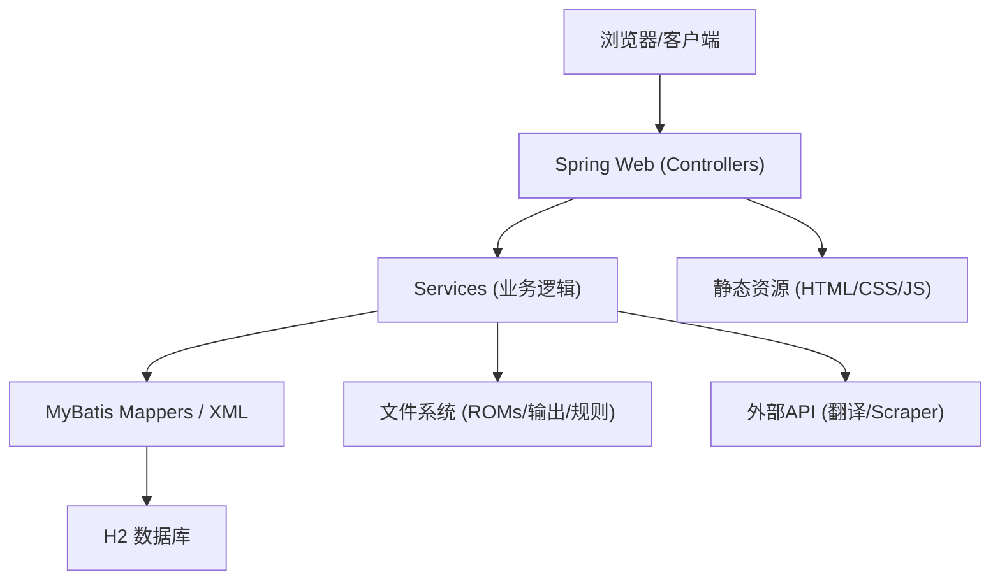
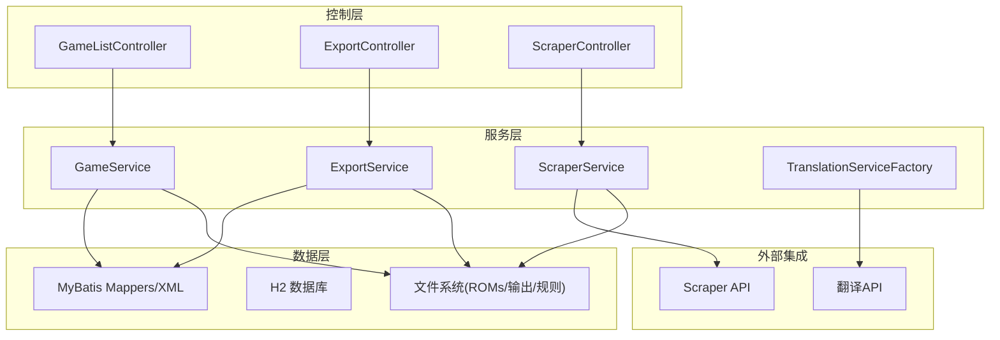
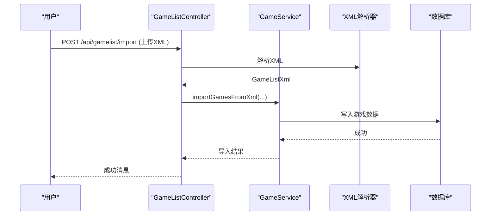
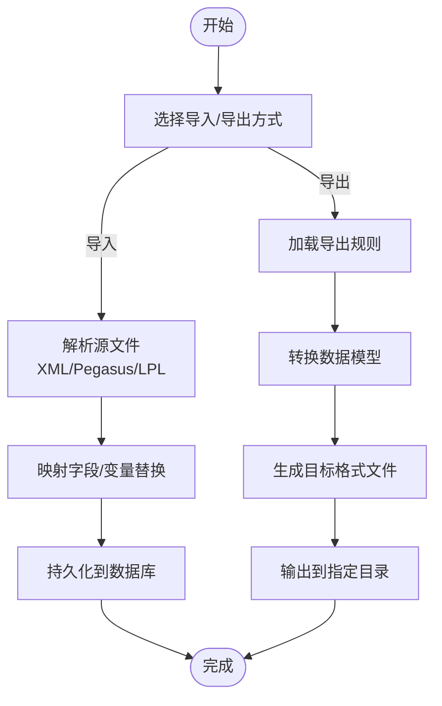
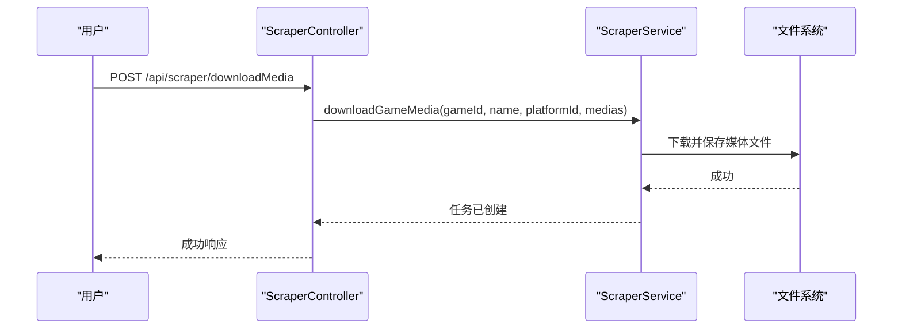
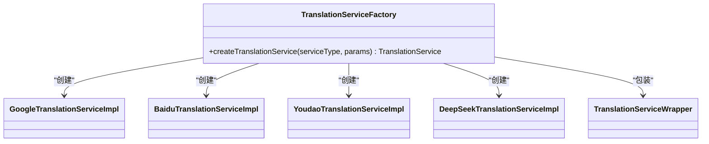
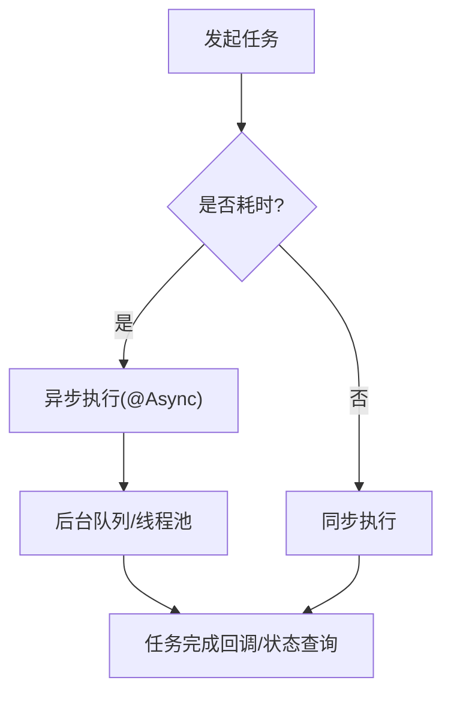
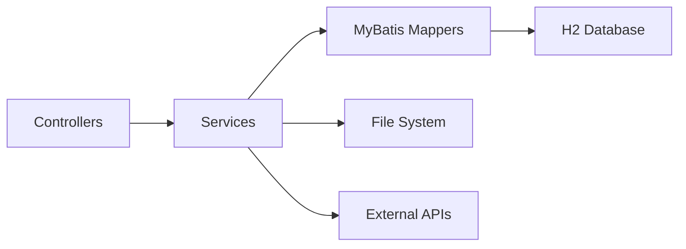

# 项目概述

<cite>
**本文引用的文件**
- [README.md](file://README.md)
- [pom.xml](file://pom.xml)
- [Application.java](file://src/main/java/com/gamelist/Application.java)
- [application.properties](file://src/main/resources/application.properties)
- [GameListController.java](file://src/main/java/com/gamelist/controller/GameListController.java)
- [ExportController.java](file://src/main/java/com/gamelist/controller/ExportController.java)
- [ScraperController.java](file://src/main/java/com/gamelist/controller/ScraperController.java)
- [GameService.java](file://src/main/java/com/gamelist/service/GameService.java)
- [TranslationServiceFactory.java](file://src/main/java/com/gamelist/service/impl/TranslationServiceFactory.java)
- [AsyncConfig.java](file://src/main/java/com/gamelist/config/AsyncConfig.java)
- [Quick-Start.md](file://wiki/Quick-Start.md)
</cite>

## 目录
1. [简介](#简介)
2. [项目结构](#项目结构)
3. [核心组件](#核心组件)
4. [架构总览](#架构总览)
5. [详细组件分析](#详细组件分析)
6. [依赖关系分析](#依赖关系分析)
7. [性能考量](#性能考量)
8. [故障排查指南](#故障排查指南)
9. [结论](#结论)
10. [附录：快速开始](#附录快速开始)

## 简介
WebGameListOper 是一个基于 Spring Boot 的游戏列表管理系统，面向游戏收藏者、模拟器前端用户与平台管理员。系统提供游戏列表的增删改查、多格式导入导出、媒体文件管理、翻译服务集成以及 Scraper 系统集成等能力，帮助用户高效维护与管理跨平台的游戏元数据与资源。

目标用户群体
- 个人玩家：整理与美化自己的游戏库，批量导入/导出不同前端模板（如 Pegasus、RetroBat、Lakka 等）。
- 平台管理员：统一管理平台、合并数据、批量更新与迁移、监控任务状态。
- 开发者/运维：通过 API 与配置进行二次开发与自动化部署。

主要应用场景
- 将多个来源的游戏清单（XML、Pegasus metadata、LPL）统一导入并标准化存储。
- 按规则导出为不同前端所需的清单格式，支持变量替换与字段映射。
- 自动或半自动抓取游戏封面、截图、视频等媒体资源，并进行本地化管理。
- 使用多种翻译服务对游戏名称与描述进行批量翻译，提升可读性。
- 异步执行耗时任务（扫描、导入、导出、刮削、下载），保障交互流畅。

技术栈选择
- Java 17 + Spring Boot 3.2.x：现代化后端框架，生态完善，易于扩展。
- H2 数据库 + Flyway：轻量内嵌数据库配合版本化迁移，便于部署与升级。
- MyBatis：灵活的 SQL 映射，适配复杂查询与多平台字段差异。
- OkHttp + JSON：HTTP 客户端与 JSON 处理，支撑外部 API 调用与响应封装。
- Docker：容器化部署，简化环境差异与运维成本。

## 项目结构
项目采用典型的 MVC 分层与模块化组织：
- controller：REST 接口层，接收请求、参数校验、返回结果。
- service：业务逻辑层，封装核心流程（导入、导出、刮削、翻译、任务管理等）。
- model：领域模型与请求/响应对象，承载数据契约。
- mapper/xml：MyBatis 映射与 SQL 定义。
- config：应用配置（异步、数据库、静态资源、初始化等）。
- util：工具类（加密、语言检测、路径处理、速率限制等）。
- xml：XML/Pegasus 元数据解析器。
- resources/static：前端页面与国际化资源。
- rules/import/export：导入模板与导出规则配置文件。
- docs/wiki：用户文档与使用说明。

图表来源
- [GameListController.java:39-551](file://src/main/java/com/gamelist/controller/GameListController.java#L39-L551)
- [ExportController.java:14-60](file://src/main/java/com/gamelist/controller/ExportController.java#LL14-L60)
- [ScraperController.java:21-131](file://src/main/java/com/gamelist/controller/ScraperController.java#L21-L131)
- [GameService.java:13-61](file://src/main/java/com/gamelist/service/GameService.java#L13-L61)
- [application.properties:10-86](file://src/main/resources/application.properties#L10-L86)

章节来源
- [pom.xml:1-152](file://pom.xml#L1-L152)
- [application.properties:1-86](file://src/main/resources/application.properties#L1-L86)

## 核心组件
- 游戏列表控制器（GameListController）：提供导入、扫描、分页查询、统计、筛选、批量更新/删除、迁移、合盘等接口。
- 导出控制器（ExportController）：提供按规则导出平台清单、获取导出规则列表等接口。
- 刮削控制器（ScraperController）：提供启动/暂停/恢复/停止刮削任务、查询任务状态、搜索游戏、下载媒体等接口。
- 游戏服务（GameService）：定义导入、扫描、CRUD、统计、筛选、批量操作、迁移、合盘等能力契约。
- 翻译服务工厂（TranslationServiceFactory）：根据类型创建具体翻译实现（Google、百度、有道、DeepSeek），并包装通用错误处理。
- 异步配置（AsyncConfig）：启用 Spring 异步能力，支撑后台任务与长耗时操作。

章节来源
- [GameListController.java:39-551](file://src/main/java/com/gamelist/controller/GameListController.java#L39-L551)
- [ExportController.java:14-60](file://src/main/java/com/gamelist/controller/ExportController.java#L14-L60)
- [ScraperController.java:21-131](file://src/main/java/com/gamelist/controller/ScraperController.java#L21-L131)
- [GameService.java:13-61](file://src/main/java/com/gamelist/service/GameService.java#L13-L61)
- [TranslationServiceFactory.java:5-46](file://src/main/java/com/gamelist/service/impl/TranslationServiceFactory.java#L5-L46)
- [AsyncConfig.java:1-14](file://src/main/java/com/gamelist/config/AsyncConfig.java#L1-L14)

## 架构总览
系统遵循 MVC 分层设计，结合工厂模式与异步任务处理，形成高内聚、低耦合的可扩展架构：
- 控制层：以 RESTful 风格暴露能力，统一异常与日志记录。
- 服务层：聚合业务编排，协调导入/导出/刮削/翻译/任务等子系统。
- 数据层：MyBatis + H2，Flyway 管理迁移；文件系统用于 ROM、输出与规则。
- 外部集成：OkHttp 调用翻译与 Scraper 服务；JSON 处理响应。
- 异步处理：@EnableAsync 开启异步，适合批量导入、导出、刮削与下载。

图表来源
- [GameListController.java:39-551](file://src/main/java/com/gamelist/controller/GameListController.java#L39-L551)
- [ExportController.java:14-60](file://src/main/java/com/gamelist/controller/ExportController.java#L14-L60)
- [ScraperController.java:21-131](file://src/main/java/com/gamelist/controller/ScraperController.java#L21-L131)
- [GameService.java:13-61](file://src/main/java/com/gamelist/service/GameService.java#L13-L61)
- [TranslationServiceFactory.java:5-46](file://src/main/java/com/gamelist/service/impl/TranslationServiceFactory.java#L5-L46)

## 详细组件分析

### 游戏列表管理（CRUD、导入、扫描、统计、筛选、批量操作）
- 导入与扫描：支持上传 XML、扫描指定路径下的 gamelist.xml 与 Pegasus metadata，解析后入库。
- 查询与分页：支持按平台、时间范围、开发商、类型、玩家数、刮削状态、文件状态等多维筛选与分页。
- 统计：总体统计与各平台统计，辅助运营与决策。
- 批量操作：批量更新、批量删除、迁移至目标平台、合盘（多碟合并）。
- 模板导入：动态读取导入模板目录，展示可用模板信息。

图表来源
- [GameListController.java:54-74](file://src/main/java/com/gamelist/controller/GameListController.java#L54-L74)
- [GameService.java:14-20](file://src/main/java/com/gamelist/service/GameService.java#L14-L20)

章节来源
- [GameListController.java:54-551](file://src/main/java/com/gamelist/controller/GameListController.java#L54-L551)
- [GameService.java:14-61](file://src/main/java/com/gamelist/service/GameService.java#L14-L61)

### 多格式导入导出
- 导入：支持 XML、Pegasus metadata、LPL 等多种格式，可指定导入方法与模板，支持仅元数据导入与多线程并发。
- 导出：按规则导出到不同前端模板，支持变量替换与字段映射，提供规则列表查询。

图表来源
- [GameListController.java:79-114](file://src/main/java/com/gamelist/controller/GameListController.java#L79-L114)
- [ExportController.java:25-58](file://src/main/java/com/gamelist/controller/ExportController.java#L25-L58)
- [GameService.java:17-37](file://src/main/java/com/gamelist/service/GameService.java#L17-L37)

章节来源
- [GameListController.java:79-114](file://src/main/java/com/gamelist/controller/GameListController.java#L79-L114)
- [ExportController.java:25-58](file://src/main/java/com/gamelist/controller/ExportController.java#L25-L58)
- [GameService.java:17-37](file://src/main/java/com/gamelist/service/GameService.java#L17-L37)

### 媒体文件管理与下载
- 媒体下载：支持单个游戏媒体文件下载任务创建，后台异步执行。
- 状态查询：提供当前刮削/下载状态查询，便于前端展示进度。
- 文件访问：静态资源映射 ROMs、输出目录，便于直接访问媒体。

图表来源
- [ScraperController.java:114-131](file://src/main/java/com/gamelist/controller/ScraperController.java#L114-L131)

章节来源
- [ScraperController.java:33-131](file://src/main/java/com/gamelist/controller/ScraperController.java#L33-L131)

### 翻译服务集成（工厂模式）
- 工厂模式：根据服务类型创建对应翻译实现（Google、百度、有道、DeepSeek），并统一包装错误处理。
- 可扩展：新增翻译服务只需实现接口并在工厂中注册。

图表来源
- [TranslationServiceFactory.java:5-46](file://src/main/java/com/gamelist/service/impl/TranslationServiceFactory.java#L5-L46)

章节来源
- [TranslationServiceFactory.java:5-46](file://src/main/java/com/gamelist/service/impl/TranslationServiceFactory.java#L5-L46)

### 异步任务处理
- 异步启用：通过 @EnableAsync 与 AsyncConfig 启用异步能力。
- 适用场景：批量导入/导出、扫描、刮削、媒体下载等耗时任务，避免阻塞主线程。

图表来源
- [AsyncConfig.java:1-14](file://src/main/java/com/gamelist/config/AsyncConfig.java#L1-L14)
- [Application.java:8-15](file://src/main/java/com/gamelist/Application.java#L8-L15)

章节来源
- [AsyncConfig.java:1-14](file://src/main/java/com/gamelist/config/AsyncConfig.java#L1-L14)
- [Application.java:8-15](file://src/main/java/com/gamelist/Application.java#L8-L15)

## 依赖关系分析
- 控制层与服务层解耦：控制器仅负责入参出参与简单编排，核心逻辑在 Service。
- 服务层与数据层解耦：通过 MyBatis Mapper 抽象数据库访问，便于替换与测试。
- 外部依赖：OkHttp 用于 HTTP 调用，JSON 用于响应构建；H2 作为默认数据库，Flyway 管理迁移。
- 配置驱动：application.properties 集中管理端口、编码、静态资源、数据库连接池、文件路径等。

图表来源
- [pom.xml:23-106](file://pom.xml#L23-L106)
- [application.properties:15-86](file://src/main/resources/application.properties#L15-L86)

章节来源
- [pom.xml:23-106](file://pom.xml#L23-L106)
- [application.properties:15-86](file://src/main/resources/application.properties#L15-L86)

## 性能考量
- 连接池：HikariCP 配置了最大连接数、空闲超时、连接超时等，优化数据库访问性能。
- 静态资源缓存策略：开发环境下关闭缓存，便于调试；生产环境可按需调整。
- 异步任务：批量导入/导出、刮削与下载建议异步执行，减少前端等待时间。
- 文件上传：配置临时目录与大小限制，避免无权限与大文件导致的问题。
- 日志：控制台与文件日志分离，便于问题定位与审计。

[本节为通用性能指导，不直接分析具体文件]

## 故障排查指南
- 导入失败：检查上传文件是否为有效 XML，确认解析器与模板匹配；查看控制器异常捕获与日志。
- 扫描失败：确认路径存在且具备读取权限，扫描深度合理；关注异常信息与返回的错误码。
- 导出失败：核对导出规则是否存在且正确；检查输出目录权限与磁盘空间。
- 翻译失败：确认翻译服务密钥与网络连通性；查看工厂创建参数是否完整。
- 刮削/下载失败：检查 Scraper API 限流与认证；确认媒体 URL 可达与目标目录可写。

章节来源
- [GameListController.java:54-114](file://src/main/java/com/gamelist/controller/GameListController.java#L54-L114)
- [ExportController.java:25-58](file://src/main/java/com/gamelist/controller/ExportController.java#L25-L58)
- [ScraperController.java:33-131](file://src/main/java/com/gamelist/controller/ScraperController.java#L33-L131)
- [TranslationServiceFactory.java:5-46](file://src/main/java/com/gamelist/service/impl/TranslationServiceFactory.java#L5-L46)

## 结论
WebGameListOper 以 Spring Boot 为核心，结合 MVC 分层、工厂模式与异步任务处理，提供了完整的游戏列表管理能力。系统支持多格式导入导出、媒体文件管理、翻译服务集成与 Scraper 系统集成，满足多样化场景需求。通过清晰的架构设计与完善的配置项，既便于初学者上手，也为有经验开发者提供了足够的扩展空间。

[本节为总结性内容，不直接分析具体文件]

## 附录：快速开始
- 使用 Docker 运行（推荐）：创建必要目录，拉取镜像并启动容器，映射数据、ROMs、日志与备份目录。
- 使用 JAR 包运行：准备 data/rules/export、data/rules/import、output、logs 目录后直接运行。
- 访问地址：http://localhost:8081（或映射端口）。
- 基本流程：导入游戏数据 → 管理游戏（查看/编辑/新增/删除）→ 导出数据 → 可选翻译与媒体下载。

章节来源
- [README.md:95-149](file://README.md#L95-L149)
- [README.md:172-226](file://README.md#L172-L226)
- [Quick-Start.md:5-89](file://wiki/Quick-Start.md#L5-L89)