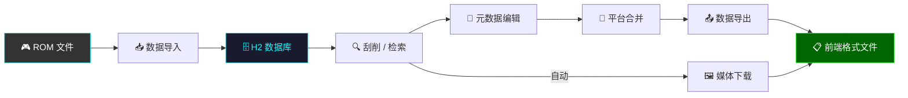
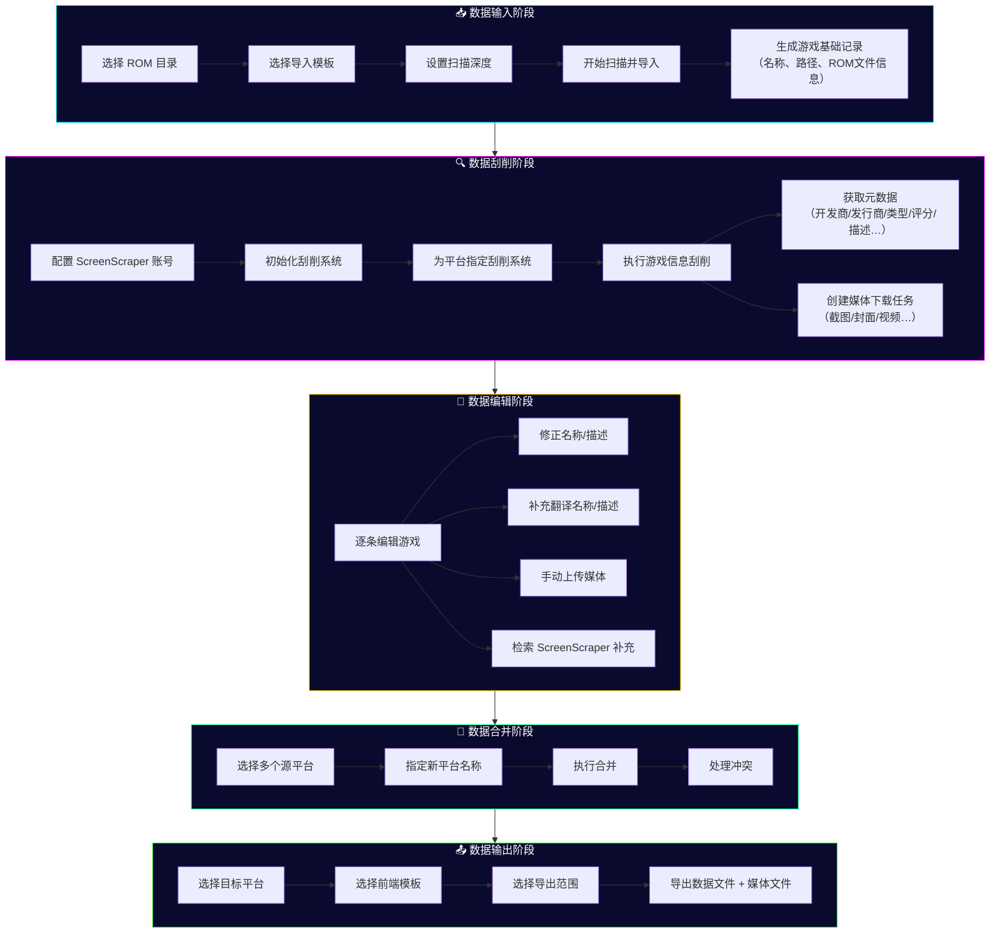
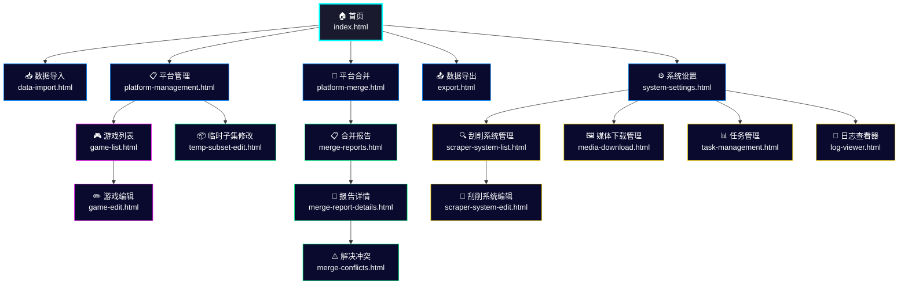

# Frontend-Killer 软件说明

> **版本**：v1.1-RC1 · **更新日期**：2026-09-13

Frontend-Killer（webGamelistOper）是一款基于 Web 的模拟游戏元数据管理平台，用于将 ROM 文件集合加工为各前端启动器可直接使用的游戏列表数据。

---

## 数据加工流程

### 流程说明

| 步骤 | 说明 | 对应页面 |
|------|------|----------|
| 1. ROM 文件 | 用户的模拟游戏 ROM 文件目录 | — |
| 2. 数据导入 | 扫描 ROM 目录，按导入模板解析生成游戏记录 | [数据导入](03-data-import-cn.md) |
| 3. H2 数据库 | 所有游戏数据存储在内嵌 H2 数据库中 | [系统设置](11-system-settings-cn.md) |
| 4. 刮削/检索 | 通过 ScreenScraper API 获取游戏元数据与媒体 | [刮削系统](09-scraper-cn.md) |
| 5. 元数据编辑 | 手动修正/补充游戏名称、描述、翻译等 | [游戏编辑](06-game-edit-cn.md) |
| 6. 平台合并 | 将多个子平台合并为一个统一平台 | [平台合并](07-platform-merge-cn.md) |
| 7. 数据导出 | 按目标前端模板输出 gamelist.xml 等文件 | [数据导出](08-export-cn.md) |
| 8. 媒体下载 | 自动下载截图、封面、视频等媒体文件 | [媒体下载](10-media-download-cn.md) |

---

## 数据生产流程图

---

## 页面导航图

---

## 文档目录

| 编号 | 文档 | 说明 |
|------|------|------|
| 00 | [总览](00-overview-cn.md) | 本文 — 流程图与页面索引 |
| 01 | [快速开始](01-quick-start-cn.md) | 从零到导出的最小操作步骤 |
| 02 | [首页](02-home-page-cn.md) | 首页功能卡片与导航 |
| 03 | [数据导入](03-data-import-cn.md) | ROM 扫描与导入配置 |
| 04 | [平台管理](04-platform-mgmt-cn.md) | 平台增删改查、刮削系统绑定 |
| 05 | [游戏列表](05-game-list-cn.md) | 游戏表格、搜索、批量操作 |
| 06 | [游戏编辑](06-game-edit-cn.md) | 单条游戏编辑、媒体管理、检索 |
| 07 | [平台合并](07-platform-merge-cn.md) | 多平台合并与冲突处理 |
| 08 | [数据导出](08-export-cn.md) | 导出配置与前端格式输出 |
| 09 | [刮削系统](09-scraper-cn.md) | ScreenScraper 集成与系统管理 |
| 10 | [媒体下载](10-media-download-cn.md) | 媒体下载任务管理与配额 |
| 11 | [系统设置](11-system-settings-cn.md) | 语言、账号、数据库备份 |
| 12 | [任务管理](12-task-management-cn.md) | 后台任务监控与日志 |
| 13 | [日志查看器](13-log-viewer-cn.md) | 实时日志查看 |
| 14 | [临时子集](14-temp-subset-cn.md) | 子集分离、编辑与同步 |
| 15 | [常见问题](15-faq-cn.md) | FAQ 与故障排查 |

---

## 支持的前端格式

| 前端 | 导入模板 | 导出模板 |
|------|----------|----------|
| Pegasus | `pegasus.json` / `pegasus-v3.json` | `pegasus.json` / `pegasus-v3.json` |
| ES-DE (EmulationStation) | `esde.json` / `esde-v3.json` | `esde.json` / `esde-v3.json` |
| RetroBat | `retrobat.json` / `retrobat-v3.json` | `retrobat.json` / `retrobat-v3.json` |
| EmuELEC | `emuelec.json` / `emuelec-v3.json` | `emuelec.json` |
| Lakka | `lakka.json` | `lakka.json` |
| Skraper (ES) | `skraper-es.json` / `skraper-es-v3.json` | — |
| WebGamelistOper | `webgamelistoper.json` / `webgamelistoper-v3.json` | — |

---

## 技术栈

- **后端**：Spring Boot 3.2.x + Java 17
- **数据库**：H2 嵌入式（单文件 `data/database/database.db`）
- **前端**：纯 HTML + CSS + JavaScript（无框架依赖）
- **刮削**：ScreenScraper API（CRC32 匹配）
- **部署**：可执行 JAR / Docker
