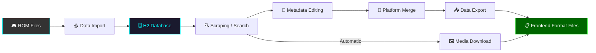
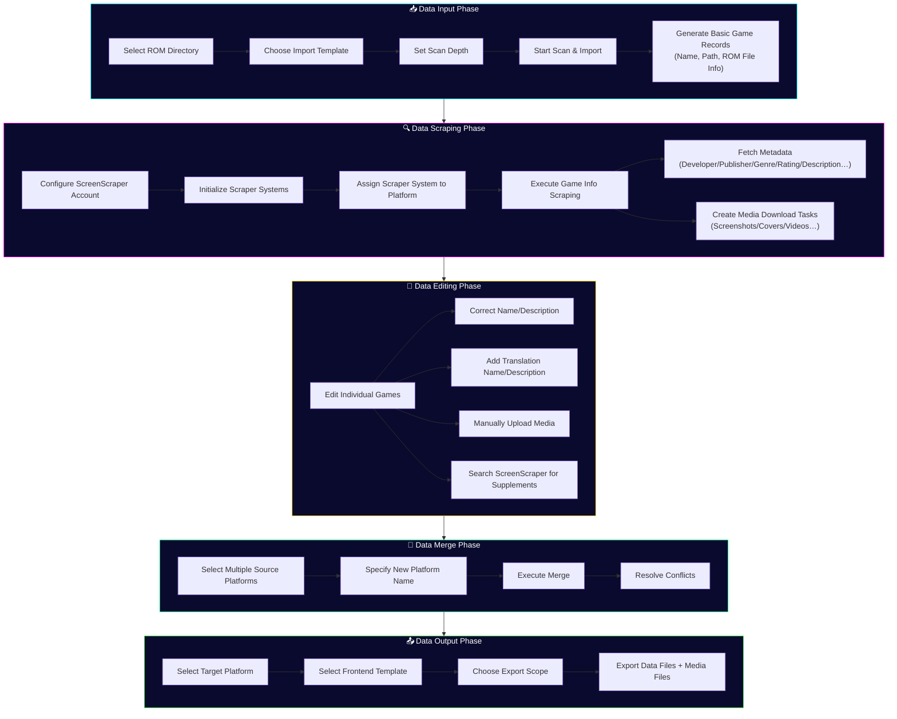
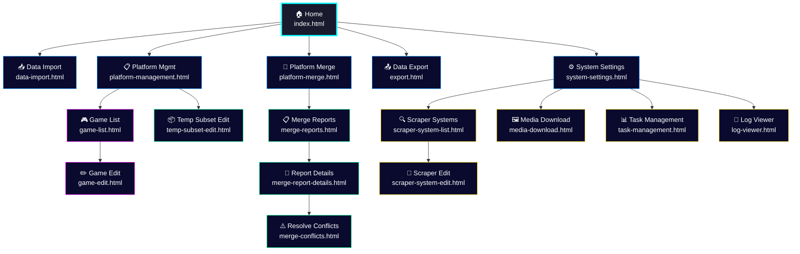

# Frontend-Killer User Guide

> **Version**: v1.2 · **Updated**: 2026-09-23

Frontend-Killer (webGamelistOper) is a web-based retro game metadata management platform that transforms ROM file collections into game list data ready for use by frontend launchers.

---

## Data Processing Pipeline

### Pipeline Steps

| Step | Description | Page |
|------|-------------|------|
| 1. ROM Files | Your retro game ROM file directory | — |
| 2. Data Import | Scan ROM directories and generate game records using import templates | [Data Import](03-data-import-en.md) |
| 3. H2 Database | All game data stored in embedded H2 database | [System Settings](11-system-settings-en.md) |
| 4. Scraping/Search | Fetch game metadata and media via ScreenScraper API | [Scraper System](09-scraper-en.md) |
| 5. Metadata Editing | Manually correct/supplement game names, descriptions, translations | [Game Edit](06-game-edit-en.md) |
| 6. Platform Merge | Merge multiple sub-platforms into one unified platform | [Platform Merge](07-platform-merge-en.md) |
| 7. Data Export | Output gamelist.xml and other files using target frontend templates | [Data Export](08-export-en.md) |
| 8. Media Download | Automatically download screenshots, covers, videos, etc. | [Media Download](10-media-download-en.md) |

---

## Data Production Flowchart

---

## Page Navigation Map

---

## Documentation Index

| No. | Document | Description |
|-----|----------|-------------|
| 00 | [Overview](00-overview-en.md) | This page — flowcharts and page index |
| 01 | [Quick Start](01-quick-start-en.md) | Minimum steps from zero to export |
| 02 | [Home Page](02-home-page-en.md) | Home page feature cards and navigation |
| 03 | [Data Import](03-data-import-en.md) | ROM scanning and import configuration |
| 04 | [Platform Management](04-platform-mgmt-en.md) | Platform CRUD, scraper system binding |
| 05 | [Game List](05-game-list-en.md) | Game table, search, batch operations |
| 06 | [Game Edit](06-game-edit-en.md) | Single game editing, media management, search |
| 07 | [Platform Merge](07-platform-merge-en.md) | Multi-platform merge and conflict handling |
| 08 | [Data Export](08-export-en.md) | Export configuration and frontend format output |
| 09 | [Scraper System](09-scraper-en.md) | ScreenScraper integration and system management |
| 10 | [Media Download](10-media-download-en.md) | Media download task management and quotas |
| 11 | [System Settings](11-system-settings-en.md) | Language, account, database backup |
| 12 | [Task Management](12-task-management-en.md) | Background task monitoring and logs |
| 13 | [Log Viewer](13-log-viewer-en.md) | Real-time log viewing |
| 14 | [Temp Subset](14-temp-subset-en.md) | Subset separation, editing, and sync |
| 15 | [FAQ](15-faq-en.md) | FAQ and troubleshooting |

---

## Supported Frontend Formats

| Frontend | Import Template | Export Template |
|----------|----------------|-----------------|
| Pegasus | `pegasus.json` / `pegasus-v3.json` | `pegasus.json` / `pegasus-v3.json` |
| ES-DE (EmulationStation) | `esde.json` / `esde-v3.json` | `esde.json` / `esde-v3.json` |
| RetroBat | `retrobat.json` / `retrobat-v3.json` | `retrobat.json` / `retrobat-v3.json` |
| EmuELEC | `emuelec.json` / `emuelec-v3.json` | `emuelec.json` |
| Lakka | `lakka.json` | `lakka.json` |
| Skraper (ES) | `skraper-es.json` / `skraper-es-v3.json` | — |
| WebGamelistOper | `webgamelistoper.json` / `webgamelistoper-v3.json` | — |

---

## Tech Stack

- **Backend**: Spring Boot 3.2.x + Java 17
- **Database**: H2 Embedded (single file `data/database/database.db`)
- **Frontend**: Pure HTML + CSS + JavaScript (no framework dependencies)
- **Scraping**: ScreenScraper API (CRC32 matching)
- **Deployment**: Executable JAR / Docker
