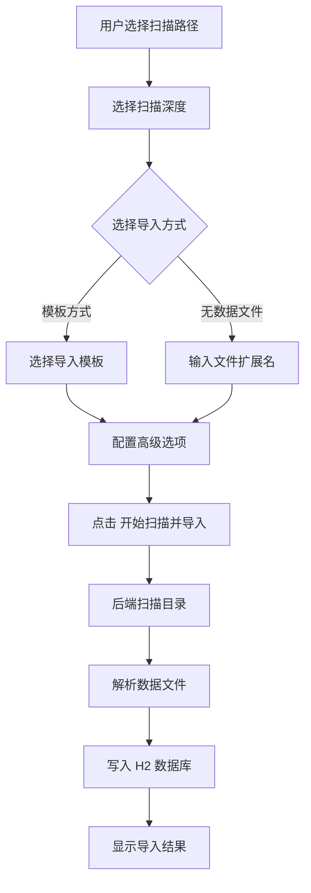

# 数据导入

> 页面文件：`data-import.html`

数据导入页面用于扫描 ROM 目录并将游戏数据导入数据库。这是数据加工流程的第一步。

---

## 页面元素

### 导航栏

| 元素 | 说明 |
|------|------|
| **"返回首页"** 链接 | 返回 `index.html` |

---

### 扫描路径区域

| 元素 | 类型 | 说明 |
|------|------|------|
| **扫描路径** | 文本输入 | ROM 文件所在的根目录路径，可手动输入 |
| **"浏览目录"** 按钮 | 按钮 | 弹出目录浏览窗口，逐级导航选择目录 |
| **子目录列表** | 列表 | 显示当前路径下的子目录，可点击进入下层 |
| **"返回上层"** | 链接 | 在子目录列表中返回上一级目录 |

---

### 导入配置区域

| 元素 | 类型 | 说明 |
|------|------|------|
| **扫描深度** | 下拉选择 | 控制扫描子目录的层数。选项：全部 / 当前 / 1层 / 2层 / 3层 |
| **选择系统** | 下拉选择 | （可选）选择刮削系统后，自动关联该系统的文件扩展名 |
| **文件扩展名** | 文本显示 | 根据所选系统自动填充，也可手动修改 |

---

### 导入方式

页面提供两种导入方式，通过单选按钮切换：

#### 方式一：模板方式导入（推荐）

| 元素 | 类型 | 说明 |
|------|------|------|
| **导入模板** | 下拉选择 | 选择与 ROM 目录结构匹配的导入模板 |
| **模板描述** | 文本显示 | 显示所选模板的说明信息 |

可用模板列表：

| 模板名称 | 适用场景 |
|----------|----------|
| `pegasus.json` / `pegasus-v3.json` | Pegasus 前端格式 |
| `esde.json` / `esde-v3.json` | ES-DE (EmulationStation) 格式 |
| `retrobat.json` / `retrobat-v3.json` | RetroBat 格式 |
| `emuelec.json` / `emuelec-v3.json` | EmuELEC 格式 |
| `lakka.json` | Lakka 格式 |
| `skraper-es.json` / `skraper-es-v3.json` | Skraper 导出格式 |
| `webgamelistoper.json` / `webgamelistoper-v3.json` | 本工具自身格式 |

> 💡 **v3 模板** 是 V3 版本格式，支持更丰富的字段映射。如果你的数据来源于本工具早期版本，请选择对应的 v3 模板。

#### 方式二：无数据文件导入

当 ROM 目录下没有 gamelist.xml 等数据文件时使用。系统仅根据文件名创建基础游戏记录。

| 元素 | 类型 | 说明 |
|------|------|------|
| **文件扩展名** | 文本输入 | 手动指定要扫描的 ROM 文件扩展名（如 `.nes`, `.sfc`） |

---

### 高级选项

| 元素 | 类型 | 说明 |
|------|------|------|
| **"匹配无记录媒体文件"** | 复选框 | 导入时同时扫描媒体目录，将无游戏记录的媒体文件标记为待匹配 |
| **导入线程数** | 下拉选择 | 控制并行导入的线程数量，范围 1-10，默认 2 |

---

### 操作按钮

| 按钮 | 说明 |
|------|------|
| **"开始扫描并导入"** | 启动导入流程。系统按配置扫描目录并解析数据文件，将结果写入数据库 |

---

## 目录浏览功能

点击 **"浏览目录"** 按钮后弹出目录浏览模态框：

| 元素 | 说明 |
|------|------|
| **当前路径显示** | 显示当前浏览的目录路径 |
| **子目录列表** | 列出当前目录下的所有子目录 |
| **目录名** | 点击可进入该子目录 |
| **"选择此目录"** 按钮 | 将当前目录设为扫描路径 |
| **"返回上层"** 按钮 | 返回上一级目录 |
| **"关闭"** 按钮 | 关闭浏览窗口 |

---

## 导入流程

---

## 导入结果

导入完成后，页面显示统计信息：

| 统计项 | 说明 |
|--------|------|
| 扫描文件数 | 扫描到的 ROM 文件总数 |
| 成功导入数 | 成功写入数据库的游戏记录数 |
| 跳过数 | 因重复或其他原因跳过的文件数 |
| 失败数 | 导入失败的文件数 |

---

## 注意事项

1. **路径格式**：Windows 下使用正斜杠 `/` 或双反斜杠 `\\`
2. **大目录导入**：ROM 数量较多时，建议增加导入线程数以加速
3. **重复导入**：系统会自动跳过已存在的游戏记录（基于路径去重）
4. **模板选择**：模板决定了如何解析数据文件中的字段映射关系
5. **媒体匹配**：勾选"匹配无记录媒体文件"后，系统会尝试将已有的媒体文件与游戏记录关联

---

## 下一步

- 导入后管理平台 → [平台管理](04-platform-mgmt-cn.md)
- 了解模板详情 → 参见 `rules/import/` 目录下的模板文件
