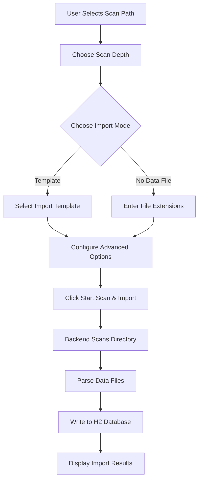

# Data Import

> Page file: `data-import.html`

The Data Import page is used to scan ROM directories and import game data into the database. This is the first step in the data processing pipeline.

---

## Page Elements

### Navigation Bar

| Element | Description |
|---------|-------------|
| **"Back to Home"** link | Returns to `index.html` |

---

### Scan Path Area

| Element | Type | Description |
|---------|------|-------------|
| **Scan Path** | Text input | Root directory path for ROM files; can be typed manually |
| **"Browse Directory"** button | Button | Opens a directory browser modal for step-by-step navigation |
| **Subdirectory List** | List | Shows subdirectories under the current path; click to navigate deeper |
| **"Go Up"** | Link | Navigate to the parent directory in the browser |

---

### Import Configuration

| Element | Type | Description |
|---------|------|-------------|
| **Scan Depth** | Dropdown | Controls how many subdirectory levels to scan. Options: All / Current / 1-3 levels |
| **Select System** | Dropdown | (Optional) Selecting a scraper system auto-associates file extensions |
| **File Extensions** | Text display | Auto-filled based on selected system; can also be edited manually |

---

### Import Modes

The page offers two import modes, switched via radio buttons:

#### Mode 1: Template Import (Recommended)

| Element | Type | Description |
|---------|------|-------------|
| **Import Template** | Dropdown | Select an import template matching your ROM directory structure |
| **Template Description** | Text display | Shows the description of the selected template |

Available templates:

| Template Name | Use Case |
|---------------|----------|
| `pegasus.json` / `pegasus-v3.json` | Pegasus frontend format |
| `esde.json` / `esde-v3.json` | ES-DE (EmulationStation) format |
| `retrobat.json` / `retrobat-v3.json` | RetroBat format |
| `emuelec.json` / `emuelec-v3.json` | EmuELEC format |
| `lakka.json` | Lakka format |
| `skraper-es.json` / `skraper-es-v3.json` | Skraper export format |
| `webgamelistoper.json` / `webgamelistoper-v3.json` | This tool's native format |

> 💡 **v3 templates** are V3 version format with richer field mappings. If your data comes from earlier versions of this tool, choose the corresponding v3 template.

#### Mode 2: No-Data-File Import

Used when the ROM directory has no gamelist.xml or similar data files. The system creates basic game records based on filenames only.

| Element | Type | Description |
|---------|------|-------------|
| **File Extensions** | Text input | Manually specify ROM file extensions to scan (e.g., `.nes`, `.sfc`) |

---

### Advanced Options

| Element | Type | Description |
|---------|------|-------------|
| **"Match unrecorded media files"** | Checkbox | During import, also scan media directories and flag media files without game records for matching |
| **Import Threads** | Dropdown | Controls parallel import thread count, range 1-10, default 2 |

---

### Action Buttons

| Button | Description |
|--------|-------------|
| **"Start Scan & Import"** | Launches the import process. The system scans directories per configuration, parses data files, and writes results to the database |

---

## Directory Browser

Clicking the **"Browse Directory"** button opens a directory browser modal:

| Element | Description |
|---------|-------------|
| **Current Path Display** | Shows the current browsing directory path |
| **Subdirectory List** | Lists all subdirectories under the current directory |
| **Directory Name** | Click to enter that subdirectory |
| **"Select This Directory"** button | Set the current directory as the scan path |
| **"Go Up"** button | Return to the parent directory |
| **"Close"** button | Close the browser window |

---

## Import Flow

---

## Import Results

After import completes, the page displays statistics:

| Statistic | Description |
|-----------|-------------|
| Files Scanned | Total ROM files found |
| Successfully Imported | Game records written to database |
| Skipped | Files skipped due to duplicates or other reasons |
| Failed | Files that failed to import |

---

## Notes

1. **Path Format**: On Windows, use forward slashes `/` or double backslashes `\\`
2. **Large Directory Import**: When there are many ROMs, increase import threads to speed up
3. **Duplicate Import**: The system automatically skips existing game records (deduplication by path)
4. **Template Selection**: Templates determine how fields in data files are mapped
5. **Media Matching**: When "Match unrecorded media files" is checked, the system attempts to associate existing media files with game records

---

## Next Steps

- Manage platforms after import → [Platform Management](04-platform-mgmt-en.md)
- Learn template details → See template files in the `rules/import/` directory
