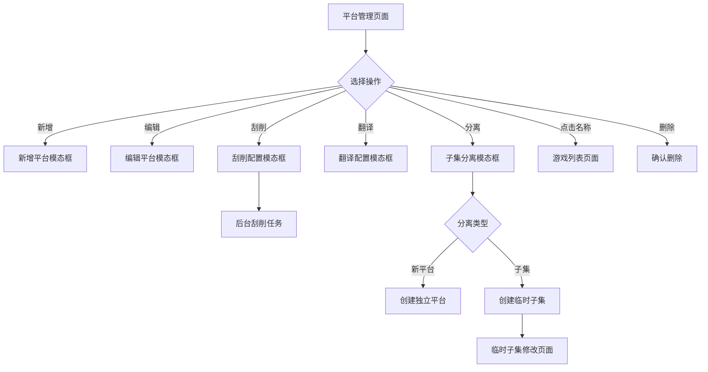

# 平台管理

> 页面文件：`platform-management.html`

平台管理是系统的核心页面，用于管理所有游戏平台的增删改查、刮削配置、游戏子集分离等操作。

---

## 导航选项卡

页面顶部有两个选项卡：

| 选项卡 | 说明 |
|--------|------|
| **平台** | 主选项卡，显示所有平台列表 |
| **游戏子集** | 显示由分离功能创建的临时子集列表 |

---

## 平台选项卡

### 工具栏

| 元素 | 类型 | 说明 |
|------|------|------|
| **"返回首页"** 链接 | 链接 | 返回 `index.html` |
| **"新增平台"** 按钮 | 按钮 | 弹出新增平台模态框 |

---

### 平台表格

| 列名 | 说明 |
|------|------|
| **ID** | 平台数据库 ID |
| **Logo** | 平台 Logo 图标（如有） |
| **平台名称** | 点击可进入该平台的 [游戏列表](05-game-list-cn.md) |
| **游戏数量** | 该平台下的游戏总数 |
| **已刮削** | 已有元数据的游戏数量 |
| **原始数据** | 包含原始（未翻译）数据的游戏数量 |
| **质量差** | 数据质量评分较低的游戏数量 |
| **纯 ROM** | 仅有 ROM 文件、无元数据的游戏数量 |
| **缺失游戏** | 数据库有记录但 ROM 文件不存在的游戏数量 |

### 每行操作按钮

| 按钮 | 说明 |
|------|------|
| **编辑** | 弹出编辑平台模态框 |
| **刮削** | 弹出刮削配置模态框，对该平台所有游戏执行信息刮削 |
| **翻译** | 弹出翻译配置模态框 |
| **切换译文** | 一键交换该平台下所有游戏的原文与译文 |
| **分离** | 弹出子集分离模态框 |
| **删除** | 删除该平台（需确认） |

---

### 新增平台模态框

点击 **"新增平台"** 按钮弹出：

| 字段 | 类型 | 说明 |
|------|------|------|
| **系统名** | 文本输入 | 平台显示名称（必填） |
| **软件** | 文本输入 | 模拟器软件名称 |
| **数据库** | 文本输入 | 关联的数据库标识 |
| **网站** | 文本输入 | 相关网站 URL |
| **名称** | 文本输入 | 平台排序名称 |
| **排序** | 下拉选择 | 游戏列表排序方式 |
| **启动命令** | 文本输入 | ROM 启动命令模板 |
| **路径** | 文本输入 | ROM 文件目录路径 |

| 按钮 | 说明 |
|------|------|
| **"保存"** | 创建新平台 |
| **"取消"** | 关闭弹窗 |

---

### 编辑平台模态框

点击 **"编辑"** 按钮弹出，比新增模态框多出以下字段：

| 字段 | 类型 | 说明 |
|------|------|------|
| **刮削系统** | 下拉选择 | 选择对应的 ScreenScraper 系统 ID，用于刮削匹配 |
| **Logo 设置** | 组合 | 区域码下拉 + 类型下拉，设置平台 Logo 图片来源 |

> 💡 **刮削系统** 是最关键的配置项，它决定了刮削时使用哪个系统数据库进行 CRC32 匹配。

---

### 刮削模态框

点击 **"刮削"** 按钮弹出：

| 字段 | 类型 | 说明 |
|------|------|------|
| **刮削范围** | 单选 | 全部游戏 / 仅未刮削 / 仅刮削质量差 |
| **游戏信息** | 复选框组 | 选择要刮削的信息字段（名称、描述、开发商等） |
| **媒体文件** | 复选框组 | 选择要下载的媒体类型（截图、封面、视频等） |
| **语种标签** | 复选框组 | 选择要下载的地区语种（SS/EU/US/World/JP） |

| 按钮 | 说明 |
|------|------|
| **"开始刮削"** | 启动后台刮削任务 |
| **"取消"** | 关闭弹窗 |

---

### 翻译配置模态框

点击 **"翻译"** 按钮弹出，用于配置自动翻译规则。

---

### 子集分离模态框

点击 **"分离"** 按钮弹出：

**筛选条件区域：**

| 字段 | 类型 | 说明 |
|------|------|------|
| **评分** | 范围输入 | 按评分范围筛选 |
| **年份** | 范围输入 | 按发行年份范围筛选 |
| **开发商** | 文本输入 | 按开发商名称筛选 |
| **发行商** | 文本输入 | 按发行商名称筛选 |
| **类型** | 文本输入 | 按游戏类型筛选 |
| **玩家数** | 文本输入 | 按玩家数量筛选 |
| **语言** | 文本输入 | 按语言筛选 |
| **正则匹配** | 文本输入 | 按正则表达式匹配游戏名称 |

**分离设置区域：**

| 字段 | 类型 | 说明 |
|------|------|------|
| **分离类型** | 单选 | "新平台"（独立为新平台）或 "子集"（创建临时子集） |
| **新平台/子集名称** | 文本输入 | 分离后的名称 |
| **包含刮削状态** | 复选框 | 是否同时分离刮削状态信息 |

| 按钮 | 说明 |
|------|------|
| **"执行分离"** | 按条件筛选并分离游戏 |
| **"取消"** | 关闭弹窗 |

---

## 游戏子集选项卡

切换到 **"游戏子集"** 选项卡后，显示所有临时子集列表。

| 元素 | 说明 |
|------|------|
| **子集名称** | 点击可进入子集编辑页面 |
| **游戏数量** | 子集中的游戏数 |
| **来源平台** | 子集来自哪个平台 |
| **创建时间** | 子集创建的时间 |
| **"修改"** 按钮 | 进入 [临时子集修改](14-temp-subset-cn.md) 页面 |
| **"删除"** 按钮 | 删除该子集 |

---

## 页面流程图

---

## 下一步

- 进入游戏列表 → [游戏列表](05-game-list-cn.md)
- 了解刮削详情 → [刮削系统](09-scraper-cn.md)
- 了解子集操作 → [临时子集](14-temp-subset-cn.md)
