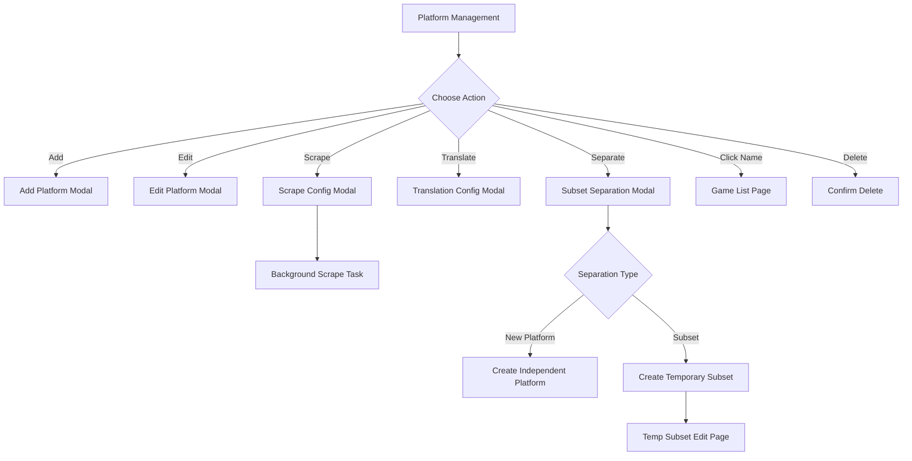

# Platform Management

> Page file: `platform-management.html`

Platform Management is the core page of the system, used for managing all game platforms — CRUD operations, scraping configuration, and game subset separation.

---

## Navigation Tabs

The page has two tabs at the top:

| Tab | Description |
|-----|-------------|
| **Platforms** | Main tab, shows all platform list |
| **Game Subsets** | Shows temporary subsets created by the separation feature |

---

## Platforms Tab

### Toolbar

| Element | Type | Description |
|---------|------|-------------|
| **"Back to Home"** link | Link | Returns to `index.html` |
| **"Add Platform"** button | Button | Opens the Add Platform modal |

---

### Platform Table

| Column | Description |
|--------|-------------|
| **ID** | Platform database ID |
| **Logo** | Platform logo image (if available) |
| **Platform Name** | Click to enter the [Game List](05-game-list-en.md) for that platform |
| **Game Count** | Total number of games under this platform |
| **Scraped** | Number of games with metadata |
| **Raw Data** | Number of games with original (untranslated) data |
| **Poor Quality** | Number of games with low data quality scores |
| **ROM Only** | Games with only ROM files, no metadata |
| **Missing Games** | Games in database but ROM file not found |

### Per-Row Action Buttons

| Button | Description |
|--------|-------------|
| **Edit** | Opens the Edit Platform modal |
| **Scrape** | Opens the scrape configuration modal to scrape all games on this platform |
| **Translate** | Opens the translation configuration modal |
| **Swap Translation** | One-click swap original and translated text for all games on this platform |
| **Separate** | Opens the subset separation modal |
| **Delete** | Delete this platform (requires confirmation) |

---

### Add Platform Modal

Opens when clicking **"Add Platform"**:

| Field | Type | Description |
|-------|------|-------------|
| **System Name** | Text input | Platform display name (required) |
| **Software** | Text input | Emulator software name |
| **Database** | Text input | Associated database identifier |
| **Website** | Text input | Related website URL |
| **Name** | Text input | Platform sort name |
| **Sort** | Dropdown | Game list sort method |
| **Launch Command** | Text input | ROM launch command template |
| **Path** | Text input | ROM file directory path |

| Button | Description |
|--------|-------------|
| **"Save"** | Create the new platform |
| **"Cancel"** | Close the modal |

---

### Edit Platform Modal

Opens when clicking **"Edit"**; has additional fields compared to the Add modal:

| Field | Type | Description |
|-------|------|-------------|
| **Scraper System** | Dropdown | Select the corresponding ScreenScraper system ID for scrape matching |
| **Logo Settings** | Combined | Region code dropdown + type dropdown for platform logo source |

> 💡 **Scraper System** is the most critical setting — it determines which system database is used for CRC32 matching during scraping.

---

### Scrape Modal

Opens when clicking **"Scrape"**:

| Field | Type | Description |
|-------|------|-------------|
| **Scrape Scope** | Radio | All games / Only unscraped / Only poor quality |
| **Game Info** | Checkbox group | Select info fields to scrape (name, description, developer, etc.) |
| **Media Files** | Checkbox group | Select media types to download (screenshots, covers, videos, etc.) |
| **Language Tags** | Checkbox group | Select regional languages to download (SS/EU/US/World/JP) |

| Button | Description |
|--------|-------------|
| **"Start Scrape"** | Launch background scrape task |
| **"Cancel"** | Close the modal |

---

### Translation Configuration Modal

Opens when clicking **"Translate"**, used to configure auto-translation rules.

---

### Subset Separation Modal

Opens when clicking **"Separate"**:

**Filter Criteria Area:**

| Field | Type | Description |
|-------|------|-------------|
| **Rating** | Range input | Filter by rating range |
| **Year** | Range input | Filter by release year range |
| **Developer** | Text input | Filter by developer name |
| **Publisher** | Text input | Filter by publisher name |
| **Genre** | Text input | Filter by game genre |
| **Players** | Text input | Filter by player count |
| **Language** | Text input | Filter by language |
| **Regex Match** | Text input | Filter game names by regex pattern |

**Separation Settings Area:**

| Field | Type | Description |
|-------|------|-------------|
| **Separation Type** | Radio | "New Platform" (independent platform) or "Subset" (temporary subset) |
| **New Platform/Subset Name** | Text input | Name after separation |
| **Include Scrape Status** | Checkbox | Whether to also separate scrape status info |

| Button | Description |
|--------|-------------|
| **"Execute Separation"** | Filter and separate games by criteria |
| **"Cancel"** | Close the modal |

---

## Game Subsets Tab

Switching to the **"Game Subsets"** tab shows all temporary subset lists.

| Element | Description |
|---------|-------------|
| **Subset Name** | Click to enter the subset editing page |
| **Game Count** | Number of games in the subset |
| **Source Platform** | Which platform the subset came from |
| **Created At** | When the subset was created |
| **"Modify"** button | Enter the [Temp Subset Edit](14-temp-subset-en.md) page |
| **"Delete"** button | Delete this subset |

---

## Page Flow Diagram

---

## Next Steps

- Enter game list → [Game List](05-game-list-en.md)
- Learn scraping details → [Scraper System](09-scraper-en.md)
- Learn subset operations → [Temp Subset](14-temp-subset-en.md)
