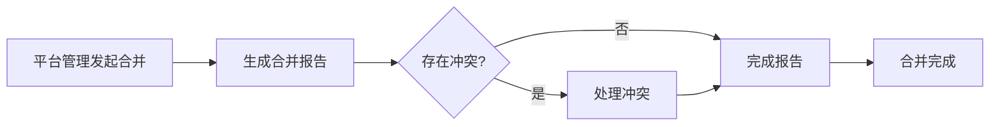

# 平台合并

> 相关页面：`merge-reports.html`、`merge-report-details.html`、`merge-conflicts.html`

平台合并功能用于将多个源平台的游戏合并到目标平台，自动检测名称和文件路径冲突。

---

## 流程概览

---

## 合并报告列表页

> 页面文件：`merge-reports.html`

### 页面顶部

| 元素 | 说明 |
|------|------|
| **"返回首页"** 按钮 | 返回首页 |

### 统计卡片

| 卡片 | 说明 |
|------|------|
| **总报告数** | 所有合并报告的数量 |
| **处理中** | 状态为处理中的报告数 |
| **已完成** | 状态为已完成的报告数 |
| **总冲突数** | 所有报告的冲突游戏总数 |

### 报告表格

| 列名 | 说明 |
|------|------|
| **ID** | 报告 ID |
| **报告名称** | 合并报告的名称 |
| **源平台** | 参与合并的源平台列表 |
| **总游戏数** | 源平台的游戏总数 |
| **已添加** | 已成功添加的游戏数 |
| **冲突** | 存在冲突的游戏数 |
| **状态** | 处理中 / 已完成 |
| **创建时间** | 报告创建时间 |

### 每行操作

| 按钮 | 说明 |
|------|------|
| **"查看详情"** | 进入报告详情页 |
| **"处理冲突"** | 进入冲突处理页（仅处理中且有冲突时显示） |
| **"删除"** | 删除该报告（仅已完成时显示） |

---

## 合并报告详情页

> 页面文件：`merge-report-details.html`

### 页面顶部

| 元素 | 说明 |
|------|------|
| **"返回首页"** 按钮 | 返回首页 |
| **"返回列表"** 按钮 | 返回合并报告列表 |
| **"完成报告"** 按钮 | 将报告标记为完成（仅处理中状态显示） |

### 报告信息卡片

| 字段 | 说明 |
|------|------|
| **报告名称** | 合并报告名称 |
| **状态** | 处理中 / 已完成 |
| **总游戏数** | 源平台游戏总数 |
| **已添加** | 已成功添加的游戏数 |
| **冲突游戏** | 存在冲突的游戏数 |
| **创建时间** | 报告创建时间 |
| **源平台** | 参与合并的源平台名称列表 |

### 冲突列表

| 列名 | 说明 |
|------|------|
| **ID** | 冲突记录 ID |
| **源游戏名称** | 来自源平台的游戏名称 |
| **源文件名** | 来自源平台的 ROM 文件名 |
| **冲突类型** | 名称冲突（红）/ 文件冲突（橙）/ 两者冲突（青） |
| **状态** | 待处理（橙）/ 已解决（绿）/ 已跳过（灰） |

---

## 冲突处理页

> 页面文件：`merge-conflicts.html`

### 冲突卡片

每张冲突卡片显示一组冲突的详细信息：

| 元素 | 说明 |
|------|------|
| **冲突类型标签** | 名称冲突 / 文件冲突 / 两者冲突 |
| **源游戏信息** | 显示源平台游戏的名称、路径、描述等 |
| **已有游戏信息** | 显示目标平台中已存在游戏的名称、路径等 |

### 冲突操作

| 按钮 | 说明 |
|------|------|
| **"添加到平台"** | 将源游戏强制添加到目标平台（覆盖/共存） |
| **"跳过冲突"** | 跳过此冲突，不添加该游戏 |

### 工具栏

| 按钮 | 说明 |
|------|------|
| **"返回详情"** | 返回合并报告详情页 |
| **"完成报告"** | 处理完所有冲突后，完成合并报告 |

---

## 冲突类型说明

| 类型 | 颜色 | 说明 |
|------|------|------|
| **名称冲突** | 🔴 红色 | 目标平台已存在同名游戏 |
| **文件冲突** | 🟠 橙色 | 目标平台已存在相同文件路径的游戏 |
| **两者冲突** | 🔵 青色 | 同时存在名称和文件路径冲突 |

---

## 下一步

- 导出合并后的平台 → [导出平台](08-export-cn.md)
- 返回平台管理 → [平台管理](04-platform-mgmt-cn.md)
