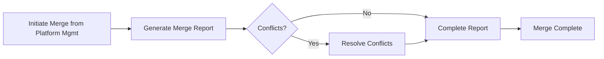

# Platform Merge

> Related pages: `merge-reports.html`, `merge-report-details.html`, `merge-conflicts.html`

The Platform Merge feature merges games from multiple source platforms into a target platform, with automatic detection of name and file path conflicts.

---

## Flow Overview

---

## Merge Report List Page

> Page file: `merge-reports.html`

### Page Header

| Element | Description |
|---------|-------------|
| **"Back to Home"** button | Returns to the home page |

### Statistics Cards

| Card | Description |
|------|-------------|
| **Total Reports** | Total number of merge reports |
| **Processing** | Number of reports currently being processed |
| **Completed** | Number of completed reports |
| **Total Conflicts** | Total number of conflicting games across all reports |

### Report Table

| Column | Description |
|--------|-------------|
| **ID** | Report ID |
| **Report Name** | Name of the merge report |
| **Source Platforms** | List of source platforms involved in the merge |
| **Total Games** | Total number of games from source platforms |
| **Added** | Number of games successfully added |
| **Conflicts** | Number of games with conflicts |
| **Status** | Processing / Completed |
| **Created Time** | Report creation time |

### Row Actions

| Button | Description |
|--------|-------------|
| **"View Details"** | Navigate to the report detail page |
| **"Handle Conflicts"** | Navigate to the conflict resolution page (only shown when status is Processing and conflicts > 0) |
| **"Delete"** | Delete the report (only shown when status is Completed) |

---

## Merge Report Detail Page

> Page file: `merge-report-details.html`

### Page Header

| Element | Description |
|---------|-------------|
| **"Back to Home"** button | Returns to the home page |
| **"Back to List"** button | Returns to the merge report list |
| **"Complete Report"** button | Mark the report as completed (only shown when status is Processing) |

### Report Info Cards

| Field | Description |
|-------|-------------|
| **Report Name** | Merge report name |
| **Status** | Processing / Completed |
| **Total Games** | Total number of source platform games |
| **Added** | Number of successfully added games |
| **Conflict Games** | Number of games with conflicts |
| **Created Time** | Report creation time |
| **Source Platforms** | List of source platform names involved in the merge |

### Conflict List

| Column | Description |
|--------|-------------|
| **ID** | Conflict record ID |
| **Source Game Name** | Game name from the source platform |
| **Source File Name** | ROM file name from the source platform |
| **Conflict Type** | Name conflict (red) / File conflict (orange) / Both conflict (cyan) |
| **Status** | Pending (orange) / Resolved (green) / Skipped (gray) |

---

## Conflict Resolution Page

> Page file: `merge-conflicts.html`

### Conflict Cards

Each conflict card displays detailed information about a conflict:

| Element | Description |
|---------|-------------|
| **Conflict type label** | Name conflict / File conflict / Both conflict |
| **Source game info** | Shows the source platform game's name, path, description, etc. |
| **Existing game info** | Shows the existing game's name, path, etc. in the target platform |

### Conflict Actions

| Button | Description |
|--------|-------------|
| **"Add to Platform"** | Force-add the source game to the target platform (overwrite/coexist) |
| **"Skip Conflict"** | Skip this conflict without adding the game |

### Toolbar

| Button | Description |
|--------|-------------|
| **"Back to Details"** | Return to the merge report detail page |
| **"Complete Report"** | Complete the merge report after resolving all conflicts |

---

## Conflict Types

| Type | Color | Description |
|------|-------|-------------|
| **Name Conflict** | 🔴 Red | A game with the same name already exists in the target platform |
| **File Conflict** | 🟠 Orange | A game with the same file path already exists in the target platform |
| **Both Conflict** | 🔵 Cyan | Both name and file path conflicts exist |

---

## Next Steps

- Export the merged platform → [Export](08-export-en.md)
- Return to platform management → [Platform Management](04-platform-mgmt-en.md)
