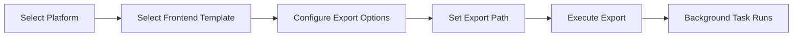

# Export Platform

> Page file: `export.html`

The Export page allows you to export platform game data into frontend-specific configuration files, ROM files, and media files.

---

## Flow Overview

---

## Page Header

| Element | Description |
|---------|-------------|
| **"Back to Home"** button | Returns to the home page |

---

## Export Form

### Select Platform

| Field | Description |
|-------|-------------|
| **Select Platform** | Dropdown to select the platform to export, displayed as "System Name (Platform Name)" |

### Select Frontend

| Field | Description |
|-------|-------------|
| **Select Frontend** | Dropdown to select the target frontend template |
| **Frontend Description** | Shows detailed description of the selected frontend (data file format, path format, etc.) |
| **Template Limitation Warning** | Yellow warning shown if the template doesn't support certain export content |

Supported frontend templates:

| Frontend | Data File Format | Path Format |
|----------|-----------------|-------------|
| **Pegasus** | metadata.pegasus.txt | Relative path (without ./ prefix) |
| **ES-DE** | gamelist.xml | Standard relative path (with ./ prefix) |
| **RetroBat** | gamelist.xml | Standard relative path (with ./ prefix) |
| **EmuELEC** | gamelist.xml | Supports three lookup locations |
| **Lakka** | gamelist.xml + .lpl | Supports core mapping |
| **Pegasus V3** | metadata.pegasus.txt (V3) | V3 format |
| **ES-DE V3** | gamelist.xml (V3) | V3 format |
| **RetroBat V3** | gamelist.xml (V3) | V3 format |
| **EmuELEC V3** | gamelist.xml (V3) | V3 format |

### Export Range

| Option | Description |
|--------|-------------|
| **Game Files** | Copy ROM files to the export directory (may be disabled by some templates) |
| **Media Files** | Copy media files to the export directory (may be disabled by some templates) |
| **Data Files** | Generate frontend data files (gamelist.xml / metadata.pegasus.txt, etc.) |

> 💡 Some frontend templates restrict which content types can be exported. Restricted options are automatically disabled with a warning.

### Export Path

| Field | Description |
|-------|-------------|
| **Export Path** | Target export path, defaults to `/output` |

### Thread Count

| Field | Description |
|-------|-------------|
| **Thread Count** | Number of parallel threads for export, default 4, maximum 10 |

---

## Action Buttons

| Button | Description |
|--------|-------------|
| **"Export"** | Submit the export task (button shows loading state after submission) |
| **"Back to Home"** | Return to the home page |

---

## Export Process

1. After submission, the export runs as a background task
2. A notification pops up in the top-right corner confirming the task has started
3. Progress can be monitored on the [Task Management](12-task-management-en.md) page
4. A notification appears when the task completes

---

## Next Steps

- Monitor export progress → [Task Management](12-task-management-en.md)
- Manage scraper systems → [Scraper Systems](09-scraper-en.md)
