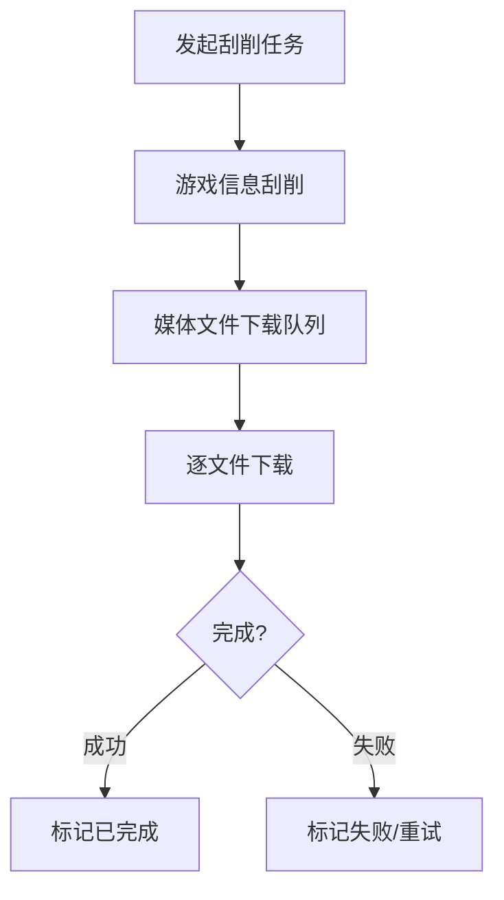

# 媒体下载

> 页面文件：`media-download.html`

媒体下载页面用于监控和管理 ScreenScraper 游戏信息刮削和媒体文件下载任务的实时状态。

---

## 流程概览

---

## 页面顶部

| 元素 | 说明 |
|------|------|
| **"返回首页"** 按钮 | 返回首页 |
| **"刷新状态"** 按钮 | 手动刷新所有统计数据 |
| **"停止所有刮削"** 按钮 | 停止所有正在执行的刮削和下载任务 |

---

## 游戏信息刮削状态卡片

显示游戏元数据刮削的整体进度：

| 元素 | 说明 |
|------|------|
| **待处理** | 等待刮削的游戏数量 |
| **处理中** | 正在刮削的游戏数量 |
| **已完成** | 刮削完成的游戏数量 |
| **失败** | 刮削失败的游戏数量 |
| **已停止** | 被停止的游戏数量 |
| **总计** | 需要刮削的游戏总数 |
| **进度条** | 可视化显示完成百分比 |

### 刮削控制按钮

| 按钮 | 说明 |
|------|------|
| **"暂停"** | 暂停当前刮削任务 |
| **"恢复"** | 恢复已暂停的刮削任务 |
| **"停止"** | 停止当前刮削任务 |
| **"删除任务"** | 删除当前刮削任务记录 |

---

## ScreenScraper 配额信息面板

显示当前 ScreenScraper 账号的 API 配额使用情况：

| 元素 | 说明 |
|------|------|
| **今日请求** | 今天已发送的 API 请求数 |
| **每日上限** | 账号允许的每日最大请求数 |
| **使用率** | 百分比显示今日已用配额比例 |
| **并发线程** | 当前并发下载的线程数 |
| **用户等级** | ScreenScraper 用户等级 |
| **贡献等级** | ScreenScraper 贡献等级 |
| **配额进度条** | 可视化显示配额使用率 |

> 💡 游客模式每日约 20,000 次请求限制。注册账号可获得更高限额。在 [系统设置](11-system-settings-cn.md) 中配置凭据。

---

## 平台卡片网格

每个平台一张卡片，显示该平台媒体文件下载的实时状态：

### 每张平台卡片

| 元素 | 说明 |
|------|------|
| **平台名称** | 显示平台名称 |
| **待下载** | 等待下载的媒体文件数 |
| **下载中** | 正在下载的媒体文件数 |
| **已完成** | 下载完成的媒体文件数 |
| **失败** | 下载失败的媒体文件数 |
| **已停止** | 被停止的媒体文件数 |
| **总计** | 该平台需要下载的媒体总数 |
| **进度条** | 可视化显示完成百分比 |

### 平台卡片操作

| 按钮 | 说明 |
|------|------|
| **"停止"** | 停止该平台的媒体下载 |
| **"恢复"** | 恢复该平台已暂停的下载 |
| **"删除"** | 删除该平台的下载任务记录 |

---

## 自动刷新

页面每 10 秒自动刷新一次所有统计数据，无需手动操作。

---

## 下一步

- 查看后台任务 → [任务管理](12-task-management-cn.md)
- 配置刮削凭据 → [系统设置](11-system-settings-cn.md)
