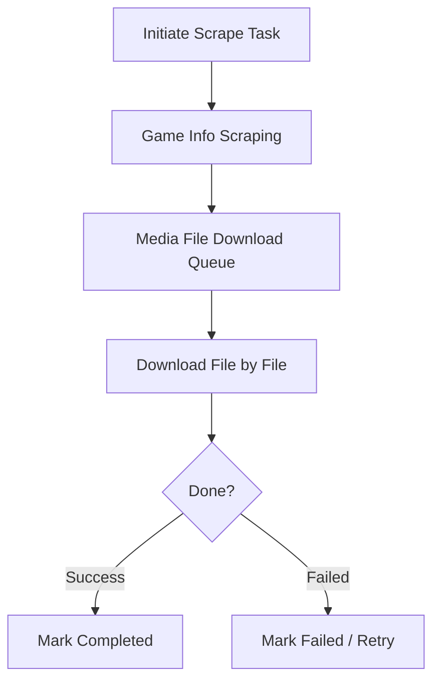

# Media Download

> Page file: `media-download.html`

The Media Download page monitors and manages the real-time status of ScreenScraper game info scraping and media file download tasks.

---

## Flow Overview

---

## Page Header

| Element | Description |
|---------|-------------|
| **"Back to Home"** button | Returns to the home page |
| **"Refresh Status"** button | Manually refresh all statistics |
| **"Stop All Scraping"** button | Stop all running scraping and download tasks |

---

## Game Info Scraping Status Card

Shows the overall progress of game metadata scraping:

| Element | Description |
|---------|-------------|
| **Pending** | Number of games waiting to be scraped |
| **Processing** | Number of games currently being scraped |
| **Completed** | Number of games that have been scraped |
| **Failed** | Number of games that failed to scrape |
| **Stopped** | Number of games that were stopped |
| **Total** | Total number of games to scrape |
| **Progress Bar** | Visual representation of completion percentage |

### Scraping Control Buttons

| Button | Description |
|--------|-------------|
| **"Pause"** | Pause the current scraping task |
| **"Resume"** | Resume a paused scraping task |
| **"Stop"** | Stop the current scraping task |
| **"Delete Task"** | Delete the current scraping task record |

---

## ScreenScraper Quota Information Panel

Shows the current ScreenScraper account's API quota usage:

| Element | Description |
|---------|-------------|
| **Today's Requests** | Number of API requests sent today |
| **Daily Limit** | Maximum daily requests allowed for the account |
| **Usage Rate** | Percentage of today's quota used |
| **Concurrent Threads** | Number of concurrent download threads |
| **User Level** | ScreenScraper user level |
| **Contribution Level** | ScreenScraper contribution level |
| **Quota Progress Bar** | Visual representation of quota usage |

> 💡 Guest mode has a limit of approximately 20,000 requests per day. Registering an account provides higher limits. Configure credentials in [System Settings](11-system-settings-en.md).

---

## Platform Card Grid

Each platform has a card showing the real-time status of media file downloads for that platform:

### Each Platform Card

| Element | Description |
|---------|-------------|
| **Platform Name** | Displays the platform name |
| **Pending** | Number of media files waiting to download |
| **Downloading** | Number of media files currently downloading |
| **Completed** | Number of media files downloaded successfully |
| **Failed** | Number of media files that failed to download |
| **Stopped** | Number of media files that were stopped |
| **Total** | Total number of media files to download for this platform |
| **Progress Bar** | Visual representation of completion percentage |

### Platform Card Actions

| Button | Description |
|--------|-------------|
| **"Stop"** | Stop media downloads for this platform |
| **"Resume"** | Resume paused downloads for this platform |
| **"Delete"** | Delete the download task record for this platform |

---

## Auto Refresh

The page automatically refreshes all statistics every 10 seconds, no manual action required.

---

## Next Steps

- View background tasks → [Task Management](12-task-management-en.md)
- Configure scraper credentials → [System Settings](11-system-settings-en.md)
