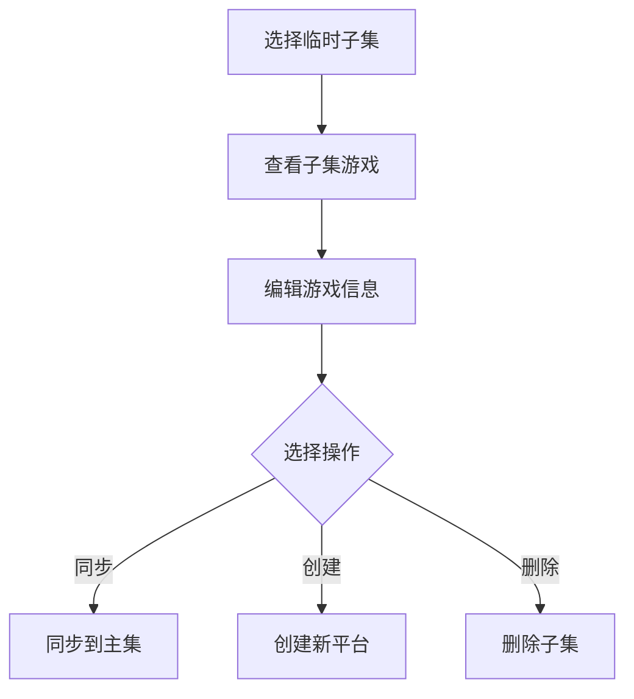

# 临时子集编辑

> 页面文件：`temp-subset-edit.html`

临时子集编辑页面用于管理平台的临时游戏子集，支持子集内游戏的编辑、同步到主集、创建新平台等操作。

---

## 页面布局

页面采用三栏布局：左侧子集列表、中间游戏列表、右侧编辑表单。

---

## 左侧：临时子集列表

| 元素 | 说明 |
|------|------|
| **子集列表** | 显示当前平台下所有临时子集，点击选择子集 |
| **"新建子集"** 按钮 | 创建新的临时子集 |

---

## 中间：子集中的游戏列表

选择子集后显示该子集包含的所有游戏：

| 元素 | 说明 |
|------|------|
| **游戏列表** | 显示子集中的所有游戏，点击选择游戏进行编辑 |
| **游戏名称** | 每条游戏显示名称 |

---

## 右侧：游戏编辑表单

选中游戏后显示编辑表单：

| 字段 | 说明 |
|------|------|
| **游戏名称 (name)** | 游戏原始名称 |
| **游戏路径 (path)** | ROM 文件路径 |
| **游戏描述 (desc)** | 游戏描述文本 |
| **翻译名称 (translatedName)** | 翻译后的游戏名 |
| **翻译描述 (translatedDesc)** | 翻译后的描述 |
| **开发商 (developer)** | 游戏开发商 |
| **发行商 (publisher)** | 游戏发行商 |
| **游戏类型 (genre)** | 游戏类型 |
| **玩家数 (players)** | 支持的玩家数 |
| **发布日期 (releasedate)** | 发行日期 |
| **评分 (rating)** | 游戏评分 |
| **语言 (lang)** | 游戏语言 |

---

## 子集操作

| 元素 | 说明 |
|------|------|
| **新平台名称** | 输入框，填写同步/创建时的目标平台名称 |
| **"同步到主集"** 按钮 | 将子集中的修改同步回主平台的游戏数据 |
| **"创建新平台"** 按钮 | 将子集中的游戏创建为一个新的独立平台 |
| **"删除子集"** 按钮 | 删除当前选中的临时子集 |

---

## 工作流程

---

## 下一步

- 返回游戏列表 → [游戏列表](05-game-list-cn.md)
- 导出新平台 → [导出平台](08-export-cn.md)
