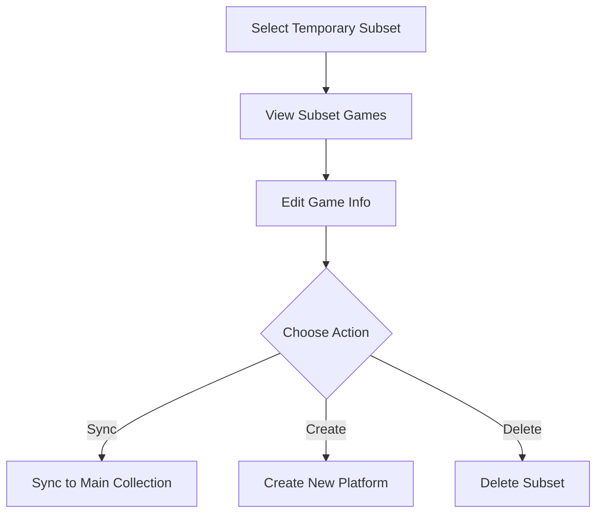

# Temporary Subset Edit

> Page file: `temp-subset-edit.html`

The Temporary Subset Edit page manages temporary game subsets for a platform, supporting game editing within subsets, syncing to the main collection, creating new platforms, and more.

---

## Page Layout

The page uses a three-column layout: subset list on the left, game list in the middle, and edit form on the right.

---

## Left: Temporary Subset List

| Element | Description |
|---------|-------------|
| **Subset List** | Displays all temporary subsets under the current platform, click to select a subset |
| **"New Subset"** button | Create a new temporary subset |

---

## Middle: Games in Subset

After selecting a subset, displays all games contained in that subset:

| Element | Description |
|---------|-------------|
| **Game List** | Shows all games in the subset, click to select a game for editing |
| **Game Name** | Each game entry displays its name |

---

## Right: Game Edit Form

After selecting a game, the edit form is displayed:

| Field | Description |
|-------|-------------|
| **Name (name)** | Original game name |
| **Path (path)** | ROM file path |
| **Description (desc)** | Game description text |
| **Translated Name (translatedName)** | Translated game name |
| **Translated Desc (translatedDesc)** | Translated description |
| **Developer (developer)** | Game developer |
| **Publisher (publisher)** | Game publisher |
| **Genre (genre)** | Game genre |
| **Players (players)** | Number of supported players |
| **Release Date (releasedate)** | Release date |
| **Rating (rating)** | Game rating |
| **Language (lang)** | Game language |

---

## Subset Actions

| Element | Description |
|---------|-------------|
| **New Platform Name** | Input field for the target platform name when syncing/creating |
| **"Sync to Main"** button | Sync the subset's modifications back to the main platform's game data |
| **"Create New Platform"** button | Create a new independent platform from the games in the subset |
| **"Delete Subset"** button | Delete the currently selected temporary subset |

---

## Workflow

---

## Next Steps

- Return to game list → [Game List](05-game-list-en.md)
- Export the new platform → [Export](08-export-en.md)
